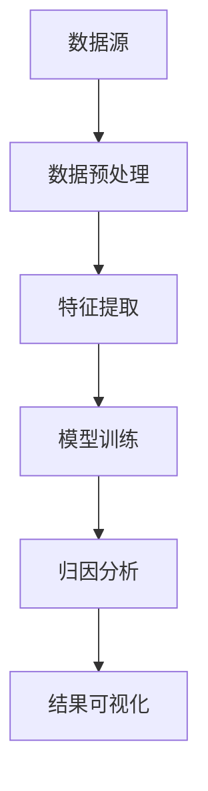

                 


# AI驱动的价值投资策略性能归因

## 关键词：人工智能、价值投资、性能归因、投资策略、因子模型

## 摘要：  
本文深入探讨了AI在价值投资策略中的应用，特别是如何通过性能归因分析来优化投资决策。文章从价值投资的基本概念出发，结合AI技术的最新进展，分析了基于机器学习的性能归因方法，并通过实际案例展示了如何构建一个高效的AI驱动价值投资系统。通过系统化的分析和数学建模，本文提出了一个创新的性能归因框架，并详细探讨了其在实际投资中的应用前景。

---

# 第1章: 价值投资与AI驱动策略概述

## 1.1 价值投资的核心概念

### 1.1.1 价值投资的定义与历史发展  
价值投资是一种以基本面分析为基础的投资策略，旨在通过识别市场低估的股票来实现超额收益。其核心理念是购买价格低于其内在价值的资产。价值投资起源于20世纪30年代，由本杰明·格雷厄姆和戴维·多德提出，经过几十年的发展，逐渐成为投资领域的重要流派。

### 1.1.2 价值投资的核心原则  
价值投资的核心原则包括：  
1. **安全边际**：购买价格远低于其内在价值的资产，以确保投资的安全性。  
2. **长期视角**：关注企业的长期基本面，而非短期市场波动。  
3. **逆向思维**：在市场恐慌时买入，在市场狂热时卖出。  

### 1.1.3 价值投资与现代投资理论的联系  
现代投资组合理论（MPT）和有效市场假说（EMH）为价值投资提供了理论基础。尽管有效市场假说认为市场是无法被预测的，但价值投资通过发现市场错误定价的机会，为投资者提供了超额收益的可能性。

---

## 1.2 AI在金融投资中的应用

### 1.2.1 AI在金融分析中的角色  
人工智能（AI）技术在金融领域的应用日益广泛，尤其是在数据处理、模式识别和预测分析方面。AI能够处理海量数据，发现传统方法难以察觉的模式，从而为投资决策提供支持。

### 1.2.2 AI驱动的投资策略类型  
AI驱动的投资策略主要包括：  
1. **量化投资**：利用算法和大数据分析进行交易决策。  
2. **因子投资**：基于统计因子构建投资组合。  
3. **情绪分析**：通过自然语言处理技术分析市场情绪。  

### 1.2.3 AI在投资决策中的优势  
AI的优势在于其处理数据的速度和准确性，能够快速响应市场变化，并通过复杂的数据分析发现潜在的投资机会。

---

## 1.3 价值投资策略的性能归因

### 1.3.1 性能归因的定义  
性能归因是指将投资组合的超额收益分解为各个因子或策略贡献的过程。通过性能归因，投资者可以了解哪些策略或因子对投资组合的表现贡献最大。

### 1.3.2 价值投资策略中的归因方法  
在价值投资中，性能归因通常涉及以下几个步骤：  
1. **数据收集**：收集股票的历史价格、财务数据和市场数据。  
2. **因子构建**：构建价值因子（如低市盈率、低市净率）和其他因子（如动量、质量）。  
3. **模型训练**：使用回归模型或其他机器学习算法分析因子对收益的贡献。  

### 1.3.3 归因分析在投资组合管理中的作用  
通过性能归因，投资者可以优化投资组合，识别哪些因子或策略表现优异，从而调整投资策略。

---

## 1.4 本章小结  
本章介绍了价值投资的基本概念和AI在金融投资中的应用，重点分析了性能归因在价值投资中的重要性。通过性能归因，投资者可以更清晰地了解投资收益的来源，从而做出更明智的投资决策。

---

# 第2章: 价值投资策略的数学模型与算法原理

## 2.1 价值投资的因子模型

### 2.1.1 常见因子模型概述  
常见的因子模型包括：  
1. **Fama-French三因子模型**：包括市值、价值和动量因子。  
2. **Carhart四因子模型**：在三因子模型基础上增加了Beta因子。  

### 2.1.2 Fama-French三因子模型  
Fama-French三因子模型的公式为：  
$$ R_i = R_f + \beta_i (R_m - R_f) + 0.3 \times SMB + 0.3 \times HML + \epsilon_i $$  
其中，SMB表示小市值因子，HML表示价值因子。

### 2.1.3 动量因子与价值因子的结合  
动量因子和价值因子的结合可以通过多因子回归模型来实现。

---

## 2.2 AI驱动的归因算法

### 2.2.1 线性回归模型在归因中的应用  
线性回归模型用于分析各因子对收益的贡献。例如，使用多元线性回归模型：  
$$ R_i = \beta_0 + \beta_1x_1 + \beta_2x_2 + ... + \beta_nx_n + \epsilon $$  

### 2.2.2 机器学习归因方法  
机器学习方法如随机森林和神经网络可以用于非线性归因分析。例如，使用随机森林回归模型：  
$$ R_i = \sum_{j=1}^{n} w_j x_j + \epsilon $$  

### 2.2.3 深度学习在归因中的潜在应用  
深度学习可以通过神经网络捕捉复杂的非线性关系，但目前在归因中的应用仍处于探索阶段。

---

## 2.3 算法实现与数学公式

### 2.3.1 线性回归模型公式  
$$ R_i = \beta_0 + \beta_1x_1 + \beta_2x_2 + ... + \beta_nx_n + \epsilon $$  

### 2.3.2 机器学习归因的损失函数  
$$ L = \frac{1}{2N}\sum_{i=1}^{N}(y_i - \hat{y}_i)^2 $$  

---

## 2.4 本章小结  
本章详细介绍了价值投资的因子模型和AI驱动的归因算法，包括线性回归、机器学习和深度学习方法。这些方法为性能归因提供了多样化的工具。

---

# 第3章: 价值投资策略的性能归因框架

## 3.1 性能归因的流程与步骤

### 3.1.1 确定归因目标  
明确归因的目标，例如分析某只股票或投资组合的表现。

### 3.1.2 数据收集与预处理  
收集相关数据并进行清洗和标准化。

### 3.1.3 模型选择与训练  
选择合适的归因模型并进行训练。

### 3.1.4 结果分析与优化  
分析归因结果并优化投资策略。

---

## 3.2 系统架构设计

### 3.2.1 系统功能模块划分  
1. 数据采集模块  
2. 特征工程模块  
3. 模型训练模块  
4. 结果分析模块  

### 3.2.2 数据流与信息流设计  
数据从数据源流向数据预处理模块，再流向特征提取模块，最后流向模型训练模块。

---

## 3.3 系统架构的Mermaid图  


---

## 3.4 本章小结  
本章提出了一个性能归因的框架，包括数据处理、模型训练和结果分析等步骤，并通过Mermaid图展示了系统的架构设计。

---

# 第4章: 基于AI的价值投资策略实现

## 4.1 项目背景与目标

### 4.1.1 项目背景  
随着AI技术的发展，越来越多的投资者开始尝试用AI优化投资策略。

### 4.1.2 项目目标  
构建一个基于AI的价值投资策略，实现性能归因分析。

---

## 4.2 系统功能设计

### 4.2.1 数据采集模块  
从数据源（如Yahoo Finance）获取股票数据。

### 4.2.2 特征工程模块  
构建价值因子（如低市盈率）和其他因子（如动量因子）。

### 4.2.3 模型训练模块  
使用机器学习算法（如线性回归）进行归因分析。

### 4.2.4 结果分析模块  
分析归因结果并优化投资策略。

---

## 4.3 项目实战

### 4.3.1 环境安装  
安装必要的Python库，如Pandas、Scikit-learn。

### 4.3.2 系统核心实现源代码  
```python
import pandas as pd
from sklearn.linear_model import LinearRegression

# 数据加载
data = pd.read_csv('stock_data.csv')

# 特征提取
X = data[['PE', 'PB', 'Size']]
y = data['Return']

# 模型训练
model = LinearRegression()
model.fit(X, y)

# 归因分析
coefficients = model.coef_
print("因子系数:", coefficients)
```

### 4.3.3 代码应用解读与分析  
上述代码展示了如何使用线性回归模型进行性能归因，其中PE（市盈率）和PB（市净率）是价值因子。

---

## 4.4 本章小结  
本章通过实际案例展示了如何基于AI构建价值投资策略，并通过代码实现性能归因分析。

---

# 第5章: 总结与展望

## 5.1 总结  
本文详细探讨了AI在价值投资策略中的应用，特别是性能归因的实现方法。通过系统化的分析和数学建模，提出了一个创新的性能归因框架。

## 5.2 未来展望  
未来的研究可以进一步探索深度学习在归因中的应用，并结合实时数据优化投资策略。

---

## 作者：AI天才研究院 & 禅与计算机程序设计艺术

