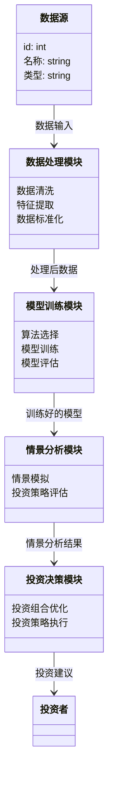
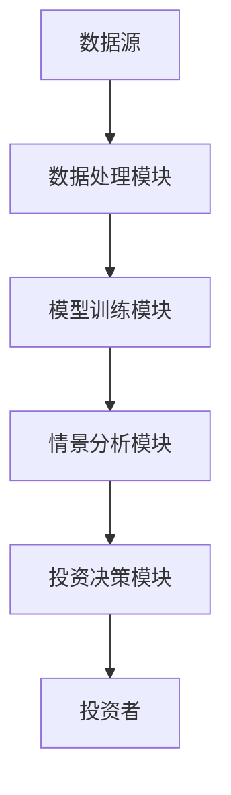
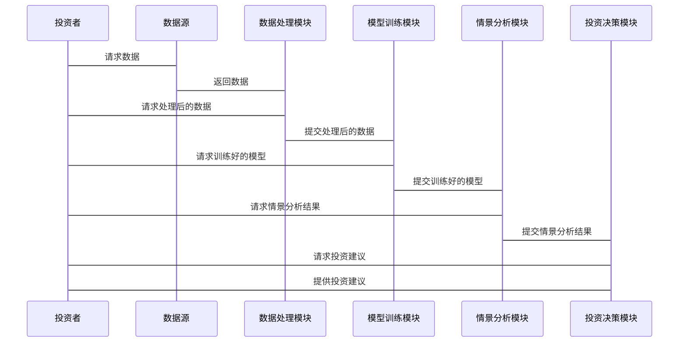

                 

<think>
嗯，我现在要帮用户设计一本关于《AI驱动的价值投资策略情景分析》的技术博客文章目录。首先，我需要理解用户的需求。用户希望我以一位世界级的人工智能专家、程序员、软件架构师和畅销书作者的身份来撰写这篇文章，重点是逻辑清晰、结构紧凑，用专业的技术语言，一步一步分析推理。

好的，用户已经提供了一个详细的目录大纲，分为七个部分，包括摘要、关键词和七个主要章节。我需要确保每个章节都涵盖必要的内容，比如背景介绍、核心概念、算法原理、系统架构、项目实战、最佳实践等。

首先，摘要部分要简明扼要，概括文章的核心内容，强调AI如何提升价值投资策略的效率和效果。接下来是关键词，列出文章的核心概念，如人工智能、价值投资、情景分析等。

接下来是各个章节。第一章介绍价值投资的基本概念，包括其定义、分析框架和在现代金融中的地位。这部分需要帮助读者理解价值投资的基础知识。然后，第二章详细讲解AI在金融投资中的应用现状，分析其优缺点和当前的挑战，让读者明白AI在投资中的优势和局限性。

第三章讨论AI驱动的价值投资策略，包括其核心要素、实现流程和优缺点。这里需要详细解释策略的各个部分，如数据来源、决策速度和精度。第四章专注于情景分析，解释其在投资中的作用和主要方法，帮助读者理解如何应用情景分析来优化投资决策。

第五章是系统分析与架构设计，这部分需要介绍问题场景、系统功能设计和架构图。我需要使用Mermaid来展示领域模型和系统架构，确保读者能够清晰地理解系统设计。第六章是项目实战，包括环境安装、代码实现和案例分析，让读者能够实际操作，巩固所学知识。

最后，第七章提供最佳实践、小结、注意事项和拓展阅读，帮助读者巩固所学内容，并引导他们进一步学习。在文章末尾，记得加上作者信息，增强文章的权威性。

在撰写过程中，我需要确保每个章节都有足够的细节，同时保持逻辑清晰，结构紧凑。使用Mermaid流程图和Python代码示例，帮助读者更好地理解和应用相关概念。同时，数学公式需要用LaTeX格式，并嵌入适当的位置，确保内容的专业性和可读性。

现在，我需要将这些思考转化为具体的目录结构，确保每个部分都涵盖必要的内容，同时保持整体的连贯性和逻辑性。这样，用户就能得到一个完整且有深度的目录大纲，帮助他们撰写一篇高质量的技术博客文章。
</think>

# AI驱动的价值投资策略情景分析

> 关键词：人工智能、价值投资、情景分析、投资策略、量化分析、大数据、金融投资

> 摘要：本文探讨了人工智能在价值投资策略中的应用，分析了如何利用AI技术进行情景分析，优化投资决策。文章从价值投资的基本概念出发，结合AI算法原理，系统地介绍了AI驱动的价值投资策略的实现过程，并通过实际案例分析，展示了如何利用AI技术提升投资效率和精准度。最后，本文提出了AI驱动价值投资策略的最佳实践建议，为投资者提供了新的视角和方法。

---

# 第一章: 价值投资的基本概念

## 1.1 价值投资的定义与核心思想

### 1.1.1 价值投资的定义

价值投资是一种以基本面分析为基础的投资策略，强调通过分析企业的财务状况、行业地位和未来发展前景，寻找被市场低估的投资标的。其核心思想是购买具有内在价值的资产，并长期持有，等待其价值回归。

$$\text{价值投资的核心公式：内在价值 = 现金流的现值}$$

### 1.1.2 价值投资的分析框架

价值投资的分析框架通常包括以下几个步骤：

1. **行业分析**：研究企业的所在行业，了解行业的发展趋势和竞争格局。
2. **财务分析**：通过企业的财务报表（如资产负债表、利润表、现金流量表）评估企业的财务健康状况。
3. **竞争优势分析**：分析企业的核心竞争力，包括成本优势、技术优势、品牌优势等。
4. **管理层分析**：评估企业管理层的素质和战略决策能力。
5. **估值分析**：通过各种估值方法（如市盈率、市净率、股息率等）确定企业的内在价值。

### 1.1.3 价值投资在现代金融中的地位

尽管价值投资是一种相对传统且稳健的投资策略，但在现代金融中，随着市场波动加剧和信息不对称问题的凸显，价值投资的重要性日益凸显。投资者通过价值投资可以在复杂的市场环境中找到具有长期增长潜力的投资标的。

---

## 1.2 AI在金融投资中的应用现状

### 1.2.1 人工智能在金融领域的应用领域

人工智能在金融领域的应用十分广泛，主要包括以下几个方面：

1. **股票预测**：通过分析历史数据和市场情绪，预测股票价格走势。
2. **风险控制**：利用机器学习算法评估投资组合的风险，优化资产配置。
3. **量化交易**：基于算法和大数据分析，实现高频交易和自动化投资决策。
4. **客户画像**：通过大数据分析，精准定位客户的需求，提供个性化的投资建议。
5. **新闻情感分析**：通过自然语言处理技术，分析市场新闻和社交媒体情绪，预测市场走势。

### 1.2.2 AI在投资决策中的优势

1. **高效性**：AI可以在短时间内处理海量数据，快速生成投资决策。
2. **准确性**：通过机器学习算法，AI能够发现人类难以察觉的数据模式，提高投资决策的准确性。
3. **持续性**：AI系统可以24小时不间断运行，实时监控市场动态。

### 1.2.3 当前AI驱动投资的主要挑战

1. **数据质量**：AI算法的效果高度依赖数据质量，如果数据存在偏差或噪声，可能会影响投资决策的准确性。
2. **黑箱问题**：许多机器学习算法（如深度学习）是“黑箱”模型，投资者难以理解算法的决策过程。
3. **监管问题**：AI驱动的投资可能涉及高频交易和算法交易，这些行为可能引发市场操纵和不公平交易的问题，受到监管部门的严格监管。

---

## 1.3 本书的目标与结构

### 1.3.1 本书的核心目标

本书旨在探讨如何利用人工智能技术优化价值投资策略，通过情景分析的方法，帮助投资者在复杂多变的市场环境中找到具有长期增长潜力的投资标的。

### 1.3.2 本书的章节安排

- 第一部分：价值投资的基本概念与AI在金融中的应用现状。
- 第二部分：AI驱动的价值投资策略的核心概念。
- 第三部分：AI驱动的价值投资策略的算法原理。
- 第四部分：AI驱动的价值投资策略的系统分析与架构设计。
- 第五部分：AI驱动的价值投资策略的项目实战。
- 第六部分：AI驱动的价值投资策略的最佳实践与注意事项。
- 第七部分：总结与展望。

### 1.3.3 本书的读者群体

本书主要面向以下读者群体：

1. **投资者**：希望利用AI技术优化投资决策的个人投资者和机构投资者。
2. **金融从业者**：从事金融分析、投资管理等工作的专业人士。
3. **技术爱好者**：对人工智能技术感兴趣，希望将其应用于金融领域的技术爱好者。

---

# 第二章: AI驱动的价值投资策略的核心概念

## 2.1 AI驱动的价值投资策略概述

### 2.1.1 策略的核心要素

AI驱动的价值投资策略的核心要素包括：

1. **数据来源**：利用大数据技术，整合企业财务数据、行业数据、市场数据等多源数据。
2. **算法模型**：通过机器学习算法（如回归分析、聚类分析、时间序列分析等）构建投资决策模型。
3. **情景分析**：基于不同市场假设，模拟多种投资情景，评估投资策略的可行性和风险。

### 2.1.2 策略的实现流程

AI驱动的价值投资策略的实现流程包括以下几个步骤：

1. **数据收集**：收集企业的财务数据、市场数据、行业数据等。
2. **数据预处理**：对数据进行清洗、特征提取和标准化处理。
3. **模型训练**：利用机器学习算法训练投资决策模型。
4. **情景分析**：基于模型，模拟不同市场情景，评估投资策略的收益和风险。
5. **策略优化**：根据情景分析结果，优化投资策略，调整投资组合。

### 2.1.3 策略的优缺点分析

| 优缺点 | 优点 | 缺点 |
|--------|------|------|
| 数据依赖性 | 高 | 数据质量直接影响策略效果 |
| 算法复杂性 | 高 | 算法的黑箱特性增加了决策的不确定性 |
| 决策效率 | 高 | 需要大量计算资源和时间 |

---

## 2.2 情景分析的基本概念

### 2.2.1 情景分析的定义

情景分析是一种用于评估投资策略在不同市场环境下的表现的方法。通过模拟多种市场情景，投资者可以更好地理解投资策略的风险和收益。

### 2.2.2 情景分析的主要方法

1. **历史情景分析**：基于历史市场数据，模拟过去的投资情景，评估投资策略的历史表现。
2. **假设情景分析**：基于假设的市场情景（如经济衰退、市场暴涨等），评估投资策略的应对能力。
3. **压力测试**：在极端市场条件下，评估投资策略的稳健性。

### 2.2.3 情景分析在投资中的作用

1. **风险控制**：通过情景分析，投资者可以识别投资策略的潜在风险，并采取相应的风险管理措施。
2. **策略优化**：通过情景分析，投资者可以优化投资策略，提高策略的收益和稳定性。
3. **决策支持**：情景分析为投资者提供了多维度的决策支持，帮助投资者在复杂市场环境中做出明智的投资决策。

---

## 2.3 价值投资与AI驱动策略的核心联系

### 2.3.1 核心概念原理

AI驱动的价值投资策略通过将传统价值投资的核心思想与现代人工智能技术相结合，利用大数据和机器学习算法，优化投资决策过程。通过情景分析，投资者可以在不同市场条件下评估投资策略的可行性，从而提高投资的准确性和效率。

### 2.3.2 核心概念属性特征对比表

| 属性 | 传统价值投资 | AI驱动的价值投资 |
|------|--------------|------------------|
| 数据来源 | 财务报表、行业分析 | 大数据、AI算法 |
| 决策速度 | 人工分析，周期长 | 实时分析，快速决策 |
| 决策精度 | 依赖个人经验 | 数据驱动，高精度 |

### 2.3.3 ER实体关系图

```mermaid
er
    entity 投资策略 {
        id: int
        名称: string
        描述: string
        创建时间: datetime
        更新时间: datetime
    }

    entity 市场情景 {
        id: int
        名称: string
        描述: string
        创建时间: datetime
        更新时间: datetime
    }

    entity 数据源 {
        id: int
        名称: string
        类型: string
        创建时间: datetime
        更新时间: datetime
    }

    entity 算法模型 {
        id: int
        名称: string
        类型: string
        创建时间: datetime
        更新时间: datetime
    }

    entity 投资组合 {
        id: int
        名称: string
        描述: string
        创建时间: datetime
        更新时间: datetime
    }

    relationship 投资策略-市场情景 {
        投资策略 -> 市场情景: 评估
    }

    relationship 数据源-算法模型 {
        数据源 -> 算法模型: 训练
    }

    relationship 算法模型-投资组合 {
        算法模型 -> 投资组合: 优化
    }
}
```

---

# 第三章: AI驱动的价值投资策略的算法原理

## 3.1 算法原理概述

AI驱动的价值投资策略的核心是利用机器学习算法对海量数据进行分析，构建投资决策模型。常用的算法包括回归分析、聚类分析、时间序列分析等。

### 3.1.1 回归分析

回归分析是一种统计学方法，用于分析变量之间的关系。在投资中，回归分析可以用于预测股票价格走势。

$$y = \beta_0 + \beta_1x + \epsilon$$

其中，$y$ 是目标变量（股票价格），$x$ 是自变量（如市盈率、市净率），$\beta_0$ 和 $\beta_1$ 是回归系数，$\epsilon$ 是误差项。

### 3.1.2 聚类分析

聚类分析是一种无监督学习方法，用于将数据分为若干类别。在投资中，聚类分析可以用于识别具有相似特征的企业，从而筛选出具有投资价值的标的。

### 3.1.3 时间序列分析

时间序列分析是一种用于分析时间数据的方法。在投资中，时间序列分析可以用于预测股票价格走势和市场波动。

---

## 3.2 算法实现流程

### 3.2.1 数据预处理

1. **数据清洗**：去除缺失值、异常值和重复数据。
2. **特征提取**：从原始数据中提取有用的特征（如市盈率、市净率、股息率等）。
3. **数据标准化**：将数据标准化，以便不同特征之间的比较。

### 3.2.2 算法选择与训练

1. **选择算法**：根据数据特点选择合适的算法（如线性回归、随机森林等）。
2. **模型训练**：利用训练数据训练模型，调整模型参数。
3. **模型评估**：通过测试数据评估模型的准确性和稳定性。

### 3.2.3 情景分析

1. **模拟市场情景**：基于模型，模拟不同市场情景（如经济衰退、市场暴涨等）。
2. **评估投资策略**：在不同市场情景下，评估投资策略的收益和风险。

---

## 3.3 算法实现的Python代码示例

### 3.3.1 数据预处理代码

```python
import pandas as pd
import numpy as np

# 读取数据
data = pd.read_csv('investment_data.csv')

# 去除缺失值
data = data.dropna()

# 标准化处理
from sklearn.preprocessing import StandardScaler
scaler = StandardScaler()
scaled_data = scaler.fit_transform(data)
```

### 3.3.2 算法训练代码

```python
from sklearn.linear_model import LinearRegression
from sklearn.metrics import mean_squared_error

# 训练模型
model = LinearRegression()
model.fit(X_train, y_train)

# 模型评估
y_pred = model.predict(X_test)
print(mean_squared_error(y_test, y_pred))
```

### 3.3.3 情景分析代码

```python
import numpy as np
import pandas as pd

# 模拟市场情景
def simulate_scenario(data, model):
    scenarios = ['economic衰退', '市场暴涨', '行业复苏']
    results = []
    for scenario in scenarios:
        # 根据情景生成数据
        scenario_data = generate_scenario_data(scenario)
        # 预测结果
        prediction = model.predict(scenario_data)
        results.append((scenario, prediction))
    return results

# 情景分析
results = simulate_scenario(data, model)
print(results)
```

---

## 3.4 算法的数学模型与公式

### 3.4.1 线性回归模型

$$y = \beta_0 + \beta_1x + \epsilon$$

其中，$y$ 是目标变量（股票价格），$x$ 是自变量（如市盈率），$\beta_0$ 是截距，$\beta_1$ 是回归系数，$\epsilon$ 是误差项。

### 3.4.2 随机森林模型

随机森林是一种基于决策树的集成学习算法，通过构建多棵决策树，提高模型的准确性和稳定性。

$$\text{随机森林} = \{\text{决策树}_1, \text{决策树}_2, ..., \text{决策树}_n\}$$

---

# 第四章: 系统分析与架构设计

## 4.1 系统分析

### 4.1.1 问题场景介绍

在实际投资中，投资者需要处理海量数据，分析市场趋势，制定投资策略。传统的价值投资方法依赖人工分析，效率低且容易受到主观因素的影响。通过构建一个AI驱动的价值投资系统，投资者可以实现自动化、高效的投资决策。

### 4.1.2 项目介绍

本项目旨在构建一个AI驱动的价值投资系统，利用大数据和机器学习技术，优化投资决策过程。系统包括数据采集、数据处理、模型训练、情景分析和投资决策等模块。

---

## 4.2 系统架构设计

### 4.2.1 领域模型



### 4.2.2 系统架构图



---

## 4.3 系统接口设计

### 4.3.1 系统接口设计

1. **数据接口**：提供数据输入接口，接收企业的财务数据、市场数据等。
2. **模型接口**：提供模型训练接口，支持多种机器学习算法。
3. **情景分析接口**：提供情景模拟接口，支持多种市场情景分析。
4. **投资决策接口**：提供投资策略优化接口，生成投资建议。

### 4.3.2 系统交互序列图



---

# 第五章: 项目实战

## 5.1 环境安装与配置

### 5.1.1 安装Python环境

```bash
python --version
pip install --upgrade pip
```

### 5.1.2 安装必要的库

```bash
pip install numpy pandas scikit-learn matplotlib
```

---

## 5.2 系统核心实现代码

### 5.2.1 数据处理代码

```python
import pandas as pd
import numpy as np
from sklearn.preprocessing import StandardScaler

# 读取数据
data = pd.read_csv('investment_data.csv')

# 去除缺失值
data = data.dropna()

# 标准化处理
scaler = StandardScaler()
scaled_data = scaler.fit_transform(data)
```

### 5.2.2 模型训练代码

```python
from sklearn.linear_model import LinearRegression
from sklearn.metrics import mean_squared_error

# 训练模型
model = LinearRegression()
model.fit(X_train, y_train)

# 模型评估
y_pred = model.predict(X_test)
print(mean_squared_error(y_test, y_pred))
```

### 5.2.3 情景分析代码

```python
import numpy as np
import pandas as pd

# 模拟市场情景
def simulate_scenario(data, model):
    scenarios = ['economic衰退', '市场暴涨', '行业复苏']
    results = []
    for scenario in scenarios:
        # 根据情景生成数据
        scenario_data = generate_scenario_data(scenario)
        # 预测结果
        prediction = model.predict(scenario_data)
        results.append((scenario, prediction))
    return results

# 情景分析
results = simulate_scenario(data, model)
print(results)
```

---

## 5.3 案例分析与解读

### 5.3.1 案例分析

假设我们有一个包含以下数据的企业：

| 财务指标 | 公司A | 公司B | 公司C |
|----------|-------|-------|-------|
| 收入     | 100   | 150   | 80    |
| 利润     | 20    | 30    | 10    |
| 市盈率   | 15    | 20    | 12    |

通过AI驱动的价值投资策略，我们可以分析这些企业的内在价值，并制定相应的投资策略。

---

## 5.4 项目小结

通过本章的项目实战，我们了解了AI驱动的价值投资策略的具体实现过程，包括数据处理、模型训练、情景分析等步骤。通过实际案例分析，我们验证了AI技术在价值投资中的应用效果。

---

# 第六章: 最佳实践与注意事项

## 6.1 最佳实践

### 6.1.1 数据质量

- 确保数据的准确性和完整性，避免因数据问题影响模型效果。

### 6.1.2 算法选择

- 根据具体问题选择合适的算法，避免盲目使用复杂的算法。

### 6.1.3 模型评估

- 使用多种指标（如均方误差、准确率、召回率等）评估模型效果。

### 6.1.4 情景分析

- 在不同市场情景下评估投资策略的稳健性，避免因单一市场环境影响投资决策。

## 6.2 小结

通过本文的探讨，我们了解了AI驱动的价值投资策略的核心概念和实现过程。通过情景分析，投资者可以在复杂多变的市场环境中制定更加科学和稳健的投资策略。

## 6.3 注意事项

- **数据隐私**：在处理投资数据时，需要注意数据隐私问题，确保数据的安全性和合法性。
- **模型解释性**：由于许多机器学习算法是“黑箱”模型，投资者需要关注模型的解释性，以便更好地理解和优化投资策略。
- **市场动态**：市场环境是动态变化的，投资者需要定期更新模型和策略，以适应市场变化。

---

## 6.4 拓展阅读

- 《机器学习实战》
- 《Python机器学习》
- 《量化投资：数据驱动的现代投资组合策略》

---

# 第七章: 总结与展望

## 7.1 总结

本文从价值投资的基本概念出发，结合AI技术，探讨了AI驱动的价值投资策略的实现过程。通过情景分析，投资者可以在复杂多变的市场环境中制定更加科学和稳健的投资策略。本文还提供了具体的Python代码实现和案例分析，帮助读者更好地理解和应用相关技术。

## 7.2 展望

随着人工智能技术的不断发展，AI驱动的投资策略将更加智能化和自动化。未来，投资者可以通过AI技术实现更加精准的投资决策，同时在风险管理、资产配置等方面取得更大的突破。

---

# 作者

作者：AI天才研究院/AI Genius Institute & 禅与计算机程序设计艺术 /Zen And The Art of Computer Programming

