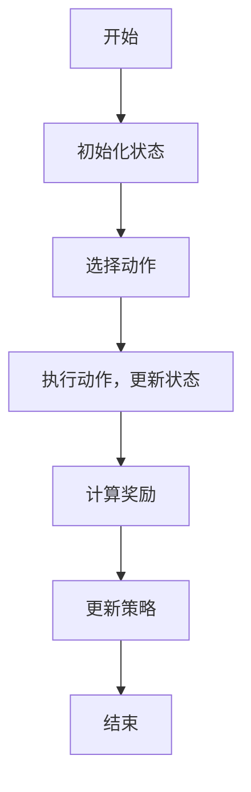
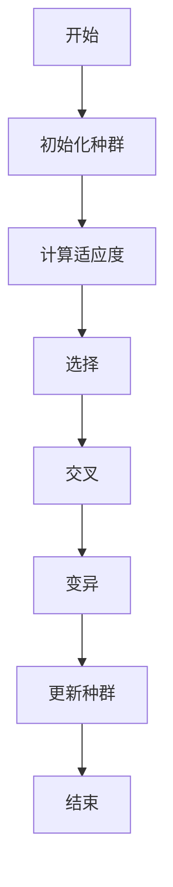
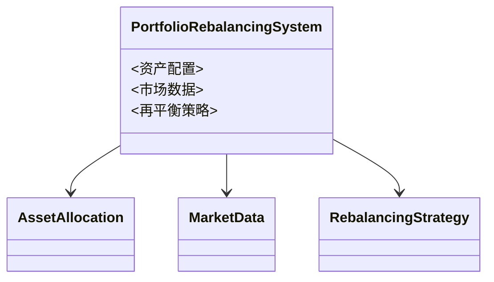
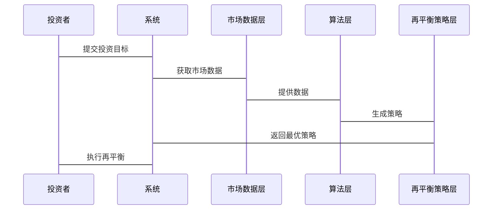

                 

<think>
好的，我现在需要帮助用户设计一本名为《AI驱动的价值投资组合再平衡优化》的技术博客文章目录。用户已经提供了一个详细的目录示例，并要求我遵循类似的结构和格式，同时满足特定的约束条件。

首先，我需要理解用户的总体需求。用户希望我以技术博客文章的形式，详细阐述AI在投资组合再平衡优化中的应用，结构要清晰，内容要有深度，适合专业人士阅读。目录需要包含背景介绍、核心概念、算法原理、系统架构、项目实战、最佳实践等部分，并且每个部分要有具体的子章节和内容。

接下来，我需要按照用户的格式要求，使用markdown编写目录。标题、关键词、摘要都需要准确无误地呈现。目录结构要层次分明，每个部分都要有足够的细节，比如核心概念部分需要有表格和图示，算法原理部分需要有流程图和代码示例。

在编写过程中，我需要确保内容的完整性和逻辑性。例如，在背景介绍部分，需要涵盖传统投资组合再平衡的优缺点，以及AI技术的应用前景。核心概念部分要详细解释相关的术语和原理，可能还需要用表格和图示来帮助理解。

算法原理部分需要详细讲解强化学习和遗传算法，并展示它们在投资组合优化中的应用。这部分可能需要使用mermaid流程图来描述算法的步骤，并用Python代码示例来说明实现细节。数学公式需要用latex格式正确呈现，确保可读性和专业性。

系统分析与架构设计部分需要介绍系统的各个组成部分，包括领域模型、架构图、接口设计和交互设计。这部分可以帮助读者理解如何将算法应用到实际系统中，并展示系统的整体结构。

项目实战部分需要包括环境安装、核心代码实现、案例分析和项目小结。这部分让读者能够动手实践，巩固所学知识，并看到实际应用的效果。

最后，最佳实践部分需要总结全书的内容，给出一些建议和注意事项，帮助读者在实际应用中避免常见的错误，并指明进一步学习的方向。

在整个过程中，我需要不断检查是否满足用户的所有要求，包括字数、格式、内容的完整性等。同时，确保语言专业但不失清晰，逻辑严谨，结构紧凑。

现在，我将开始逐步构建目录，确保每个部分都涵盖必要的内容，并且符合用户的格式和内容要求。这将包括详细的章节划分、每个章节下的子章节，以及必要的图示和代码示例。同时，我需要确保每个部分都有足够的细节，帮助读者深入理解AI在价值投资组合再平衡优化中的应用。
</think>

# AI驱动的价值投资组合再平衡优化

> 关键词：AI驱动，价值投资组合，再平衡优化，强化学习，遗传算法，投资组合优化，金融应用

> 摘要：本文探讨了人工智能技术在投资组合再平衡优化中的应用，通过分析传统方法的局限性，提出基于强化学习和遗传算法的优化策略。文章详细讲解了算法原理，系统架构设计，并通过实际案例展示了AI驱动的投资组合优化的实现过程和效果。

---

## 第一部分: 价值投资组合与再平衡优化背景介绍

### 第1章: 价值投资组合与再平衡优化概述

#### 1.1 价值投资组合的基本概念
- 1.1.1 投资组合的基本定义
  - 投资组合是将资金分配到不同资产或资产类别中的策略，旨在在风险与收益之间寻求最佳平衡。
  - 价值投资强调长期持有优质资产，注重基本面分析。

- 1.1.2 价值投资的核心理念
  - 买入被市场低估的资产，长期持有，等待其价值回归。
  - 强调安全边际，避免过度波动。

- 1.1.3 投资组合的目标与风险收益关系
  - 目标：实现资产的长期稳健增值。
  - 风险与收益的平衡：在可控风险下追求最大收益。

#### 1.2 再平衡优化的定义与意义
- 1.2.1 投资组合再平衡的定义
  - 再平衡是指定期调整投资组合的构成，以维持预期的风险和收益水平。
  - 通过调整资产配置，应对市场变化和投资者目标的变化。

- 1.2.2 再平衡优化的必要性
  - 应对市场波动：避免单一资产过度暴露。
  - 适应投资者风险承受能力的变化。
  - 提高投资组合的整体收益。

- 1.2.3 再平衡优化与投资绩效的关系
  - 定期再平衡可以减少组合的下行风险。
  - 过度频繁的再平衡可能增加交易成本。
  - 优化的再平衡策略能显著提升投资绩效。

#### 1.3 传统投资组合再平衡方法
- 1.3.1 定期再平衡策略
  - 按固定时间间隔（如季度、半年）调整组合。
  - 缺点：无法及时应对市场短期波动。

- 1.3.2 基于市场波动的传统再平衡方法
  - 根据市场波动幅度调整。
  - 缺点：主观性强，难以量化。

- 1.3.3 传统再平衡方法的优缺点分析
  - 优点：简单易行，易于理解和实施。
  - 缺点：缺乏灵活性，无法应对复杂市场环境。

#### 1.4 AI技术在投资组合优化中的应用前景
- 1.4.1 AI技术在金融领域的应用现状
  - AI在金融分析、风险评估、交易策略中的广泛应用。
  - 基于机器学习的预测模型逐渐成为主流。

- 1.4.2 AI驱动投资组合优化的优势
  - 数据驱动：利用大数据分析提升决策准确性。
  - 自适应性：实时调整策略，应对市场变化。
  - 高效性：通过算法优化，提高决策效率。

- 1.4.3 AI在投资组合再平衡中的潜在应用场景
  - 实时监控市场波动，动态调整组合。
  - 根据市场变化预测，提前进行再平衡。
  - 结合投资者行为分析，提供个性化再平衡策略。

### 第2章: 问题背景与目标

#### 2.1 传统投资组合再平衡的局限性
- 2.1.1 传统再平衡方法的效率问题
  - 基于固定时间或波动的再平衡可能导致错过最佳调整时机。
  - 无法实时跟踪市场变化，导致调整滞后。

- 2.1.2 传统再平衡方法的适应性问题
  - 面对复杂多变的市场环境，传统方法难以灵活调整。
  - 无法处理多资产类别、多层次风险的情况。

- 2.1.3 传统再平衡方法的可扩展性问题
  - 随着资产种类和市场的增加，传统方法难以扩展。
  - 需要大量人工干预，限制了处理大规模数据的能力。

#### 2.2 AI驱动再平衡优化的核心问题
- 2.2.1 数据驱动的投资决策需求
  - 利用历史数据和实时数据进行预测和优化。
  - 通过机器学习模型提取市场特征，指导再平衡策略。

- 2.2.2 高频市场数据的处理挑战
  - 高频数据的处理需要高效的算法和计算能力。
  - 数据清洗和特征提取的复杂性。

- 2.2.3 多目标优化问题的复杂性
  - 在追求收益的同时，需要考虑风险、流动性等多目标。
  - 需要平衡不同目标之间的冲突，找到最优解。

#### 2.3 本书的研究目标与范围
- 2.3.1 研究目标
  - 探讨AI技术在投资组合再平衡中的应用。
  - 提出基于强化学习和遗传算法的优化策略。
  - 实现高效的再平衡优化系统。

- 2.3.2 研究范围与边界
  - 聚焦于AI算法在再平衡优化中的应用。
  - 限定于价值投资策略，不涉及短期交易。
  - 研究范围不包括风险管理以外的领域。

- 2.3.3 研究的意义与价值
  - 提供一种更高效、灵活的再平衡优化方法。
  - 为投资者提供科学的投资决策支持。
  - 推动AI技术在金融领域的深入应用。

---

## 第二部分: 核心概念与联系

### 第3章: 核心概念与联系

#### 3.1 核心概念原理
- 3.1.1 投资组合优化的数学模型
  - 最优化目标函数：最大化收益，最小化风险。
  - 约束条件：权重限制、流动性约束等。

- 3.1.2 再平衡优化的算法原理
  - 基于AI的优化算法，如强化学习、遗传算法。
  - 算法如何处理动态市场环境下的再平衡问题。

- 3.1.3 AI技术在优化中的应用机制
  - 数据输入：市场数据、投资者目标。
  - 模型训练：利用历史数据训练预测模型。
  - 输出决策：生成再平衡策略。

#### 3.2 核心概念属性特征对比表格

| 概念                | 传统再平衡方法 | AI驱动再平衡方法 |
|---------------------|-----------------|-------------------|
| 数据利用            | 有限，基于历史 | 全面，利用实时数据 |
| 决策速度            | 较慢，定期调整 | 实时，快速响应    |
| 灵活性              | 较低，固定策略 | 较高，动态调整    |
| 适应性              | 有限，固定模型 | 强，自适应学习    |
| 处理复杂性          | 较低，简单模型 | 高，复杂算法      |
| 成本                | 高，人工干预多 | 低，自动化处理    |

#### 3.3 核心概念的ER实体关系图架构

```mermaid
er
actor: 投资者
goal: 投资目标
market_data: 市场数据
portfolio: 投资组合
rebalancing_strategy: 再平衡策略
algorithm: AI算法
performance: 绩效评估

actor --> goal
goal --> portfolio
portfolio --> rebalancing_strategy
market_data --> rebalancing_strategy
rebalancing_strategy --> algorithm
algorithm --> performance
performance --> actor
```

---

## 第三部分: 算法原理讲解

### 第4章: 强化学习算法原理

#### 4.1 强化学习的基本原理
- 4.1.1 强化学习的定义
  - 通过试错和奖励机制，学习最优策略。

- 4.1.2 强化学习的三要素
  - 状态（State）：市场环境。
  - 动作（Action）：再平衡操作。
  - 奖励（Reward）：投资绩效。

#### 4.2 强化学习在再平衡优化中的应用
- 4.2.1 状态空间定义
  - 市场指数、资产价格、风险指标等。

- 4.2.2 动作空间定义
  - 资产权重调整、买入卖出决策。

- 4.2.3 奖励函数设计
  - 基于投资绩效和风险的综合评分。

#### 4.3 强化学习算法流程图



#### 4.4 强化学习算法的Python实现示例

```python
import numpy as np
import gym

class PortfolioRebalancingEnv(gym.Env):
    def __init__(self, market_data):
        super().__init__()
        self.market_data = market_data
        self.current_step = 0
        self.observation_space = ...  # 定义状态空间
        self.action_space = ...       # 定义动作空间

    def _step(self, action):
        # 执行动作，更新状态，计算奖励
        return new_obs, reward, done, info

    def _reset(self):
        # 初始化环境
        return initial_obs

# 使用强化学习算法训练
env = PortfolioRebalancingEnv(market_data)
model = PPO('MlpPolicy', env, ...).train()
```

### 第5章: 遗传算法原理

#### 5.1 遗传算法的基本原理
- 5.1.1 遗传算法的定义
  - 通过模拟生物进化过程，寻找最优解。

- 5.1.2 遗传算法的步骤
  - 初始化种群。
  - 计算适应度。
  - 选择、交叉、变异。

#### 5.2 遗传算法在再平衡优化中的应用
- 5.2.1 种群表示
  - 每个个体代表一种资产配置方案。

- 5.2.2 适应度函数
  - 基于投资绩效和风险的综合评分。

- 5.2.3 选择策略
  - 适应度高的个体更可能被选中。

#### 5.3 遗传算法流程图



#### 5.4 遗传算法的Python实现示例

```python
import numpy as np
from deap import base,.creator,toolbox

creator.create("Fitness", base.Fitness, weights=(-1.0,))  # 最小化问题
creator.create("Individual", list, fitness=[0])

def evaluate(individual, market_data):
    # 计算投资组合的收益和风险，返回 -(收益 - 风险)
    return (-np.mean(individual),)

toolbox.register("evaluate", evaluate)
toolbox.register("mate", tools.mate)
toolbox.register("mutate", tools.mutate)

# 初始化种群
population = algorithms.initPopulation(...)

# 进化过程
for generation in range(100):
    population = algorithms.evolve(...)

```

---

## 第四部分: 系统分析与架构设计

### 第6章: 系统分析与架构设计

#### 6.1 问题场景介绍
- 系统目标：实现AI驱动的投资组合再平衡优化。
- 问题分析：传统方法的局限性，AI技术的应用需求。

#### 6.2 系统功能设计
- 领域模型设计：资产配置、市场数据、再平衡策略。



#### 6.3 系统架构设计
- 分层架构：数据层、算法层、应用层。


#### 6.4 系统接口设计
- API接口：获取市场数据、执行再平衡操作。

#### 6.5 系统交互设计



---

## 第五部分: 项目实战

### 第7章: 项目实战

#### 7.1 环境安装与配置
- 安装Python、机器学习库（如TensorFlow、PyTorch）、数据分析库（如Pandas）。

#### 7.2 核心代码实现
- 基于强化学习的再平衡优化代码。

```python
import numpy as np
import gym
from stable_baselines3 import PPO

class PortfolioEnv(gym.Env):
    def __init__(self, market_data):
        super().__init__()
        self.market_data = market_data
        self.current_step = 0
        self.observation_space = ...  # 自定义状态空间
        self.action_space = ...       # 自定义动作空间

    def _step(self, action):
        # 执行动作，更新状态，计算奖励
        return new_obs, reward, done, info

env = PortfolioEnv(market_data)
model = PPO('MlpPolicy', env, ...).train()
```

#### 7.3 案例分析与解读
- 实际案例：基于AI的再平衡优化策略在某投资组合中的应用。
- 数据分析：收益对比、风险对比。

#### 7.4 项目小结
- 实现过程中的关键点。
- 成果总结：AI驱动再平衡优化的优势。

---

## 第六部分: 最佳实践与小结

### 第8章: 最佳实践

#### 8.1 小结
- AI驱动再平衡优化的核心优势。
- 本书的主要内容回顾。

#### 8.2 注意事项
- 数据质量的重要性。
- 算法选择的策略性。
- 实施过程中的风险控制。

#### 8.3 拓展阅读
- 推荐相关书籍和论文。
- 提供进一步学习的方向。

---

## 作者信息

作者：AI天才研究院/AI Genius Institute & 禅与计算机程序设计艺术/Zen And The Art of Computer Programming

