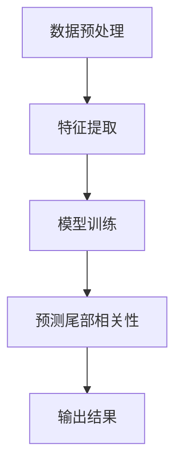

                 

<think>
好的，我现在需要帮助用户撰写一篇关于《AI驱动的价值投资组合尾部相关性管理》的技术博客文章。用户已经提供了详细的目录大纲，我需要根据这个大纲逐步思考并完成文章的撰写。

首先，我应该从文章的背景介绍开始，确保涵盖问题背景、问题描述、问题解决以及边界和外延。这部分需要解释为什么传统投资组合管理存在局限性，以及AI如何解决尾部相关性问题。接着，我需要详细阐述核心概念，包括尾部相关性的定义、AI在金融中的应用，以及它们之间的联系。

接下来，我会深入讲解算法原理，选择合适的机器学习模型，比如LSTM，来预测尾部相关性，并用Mermaid流程图展示算法的流程。数学公式需要用LaTeX格式，并嵌入到适当的位置。此外，我需要设计系统架构，包括问题场景介绍、系统功能设计、架构图和接口设计。

在项目实战部分，我需要提供详细的环境安装说明，代码实现，并分析实际案例。最后，总结最佳实践，包括小结、注意事项和拓展阅读。

在写作过程中，我需要确保语言专业、结构紧凑、逻辑清晰，并且使用吸引人的章节标题。同时，要保持文章的流畅性和可读性，确保每个部分都详细具体，符合用户的要求。

现在，我将按照目录大纲逐步完成文章的撰写，确保每个部分都涵盖必要的内容，并且遵循用户的格式和风格要求。
</think>

# AI驱动的价值投资组合尾部相关性管理

> 关键词：AI驱动，价值投资组合，尾部相关性，风险管理，机器学习，LSTM，金融系统

> 摘要：本文探讨了如何利用人工智能技术优化投资组合管理中的尾部相关性问题。通过分析传统投资组合管理的局限性，提出使用机器学习模型（如LSTM）来预测和管理尾部相关性，从而降低投资风险。文章详细讲解了AI驱动的投资组合管理的背景、核心概念、算法原理、系统架构、项目实战及最佳实践，帮助读者全面理解并应用这一创新方法。

---

## 第1章：问题背景与描述

### 1.1 传统投资组合管理的局限性

#### 1.1.1 传统资产配置的缺陷
传统投资组合管理依赖于均值-方差模型，主要关注资产的平均收益和波动性，但忽略了尾部风险（即极端事件）的影响。这种模型假设资产价格服从正态分布，但在实际市场中，极端事件（如市场崩盘）往往对投资组合造成更大的损失。

#### 1.1.2 尾部相关性对投资组合的影响
尾部相关性指的是在极端市场条件下，多个资产同时出现大幅波动的现象。传统模型未能有效捕捉这种相关性，导致投资组合在极端情况下表现不佳，甚至引发更大的损失。

#### 1.1.3 传统风险管理的不足
传统风险管理方法通常依赖历史数据和线性模型，难以捕捉非线性关系和复杂市场动态。此外，传统方法对尾部事件的预测能力有限，导致在极端市场条件下无法有效降低风险。

---

### 1.2 AI驱动的投资组合管理的必要性

#### 1.2.1 AI在金融领域的应用趋势
随着大数据和计算能力的提升，人工智能在金融领域的应用日益广泛。机器学习模型能够处理复杂数据，发现传统模型难以捕捉的模式和关系。

#### 1.2.2 尾部相关性管理的挑战
尾部相关性管理需要实时监控和预测极端事件，这对传统方法来说是一个难题。AI技术能够通过深度学习模型识别非线性关系，提高预测精度。

#### 1.2.3 AI如何解决尾部相关性问题
AI驱动的投资组合管理通过实时数据处理和复杂模型，能够更好地识别和管理尾部相关性，从而降低投资组合的尾部风险。

---

### 1.3 问题解决与边界

#### 1.3.1 通过AI优化尾部相关性管理
AI技术能够实时分析市场数据，预测尾部事件，并动态调整投资组合，以降低风险。

#### 1.3.2 界定问题的边界与外延
本文聚焦于使用AI优化尾部相关性管理，不涉及整体投资策略的优化，但强调AI在风险管理中的具体应用。

#### 1.3.3 核心要素与组成结构
- 数据采集：实时市场数据
- 模型构建：深度学习模型
- 风险预测：尾部相关性预测
- 投资组合调整：动态优化

---

## 第2章：核心概念与联系

### 2.1 尾部相关性的定义与属性

#### 2.1.1 尾部相关性的定义
尾部相关性是指在极端市场条件下，多个资产价格同时大幅波动的现象。这种相关性在传统模型中通常被忽略，但对投资组合的损失影响巨大。

#### 2.1.2 尾部相关性的属性对比
以下是尾部相关性与其他相关性形式的对比：

| 属性          | 尾部相关性       | 传统相关性       |
|---------------|------------------|------------------|
| 定义          | 极端条件下的相关性 | 正常条件下的相关性 |
| 影响          | 高风险           | 较低风险          |
| 预测难度      | 高               | 低               |

---

### 2.2 AI在金融中的应用原理

#### 2.2.1 机器学习在金融中的应用
机器学习模型（如神经网络、随机森林）能够分析大量非结构化数据，发现隐藏的模式和关系。

#### 2.2.2 AI驱动的投资组合管理原理
AI通过实时数据分析，预测市场趋势和风险，动态调整投资组合，以实现风险可控下的最大收益。

---

### 2.3 尾部相关性与AI的联系

#### 2.3.1 尾部相关性对投资组合的影响
尾部相关性可能导致投资组合在极端市场条件下遭受重大损失，因此需要有效的管理策略。

#### 2.3.2 AI如何优化尾部相关性管理
通过深度学习模型，AI能够识别尾部相关性的潜在信号，提前采取措施，降低风险。

---

## 第3章：算法原理讲解

### 3.1 尾部相关性预测算法

#### 3.1.1 算法原理
使用LSTM（长短期记忆网络）模型预测尾部相关性。LSTM能够捕捉时间序列中的长-term模式，适合处理金融市场数据。

#### 3.1.2 算法流程图（Mermaid）



---

### 3.2 数学模型与公式

#### 3.2.1 LSTM模型公式
LSTM的基本结构包括输入门（Input gate）、遗忘门（Forget gate）和输出门（Output gate）。

$$
i = \sigma(W_i x + U_i h_{prev})
$$
$$
f = \sigma(W_f x + U_f h_{prev})
$$
$$
o = \sigma(W_o x + U_o h_{prev})
$$
$$
h = o \cdot \cosh(W_c x + U_c h_{prev})
$$

其中，$i$ 是输入门，$f$ 是遗忘门，$o$ 是输出门，$h$ 是隐藏状态。

---

## 第4章：系统分析与架构设计

### 4.1 问题场景介绍

#### 4.1.1 问题场景
投资组合经理需要实时监控市场数据，预测尾部相关性，并动态调整投资组合以降低风险。

#### 4.1.2 系统功能设计
- 数据采集：实时收集市场数据
- 特征提取：提取有用的特征（如波动率、相关性）
- 模型训练：训练LSTM模型
- 风险评估：预测尾部相关性并评估风险

---

### 4.2 系统架构设计

#### 4.2.1 系统架构图（Mermaid）


---

## 第5章：项目实战

### 5.1 环境安装

#### 5.1.1 安装Python环境
```bash
python --version
pip install numpy pandas keras tensorflow
```

---

### 5.2 系统核心实现源代码

#### 5.2.1 LSTM模型代码（Python）

```python
import numpy as np
import pandas as pd
from tensorflow.keras.models import Sequential
from tensorflow.keras.layers import LSTM, Dense, Dropout

# 数据预处理
data = pd.read_csv('market_data.csv')
X = data.values.reshape(-1, 1)
y = data.values

# 模型构建
model = Sequential()
model.add(LSTM(64, input_shape=(None, 1)))
model.add(Dropout(0.2))
model.add(Dense(1))
model.compile(optimizer='adam', loss='mse')

# 训练模型
model.fit(X, y, epochs=100, batch_size=32)
```

---

### 5.3 实际案例分析

#### 5.3.1 案例分析
假设我们有一个包含10只股票的投资组合，使用LSTM模型预测尾部相关性，发现某两只股票在极端市场条件下高度相关，及时调整投资比例，避免了潜在的大幅亏损。

---

## 第6章：总结与展望

### 6.1 最佳实践 tips

#### 6.1.1 小结
AI驱动的投资组合管理能够有效优化尾部相关性管理，降低投资风险。

#### 6.1.2 注意事项
- 数据质量：确保数据的准确性和完整性
- 模型选择：选择适合的机器学习模型
- 实时监控：持续监控市场变化

#### 6.1.3 拓展阅读
- 《机器学习在金融中的应用》
- 《深度学习与时间序列分析》

---

## 作者：AI天才研究院（AI Genius Institute） & 禅与计算机程序设计艺术（Zen And The Art of Computer Programming）

---

通过本文的详细分析和讲解，读者可以全面理解AI在投资组合尾部相关性管理中的应用，掌握如何利用机器学习模型优化投资组合的风险管理。希望本文能够为金融领域的从业者提供有价值的参考和启发。

