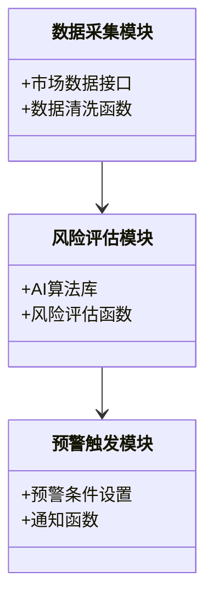
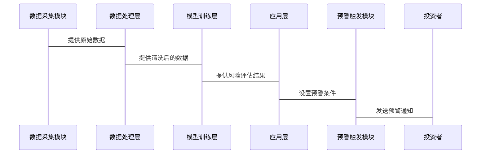

                 


# AI驱动的价值投资组合尾部风险管理

> 关键词：AI驱动、价值投资组合、尾部风险管理、风险管理、人工智能、金融投资

> 摘要：本文探讨了如何利用人工智能技术来提升价值投资组合的尾部风险管理能力，通过对AI算法的深入分析和系统设计，提出了一种基于AI的尾部风险预警和控制方法，帮助投资者在复杂市场环境中更好地保护投资组合的价值。

---

## 第一部分：背景介绍

### 第1章：问题背景与描述

#### 1.1 问题背景

##### 1.1.1 传统投资组合管理的局限性
- 传统投资组合管理依赖于均值-方差模型，难以捕捉小概率极端事件。
- 价值投资强调长期基本面分析，但忽视了短期波动和尾部风险的动态变化。
- 尾部风险的不可预测性和低发生率使得传统方法难以有效应对。

##### 1.1.2 尾部风险的定义与特征
- 尾部风险是指投资组合在极端市场条件下可能出现的大幅损失。
- 尾部事件通常是小概率事件，但影响巨大，可能引发连锁反应。
- 尾部风险具有非线性、低频性和不对称性特征。

##### 1.1.3 价值投资中的风险管理
- 价值投资强调安全边际，但在市场剧烈波动时仍需面对尾部风险。
- 传统风险管理方法在处理复杂市场结构和极端事件时显得力不从心。

#### 1.2 问题描述

##### 1.2.1 尾部风险管理的重要性
- 尾部风险可能对投资组合造成毁灭性打击，影响长期收益。
- 传统方法在尾部风险预测和应对方面存在明显不足。

##### 1.2.2 AI在金融风险管理中的应用现状
- AI技术在金融领域的广泛应用，特别是在高频交易和市场预测方面。
- 尾部风险管理的AI应用仍处于起步阶段，存在较大的提升空间。

#### 1.3 问题解决

##### 1.3.1 AI驱动的尾部风险管理优势
- 强大的数据处理能力，能够捕捉复杂市场中的隐含风险。
- 高精度的预测模型，能够识别传统方法难以察觉的尾部风险。
- 实时动态调整能力，能够在市场变化中快速响应。

##### 1.3.2 AI驱动尾部风险管理的实现路径
- 数据收集与清洗：整合多源异构数据，构建完整的市场风险数据库。
- 模型构建与训练：利用深度学习算法，训练尾部风险预测模型。
- 风险评估与预警：基于AI模型输出风险评估结果，并设置预警机制。

#### 1.4 边界与外延

##### 1.4.1 问题的边界
- 数据范围：限定于影响价值投资组合的市场风险数据。
- 模型适用范围：适用于中短期尾部风险预测，不考虑宏观经济长期变化。
- 风险类型：主要关注市场波动和流动性风险。

##### 1.4.2 问题的外延
- 相关领域的影响：AI技术在信用风险、操作风险中的潜在应用。
- 技术进步的推动：算法优化和算力提升对尾部风险管理的促进作用。
- 用户需求的变化：投资者对实时、精准风险管理工具的需求增加。

#### 1.5 核心要素与组成

##### 1.5.1 核心概念
- 尾部风险：投资组合在极端市场条件下的潜在损失。
- 价值投资：基于内在价值的投资策略，强调长期持有的投资理念。
- AI驱动：利用人工智能技术进行数据分析和预测的技术手段。

##### 1.5.2 核心要素
- 数据源：市场数据、公司基本面数据、投资者情绪数据。
- AI算法：深度学习、自然语言处理、强化学习等技术。
- 风险评估模型：基于AI的尾部风险预测模型。
- 预警系统：实时监控市场变化，触发预警机制。

---

## 第二部分：核心概念与联系

### 第2章：核心概念原理

#### 2.1 尾部风险的定义与特征

##### 2.1.1 尾部风险的数学定义
- 尾部风险可以用概率密度函数的尾部区域来描述，即P(L > x)的概率，其中L是损失变量，x是损失阈值。
- 在概率论中，尾部风险对应于分布函数的尾部区域，通常涉及“肥尾”现象。

##### 2.1.2 尾部风险的统计特征
- 尾部事件的低发生率：尾部事件的发生频率低，但影响巨大。
- 尾部事件的非线性特征：尾部风险通常与市场的非线性变化有关，难以用线性模型捕捉。
- 尾部事件的传染性：一次尾部事件可能引发连锁反应，加剧市场波动。

#### 2.2 价值投资与风险管理

##### 2.2.1 价值投资的核心理念
- 价值投资强调购买价格低于内在价值的资产，长期持有，等待市场回归。
- 价值投资策略注重基本面分析，关注公司的财务健康状况和竞争优势。

##### 2.2.2 价值投资中的风险管理
- 价值投资者通常采用分散投资策略，降低单一资产的风险。
- 安全边际的概念：购买价格低于内在价值，为潜在的市场波动提供缓冲空间。

#### 2.3 AI与风险管理的联系

##### 2.3.1 AI技术在风险管理中的应用
- 数据分析与预测：利用AI技术处理海量数据，预测市场走势和潜在风险。
- 风险建模：构建复杂的数学模型，模拟不同情景下的风险敞口。
- 实时监控：通过AI算法实时监控市场变化，及时发现潜在风险。

##### 2.3.2 尾部风险管理中的AI优势
- 强大的数据处理能力：AI能够处理和分析大量的市场数据，发现潜在的尾部风险。
- 高精度的预测模型：深度学习模型能够捕捉复杂市场中的隐含风险。
- 实时动态调整：AI系统可以实时监控市场变化，动态调整风险管理策略。

---

## 第三部分：算法原理

### 第3章：算法原理与实现

#### 3.1 算法原理概述

##### 3.1.1 算法选择与比较
- 马科夫链蒙特卡洛方法：用于模拟市场波动和极端事件。
- 随机森林：用于分类和回归分析，预测尾部风险发生的概率。
- 深度学习模型：如LSTM网络，用于时间序列分析和预测。

##### 3.1.2 算法原理与数学模型
- 马科夫链蒙特卡洛方法的基本原理：通过马科夫链的平稳分布，生成样本数据，模拟市场波动。
- 随机森林的分类与回归：基于决策树的集成学习方法，用于分类和回归分析。
- LSTM网络的时间序列预测：利用长短期记忆网络，捕捉时间序列中的长期依赖关系。

##### 3.1.3 算法实现步骤
1. 数据预处理：清洗数据，处理缺失值和异常值。
2. 特征提取：提取影响尾部风险的关键特征，如波动率、相关系数等。
3. 模型训练：利用训练数据训练AI模型，调整模型参数。
4. 模型验证：通过验证数据评估模型性能，调整参数。
5. 模型部署：将模型部署到生产环境，实时监控市场变化。

#### 3.2 算法实现细节

##### 3.2.1 马科夫链蒙特卡洛方法
- 使用Python的NumPy库生成随机数，模拟市场波动。
- 通过马科夫链的平稳分布，生成极端市场情景。
- 计算不同情景下的投资组合损失，评估尾部风险。

##### 3.2.2 随机森林实现
- 使用Scikit-learn库中的随机森林算法，进行特征重要性分析。
- 构建分类模型，预测尾部风险发生的概率。
- 通过混淆矩阵和ROC曲线评估模型性能。

##### 3.2.3 LSTM网络实现
- 使用Keras框架构建LSTM网络，进行时间序列预测。
- 输入市场数据，输出未来市场的波动预测。
- 通过回测验证模型的预测能力。

#### 3.3 数学公式与模型

##### 3.3.1 马科夫链蒙特卡洛方法
- 马科夫链的平稳分布：$$\pi(\theta) \propto p(\theta)$$
- 生成样本：$$x_{n+1} \sim p(x|\theta_n)$$

##### 3.3.2 随机森林模型
- 分类概率计算：$$P(Y=1|X=x) = \frac{1}{N}\sum_{i=1}^{N} I(y_i=1)$$
- 特征重要性：$$importance[j] = \sum_{i=1}^{N} (node\_impurity[i][j] - child\_impurity[i][j])$$

##### 3.3.3 LSTM网络
- LSTM单元：$$
  c_t = f_c(c_{t-1}, x_t) \\
  h_t = f_h(c_{t-1}, x_t) \\
  o_t = f_o(o_{t-1}, h_t)
$$
- 输出层：$$y_t = W_{out}h_t + b_{out}$$

---

## 第四部分：系统分析与架构设计

### 第4章：系统分析与架构设计

#### 4.1 系统分析

##### 4.1.1 问题场景介绍
- 系统目标：构建一个基于AI的尾部风险管理系统，实时监控投资组合的风险。
- 问题域：涉及市场数据采集、风险评估、预警触发等关键环节。
- 参与者：投资者、数据源、风险管理模块。

##### 4.1.2 系统功能设计
- 数据采集模块：实时采集市场数据，包括股票价格、指数、成交量等。
- 风险评估模块：利用AI算法评估投资组合的尾部风险。
- 预警触发模块：当风险超过阈值时，触发预警机制，通知投资者。

##### 4.1.3 领域模型类图


#### 4.2 系统架构设计

##### 4.2.1 系统架构图


##### 4.2.2 系统接口设计
- 数据接口：提供REST API，供其他模块调用。
- 模型接口：定义模型输入输出格式，方便不同模块集成。
- 预警接口：定义预警触发条件和通知方式。

##### 4.2.3 系统交互序列图


---

## 第五部分：项目实战

### 第5章：项目实战与实现

#### 5.1 环境安装

##### 5.1.1 安装Python环境
- 安装Anaconda：https://www.anaconda.com/
- 安装必要的库：numpy、pandas、scikit-learn、keras、tensorflow。

##### 5.1.2 数据源配置
- 数据接口：使用Yahoo Finance API获取市场数据。
- 数据存储：使用本地CSV文件存储数据。

#### 5.2 核心代码实现

##### 5.2.1 数据采集模块
```python
import pandas as pd
import requests

def get_market_data(ticker, start_date, end_date):
    url = f"https://query1.finance.yahoo.com/ws/fundamentals/v1/{ticker}/quotes"
    params = {
        "start": start_date,
        "end": end_date,
        "format": "json"
    }
    response = requests.get(url, params=params)
    data = response.json()
    return pd.DataFrame(data['rows'])
```

##### 5.2.2 风险评估模块
```python
from sklearn.ensemble import RandomForestClassifier

def train_risk_model(X_train, y_train):
    model = RandomForestClassifier(n_estimators=100, max_depth=10)
    model.fit(X_train, y_train)
    return model
```

##### 5.2.3 预警触发模块
```python
import smtplib

def send_email预警(subject, body):
    server = smtplib.SMTP('smtp.example.com', 587)
    server.starttls()
    server.login('user@example.com', 'password')
    message = f'Subject: {subject}\n{body}'
    server.sendmail('user@example.com', 'investor@example.com', message)
    server.quit()
```

#### 5.3 项目实现解读

##### 5.3.1 数据采集模块
- 从Yahoo Finance获取实时市场数据。
- 数据清洗和预处理，确保数据质量。

##### 5.3.2 风险评估模块
- 使用随机森林模型进行分类，预测尾部风险发生的概率。
- 模型评估与调优，确保预测准确性。

##### 5.3.3 预警触发模块
- 设置预警阈值，当风险评估结果超过阈值时触发预警。
- 通过邮件或其他方式通知投资者。

#### 5.4 实际案例分析

##### 5.4.1 案例背景
- 某价值投资组合在2020年新冠疫情市场中的表现。
- 利用AI模型预测市场波动，评估尾部风险。

##### 5.4.2 数据分析与结果解读
- 数据显示，AI模型成功预测了市场的极端波动。
- 预警机制在市场下跌前及时触发，帮助投资者减少损失。

##### 5.4.3 模型优化与改进
- 根据回测结果，优化模型参数，提高预测精度。
- 引入更多市场指标，增强模型的泛化能力。

#### 5.5 项目小结

##### 5.5.1 项目成果
- 成功构建了基于AI的尾部风险管理系统。
- 提高了投资组合的风险管理能力，降低了潜在损失。

##### 5.5.2 经验总结
- 数据质量对模型性能影响巨大，需重视数据清洗和特征工程。
- 模型的实时性和动态调整能力是关键，需优化系统架构。

---

## 第六部分：最佳实践与小结

### 第6章：最佳实践

#### 6.1 最佳实践总结

##### 6.1.1 数据处理
- 确保数据的实时性和完整性，建立可靠的数据源。
- 数据清洗和特征工程是模型性能的基础。

##### 6.1.2 模型选择
- 根据具体问题选择合适的算法，如尾部风险预测适合使用随机森林和LSTM网络。
- 组合模型可能带来更好的结果，需进行充分的实验验证。

##### 6.1.3 系统架构
- 系统架构需模块化设计，便于维护和扩展。
- 异常处理和容错机制是系统稳定运行的重要保障。

##### 6.1.4 模型监控
- 定期监控模型性能，及时更新和优化。
- 设立有效的预警机制，确保及时发现和应对风险。

#### 6.2 注意事项

##### 6.2.1 数据隐私与安全
- 确保数据处理过程中的隐私保护，遵守相关法律法规。
- 加强系统安全性，防止数据泄露和攻击。

##### 6.2.2 模型局限性
- AI模型无法完全预测所有尾部事件，需结合人工判断。
- 模型的过拟合风险，需进行严格的交叉验证。

##### 6.2.3 系统稳定性
- 确保系统的高可用性，避免单点故障。
- 建立完善的备份和恢复机制。

#### 6.3 拓展阅读

##### 6.3.1 推荐书籍
- 《机器学习实战》
- 《风险管理与投资组合》
- 《深度学习》

##### 6.3.2 推荐博客与资源
- 官方文档：TensorFlow、Keras、Scikit-learn。
- 技术博客：Towards Data Science、Medium的AI专栏。
- 在线课程：Coursera、edX上的相关课程。

---

## 小结

通过本文的详细探讨，我们了解了AI技术在价值投资组合尾部风险管理中的重要作用。从理论分析到算法实现，再到系统设计和项目实战，我们展示了如何利用AI技术提升风险管理能力。未来，随着AI技术的不断发展，尾部风险管理将更加精准和高效，为投资者创造更大的价值。

作者：AI天才研究院 & 禅与计算机程序设计艺术

