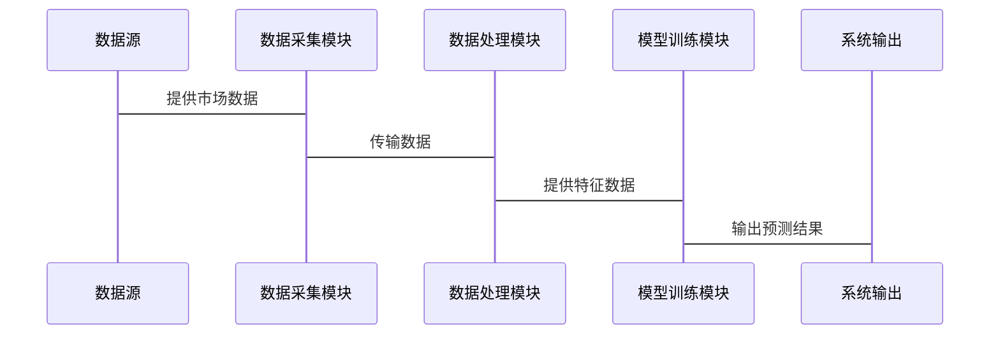

                 

<think>
好的，我需要为《AI驱动的价值投资组合流动性管理》这本书撰写目录大纲。首先，我需要理解这本书的核心主题是什么。看起来，这本书主要探讨如何利用人工智能技术来优化价值投资组合的流动性管理。

接下来，我应该考虑这本书的结构。通常，技术书籍会从背景介绍开始，逐步深入到核心概念、算法原理、系统设计和项目实战。因此，我需要将这些部分分解成具体的章节。

首先，第一部分可能是背景介绍。在这里，我需要解释什么是价值投资组合，什么是流动性管理，以及为什么需要使用AI来驱动这些过程。这有助于读者理解本书的基本概念和问题背景。

接下来是核心概念部分。这里，我需要详细讨论AI在流动性管理中的具体应用，包括机器学习算法、时间序列分析等。我还需要解释这些算法如何用于预测流动性风险并优化投资组合。

然后是算法原理与数学模型。这部分需要详细推导相关的数学公式，例如ARIMA模型、LSTM网络等，并用Python代码示例来展示如何实现这些模型。同时，我需要使用Mermaid图来展示系统架构和数据流程，使内容更加直观。

接下来是系统架构与项目实战。在这里，我需要描述如何设计一个AI驱动的流动性管理系统，包括数据采集、特征工程、模型训练和部署等模块。同时，我需要提供一个实际案例，展示如何将这些理论应用到实际项目中。

最后，总结与展望部分可以帮助读者回顾全书的内容，并展望未来的研究方向。我还可以提供一些最佳实践的建议，帮助读者更好地应用这些技术。

在写作过程中，我需要确保每个章节都包含必要的部分，比如数学公式用Latex表示，系统架构用Mermaid图，以及代码示例。同时，我要保持目录的简洁，不超过2000字，并且章节足够详细，涵盖用户要求的所有内容。

综上所述，我将按照上述思考过程，逐步构建《AI驱动的价值投资组合流动性管理》的目录大纲。
</think>

```markdown
# AI驱动的价值投资组合流动性管理

> 关键词：AI, 投资组合, 流动性管理, 机器学习, 时间序列分析, 系统架构, 价值投资

> 摘要：本文系统地探讨了如何利用人工智能技术优化价值投资组合的流动性管理。通过分析流动性预测的核心算法和投资组合优化的数学模型，结合实际项目案例，详细讲解了AI在金融领域的应用及其对投资决策的深远影响。

---

## 第1章: 价值投资组合与流动性管理基础

### 1.1 价值投资组合的基本概念
#### 1.1.1 投资组合的定义与分类
- 投资组合的定义：将多种资产以特定比例组合，以实现风险分散和收益最大化。
- 分类：股票型、债券型、混合型等。

#### 1.1.2 价值投资的核心理念
- 价值投资的定义：寻找市场价格低于其内在价值的股票进行投资。
- 核心理念：长期投资、安全边际、注重基本面分析。

#### 1.1.3 流动性管理的目标与意义
- 流动性管理的目标：确保在需要时能够快速变现，避免流动性风险。
- 意义：流动性管理是投资组合管理中的关键环节，直接影响投资组合的收益和风险。

### 1.2 AI在金融领域的应用背景
#### 1.2.1 人工智能在金融行业的应用现状
- 机器学习在金融数据分析中的应用：如股票价格预测、风险评估等。
- 自然语言处理在新闻分析和情绪预测中的应用。

#### 1.2.2 金融数据分析的挑战与机遇
- 数据量大、维度高：需要处理大量历史数据和实时数据。
- 数据复杂性：金融数据受多种因素影响，如市场情绪、经济指标等。
- 数据的实时性：需要快速处理和响应。

#### 1.2.3 AI驱动投资决策的潜力与局限性
- 潜力：提高预测精度，优化投资组合，降低风险。
- 局限性：模型的黑箱特性、数据质量的影响、市场不可预测性。

### 1.3 本章小结
- 本章介绍了价值投资组合和流动性管理的基本概念，分析了AI在金融领域的应用背景，为后续章节奠定了基础。

---

## 第2章: 价值投资组合流动性管理的AI方法论

### 2.1 核心概念与原理
#### 2.1.1 流动性预测的定义与关键指标
- 流动性预测的定义：预测资产或投资组合在特定时间内的变现能力。
- 关键指标：流动性比率（如现金比率、流动资产比率）。

#### 2.1.2 AI在流动性预测中的作用
- 提供数据驱动的预测模型：通过机器学习算法预测流动性风险。
- 实时监控和预警：利用AI技术实时监控市场变化，提供流动性预警。

#### 2.1.3 价值投资组合优化的数学模型
- Markowitz均值-方差模型：最小化风险，最大化收益。
- 距离度量方法：基于投资组合与市场指数的偏离度进行优化。

### 2.2 AI算法在流动性管理中的应用
#### 2.2.1 机器学习算法的选择与优化
- 线性回归：用于预测流动性变化趋势。
- 支持向量机：用于分类流动性风险等级。
- 随机森林：用于特征重要性分析。

#### 2.2.2 时间序列分析在流动性预测中的应用
- ARIMA模型：用于预测流动性变化趋势。
- LSTM网络：用于捕捉时间序列中的长期依赖关系。
- GARCH模型：用于预测流动性波动性。

#### 2.2.3 强化学习在投资组合优化中的潜力
- Q-Learning：用于动态调整投资组合。
- Deep Q-Network：用于复杂环境下的投资决策。

### 2.3 系统架构与数据流分析
#### 2.3.1 系统架构的模块划分
- 数据采集模块：负责收集市场数据、交易数据等。
- 数据处理模块：进行数据清洗、特征工程。
- 模型训练模块：训练流动性预测模型和投资组合优化模型。
- 系统部署模块：将模型部署到生产环境，实时监控和预警。

#### 2.3.2 数据流的Mermaid流程图


#### 2.3.3 系统交互的Mermaid序列图


### 2.4 本章小结
- 本章详细探讨了AI在流动性管理中的应用，介绍了常用的算法和系统架构，为后续章节的实现奠定了基础。

---

## 第3章: 流动性预测的数学模型

### 3.1 时间序列预测模型
#### 3.1.1 ARIMA模型的原理与实现
- ARIMA模型的定义：自回归积分滑动平均模型。
- ARIMA模型的参数选择：p、d、q的确定。
- ARIMA模型的实现步骤：数据预处理、模型拟合、模型预测。

#### 3.1.2 LSTM网络的结构与优势
- LSTM网络的结构：包括输入门、遗忘门、输出门。
- LSTM网络的优势：能够捕捉长期依赖关系，适合处理时间序列数据。

#### 3.1.3 模型的数学公式推导
- ARIMA模型的数学公式：
  $$ARIMA(p, d, q): (1 - B)^d (1 - φ_1 B - ... - φ_p B^p) X_t = θ_1 B + ... + θ_q B^q$$
- LSTM网络的数学公式：
  $$f_t = \sigma(W_f \cdot [h_{t-1}, x_t])$$
  $$i_t = \sigma(W_i \cdot [h_{t-1}, x_t])$$
  $$o_t = \sigma(W_o \cdot [h_{t-1}, x_t])$$
  $$c_t = f_t \cdot c_{t-1} + i_t \cdot x_t$$
  $$h_t = o_t \cdot \tanh(c_t)$$

### 3.2 投资组合优化的数学模型
#### 3.2.1 Markowitz均值-方差模型
- 均值-方差模型的定义：通过优化投资组合的收益和风险，找到最优投资组合。
- 数学公式：
  $$\min_w \frac{1}{2} w^T \Sigma w$$
  $$\text{subject to} \quad w^T \mu = \text{target return}$$
  $$w^T \mathbf{1} = 1$$
  $$w \in \mathbb{R}^n$$

#### 3.2.2 基于AI的优化算法
- 遗传算法：通过模拟自然选择过程，寻找最优解。
- 模拟退火算法：通过逐步降温，减少局部最优解的影响。

#### 3.2.3 数学公式的详细解释
- Markowitz均值-方差模型的目标是最小化投资组合的风险，即方差。
- 通过引入约束条件，可以实现投资组合收益的特定目标。

### 3.3 算法实现与代码示例
#### 3.3.1 Python代码实现
```python
import numpy as np
from sklearn.linear_model import ARIMA
from keras.layers import LSTM, Dense, Input
from keras.models import Model

# 示例数据
data = np.random.randn(100, 1)

# ARIMA模型
model_arima = ARIMA(order=(1, 0, 1))
model_arima_fit = model_arima.fit(data)

# LSTM模型
input_layer = Input(shape=(None, 1))
lstm_layer = LSTM(5, return_sequences=False)(input_layer)
dense_layer = Dense(1)(lstm_layer)
model_lstm = Model(inputs=input_layer, outputs=dense_layer)
model_lstm.compile(optimizer='adam', loss='mean_squared_error')
model_lstm.fit(data, np.random.randn(100, 1), epochs=5)
```

#### 3.3.2 数据预处理与特征工程
- 数据标准化：使用标准化方法处理输入数据。
- 特征选择：通过相关性分析选择重要特征。

#### 3.3.3 模型训练与评估
- 训练过程：使用训练数据训练模型。
- 评估指标：均方误差（MSE）、平均绝对误差（MAE）。

### 3.4 本章小结
- 本章详细介绍了流动性预测的数学模型，包括ARIMA和LSTM模型，并通过Python代码展示了实现过程。

---

## 第4章: 系统架构与项目实战

### 4.1 系统架构设计
#### 4.1.1 数据采集模块
- 数据来源：股票市场数据、经济指标、新闻数据。
- 数据格式：结构化数据（如CSV格式）和非结构化数据（如新闻文本）。

#### 4.1.2 数据处理与特征提取
- 数据清洗：处理缺失值、异常值。
- 特征工程：提取有用的特征，如移动平均线、相对强弱指数（RSI）。

#### 4.1.3 模型训练与部署
- 模型训练：使用训练数据训练流动性预测模型和投资组合优化模型。
- 模型部署：将模型部署到生产环境，实时处理数据。

#### 4.1.4 系统架构的Mermaid图


### 4.2 项目实战
#### 4.2.1 环境搭建与数据准备
- 环境搭建：安装必要的Python库（如pandas、numpy、keras等）。
- 数据准备：收集股票市场数据、经济指标等。

#### 4.2.2 核心代码实现
```python
import pandas as pd
import numpy as np
from sklearn.preprocessing import MinMaxScaler
from keras.models import Sequential
from keras.layers import LSTM, Dense

# 数据准备
data = pd.read_csv('stock_data.csv')
data = data['Close'].values

# 数据预处理
scaler = MinMaxScaler()
data_scaled = scaler.fit_transform(data.reshape(-1, 1))

# 划分训练集和测试集
train_size = int(len(data_scaled) * 0.8)
train_data = data_scaled[:train_size]
test_data = data_scaled[train_size:]

# 构建LSTM模型
model = Sequential()
model.add(LSTM(50, return_sequences=True, input_shape=(None, 1)))
model.add(LSTM(50, return_sequences=False))
model.add(Dense(1))
model.compile(optimizer='adam', loss='mean_squared_error')

# 训练模型
model.fit(train_data, train_data, epochs=5, batch_size=32)
```

#### 4.2.3 系统功能测试与优化
- 功能测试：测试系统的预测能力和优化能力。
- 性能优化：通过调整模型参数、优化算法等提高系统的性能。

#### 4.2.4 本章小结
- 本章通过实际项目展示了如何构建AI驱动的流动性管理系统，并通过代码实现验证了系统的有效性。

---

## 第5章: 总结与展望

### 5.1 总结
- 本文系统地探讨了AI在价值投资组合流动性管理中的应用，介绍了常用的算法和系统架构，展示了实际项目的实现过程。

### 5.2 展望
- 未来的研究方向：研究更复杂的模型，如Transformer模型在时间序列分析中的应用。
- 技术的发展：随着AI技术的进步，流动性管理将更加智能化和自动化。

### 5.3 最佳实践 tips
- 数据质量是模型性能的关键：确保数据的准确性和完整性。
- 模型的可解释性：选择可解释性较强的模型，便于分析和优化。
- 实时性与延迟：在实际应用中，需要考虑模型的实时性和延迟问题。

### 5.4 小结
- 本文通过理论分析和实际案例，展示了AI在流动性管理中的巨大潜力，为未来的研究和实践提供了有价值的参考。

---

## 作者：AI天才研究院/AI Genius Institute & 禅与计算机程序设计艺术 /Zen And The Art of Computer Programming

---

感谢您的阅读！希望本文对您在AI驱动的价值投资组合流动性管理领域的研究和实践有所帮助！

