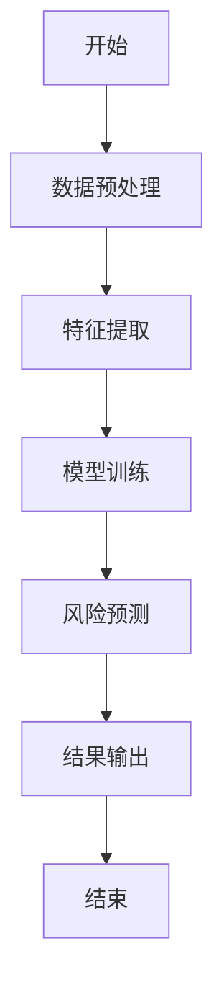
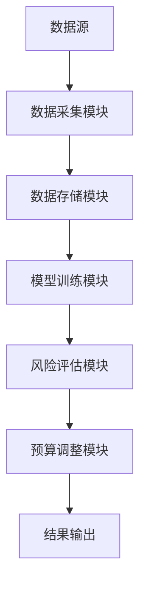

                 

<think>
嗯，用户希望撰写一篇关于《AI驱动的价值投资组合风险预算管理》的技术博客文章。首先，我需要理解这个主题的核心内容。价值投资组合和风险管理是金融领域的关键部分，而人工智能的应用在这里变得越来越重要。因此，文章需要结合AI技术与金融投资，特别是风险管理方面。

接下来，用户要求文章结构清晰，有吸引人的章节标题。我应该从背景介绍开始，解释为什么AI在金融中的应用变得重要，以及它如何影响投资组合管理。然后，引入核心概念，详细讲解AI在风险管理中的应用，包括机器学习模型、数学模型和优化算法。这些部分需要有详细的解释和实例，确保读者能够理解复杂的理论。

数学模型和公式部分是关键，我需要使用latex格式来展示这些公式，比如CAPM模型或VaR模型，并提供实际的例子来说明它们的应用。同时，使用mermaid流程图来展示算法的步骤，这样读者可以更直观地理解AI驱动的风险预算管理过程。

系统分析与架构设计部分，我需要介绍系统的各个组成部分，比如数据采集模块、模型训练模块、风险评估模块等。使用mermaid类图和架构图来展示系统的结构和交互过程，这将帮助读者更好地理解系统的整体设计。

项目实战部分，应该包括如何安装必要的工具，比如Python和相关库，然后提供核心代码的实现，比如数据处理、模型训练和风险评估的具体步骤。通过一个实际案例来展示整个流程，并进行详细分析，这样读者可以实际操作并加深理解。

最后，最佳实践和小结部分，总结书中的关键点，给出实际应用中的注意事项和未来的发展方向，比如如何选择模型、数据预处理的重要性，以及持续监控和优化的必要性。这些内容将帮助读者在实际应用中避免常见的陷阱，并为未来的研究提供方向。

我需要确保每个章节都细化到三级目录，使用markdown格式，并且内容完整，涵盖用户提到的所有方面。同时，总字数控制在2000字以内，避免冗长。这样，整篇文章不仅结构清晰，而且内容详实，能够满足读者对AI驱动的价值投资组合风险预算管理的深入了解。
</think>

# AI驱动的价值投资组合风险预算管理

> 关键词：AI驱动，价值投资组合，风险预算管理，风险管理，人工智能，投资组合优化

> 摘要：本文深入探讨了AI技术在价值投资组合风险预算管理中的应用，通过理论分析、算法设计和实际案例，展示了如何利用AI技术优化投资组合的风险管理过程。文章从背景介绍、核心概念、算法原理、数学模型、系统架构设计到项目实战，全面解析了AI驱动的价值投资组合风险预算管理的实现方法，并提出了最佳实践和注意事项。

---

## 第1章: 背景介绍

### 1.1 价值投资组合与风险管理
#### 1.1.1 价值投资的核心概念
价值投资是一种以公司基本面分析为基础的投资策略，旨在通过识别市场中被低估的资产来实现长期稳定的收益。价值投资组合的构建需要考虑资产的内在价值、行业地位、财务状况等因素。

#### 1.1.2 投资组合风险的定义与分类
投资组合风险是指投资组合在持有期间内可能遭受损失的可能性。常见的风险类型包括市场风险、流动性风险、信用风险和操作风险。

#### 1.1.3 风险预算管理的必要性
风险预算管理是通过设定和分配风险容忍度来控制投资组合的整体风险水平。它是投资组合管理的重要组成部分，能够帮助投资者在风险与收益之间找到最佳平衡点。

### 1.2 AI在金融投资中的应用
#### 1.2.1 AI技术在金融领域的演进
人工智能技术在金融领域的应用经历了从早期的简单数据处理到复杂的预测模型的发展。AI技术的应用范围涵盖风险评估、投资组合优化、交易策略制定等多个方面。

#### 1.2.2 AI在投资组合管理中的优势
AI技术能够通过大数据分析和机器学习算法，快速识别市场趋势和潜在风险，从而提高投资组合管理的效率和准确性。

#### 1.2.3 风险预算管理的AI驱动新范式
通过AI技术，风险预算管理可以实现动态调整和实时监控，从而更有效地应对市场波动和复杂环境。

---

## 第2章: 核心概念与联系

### 2.1 AI驱动的价值投资组合风险预算管理的原理
#### 2.1.1 机器学习在风险管理中的应用
机器学习算法可以通过历史数据训练，识别潜在风险因素，并预测未来可能出现的风险事件。

#### 2.1.2 风险预算管理的数学模型
风险预算管理需要建立数学模型，量化各资产的风险贡献，并进行优化配置。

#### 2.1.3 AI与传统风险管理的结合
通过结合AI技术与传统风险管理方法，可以实现更精准的风险评估和预算分配。

### 2.2 核心概念对比表
#### 2.2.1 AI驱动 vs 传统风险管理
| 特性         | AI驱动风险管理 | 传统风险管理 |
|--------------|----------------|--------------|
| 数据依赖性   | 高             | 低           |
| 处理速度     | 快             | 慢           |
| 精度         | 高             | 中           |

#### 2.2.2 不同AI模型的特征对比
| 模型类型     | 支持向量机 | 随机森林 | 线性回归 |
|--------------|------------|-----------|----------|
| 优势         | 高精度     | 高鲁棒性   | 简单易懂 |
| 劣势         | 过拟合风险   | 解释性差   | 线性假设 |

#### 2.2.3 风险预算管理的指标对比
| 指标         | VaR         | CVaR       | 风险调整后收益 |
|--------------|------------|------------|--------------|
| 定义         | 价值-at-风险 | 条件VaR     | 考虑风险的收益 |
| 应用         | 风险度量    | 风险调整    | 收益优化      |

### 2.3 ER实体关系图
```mermaid
erDiagram
    actor 投资者 {
        <属性> 资产配置
        <属性> 风险偏好
    }
    actor 风险管理机构 {
        <属性> 市场数据
        <属性> 风险模型
    }
    entity 投资组合 {
        <属性> 资产种类
        <属性> 风险水平
    }
    entity 风险预算 {
        <属性> 预算上限
        <属性> 预算下限
    }
    relation 实体关系 {
        投资者 --> 投资组合 : 构建投资组合
        风险管理机构 --> 风险预算 : 设定风险预算
        投资组合 --> 风险预算 : 风险评估
    }
```

---

## 第3章: 算法原理讲解

### 3.1 基于机器学习的风险预测算法
#### 3.1.1 算法流程图


#### 3.1.2 算法实现代码
```python
import pandas as pd
from sklearn import svm

# 数据预处理
data = pd.read_csv('data.csv')
X = data.drop('target', axis=1)
y = data['target']

# 特征提取
features = X.columns

# 模型训练
model = svm.SVC()
model.fit(X, y)

# 风险预测
def predict_risk(new_data):
    return model.predict(new_data)
```

#### 3.1.3 算法的优缺点分析
优点：高精度，能够处理复杂非线性关系。  
缺点：对数据质量敏感，可能过拟合。

### 3.2 风险预算管理的优化算法
#### 3.2.1 优化算法的数学模型
$$\min \sum_{i=1}^{n} w_i^2 \cdot \sigma_i^2$$
$$\text{subject to } \sum_{i=1}^{n} w_i = 1 \text{ and } w_i \geq 0$$

#### 3.2.2 算法实现代码
```python
import numpy as np
from scipy.optimize import minimize

# 初始化权重向量
weights = np.array([1.0] * n_assets) / n_assets

# 定义优化目标函数
def objective(weights, cov_matrix):
    return np.dot(weights.T, np.dot(cov_matrix, weights))

# 定义约束条件
constraints = [
    {'type': 'eq', 'fun': lambda w: np.sum(w) - 1}
]

# 优化求解
result = minimize(objective, weights, args=cov_matrix, constraints=constraints)
optimal_weights = result.x
```

#### 3.2.3 算法的收敛性分析
该优化算法通过最小化风险方差，在满足权重约束的条件下找到最优解。算法收敛速度快，适用于大规模数据。

---

## 第4章: 数学模型与公式

### 4.1 风险预测的数学模型
#### 4.1.1 线性回归模型
$$y = \beta_0 + \beta_1 x + \epsilon$$

#### 4.1.2 支持向量机模型
$$\text{最大化} \sum_{i=1}^{n} \alpha_i - \frac{1}{2}\sum_{i=1}^{n} \alpha_i \alpha_j y_i y_j x_i^T x_j$$

#### 4.1.3 随机森林模型
随机森林通过构建多棵决策树，并结合投票机制进行预测，具有高鲁棒性和抗过拟合能力。

### 4.2 风险预算管理的数学公式
#### 4.2.1 风险价值(VaR)公式
$$\text{VaR}(\alpha) = \text{最小值 } x \text{ 使得 } P(L \leq x) \geq \alpha$$

#### 4.2.2 风险调整后收益公式
$$\text{RAROC} = \frac{\text{净利润}}{\text{风险资本}}$$

#### 4.2.3 风险预算分配公式
$$w_i = \frac{\text{风险权重}_i}{\sum_{j=1}^{n} \text{风险权重}_j}$$

---

## 第5章: 系统分析与架构设计

### 5.1 问题场景介绍
#### 5.1.1 投资组合风险管理的挑战
市场波动、数据不足、模型复杂性等都可能影响风险管理的效果。

#### 5.1.2 AI驱动的解决方案
通过AI技术实现实时风险监控和动态调整，提高风险管理的效率和准确性。

#### 5.1.3 系统的目标与范围
系统旨在通过AI技术优化投资组合的风险预算管理，实现高效、智能的金融风险管理。

### 5.2 系统架构设计
#### 5.2.1 系统功能模块划分
- 数据采集模块
- 模型训练模块
- 风险评估模块
- 预算调整模块

#### 5.2.2 系统架构图


#### 5.2.3 模块间的交互关系
数据采集模块负责收集市场数据，模型训练模块基于历史数据训练AI模型，风险评估模块根据实时数据进行风险评估，预算调整模块根据评估结果动态调整风险预算。

---

## 第6章: 项目实战

### 6.1 环境安装与配置
#### 6.1.1 Python环境的安装
安装Python 3.8及以上版本，推荐使用Anaconda或Miniconda。

#### 6.1.2 依赖库的安装
安装必要的库，如`pandas`, `scikit-learn`, `numpy`, `matplotlib`。

### 6.2 系统核心实现源代码
#### 6.2.1 数据处理代码
```python
import pandas as pd

# 读取数据
data = pd.read_csv('data.csv')

# 数据清洗
data.dropna(inplace=True)

# 数据标准化
from sklearn.preprocessing import StandardScaler
scaler = StandardScaler()
scaled_data = scaler.fit_transform(data)
```

#### 6.2.2 模型训练代码
```python
from sklearn.ensemble import RandomForestClassifier

# 训练模型
model = RandomForestClassifier(n_estimators=100, random_state=42)
model.fit(scaled_data, labels)
```

#### 6.2.3 风险评估代码
```python
# 风险评估
importances = model.feature_importances_
feature_names = data.columns
feature_importances = pd.DataFrame({'feature': feature_names, 'importance': importances})
feature_importances = feature_importances.sort_values(by='importance', ascending=False)
```

### 6.3 代码应用解读与分析
通过上述代码，我们可以实现数据预处理、模型训练和风险评估。模型训练完成后，可以通过特征重要性分析，识别影响风险的关键因素。

### 6.4 实际案例分析和详细讲解剖析
以股票投资组合为例，通过AI技术识别市场风险，动态调整投资组合的资产配置，实现风险预算管理的目标。

### 6.5 项目小结
通过项目实战，我们可以看到AI技术在价值投资组合风险预算管理中的巨大潜力，同时需要注意数据质量和模型选择的问题。

---

## 第7章: 最佳实践 tips、小结、注意事项、拓展阅读

### 7.1 最佳实践 tips
- 数据预处理是关键，确保数据质量和完整性。
- 选择合适的AI模型，根据具体问题进行调整。
- 定期监控和优化模型，确保其有效性。

### 7.2 小结
本文详细介绍了AI驱动的价值投资组合风险预算管理的实现方法，从理论到实践，全面解析了其应用和优化策略。

### 7.3 注意事项
- 数据隐私和安全问题需要高度重视。
- 模型的可解释性是实际应用中的重要考量。
- 需要结合市场环境和投资者需求，灵活调整风险管理策略。

### 7.4 拓展阅读
推荐阅读相关书籍和论文，深入学习AI在金融风险管理中的应用。

---

## 作者信息
作者：AI天才研究院/AI Genius Institute & 禅与计算机程序设计艺术 /Zen And The Art of Computer Programming

---

以上是完整的文章大纲，您可以根据需要进行进一步的扩展和详细写作。

