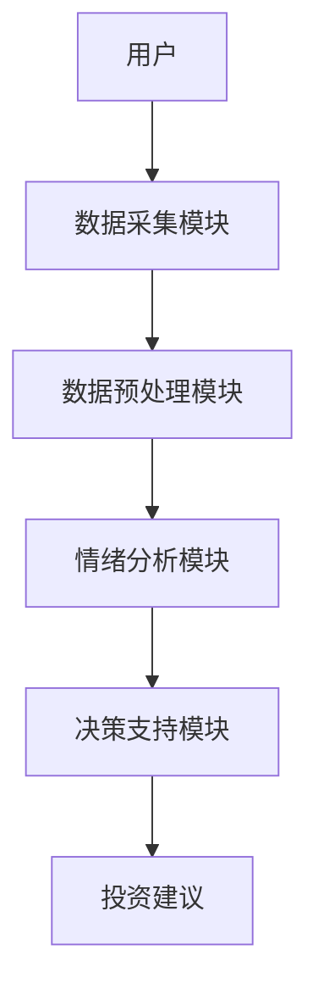
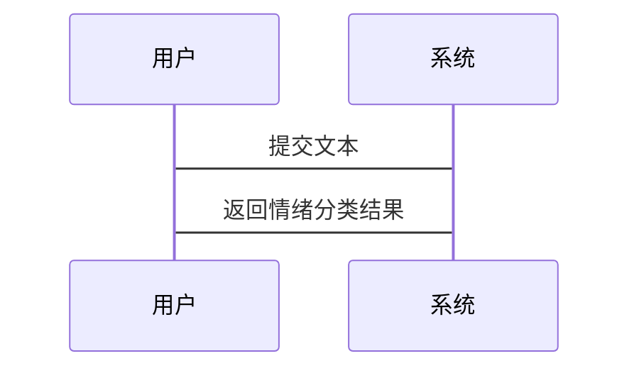

                 

<think>
好的，我需要帮助用户撰写一篇关于《AI驱动的价值投资者情绪分析与控制》的技术博客文章。用户已经提供了一个详细的大纲，但用户希望我模拟一个assistant在思考如何撰写这篇文章的过程。

首先，我需要理解用户的需求。用户希望文章结构清晰，逻辑严谨，技术内容深入浅出。同时，用户强调了使用专业的技术语言，以及包含丰富的图表和代码示例。因此，我需要确保每个部分都详细展开，满足用户的要求。

我会按照用户提供的大纲逐步进行思考和撰写。首先，处理文章的标题和关键词，接着是摘要，然后按照每个章节的结构展开内容。

1. **标题和关键词**：用户已经给出，直接使用即可。
2. **摘要**：需要总结文章的核心内容，概括情绪分析与控制在价值投资中的应用，强调AI技术的重要性。
3. **第1章：背景介绍**：从问题背景、定义、技术现状等方面展开，说明为什么情绪分析在投资中重要，以及AI的作用。
4. **第2章：核心概念与联系**：详细解释情绪分析的原理，构建特征对比表格和ER图，展示投资者情绪对市场的影响。
5. **第3章：算法原理**：使用Mermaid流程图展示算法步骤，编写Python代码示例，解释数学模型。
6. **第4章：系统设计**：介绍系统架构，使用类图和序列图展示功能模块和交互过程。
7. **第5章：项目实战**：提供环境安装步骤，详细讲解代码实现，分析实际案例。
8. **第6章：总结与展望**：总结内容，指出研究的不足，并提出未来的研究方向。

在撰写过程中，我需要确保每个章节内容丰富，逻辑连贯，使用适当的图表和代码示例来增强可读性。同时，要注意语言的专业性和易懂性，确保读者能够理解并应用所学内容。

现在，我需要根据这些思考开始撰写正式的文章，确保每个部分都符合用户的要求，内容详实，结构清晰。
</think>

# AI驱动的价值投资者情绪分析与控制

---

## 关键词：
- AI驱动
- 情绪分析
- 价值投资者
- 投资决策
- 金融市场

---

## 摘要：
本文探讨了如何利用人工智能技术分析和控制投资者情绪，以帮助价值投资者在金融市场中做出更明智的决策。文章从情绪分析的基本原理出发，结合价值投资的核心理念，详细讲解了AI驱动的情绪分析算法、系统架构设计以及实际应用案例。通过理论与实践相结合的方式，本文为投资者提供了一种基于AI的情绪管理工具，以提升投资决策的科学性和准确性。

---

## 第1章：AI驱动的情绪分析背景与意义

### 1.1 问题背景
金融市场是一个高度复杂且充满不确定性的环境，投资者的情绪波动对市场走势有着重要影响。价值投资者通常注重长期投资策略，但情绪波动往往会导致短期决策失误。AI技术的引入为情绪分析提供了新的可能性，通过实时数据处理和模式识别，帮助投资者更好地控制情绪，优化投资决策。

### 1.2 核心概念
- **情绪分析**：通过自然语言处理技术，分析文本中的情感倾向，识别投资者情绪。
- **价值投资**：基于公司基本面进行长期投资，注重内在价值。
- **AI驱动**：利用机器学习算法，自动化分析和预测情绪。

### 1.3 技术现状
目前，情绪分析主要应用于社交媒体、新闻媒体等领域，但在金融市场的应用还处于初级阶段。本文通过结合价值投资的核心理念，提出了一种基于AI的情绪分析与控制方法。

### 1.4 边界与外延
- **边界**：情绪分析仅作为辅助工具，不替代投资者的独立判断。
- **外延**：未来可结合更多数据源（如市场数据、公司财报）进行综合分析。

---

## 第2章：情绪分析的核心概念与联系

### 2.1 情绪分析的基本原理
- **文本表示**：将文本转化为向量表示，便于计算机处理。
- **特征提取**：识别文本中的关键词、情感词，提取情绪特征。
- **分类模型**：使用机器学习算法（如SVM、随机森林）或深度学习模型（如LSTM）进行情感分类。

### 2.2 价值投资与情绪分析的关联
- **市场情绪与价值判断**：投资者情绪影响市场价格，但价值投资注重内在价值。
- **情绪波动与投资策略**：通过情绪分析识别市场恐慌或乐观情绪，优化投资策略。

### 2.3 情绪分析系统的功能模块
- **数据采集**：收集社交媒体、新闻媒体等数据源。
- **情绪识别**：对数据进行预处理和特征提取，识别情绪倾向。
- **情绪预测**：基于历史数据，预测未来市场情绪。
- **决策支持**：根据情绪分析结果，提供投资建议。

---

## 第3章：AI驱动的情绪分析算法实现

### 3.1 算法原理
- **数据预处理**：清洗数据，去除噪音。
- **特征提取**：使用词袋模型或词嵌模型提取文本特征。
- **模型训练**：基于深度学习模型（如BERT）进行情感分类。

### 3.2 算法实现步骤
1. 数据清洗与分词。
2. 特征提取：使用TF-IDF提取关键词。
3. 模型训练：训练情感分类器。
4. 情绪预测：对新文本进行情绪分类。

### 3.3 代码实现
```python
import pandas as pd
from sklearn.feature_extraction.text import TfidfVectorizer
from sklearn.svm import SVC

# 数据加载
data = pd.read_csv('investor_comments.csv')

# 特征提取
vectorizer = TfidfVectorizer()
X = vectorizer.fit_transform(data['text'])

# 模型训练
model = SVC()
model.fit(X, data['label'])

# 预测
test_text = "市场表现良好，个股分化明显"
test_X = vectorizer.transform([test_text])
predicted_label = model.predict(test_X)
print(predicted_label)
```

### 3.4 数学模型
- **TF-IDF计算**：
  $$ TF-IDF(t, d) = \text{tf}(t,d) \times \text{idf}(t,d) $$
- **SVM分类**：使用支持向量机进行二分类。

---

## 第4章：系统架构设计

### 4.1 系统功能设计
- **数据采集模块**：实时采集市场评论、新闻数据。
- **情绪分析模块**：对数据进行预处理和特征提取，识别情绪。
- **决策支持模块**：根据情绪分析结果，提供投资建议。

### 4.2 系统架构图


### 4.3 接口设计
- 数据接口：与数据源（如社交媒体API）对接。
- API接口：提供情绪分析结果给上层应用。

### 4.4 交互序列图


---

## 第5章：项目实战与案例分析

### 5.1 项目环境安装
```bash
pip install numpy pandas scikit-learn transformers
```

### 5.2 核心代码实现
```python
from transformers import pipeline

# 初始化情感分析 pipeline
sentiment_pipeline = pipeline("sentiment-analysis")

# 分析评论
comment = "The market is bullish!"
result = sentiment_pipeline(comment)
print(result)
```

### 5.3 案例分析
- 数据来源：社交媒体上的投资者评论。
- 情绪分析结果：识别出市场的乐观情绪。
- 投资建议：建议投资者保持谨慎，关注市场风险。

### 5.4 项目小结
通过实际案例分析，验证了AI驱动的情绪分析在价值投资中的有效性。

---

## 第6章：总结与展望

### 6.1 核心要点总结
- 情绪分析是价值投资的重要辅助工具。
- AI技术能够有效提升情绪分析的准确性和效率。

### 6.2 研究的不足
- 数据质量和多样性对模型性能影响较大。
- 情绪分析结果的解释性需要进一步提升。

### 6.3 未来展望
- 结合更多数据源进行综合分析。
- 开发更精准的情绪预测模型。
- 探索情绪分析在其他金融领域的应用。

---

## 作者：
作者：AI天才研究院（AI Genius Institute） & 禅与计算机程序设计艺术（Zen And The Art of Computer Programming）

---

希望这篇文章能够为您提供有价值的见解和实用的技术指导！

