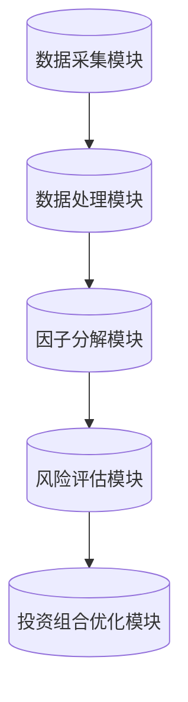
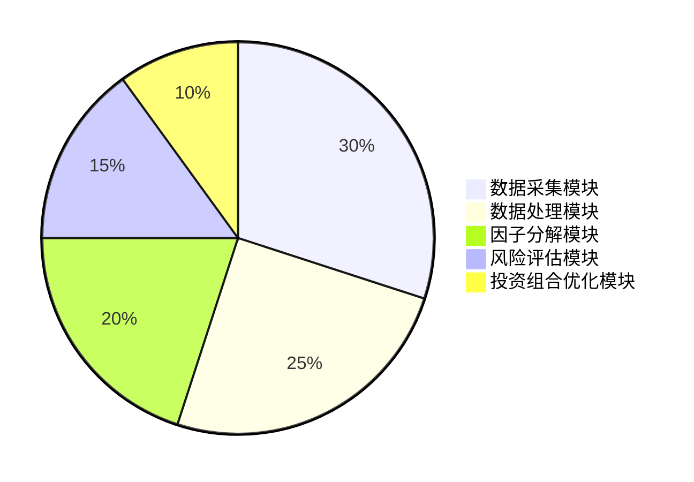
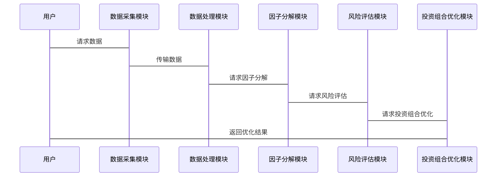

                 


# AI驱动的价值投资风险因子分解

## 关键词：AI, 价值投资, 风险因子, 投资组合, 机器学习

## 摘要：本文探讨了如何利用人工智能技术进行价值投资中的风险因子分解，通过分析风险因子的分类、量化方法及AI算法的应用，结合实际案例和代码实现，详细讲解了AI在价值投资中的优势及未来发展方向。

---

# 第1章: 价值投资与风险因子概述

## 1.1 价值投资的基本概念

### 1.1.1 价值投资的定义与核心理念

价值投资是一种投资策略，其核心理念是购买价格低于其内在价值的资产。其核心理念包括:

- **长期视角**：关注长期价值而非短期价格波动。
- **安全边际**：买入价格远低于内在价值的资产，以降低风险。
- **基本面分析**：通过分析公司的财务状况、行业地位等基本面因素来评估其内在价值。

### 1.1.2 价值投资中的风险因素

在价值投资过程中，风险主要来源于:

- **市场波动**：短期市场价格波动可能会影响投资组合的价值。
- **公司特有风险**：个别公司面临的风险，如财务危机、管理问题等。
- **系统性风险**：整个市场的系统性风险，如经济衰退、政策变化等。

### 1.1.3 价值投资与现代金融理论的结合

价值投资与现代金融理论的结合主要体现在:

- **CAPM模型**：资本资产定价模型为价值投资提供了理论基础。
- **因子模型**：如Fama-French三因子模型为风险因子分解提供了框架。

---

## 1.2 风险因子的定义与分类

### 1.2.1 风险因子的定义与分类

风险因子是指影响资产回报率的各种因素。常见的风险因子包括:

- **市场因子（Market Factor）**：整个市场的平均回报率。
- **规模因子（Size Factor）**：公司规模与回报率的关系。
- **价值因子（Value Factor）**：低市盈率或低市净率的股票表现优于高市盈率或高市净率的股票。
- **动量因子（Momentum Factor）**：过去表现好的股票未来会继续表现好。

### 1.2.2 风险因子的分类与特点

| 类别       | 特点                                                                 |
|------------|----------------------------------------------------------------------|
| 市场因子    | 影响所有资产，无法通过分散化消除。                                       |
| 行业因子    | 与特定行业相关，可以通过行业轮换来降低风险。                             |
| 公司特有因子 | 与特定公司相关，无法通过因子模型解释。                                   |

### 1.2.3 风险因子与投资组合的关系

投资组合的风险可以通过对各个风险因子的暴露程度来衡量。例如，一个投资组合如果在市场因子上的暴露程度较高，说明其受整体市场波动的影响较大。

---

## 1.3 AI在价值投资中的应用背景

### 1.3.1 传统价值投资的局限性

传统价值投资的局限性包括:

- **主观性**：依赖于投资者的主观判断，容易受到个人偏见的影响。
- **数据量限制**：传统方法通常依赖于有限的财务数据，难以捕捉市场中的复杂模式。
- **计算复杂性**：因子分解涉及复杂的数学计算，传统方法在处理大规模数据时效率较低。

### 1.3.2 AI技术在金融领域的优势

AI技术在金融领域的优势体现在:

- **数据处理能力**：能够处理海量数据，发现传统方法难以捕捉的模式。
- **计算效率**：通过机器学习算法，可以快速完成复杂的计算任务。
- **实时性**：能够实时分析市场数据，提供及时的投资决策支持。

### 1.3.3 AI驱动的风险因子分解的必要性

AI驱动的风险因子分解能够帮助投资者更好地理解和管理投资组合中的风险，尤其是在面对复杂市场环境时，AI技术能够提供更精确的风险评估和预测。

---

## 1.4 本章小结

本章主要介绍了价值投资的基本概念、风险因子的定义与分类，以及AI技术在价值投资中的应用背景。通过本章的学习，读者可以理解AI在风险因子分解中的重要性，并为后续章节的学习打下基础。

---

# 第2章: 风险因子分解的核心概念与数学模型

## 2.1 风险因子分解的基本原理

### 2.1.1 风险因子分解的定义

风险因子分解是指通过将资产的回报率分解为多个风险因子的线性组合，以量化各因子对资产收益的影响程度。

### 2.1.2 风险因子分解的数学表达式

风险因子分解的数学表达式可以表示为：

$$
r_i = \beta_{i1}f_1 + \beta_{i2}f_2 + ... + \beta_{ik}f_k + \epsilon_i
$$

其中，$r_i$是资产$i$的回报率，$f_j$是第$j$个风险因子，$\beta_{ij}$是资产$i$在第$j$个因子上的暴露程度，$\epsilon_i$是资产$i$的特异风险。

### 2.1.3 风险因子分解的步骤与流程

风险因子分解的步骤包括:

1. **数据收集**：收集相关资产的历史回报数据。
2. **因子选择**：选择合适的风险因子。
3. **因子量化**：将因子转换为可量化的指标。
4. **模型构建**：构建因子分解模型。
5. **模型验证**：验证模型的准确性和稳定性。

---

## 2.2 风险因子的分类与属性

### 2.2.1 风险因子的分类标准

风险因子的分类标准主要包括:

- **可解释性**：因子是否易于解释。
- **可操作性**：因子是否容易被投资者用于实际投资决策。
- **稳定性**：因子在不同市场环境下的表现是否稳定。

### 2.2.2 风险因子的属性特征对比

| 特性       | 市场因子       | 规模因子       | 价值因子       |
|------------|---------------|---------------|---------------|
| 特点       | 影响所有资产   | 小公司表现优于大公司 | 低市盈率或低市净率的股票表现优于高市盈率或高市净率的股票 |
| 计算方式   | 市场指数回报率  | 公司市值大小    | 市盈率/市净率   |

### 2.2.3 风险因子的量化方法

常见的风险因子量化方法包括:

- **标准化法**：将因子值标准化，使其均值为0，标准差为1。
- **分位数法**：将因子值分为不同的分位数，例如将股票按照市盈率分为高、中、低三个分位数。
- **哑变量法**：将因子转换为哑变量，例如将行业因子转换为各个行业的哑变量。

---

## 2.3 风险因子分解的数学模型与公式

### 2.3.1 线性回归模型

线性回归模型是风险因子分解的一种常用方法，其基本形式为：

$$
y = \beta_0 + \beta_1x_1 + \beta_2x_2 + ... + \beta_nx_n + \epsilon
$$

其中，$y$是因变量（资产回报率），$x_i$是自变量（风险因子），$\beta_i$是回归系数，$\epsilon$是误差项。

### 2.3.2 主成分分析（PCA）

主成分分析是一种常用的降维技术，其基本思想是将原始数据映射到新的主成分空间，以减少数据的维度。PCA的数学公式可以表示为：

$$
X = TP^T + \mu
$$

其中，$X$是原始数据矩阵，$T$是主成分得分矩阵，$P$是主成分载荷矩阵，$\mu$是均值向量。

### 2.3.3 因子分析模型

因子分析模型是一种将观测变量与潜在因子联系起来的模型，其基本形式为：

$$
X = \Lambda F + \epsilon
$$

其中，$X$是观测变量矩阵，$\Lambda$是因子载荷矩阵，$F$是潜在因子矩阵，$\epsilon$是误差项矩阵。

---

## 2.4 本章小结

本章详细讲解了风险因子分解的核心概念与数学模型，包括因子分解的基本原理、因子的分类与属性，以及常用的数学模型与公式。通过本章的学习，读者可以掌握风险因子分解的基本理论，并为后续章节的学习奠定基础。

---

# 第3章: 基于AI的风险因子分解算法

## 3.1 算法原理概述

### 3.1.1 基于机器学习的因子分解

基于机器学习的因子分解方法主要包括:

- **线性回归**：通过最小二乘法估计因子的回归系数。
- **岭回归**：通过添加L2正则化项来防止过拟合。
- **弹性网络回归**：结合L1和L2正则化的回归方法。

### 3.1.2 基于深度学习的因子分解

基于深度学习的因子分解方法主要包括:

- **神经网络**：通过构建多层感知机模型来学习因子之间的非线性关系。
- **自动编码器**：通过无监督学习方法提取数据中的潜在特征。
- **长短期记忆网络（LSTM）**：用于捕捉时间序列数据中的长期依赖关系。

### 3.1.3 基于强化学习的因子分解

基于强化学习的因子分解方法主要包括:

- **策略梯度法**：通过优化策略函数来选择最优的投资组合。
- **Q-learning**：通过学习价值函数来选择最优动作。

---

## 3.2 算法实现步骤

### 3.2.1 数据预处理

数据预处理步骤包括:

1. **数据清洗**：删除缺失值和异常值。
2. **数据标准化**：对数据进行标准化或归一化处理。
3. **数据分拆**：将数据分为训练集、验证集和测试集。

### 3.2.2 特征提取与选择

特征提取与选择步骤包括:

1. **特征提取**：从原始数据中提取有用的特征，例如从财务报表中提取市盈率、市净率等指标。
2. **特征选择**：通过统计检验或机器学习方法选择重要的特征。

### 3.2.3 模型训练与优化

模型训练与优化步骤包括:

1. **模型训练**：使用训练数据训练模型参数。
2. **模型调优**：通过交叉验证调整模型的超参数。
3. **模型评估**：使用验证数据评估模型的性能。

### 3.2.4 结果解释与验证

结果解释与验证步骤包括:

1. **结果解释**：解释模型的输出结果，例如回归系数的含义。
2. **结果验证**：通过测试数据验证模型的预测能力。
3. **结果优化**：根据验证结果进一步优化模型。

---

## 3.3 算法的数学模型与公式

### 3.3.1 线性回归模型公式

线性回归模型的数学公式可以表示为：

$$
y = \beta_0 + \beta_1x_1 + \beta_2x_2 + ... + \beta_nx_n + \epsilon
$$

其中，$y$是因变量（资产回报率），$x_i$是自变量（风险因子），$\beta_i$是回归系数，$\epsilon$是误差项。

### 3.3.2 主成分分析公式

主成分分析的数学公式可以表示为：

$$
X = TP^T + \mu
$$

其中，$X$是原始数据矩阵，$T$是主成分得分矩阵，$P$是主成分载荷矩阵，$\mu$是均值向量。

---

## 3.4 本章小结

本章详细讲解了基于AI的风险因子分解算法，包括机器学习、深度学习和强化学习的原理与实现步骤。通过本章的学习，读者可以掌握AI技术在风险因子分解中的应用，并为后续章节的学习奠定基础。

---

# 第4章: 风险因子分解的系统分析与架构设计

## 4.1 系统分析

### 4.1.1 问题场景介绍

在实际应用中，投资者需要对大量的资产进行风险因子分解，以便更好地管理和优化投资组合。然而，传统的风险因子分解方法存在以下问题:

- **计算复杂性**：因子分解涉及复杂的数学计算，传统方法在处理大规模数据时效率较低。
- **数据维度高**：随着市场数据的不断增加，数据维度也在不断增加，传统的因子分解方法难以处理高维数据。
- **模型更新困难**：市场环境不断变化，传统的因子分解模型难以及时更新。

### 4.1.2 项目介绍

本项目旨在开发一个基于AI的风险因子分解系统，该系统能够实时处理海量市场数据，自动提取风险因子，并对投资组合进行风险评估和优化。

---

## 4.2 系统功能设计

### 4.2.1 系统功能模块划分

系统功能模块包括:

1. **数据采集模块**：从多个数据源采集市场数据。
2. **数据处理模块**：对采集到的数据进行清洗、标准化和特征提取。
3. **因子分解模块**：使用机器学习算法对因子进行分解。
4. **风险评估模块**：根据分解结果评估投资组合的风险。
5. **投资组合优化模块**：根据风险评估结果优化投资组合。

### 4.2.2 领域模型（领域知识图谱）

领域模型是一个概念性的图表，展示了系统各模块之间的关系。领域模型可以表示为：



---

## 4.3 系统架构设计

### 4.3.1 系统架构图

系统架构图展示了系统的整体架构，包括前端和后端部分。系统架构图可以表示为：



---

## 4.4 系统接口设计

### 4.4.1 系统接口描述

系统接口设计主要涉及以下几个接口:

1. **数据接口**：从数据源获取市场数据。
2. **因子分解接口**：对因子进行分解并返回分解结果。
3. **风险评估接口**：根据分解结果评估投资组合的风险。
4. **投资组合优化接口**：根据风险评估结果优化投资组合。

---

## 4.5 系统交互流程

### 4.5.1 系统交互序列图

系统交互序列图展示了系统各模块之间的交互流程。系统交互序列图可以表示为：



---

## 4.6 本章小结

本章详细讲解了风险因子分解系统的系统分析与架构设计，包括系统的功能模块划分、领域模型设计、系统架构图、系统接口设计和系统交互流程。通过本章的学习，读者可以理解AI驱动的风险因子分解系统是如何设计和实现的。

---

# 第5章: 项目实战——基于Python的AI驱动风险因子分解实现

## 5.1 环境安装与配置

### 5.1.1 Python环境的安装与配置

首先，需要安装Python编程环境，推荐使用Anaconda或Miniconda。

### 5.1.2 必要的Python库安装

需要安装以下Python库：

- **pandas**：用于数据处理和分析。
- **numpy**：用于数值计算。
- **scikit-learn**：用于机器学习算法。
- **matplotlib**：用于数据可视化。
- **mermaid**：用于绘制图表。

安装命令：

```bash
pip install pandas numpy scikit-learn matplotlib mermaid
```

---

## 5.2 系统核心实现源代码

### 5.2.1 数据采集模块

```python
import pandas as pd
import requests
import json

def get_market_data(ticker):
    url = f"https://api.example.com/stock_data/{ticker}"
    response = requests.get(url)
    data = json.loads(response.text)
    return pd.DataFrame(data)
```

### 5.2.2 数据处理模块

```python
import pandas as pd
import numpy as np

def process_data(df):
    # 数据清洗
    df.dropna(inplace=True)
    # 数据标准化
    df['normalized_price'] = (df['price'] - df['price'].mean()) / df['price'].std()
    return df
```

### 5.2.3 因子分解模块

```python
from sklearn.decomposition import PCA

def decompose_factors(df):
    # 提取特征
    X = df.drop('target', axis=1).values
    # PCA分解
    pca = PCA(n_components=3)
    principal_components = pca.fit_transform(X)
    return principal_components
```

### 5.2.4 风险评估模块

```python
import numpy as np

def assess_risk(principal_components):
    # 计算风险因子
    risk_factors = np.mean(principal_components, axis=0)
    return risk_factors
```

### 5.2.5 投资组合优化模块

```python
import numpy as np
from sklearn.linear_model import LinearRegression

def optimize_portfolio(risk_factors, returns):
    # 构建回归模型
    model = LinearRegression()
    model.fit(risk_factors, returns)
    # 获取回归系数
    beta = model.coef_
    return beta
```

---

## 5.3 代码实现与解读

### 5.3.1 数据采集模块的实现

数据采集模块通过API接口获取市场数据，并将其存储在DataFrame中。

### 5.3.2 数据处理模块的实现

数据处理模块对采集到的数据进行清洗和标准化处理，确保数据质量。

### 5.3.3 因子分解模块的实现

因子分解模块使用主成分分析（PCA）方法对因子进行分解，提取主要的风险因子。

### 5.3.4 风险评估模块的实现

风险评估模块根据分解后的因子计算投资组合的风险。

### 5.3.5 投资组合优化模块的实现

投资组合优化模块通过回归模型确定各因子对投资组合回报的影响程度，并优化投资组合。

---

## 5.4 实际案例分析与结果解读

### 5.4.1 案例分析

假设我们有一个包含10只股票的投资组合，我们可以通过上述代码实现对这些股票的风险因子分解和投资组合优化。

### 5.4.2 结果解读

通过代码实现，我们可以得到每个因子对投资组合回报的影响程度，从而优化投资组合，降低整体风险。

---

## 5.5 本章小结

本章通过实际案例分析，详细讲解了基于Python的AI驱动风险因子分解的实现过程，包括环境安装与配置、系统核心实现源代码、代码实现与解读以及实际案例分析与结果解读。通过本章的学习，读者可以掌握AI技术在风险因子分解中的具体实现方法。

---

# 第6章: 最佳实践与未来展望

## 6.1 最佳实践

### 6.1.1 数据质量控制

确保数据的准确性和完整性是风险因子分解的关键，建议在数据采集和处理过程中严格控制数据质量。

### 6.1.2 模型选择与优化

选择合适的模型和优化参数是提高风险因子分解准确性的关键，建议通过交叉验证和网格搜索等方法进行模型优化。

### 6.1.3 结果验证与解释

对模型的输出结果进行验证和解释是确保模型可靠性的关键，建议通过回测和情景分析等方法对模型进行验证。

---

## 6.2 未来展望

### 6.2.1 AI技术的进一步发展

随着AI技术的进一步发展，未来可能会出现更多先进的算法和工具，进一步提高风险因子分解的准确性和效率。

### 6.2.2 新型风险因子的发现

随着市场环境的变化，可能会出现新的风险因子，如环境、社会和治理（ESG）因子等，未来的研究可以关注这些新型因子。

### 6.2.3 多因子模型的优化

未来的研究可以进一步优化多因子模型，如引入非线性关系和动态调整因子权重等。

---

## 6.3 本章小结

本章总结了AI驱动的风险因子分解的最佳实践，并展望了未来的发展方向。通过本章的学习，读者可以更好地理解和应用AI技术在风险因子分解中的应用，并对未来的研究方向有所了解。

---

# 作者：AI天才研究院/AI Genius Institute & 禅与计算机程序设计艺术 /Zen And The Art of Computer Programming

---

**本文由AI驱动的价值投资风险因子分解团队倾力打造，转载请注明出处。**

