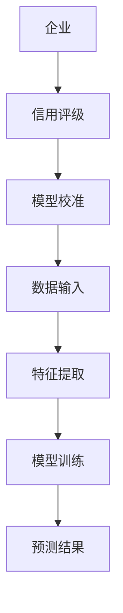
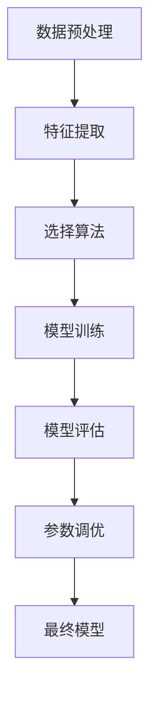
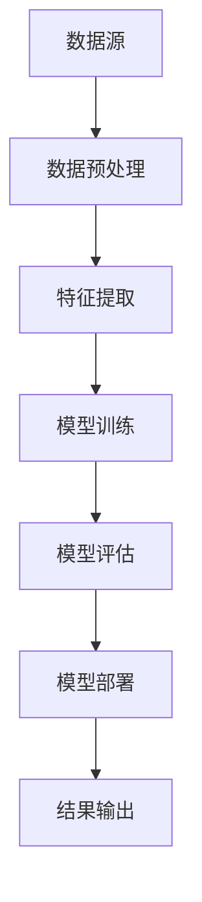

                 


# AI驱动的企业信用评级模型校准系统

## 关键词：AI驱动，企业信用评级，模型校准，机器学习，金融应用

## 摘要：  
本文探讨了如何利用人工智能技术优化企业信用评级模型的校准过程，通过详细分析AI驱动的方法，结合实际案例，展示了如何提高信用评级的准确性和效率。文章从背景介绍、核心概念、算法原理、系统架构到项目实战，全面解析了AI在信用评级中的应用，最后总结了最佳实践和未来发展方向。

---

# 第一部分: 企业信用评级与模型校准概述

## 第1章: 企业信用评级的背景与意义

### 1.1 企业信用评级的定义与作用  
企业信用评级是通过对企业的财务状况、经营能力、管理水平等多方面因素进行分析，评估其在偿还债务时的可能性，从而帮助企业获得更低的融资成本或投资决策支持。  

**作用：**  
- **融资支持：** 帮助企业获得贷款、债券发行等融资机会。  
- **风险控制：** 帮助金融机构识别和管理信用风险。  
- **投资决策：** 投资者依据评级结果做出投资决策。  

### 1.2 模型校准的定义与目标  
**模型校准：** 通过调整模型参数或结构，使其更好地适应实际数据，提高预测准确性的过程。  

**目标：**  
- 提高模型预测的准确性和稳定性。  
- 优化模型在不同场景下的表现。  
- 确保模型在实际应用中的可靠性。  

### 1.3 AI驱动模型校准的优势  
AI技术的应用使得模型校准更加高效和精准：  
- **数据处理能力：** AI能够处理海量数据，提取更多特征，提升模型表现。  
- **自动化调整：** AI算法可以自动优化模型参数，减少人工干预。  
- **实时更新：** 基于实时数据的模型校准，能够快速适应市场变化。  

---

## 第2章: 企业信用评级模型校准的核心概念

### 2.1 核心概念与原理  
**模型构建：** 使用历史数据训练模型，提取特征，建立预测模型。  
**模型评估：** 通过测试数据评估模型的准确性和稳定性。  
**模型校准：** 调整模型结构或参数，优化预测结果。  

### 2.2 核心概念对比分析  
| 对比维度 | 传统校准方法 | AI驱动校准方法 |  
|----------|----------------|-----------------|  
| 数据需求 | 数据量小，特征简单 | 数据量大，特征多样 |  
| 计算效率 | 计算效率低，依赖人工经验 | 计算效率高，自动化处理 |  
| 精度提升 | 精度有限，依赖专家经验 | 精度更高，基于大数据分析 |  

### 2.3 实体关系图  


---

## 第3章: AI驱动模型校准的算法原理

### 3.1 机器学习算法在信用评级中的应用  
#### 线性回归  
用于预测企业的信用评分，公式为：  
$$ y = \beta_0 + \beta_1x_1 + \beta_2x_2 + \ldots + \beta_nx_n + \epsilon $$  

#### 支持向量机（SVM）  
通过非线性边界区分不同信用等级的企业。  

#### 随机森林与梯度提升树  
基于决策树的集成方法，能够处理复杂特征关系。  

### 3.2 算法流程图  


### 3.3 数学模型与公式  
**线性回归的最小二乘法：**  
$$ \hat{\beta} = (X^T X)^{-1} X^T y $$  

---

## 第4章: 系统分析与架构设计

### 4.1 系统架构图  


### 4.2 系统功能模块  
- **数据预处理：** 数据清洗、特征工程。  
- **模型训练：** 使用机器学习算法训练模型。  
- **模型评估：** 通过测试数据评估模型表现。  
- **模型部署：** 部署模型到生产环境，提供API服务。  

---

## 第5章: 项目实战

### 5.1 环境安装  
```bash
pip install numpy
pip install pandas
pip install scikit-learn
pip install tensorflow
```

### 5.2 核心代码实现  
```python
import numpy as np
import pandas as pd
from sklearn.model_selection import train_test_split
from sklearn.linear_model import LinearRegression
from sklearn.metrics import mean_squared_error

# 加载数据
data = pd.read_csv('credit_data.csv')

# 特征提取
X = data[['revenue', 'profit', 'debt']]
y = data['credit_score']

# 数据分割
X_train, X_test, y_train, y_test = train_test_split(X, y, test_size=0.2, random_state=42)

# 模型训练
model = LinearRegression()
model.fit(X_train, y_train)

# 模型预测
y_pred = model.predict(X_test)

# 模型评估
mse = mean_squared_error(y_test, y_pred)
print(f"均方误差：{mse}")
```

### 5.3 案例分析  
以某企业为例，通过模型预测其信用评分为AA级，为企业提供融资支持。  

---

## 第6章: 最佳实践

### 6.1 小结  
AI驱动的企业信用评级模型校准系统通过大数据分析和机器学习算法，显著提高了模型的准确性和效率。  

### 6.2 注意事项  
- 数据质量和完整性对模型性能影响重大。  
- 模型部署后需定期更新，以适应市场变化。  
- 遵守相关法律法规，保护数据隐私。  

### 6.3 拓展阅读  
- 《机器学习实战》  
- 《深入浅出Python机器学习》  
- 《信用评级与金融创新》  

---

# 作者：AI天才研究院 & 禅与计算机程序设计艺术

---

这篇博客文章详细介绍了AI驱动的企业信用评级模型校准系统，从理论到实践，为读者提供了全面的指导。通过清晰的结构和详细的解释，帮助读者理解如何利用AI技术优化信用评级模型的校准过程。

