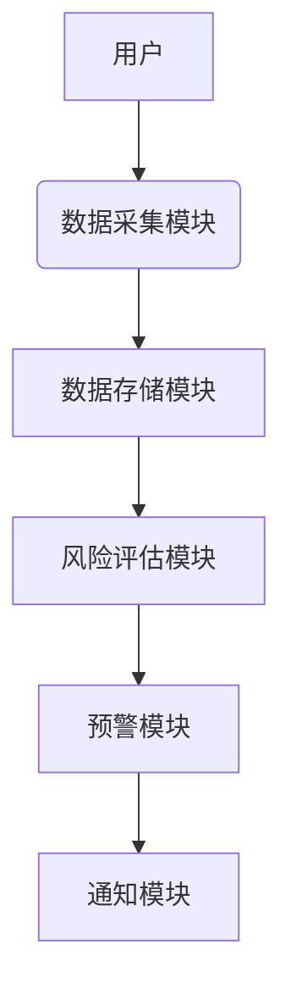

                 


# AI驱动的企业信用风险传导路径识别与预警系统

## 关键词：人工智能、信用风险、传导路径、预警系统、机器学习

## 摘要：本文探讨了利用AI技术构建企业信用风险传导路径识别与预警系统的方法。通过分析信用风险的定义、传导机制，结合机器学习算法和系统架构设计，提出了一个创新的解决方案，并通过实际案例展示了系统的实现与应用效果。

---

## 第一部分：企业信用风险传导路径识别与预警系统背景

### 第1章：企业信用风险概述

#### 1.1 企业信用风险的基本概念

企业信用风险是指企业在经营过程中，由于外部环境变化或内部管理问题，导致无法履行债务或其他合同义务而产生的风险。这种风险可能影响企业的生存和发展，甚至波及整个金融系统。企业信用风险主要包括违约风险、流动性风险和操作风险等。

#### 1.2 企业信用风险传导机制

信用风险的传导机制是指风险从一个企业向另一个企业或相关方扩散的过程。这种传导可能通过供应链、金融产品、市场行为等多种路径实现。例如，一家企业违约可能影响其供应商和客户，进而引发连锁反应。

#### 1.3 传统信用风险识别方法的局限性

传统的信用风险识别方法依赖于财务指标分析和人工审查，这种方法效率低、覆盖面有限，难以应对复杂多变的市场环境。AI技术的应用可以显著提高风险识别的效率和准确性。

---

### 第2章：AI在信用风险识别中的应用

#### 2.1 AI技术在金融领域的应用现状

AI技术已经在金融领域的多个方面得到广泛应用，包括算法交易、欺诈检测、信用评分等。AI的引入极大地提高了金融决策的效率和准确性。

#### 2.2 信用风险传导路径识别的关键技术

- **数据挖掘技术**：通过分析海量数据，识别潜在的风险点。
- **机器学习算法**：利用监督学习、无监督学习等方法，预测信用风险。
- **自然语言处理技术**：分析企业报告和新闻中的文本信息，提取风险信号。

---

## 第二部分：AI驱动信用风险识别的核心概念与技术

### 第3章：信用风险传导路径识别的AI模型

#### 3.1 基于机器学习的信用风险模型

- **监督学习模型**：如逻辑回归、支持向量机（SVM）等，用于分类信用风险。
- **非监督学习模型**：如聚类分析，用于发现隐藏的信用风险模式。
- **深度学习模型**：如神经网络，能够处理复杂的非结构化数据。

#### 3.2 模型训练与优化

- **数据预处理**：清洗、归一化、特征提取。
- **模型训练**：使用训练数据拟合模型参数。
- **模型评估与优化**：通过交叉验证、调参等方法提升模型性能。

---

## 第三部分：系统架构与实现

### 第4章：系统架构设计

#### 4.1 系统功能设计

- **数据采集**：获取企业的财务数据、市场数据等。
- **风险评估**：利用AI模型评估企业的信用风险。
- **预警触发**：当风险超过阈值时，触发预警机制。

#### 4.2 系统架构图



#### 4.3 接口设计与交互

- **数据接口**：与企业数据库连接。
- **用户界面**：供用户查看风险评估结果和预警信息。

---

## 第四部分：项目实战

### 第5章：项目实现

#### 5.1 环境安装

- **Python**：安装Anaconda，配置Jupyter Notebook。
- **库安装**：使用pip安装numpy、pandas、scikit-learn、tensorflow等库。

#### 5.2 核心代码实现

```python
import numpy as np
import pandas as pd
from sklearn.model_selection import train_test_split
from sklearn.linear_model import LogisticRegression
from sklearn.metrics import accuracy_score

# 加载数据
data = pd.read_csv('credit_risk.csv')
X = data.drop('risk', axis=1)
y = data['risk']

# 数据分割
X_train, X_test, y_train, y_test = train_test_split(X, y, test_size=0.2)

# 模型训练
model = LogisticRegression()
model.fit(X_train, y_train)

# 模型预测
y_pred = model.predict(X_test)

# 模型评估
print("准确率:", accuracy_score(y_test, y_pred))
```

---

## 第五部分：最佳实践与总结

### 第6章：项目总结

#### 6.1 小结

本文详细介绍了AI驱动的企业信用风险传导路径识别与预警系统的构建过程，包括背景分析、算法选择、系统设计和项目实现。

#### 6.2 注意事项

- 数据质量对模型性能影响重大，需确保数据准确性和完整性。
- 模型部署后需定期更新，以应对市场变化。

#### 6.3 拓展阅读

建议读者深入研究以下内容：
- 更复杂的深度学习模型，如LSTM。
- 多目标优化在信用风险评估中的应用。

---

## 作者

**作者：AI天才研究院/AI Genius Institute & 禅与计算机程序设计艺术 /Zen And The Art of Computer Programming**

---

这篇文章详细探讨了AI在企业信用风险识别中的应用，从理论到实践，全面阐述了系统的构建过程，为读者提供了深入的技术见解和实际操作指南。

