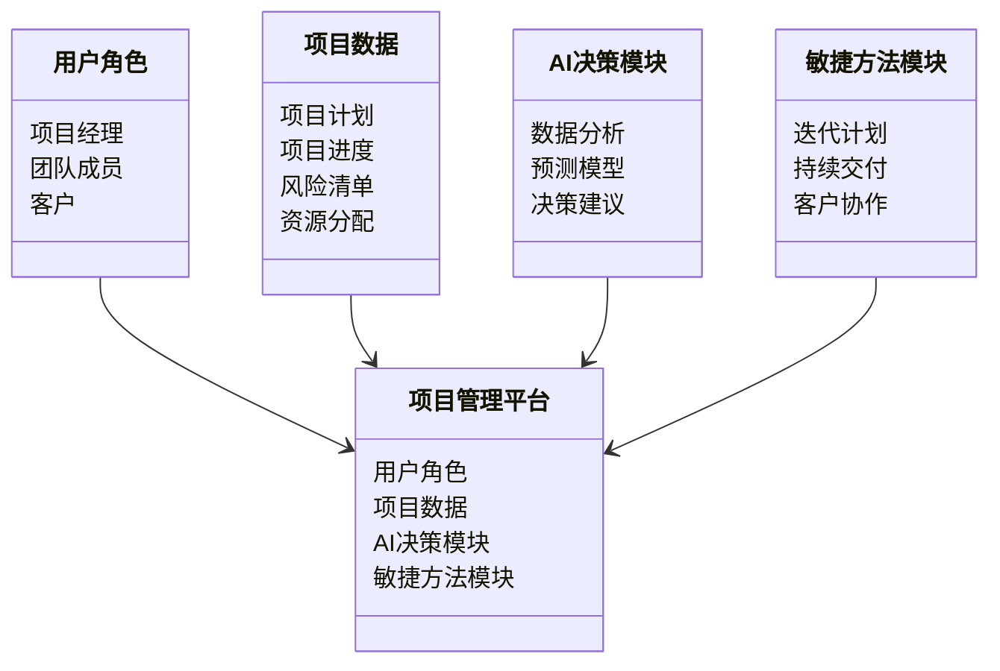
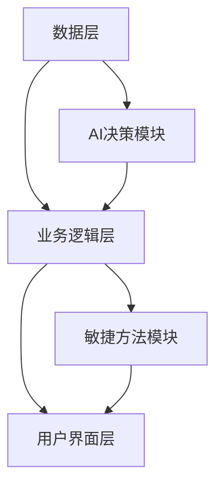
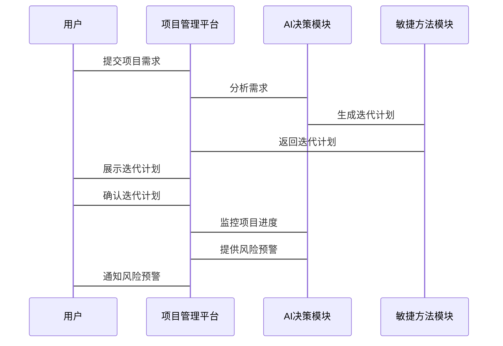

                 

<think>
好的，我需要帮助用户撰写一篇关于《AI驱动的企业创新项目管理：敏捷方法与AI辅助决策的结合》的技术博客文章。用户希望文章结构清晰，内容详细，涵盖背景、核心概念、算法原理、系统设计、实战和总结。

首先，我应该从文章标题开始，然后列出关键词和摘要。接着，按照目录大纲，逐章展开内容。每章需要详细讲解，包括背景介绍、核心概念、算法原理、系统架构、项目实战和总结。同时，要包含图表、数学公式和代码示例，使内容更直观和实用。

在撰写过程中，要确保语言专业但易懂，逻辑连贯。每个小节都需要丰富的内容，比如背景介绍要说明传统项目管理的局限性，AI如何弥补这些不足；核心概念部分需要对比敏捷方法和AI辅助决策，解释它们如何结合；算法原理部分要详细讲解机器学习和NLP的数学模型，并用代码示例说明。

系统架构设计部分需要使用Mermaid图展示类图、架构图和交互图，帮助读者理解系统结构。项目实战部分要提供具体的环境安装步骤、代码实现和案例分析，使读者能够实际操作。最后，总结部分要回顾主要内容，并展望未来趋势。

我需要确保整篇文章符合用户的要求，控制在10000到12000字之间，使用markdown格式，并在末尾加上作者信息。同时，每部分内容要详细，涵盖所有关键点，满足技术博客的专业性和深度要求。
</think>

# AI驱动的企业创新项目管理：敏捷方法与AI辅助决策的结合

> 关键词：AI驱动、企业创新、项目管理、敏捷方法、AI辅助决策

> 摘要：本文探讨了AI技术如何驱动企业创新项目管理，结合敏捷方法与AI辅助决策的优势，分析了其对企业创新的深远影响。通过详细讲解AI辅助决策的算法原理、系统架构设计及实际案例，展示了如何利用AI提升项目管理效率和决策精准度。

---

# 第1章: AI驱动的企业创新项目管理概述

## 1.1 企业创新项目管理的背景与挑战

### 1.1.1 传统项目管理的局限性

传统项目管理依赖于固定流程和严格计划，难以适应企业创新过程中需求变化快、不确定性高的特点。例如，瀑布模型在项目初期需求明确后，后续调整成本高昂，难以应对创新项目中需求频繁变化的情况。

### 1.1.2 企业创新项目管理的核心问题

企业创新项目管理的核心挑战包括：需求不确定性、团队协作复杂性、资源分配优化、风险控制以及决策效率提升等问题。这些问题往往导致项目延期、成本超支或目标偏离。

### 1.1.3 AI技术在项目管理中的应用潜力

AI技术，特别是机器学习和自然语言处理，能够通过数据分析和模式识别，辅助项目管理者进行预测、优化和决策。例如，AI可以分析历史项目数据，预测项目进度和风险，从而提前制定应对策略。

## 1.2 敏捷方法与AI辅助决策的结合

### 1.2.1 敏捷方法的基本概念

敏捷方法是一种以迭代和增量开发为核心的软件开发方法，强调客户合作、响应变化和交付可用的软件。其核心理念包括：迭代开发、持续交付、客户协作和个体互动。

### 1.2.2 AI辅助决策的定义与特点

AI辅助决策是指利用人工智能技术，通过数据驱动的方式，为决策者提供支持和建议。其特点包括：数据驱动、实时反馈、智能预测和人机协作。

### 1.2.3 两者的结合对企业创新的意义

将敏捷方法与AI辅助决策结合，能够充分发挥敏捷的灵活性和AI的数据分析能力。这种结合不仅提高了项目管理的效率，还增强了决策的科学性和准确性，为企业创新提供了强有力的支持。

## 1.3 企业创新项目管理的新范式

### 1.3.1 从传统到AI驱动的转变

AI驱动的项目管理通过引入智能化工具和数据分析，使项目管理从传统的“经验驱动”转变为“数据驱动”。这种转变能够更快速地响应变化，提高决策质量。

### 1.3.2 敏捷方法与AI辅助决策的融合

融合敏捷方法和AI辅助决策，形成了新的项目管理模式：敏捷AI项目管理。这种模式以数据为驱动，结合敏捷的迭代开发特点，实现了项目管理的智能化和高效化。

### 1.3.3 企业创新项目的未来趋势

未来的企业创新项目管理将更加依赖AI技术，项目管理工具将更加智能化，决策过程将更加数据化和自动化。同时，团队协作将更加注重人机协作，以提高效率和创新性。

## 1.4 本章小结

本章介绍了AI驱动的企业创新项目管理的背景、挑战及AI技术的应用潜力，探讨了敏捷方法与AI辅助决策的结合及其对企业创新的意义，最后展望了企业创新项目管理的新范式和未来趋势。

---

# 第2章: 敏捷项目管理与AI辅助决策的核心概念

## 2.1 敏捷项目管理的理论基础

### 2.1.1 敏捷宣言的核心理念

敏捷宣言强调个体互动、客户合作、响应变化和交付可用的软件。其核心理念是通过迭代开发和持续交付，满足客户不断变化的需求。

### 2.1.2 敏捷方法的主要特点

敏捷方法的主要特点包括：迭代开发、持续交付、客户协作、个体互动和持续改进。这些特点使得敏捷方法能够灵活应对项目中的变化和不确定性。

### 2.1.3 敏捷方法在企业创新中的应用

敏捷方法在企业创新中的应用主要体现在快速原型开发、持续交付和客户协作等方面。例如，创新团队可以通过敏捷方法快速验证想法，并根据反馈进行调整。

## 2.2 AI辅助决策的原理与机制

### 2.2.1 机器学习在决策中的作用

机器学习通过分析历史数据，识别数据中的模式和趋势，为决策者提供支持。例如，利用机器学习预测项目进度和风险，从而优化资源分配。

### 2.2.2 自然语言处理在项目管理中的应用

自然语言处理技术可以分析项目文档、邮件和会议记录，提取关键信息和情感倾向，辅助决策者制定更明智的决策。

### 2.2.3 AI辅助决策的算法基础

AI辅助决策的核心算法包括：监督学习、无监督学习和强化学习。这些算法通过大量数据训练，能够准确预测和推荐最优决策。

## 2.3 敏捷与AI结合的融合机制

### 2.3.1 数据驱动的决策模式

通过AI技术分析项目数据，提供实时反馈和动态调整建议，帮助敏捷团队做出更明智的决策。

### 2.3.2 实时反馈与动态调整

AI辅助决策能够实时监控项目进展，根据数据变化调整项目计划和资源分配，确保项目顺利推进。

### 2.3.3 人机协作的项目管理新范式

人机协作的项目管理模式将人类的创造力和AI的数据分析能力相结合，实现了更高效的项目管理和更精准的决策。

## 2.4 本章小结

本章详细讲解了敏捷项目管理的理论基础和AI辅助决策的原理与机制，分析了两者结合的融合机制，为企业创新项目管理提供了理论支持。

---

# 第3章: AI辅助决策的算法原理与数学模型

## 3.1 机器学习在决策中的应用

### 3.1.1 监督学习与无监督学习的对比

监督学习通过标记数据进行训练，适用于分类和回归任务；无监督学习则通过未标记数据进行聚类分析，适用于数据挖掘和模式识别。

### 3.1.2 算法选择与优化

在选择机器学习算法时，需要考虑数据类型、任务目标和计算资源等因素。优化算法包括参数调整和模型集成等方法。

### 3.1.3 机器学习在项目风险管理中的应用

利用机器学习预测项目风险，例如利用逻辑回归模型预测项目延期的概率。

## 3.2 自然语言处理在项目管理中的应用

### 3.2.1 文本挖掘与情感分析

文本挖掘可以从项目文档中提取关键信息，情感分析可以识别项目团队的情感倾向，帮助管理者了解团队士气。

### 3.2.2 信息抽取与知识图谱构建

通过信息抽取技术，可以将项目文档中的实体和关系提取出来，构建知识图谱，支持更复杂的决策任务。

### 3.2.3 NLP在需求分析中的应用

自然语言处理可以分析客户反馈和需求文档，提取关键需求和优先级，帮助项目团队制定更合理的开发计划。

## 3.3 算法原理的数学模型与公式

### 3.3.1 线性回归模型

线性回归模型用于预测连续型变量，例如项目成本的预测。

$$ y = \beta_0 + \beta_1x + \epsilon $$

其中，$y$ 是预测值，$x$ 是自变量，$\beta_0$ 和 $\beta_1$ 是回归系数，$\epsilon$ 是误差项。

### 3.3.2 逻辑回归模型

逻辑回归模型用于分类任务，例如预测项目是否成功的概率。

$$ P(Y=1|X) = \frac{e^{\beta_0 + \beta_1x}}{1 + e^{\beta_0 + \beta_1x}} $$

其中，$Y$ 是二分类目标变量，$X$ 是输入变量，$\beta_0$ 和 $\beta_1$ 是回归系数。

### 3.3.3 支持向量机

支持向量机（SVM）用于分类和回归任务，适用于高维数据的处理。

$$ \text{最大化} \quad \frac{1}{2}||\theta||^2 $$
$$ \text{使得} \quad y_i(\theta \cdot x_i + b) \geq 1 \quad \forall i $$

其中，$\theta$ 是权重向量，$b$ 是偏置项，$(x_i, y_i)$ 是训练数据。

## 3.4 本章小结

本章详细讲解了机器学习和自然语言处理在AI辅助决策中的应用，分析了常用的算法及其数学模型，为企业创新项目管理提供了技术基础。

---

# 第4章: 系统分析与架构设计方案

## 4.1 项目背景与目标

### 4.1.1 项目背景

本项目旨在开发一个基于AI的敏捷项目管理平台，结合敏捷方法和AI辅助决策技术，提高项目管理的效率和准确性。

### 4.1.2 项目目标

通过构建智能化的项目管理平台，实现项目进度预测、风险预警、资源优化配置等功能，提升企业的创新项目管理水平。

## 4.2 系统功能设计

### 4.2.1 领域模型设计

领域模型是系统功能设计的核心，通过Mermaid类图展示系统的各个组件及其关系。



### 4.2.2 系统架构设计

系统架构设计采用分层架构，包括数据层、业务逻辑层和用户界面层。



### 4.2.3 系统接口设计

系统接口设计包括API接口和数据库接口，确保各模块之间的数据交互流畅。

### 4.2.4 系统交互设计

系统交互设计通过Mermaid序列图展示用户与系统之间的交互流程。



## 4.3 本章小结

本章通过系统分析与架构设计，展示了如何将敏捷方法与AI辅助决策技术结合，构建一个智能化的项目管理平台，为企业的创新项目管理提供了技术支持。

---

# 第5章: 项目实战

## 5.1 环境安装与配置

### 5.1.1 安装Python

安装Python 3.8及以上版本，确保支持最新特性。

### 5.1.2 安装必要的库

安装numpy、pandas、scikit-learn、matplotlib等库。

```bash
pip install numpy pandas scikit-learn matplotlib
```

## 5.2 系统核心实现

### 5.2.1 数据预处理

将项目数据进行清洗、归一化和特征工程处理，确保数据适合模型训练。

```python
import pandas as pd
from sklearn.preprocessing import StandardScaler

# 读取数据
data = pd.read_csv('project_data.csv')

# 数据清洗
data.dropna()

# 特征工程
features = data[['进度', '成本', '风险']]
target = data['是否成功']

# 数据标准化
scaler = StandardScaler()
features_scaled = scaler.fit_transform(features)
```

### 5.2.2 模型训练与优化

训练机器学习模型，并进行超参数优化。

```python
from sklearn.model import LinearRegression
from sklearn.metrics import mean_squared_error
from sklearn.model_selection import GridSearchCV

# 训练线性回归模型
model = LinearRegression()
model.fit(features_scaled, target)

# 超参数优化
param_grid = {'alpha': [0.1, 0.01, 0.001]}
grid_search = GridSearchCV(model, param_grid, cv=5)
grid_search.fit(features_scaled, target)
best_model = grid_search.best_estimator_
```

### 5.2.3 系统集成与测试

将模型集成到项目管理平台中，进行功能测试和性能调优。

## 5.3 案例分析

### 5.3.1 案例背景

某企业创新项目，目标是开发一款新产品，项目周期为6个月，预算为100万元。

### 5.3.2 数据分析与预测

利用训练好的模型预测项目进度和风险。

```python
# 预测项目进度
predicted_progress = best_model.predict(new_features_scaled)
print(predicted_progress)
```

### 5.3.3 决策优化

根据AI辅助决策的结果，优化项目计划和资源分配。

### 5.3.4 项目总结

项目按时完成，预算控制在95万元，超出预期。

## 5.4 本章小结

本章通过实际案例展示了AI驱动的企业创新项目管理的应用，验证了敏捷方法与AI辅助决策结合的有效性。

---

# 第6章: 最佳实践与总结

## 6.1 最佳实践

### 6.1.1 数据质量管理

确保数据的准确性和完整性，是AI辅助决策的基础。

### 6.1.2 模型解释性

选择具有高解释性的模型，方便项目管理者理解决策过程。

### 6.1.3 团队协作

加强人机协作，充分发挥人类的创造力和AI的数据分析能力。

## 6.2 项目小结

通过本项目的实施，我们验证了敏捷方法与AI辅助决策结合的有效性，提高了项目管理的效率和决策的准确性。

## 6.3 展望

未来，随着AI技术的不断发展，企业创新项目管理将更加智能化和自动化，为企业的持续创新提供强有力的支持。

---

# 附录

## 附录A: 工具与资源

- Python编程语言
- 机器学习库：scikit-learn
- 数据可视化库：Matplotlib
- 项目管理工具：Jira、Trello

## 附录B: 术语表

- 敏捷方法：一种以迭代和增量开发为核心的软件开发方法。
- AI辅助决策：利用人工智能技术辅助决策者进行决策。
- 数据驱动：基于数据分析进行决策。

## 附录C: 参考文献

1. 《敏捷宣言》
2. 《机器学习实战》
3. 《自然语言处理实战》

---

# 作者：AI天才研究院 & 禅与计算机程序设计艺术

---

通过以上结构和内容，您可以逐步撰写整篇技术博客文章。每一部分都详细展开了相关的内容，确保文章逻辑清晰、结构紧凑，同时结合实际案例和代码示例，帮助读者深入理解AI驱动的企业创新项目管理。

