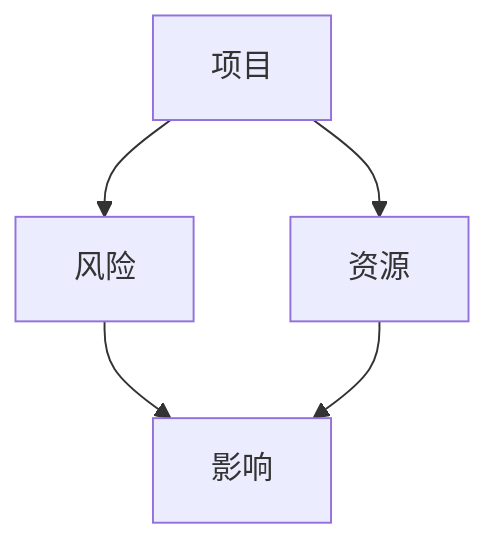
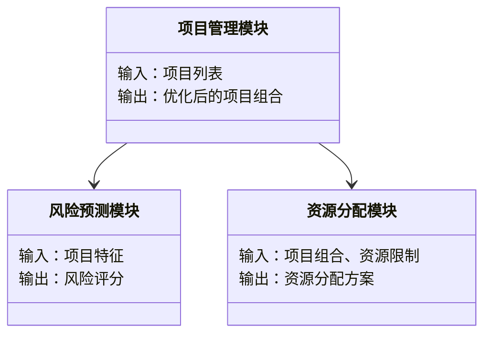
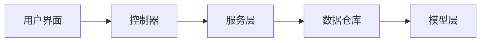
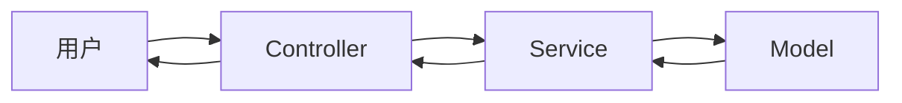

                 


# AI驱动的企业创新项目组合管理：风险平衡与资源优化的智能化

## 关键词
AI技术、项目组合管理、风险平衡、资源优化、机器学习

## 摘要
本文探讨了AI技术在企业创新项目组合管理中的应用，重点分析了如何通过智能化方法实现风险平衡与资源优化。文章从背景介绍、核心概念、算法原理、系统架构、项目实战到最佳实践，全面阐述了AI驱动的项目组合管理的理论与实践，为企业提供了一套系统化的解决方案。

---

## 第一部分：背景与概述

### 第1章：AI驱动的企业创新项目组合管理概述

#### 1.1 问题背景与挑战
传统的项目组合管理依赖于经验判断和人工决策，难以应对复杂多变的创新环境。企业在资源有限的情况下，如何选择最优的项目组合以实现最大价值，是一个复杂的优化问题。传统方法存在以下问题：
- **信息不全**：难以全面考虑市场变化、技术风险等动态因素。
- **决策延迟**：人工评估耗时长，难以快速响应市场变化。
- **资源分配不均**：难以量化评估各项目的潜在价值和风险，导致资源分配不合理。

#### 1.2 AI技术的应用潜力
AI技术，尤其是机器学习和大数据分析，为项目组合管理带来了新的可能性：
- **数据驱动决策**：通过分析历史数据和市场趋势，预测项目风险和收益。
- **自动化优化**：利用算法自动调整项目组合，实现资源的最优分配。
- **实时反馈**：基于实时数据调整决策，提高管理的灵活性。

#### 1.3 本书目标与结构
本书旨在为企业提供一套基于AI的项目组合管理方法论，涵盖从理论到实践的全过程。文章结构如下：
- 第1章：背景与概述。
- 第2章：核心概念与联系。
- 第3章：算法原理讲解。
- 第4章：系统分析与架构设计方案。
- 第5章：项目实战。
- 第6章：最佳实践、小结、注意事项与拓展阅读。

---

## 第二部分：核心概念与联系

### 第2章：AI驱动项目组合管理的核心概念

#### 2.1 核心概念解析
项目组合管理的核心目标是通过优化资源配置，实现企业战略目标的最大化。AI驱动的项目组合管理引入了以下核心概念：
- **机器学习模型**：用于预测项目风险和收益。
- **数据驱动决策**：基于大量数据进行分析，提供科学决策依据。
- **风险平衡**：在项目之间平衡风险，避免过度集中。
- **资源优化**：通过算法实现资源的最优分配。

#### 2.2 核心概念对比分析
以下是传统项目组合管理与AI驱动管理的核心概念对比：

| 比较维度 | 传统管理 | AI驱动管理 |
|----------|-----------|------------|
| 数据来源 | 主要依赖经验数据 | 结合历史数据、市场数据、实时数据 |
| 决策方式 | 人工判断为主 | 数据驱动，算法辅助 |
| 风险处理 | 静态评估 | 动态调整，实时反馈 |
| 资源分配 | 简单分配 | 精准优化 |

#### 2.3 实体关系图
以下是项目组合管理中的实体关系图：



---

## 第三部分：算法原理讲解

### 第3章：基于机器学习的项目组合管理算法

#### 3.1 机器学习模型选择
在项目组合管理中，常用的机器学习模型包括：
- **监督学习**：用于预测项目收益和风险。
- **无监督学习**：用于发现数据中的潜在模式。

#### 3.2 风险预测算法
以下是基于线性回归的项目风险预测算法：


线性回归的数学模型为：
$$
y = \beta_0 + \beta_1x + \epsilon
$$
其中，$y$是项目风险，$x$是项目特征，$\beta_0$和$\beta_1$是回归系数，$\epsilon$是误差项。

#### 3.3 资源分配优化算法
以下是基于聚类分析的资源分配优化算法：


聚类分析的数学模型为：
$$
\text{目标函数} = \sum_{i=1}^{n} \sum_{j=1}^{k} w_{ij}d_{ij}^2
$$
其中，$w_{ij}$是项目$i$属于簇$j$的概率，$d_{ij}$是项目$i$与簇$j$中心的距离。

---

## 第四部分：系统分析与架构设计方案

### 第4章：AI驱动项目组合管理系统的分析与设计

#### 4.1 项目场景介绍
假设某企业计划推出多个创新项目，希望通过AI系统优化项目组合，实现风险平衡和资源优化。

#### 4.2 系统功能设计
以下是系统功能的领域模型：



#### 4.3 系统架构设计
以下是系统的架构图：



#### 4.4 接口设计与交互
以下是系统交互流程图：



---

## 第五部分：项目实战

### 第5章：AI驱动项目组合管理的实战指导

#### 5.1 环境安装
- **Python**：安装Anaconda或Miniconda。
- **机器学习库**：安装Scikit-learn、XGBoost等。
- **可视化工具**：安装Matplotlib、Seaborn。

#### 5.2 核心代码实现
以下是项目风险预测的Python代码示例：

```python
from sklearn.linear_model import LinearRegression
from sklearn.metrics import mean_squared_error
import pandas as pd

# 加载数据
data = pd.read_csv('projects.csv')

# 数据预处理
X = data[['feature1', 'feature2']]
y = data['risk']

# 训练模型
model = LinearRegression()
model.fit(X, y)

# 预测风险
predicted_risk = model.predict(X)

# 评估模型
mse = mean_squared_error(y, predicted_risk)
print(f'均方误差：{mse}')
```

#### 5.3 案例分析与解读
假设某企业有三个创新项目，分别属于不同领域，资源限制为100万元。通过AI算法预测各项目的风险和收益，优化后的项目组合如下：
- 项目A：投资50万元，预期收益120万元，风险评分0.6。
- 项目B：投资30万元，预期收益80万元，风险评分0.4。
- 项目C：投资20万元，预期收益60万元，风险评分0.3。

通过资源分配优化，企业实现了风险平衡和资源的最优分配。

---

## 第六部分：最佳实践与总结

### 第6章：最佳实践、小结、注意事项与拓展阅读

#### 6.1 最佳实践
- **数据质量**：确保数据的准确性和完整性。
- **模型选择**：根据具体场景选择合适的算法。
- **持续优化**：定期更新模型，适应变化。

#### 6.2 小结
本文系统介绍了AI驱动的企业创新项目组合管理的理论与实践，展示了如何通过机器学习算法优化资源配置和风险平衡。

#### 6.3 注意事项
- AI模型需要不断优化和调整，以应对市场变化。
- 数据隐私和安全问题需要重视。

#### 6.4 拓展阅读
- 推荐阅读《机器学习实战》和《Python机器学习》等书籍。
- 关注最新的AI研究论文，了解前沿技术。

---

## 作者：AI天才研究院 & 禅与计算机程序设计艺术

---

这篇文章系统地介绍了AI驱动的企业创新项目组合管理的各个方面，从理论到实践，为读者提供了全面的指导。通过本文，读者可以了解如何利用AI技术优化项目组合管理，实现风险平衡与资源优化。

