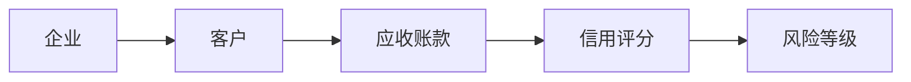
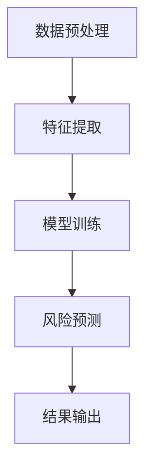
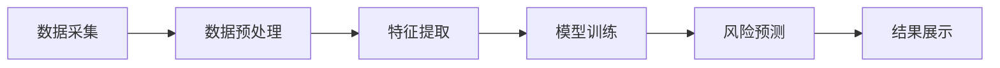

                 


# AI驱动的企业应收账款组合信用风险评估系统

> **关键词**: 人工智能, 信用风险评估, 应收账款, 机器学习, 风险管理

> **摘要**: 本文深入探讨了AI技术在企业应收账款组合信用风险评估中的应用，通过系统化的分析和设计，提出了一种基于机器学习的解决方案。文章从问题背景、核心概念、算法原理到系统架构进行了全面阐述，并通过实际案例展示了系统的实现与应用效果。本文旨在为企业信用风险管理提供一种高效、智能的解决方案，同时为AI技术在金融领域的应用提供参考。

---

## 第一部分: 背景与核心概念

### 第1章: 问题背景与核心概念

#### 1.1 问题背景

**1.1.1 应收账款信用风险的定义与重要性**

应收账款是企业的一项重要资产，但其回收过程伴随着信用风险。信用风险是指由于客户未能履行还款义务而给企业带来的损失。在企业经营中，信用风险的管理直接关系到企业的财务健康和经营稳定性。

**1.1.2 传统信用风险评估的局限性**

传统的信用风险评估方法主要依赖于财务报表分析、历史交易记录和人工经验判断。这种方法存在以下问题：
- 数据维度有限，难以捕捉客户的潜在风险；
- 人工判断主观性强，难以保证一致性；
- 对复杂市场环境的适应能力较差。

**1.1.3 AI技术在信用风险评估中的应用潜力**

AI技术，特别是机器学习算法，能够从海量数据中提取特征，识别潜在风险因素，并通过模型优化实现精准预测。AI技术的应用可以帮助企业更高效、更准确地评估信用风险。

---

#### 1.2 核心概念与问题描述

**1.2.1 应收账款组合信用风险的核心要素**

应收账款组合信用风险的核心要素包括：
- 客户的基本信息（如行业、规模）；
- 交易历史数据（如交易频率、金额）；
- 财务状况（如资产负债率、利润率）；
- 市场环境（如经济周期、行业趋势）。

**1.2.2 信用风险评估的指标与方法**

常用的信用风险评估指标包括：
- 信用评分（Credit Score）：通过模型计算客户信用等级；
- 违约概率（PD，Probability of Default）：客户在未来一定时间内违约的概率；
- 违约损失率（LGD，Loss Given Default）：违约发生时的预期损失比例。

**1.2.3 AI驱动的风险评估的边界与外延**

AI驱动的风险评估的边界包括：
- 数据来源：仅基于结构化数据（如财务数据、交易记录）；
- 评估范围：单个客户的信用风险评估；
- 时间范围：预测未来一定时间内的风险。

其外延则包括：
- 组合风险评估：将多个客户的信用风险综合评估；
- 动态风险监控：实时更新客户信用风险评估结果。

---

#### 1.3 问题解决与边界定义

**1.3.1 AI驱动的风险评估的核心目标**

AI驱动的信用风险评估的核心目标是通过机器学习算法，构建一个能够准确预测客户信用风险的模型，从而帮助企业做出更科学的赊销决策。

**1.3.2 系统边界与功能范围**

系统边界：
- 输入：客户的交易数据、财务数据、市场数据；
- 输出：客户的信用评分、违约概率、风险等级。

功能范围：
- 数据采集与预处理；
- 特征提取与模型训练；
- 风险评估与结果展示。

**1.3.3 核心概念的结构化描述**

通过Mermaid图可以清晰展示核心概念的结构化关系：



---

## 第二部分: 核心概念与联系

### 第2章: 核心概念的原理与特征

#### 2.1 核心概念的原理与特征

**2.1.1 信用风险评估的数学模型**

信用风险评估的数学模型通常基于概率论和统计学。例如，逻辑回归模型通过构建概率函数，将客户特征映射到违约概率。

**2.1.2 AI算法在信用评估中的应用**

AI算法在信用评估中的应用主要体现在：
- 特征提取：通过神经网络自动提取潜在特征；
- 模型训练：利用随机森林、梯度提升树等算法优化模型；
- 预测与解释：通过模型输出信用评分并解释结果。

**2.1.3 核心概念的属性特征对比**

以下表格对比了传统方法与AI驱动方法在信用评估中的属性特征：

| 属性 | 传统方法 | AI驱动方法 |
|------|----------|------------|
| 数据需求 | 需要结构化数据 | 支持非结构化数据 |
| 模型复杂度 | 简单线性模型 | 复杂非线性模型 |
| 精度 | 较低 | 较高 |

---

#### 2.2 实体关系图

通过Mermaid图可以展示实体关系：


---

## 第三部分: 算法原理讲解

### 第3章: 算法原理

#### 3.1 算法原理

**3.1.1 逻辑回归模型**

逻辑回归是一种常用的分类算法，其数学模型如下：

$$ P(y=1|x) = \frac{e^{\beta_0 + \beta_1x_1 + \dots + \beta_kx_k}}{1 + e^{\beta_0 + \beta_1x_1 + \dots + \beta_kx_k}} $$

其中，$y$ 是目标变量，$x_i$ 是特征变量，$\beta_i$ 是模型参数。

**3.1.2 随机森林算法**

随机森林是一种基于决策树的集成算法，通过随机采样和特征选择来提高模型的泛化能力。

**3.1.3 神经网络模型**

神经网络是一种多层的非线性模型，能够自动提取数据特征。其基本结构如下：

$$ y = f(Wx + b) $$

其中，$W$ 是权重矩阵，$b$ 是偏置，$f$ 是激活函数。

---

#### 3.2 算法流程图

通过Mermaid图可以展示算法流程：



---

#### 3.3 算法实现代码

以下是逻辑回归模型的Python实现示例：

```python
import numpy as np
from sklearn.linear_model import LogisticRegression

# 数据准备
X = np.array([[...], [...]])  # 特征向量
y = np.array([...])  # 标签

# 模型训练
model = LogisticRegression()
model.fit(X, y)

# 预测
new_X = np.array([[...], [...]])
predicted = model.predict(new_X)
print(predicted)
```

---

## 第四部分: 系统分析与架构设计

### 第4章: 系统分析与架构设计

#### 4.1 问题场景介绍

系统需要实现以下功能：
- 数据采集与预处理；
- 特征提取与模型训练；
- 风险评估与结果展示。

#### 4.2 系统功能设计

通过Mermaid图展示系统功能模块：



---

## 第五部分: 项目实战

### 第5章: 项目实战

#### 5.1 环境安装与配置

安装必要的库：

```bash
pip install numpy scikit-learn matplotlib
```

#### 5.2 核心代码实现

以下是系统核心代码示例：

```python
import numpy as np
from sklearn.model_selection import train_test_split
from sklearn.metrics import accuracy_score

# 数据准备
X = np.array([[...], [...]])  # 特征向量
y = np.array([...])  # 标签

# 数据分割
X_train, X_test, y_train, y_test = train_test_split(X, y, test_size=0.2)

# 模型训练
model = LogisticRegression()
model.fit(X_train, y_train)

# 预测与评估
y_pred = model.predict(X_test)
print("Accuracy:", accuracy_score(y_test, y_pred))
```

#### 5.3 案例分析与解读

通过具体案例分析模型的预测效果，并进行解读。

---

## 第六部分: 总结与展望

### 第6章: 总结与展望

#### 6.1 项目总结

总结系统的设计与实现过程，分析其优缺点。

#### 6.2 未来展望

探讨AI技术在信用风险评估中的未来发展方向，如引入强化学习、知识图谱等新技术。

---

## 作者信息

作者：AI天才研究院/AI Genius Institute & 禅与计算机程序设计艺术 /Zen And The Art of Computer Programming

---

以上是《AI驱动的企业应收账款组合信用风险评估系统》的技术博客文章框架，具体内容可根据实际需求进一步补充和完善。

