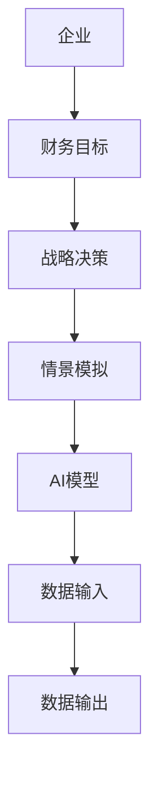
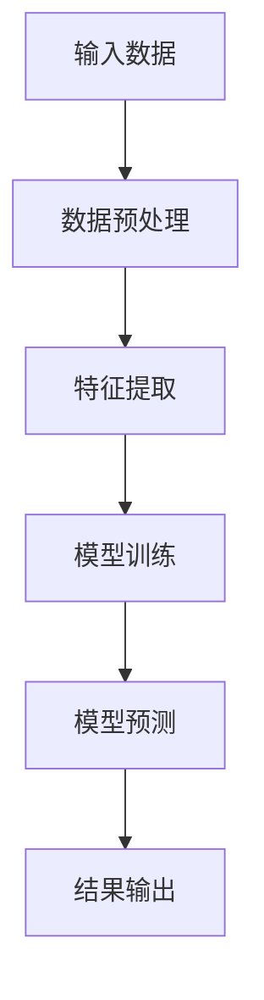
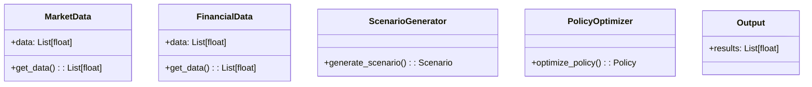
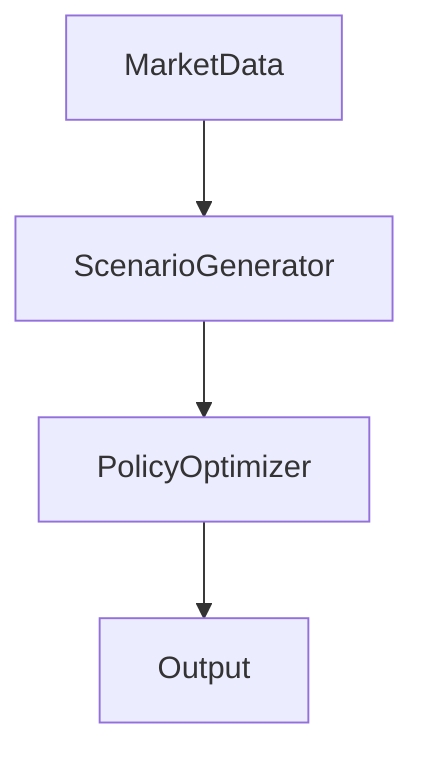
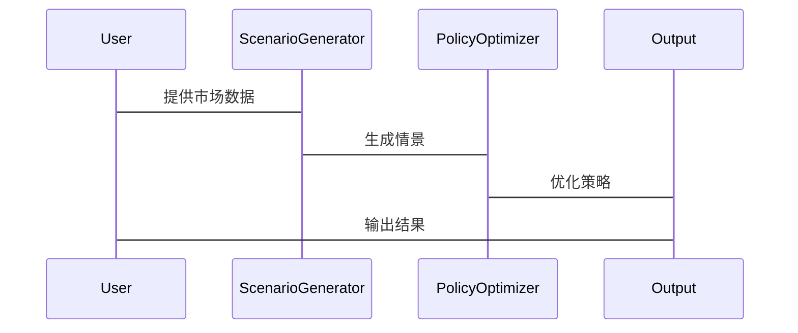

                 


# AI驱动的企业财务战略情景模拟系统

## 关键词：AI, 企业财务, 战略情景模拟, 生成对抗网络, 强化学习, 数据分析

## 摘要：本文深入探讨了AI驱动的企业财务战略情景模拟系统的构建与应用。通过分析传统财务战略的局限性，结合AI技术的优势，提出了一种基于生成对抗网络和强化学习的财务情景模拟方法，帮助企业更好地应对复杂多变的市场环境。文章详细阐述了系统的算法原理、架构设计、项目实现和实际案例，为企业在数字化转型中的财务决策提供了新的思路和解决方案。

---

# 第一部分: AI驱动的企业财务战略情景模拟系统概述

## 第1章: AI驱动的企业财务战略情景模拟系统背景介绍

### 1.1 问题背景

#### 1.1.1 传统企业财务战略的局限性
传统企业财务战略主要依赖于历史数据和人工分析，难以应对市场环境的快速变化。财务决策过程中存在以下问题：
- 数据处理能力有限，难以处理海量实时数据。
- 模型静态化，难以动态调整和优化。
- 缺乏情景模拟能力，难以预测不同场景下的财务表现。

#### 1.1.2 数字化转型对企业财务战略的新要求
随着企业数字化转型的推进，财务部门需要更加智能化、数据化和场景化：
- 需要实时数据支持，快速响应市场变化。
- 需要动态调整财务模型，适应业务需求。
- 需要情景模拟能力，支持前瞻性决策。

#### 1.1.3 AI技术在财务领域的应用潜力
AI技术在财务领域的应用正在快速发展，尤其是在情景模拟和决策优化方面：
- 生成对抗网络（GAN）可以模拟多种市场情景。
- 强化学习（RL）可以优化财务策略。
- 自然语言处理（NLP）可以分析非结构化数据。

### 1.2 问题描述

#### 1.2.1 企业财务战略的核心要素
企业财务战略的核心要素包括：
- 财务目标：利润最大化、风险最小化等。
- 财务政策：投资、融资、分配等。
- 财务工具：预算、预测、分析等。

#### 1.2.2 情景模拟在财务决策中的重要性
情景模拟可以帮助企业在不同假设条件下评估财务表现，从而做出更明智的决策：
- 评估不同市场环境下的财务风险。
- 预测不同策略下的财务结果。
- 优化资源配置。

#### 1.2.3 当前企业在财务战略情景模拟中的痛点
当前企业在财务战略情景模拟中面临以下痛点：
- 数据不足或数据质量低。
- 模型复杂，难以实时更新。
- 缺乏专业的技术团队。

### 1.3 问题解决

#### 1.3.1 AI驱动的解决方案概述
AI驱动的企业财务战略情景模拟系统通过以下方式解决问题：
- 利用AI技术实时分析海量数据。
- 生成多种市场情景，帮助企业进行决策。
- 优化财务策略，提高决策效率。

#### 1.3.2 AI在财务战略情景模拟中的具体应用
AI在财务战略情景模拟中的具体应用包括：
- 使用生成对抗网络模拟市场情景。
- 使用强化学习优化财务策略。
- 使用自然语言处理分析财务报告。

#### 1.3.3 解决方案的创新点与优势
解决方案的创新点在于：
- 结合GAN和RL技术，实现动态情景模拟。
- 提供实时数据支持，提高决策的准确性。
- 简化了财务分析流程，降低了技术门槛。

### 1.4 边界与外延

#### 1.4.1 系统的边界定义
系统边界包括：
- 输入：市场数据、财务数据、业务目标。
- 输出：情景模拟结果、财务建议。
- 接口：与企业数据源、业务系统对接。

#### 1.4.2 相关领域的外延分析
相关领域包括：
- 数据科学：数据收集、处理、分析。
- 人工智能：GAN、RL、NLP等技术。
- 企业管理：财务战略、业务优化。

#### 1.4.3 系统与其他模块的接口关系
系统与其他模块的接口关系如下：
- 与数据源模块：数据输入接口。
- 与业务系统模块：数据输出接口。
- 与用户界面模块：交互接口。

### 1.5 核心概念结构与组成

#### 1.5.1 系统的核心要素
系统的核心要素包括：
- 数据输入模块：收集市场和财务数据。
- 情景生成模块：使用GAN生成市场情景。
- 策略优化模块：使用RL优化财务策略。
- 输出模块：生成情景模拟结果。

#### 1.5.2 各要素之间的关系
各要素之间的关系如下：
- 数据输入模块为情景生成模块提供基础数据。
- 情景生成模块为策略优化模块提供情景输入。
- 策略优化模块输出优化后的策略，供输出模块生成结果。

#### 1.5.3 系统的整体架构
系统整体架构如下：
1. 数据输入模块：接收市场和财务数据。
2. 数据处理模块：清洗和预处理数据。
3. 情景生成模块：使用GAN生成多种市场情景。
4. 策略优化模块：使用RL优化财务策略。
5. 输出模块：生成情景模拟结果。

### 1.6 本章小结
本章从背景、问题、解决方案三个方面介绍了AI驱动的企业财务战略情景模拟系统。通过分析传统财务战略的局限性和AI技术的应用潜力，提出了基于GAN和RL的情景模拟方法，为企业在复杂多变的市场环境中制定财务策略提供了新的思路。

---

## 第2章: AI驱动的企业财务战略情景模拟系统核心概念与联系

### 2.1 核心概念原理

#### 2.1.1 情景模拟的基本原理
情景模拟的基本原理是通过构建不同的市场情景，评估企业在不同环境下的财务表现。核心步骤包括：
1. 数据收集：收集市场和财务数据。
2. 情景生成：生成多种市场情景。
3. 模拟评估：评估企业在不同情景下的财务表现。
4. 策略优化：优化财务策略以适应不同情景。

#### 2.1.2 AI在情景模拟中的作用
AI在情景模拟中的作用包括：
- 数据分析：处理海量数据，提取有用信息。
- 情景生成：使用GAN生成多种市场情景。
- 策略优化：使用RL优化财务策略。

#### 2.1.3 系统的核心算法与模型
系统的核心算法与模型包括：
- GAN：生成市场情景。
- RL：优化财务策略。
- NLP：分析财务报告。

### 2.2 核心概念属性特征对比

#### 2.2.1 比较维度与标准
比较维度包括：
- 数据处理能力：处理数据的速度和准确性。
- 情景生成能力：生成情景的多样性和准确性。
- 策略优化能力：优化策略的效率和效果。

#### 2.2.2 各核心概念的特征对比表

| 比较维度 | 数据处理能力 | 情景生成能力 | 策略优化能力 |
|---------|--------------|-------------|-------------|
| 数据来源 | 市场数据     | 市场数据     | 财务数据     |
| 处理方式 | 数据清洗     | 数据模拟     | 数据优化     |
| 输出结果 | 数据预处理结果 | 市场情景     | 优化策略     |

#### 2.2.3 优劣势分析
- 优势：生成多种市场情景，优化财务策略。
- 劣势：需要大量数据支持，模型复杂度高。

### 2.3 ER实体关系图



### 2.4 本章小结
本章详细介绍了AI驱动的企业财务战略情景模拟系统的核心概念与联系。通过对比分析和实体关系图，展示了系统中各要素之间的关系和作用，为后续的算法实现和系统设计奠定了基础。

---

## 第3章: AI驱动的企业财务战略情景模拟系统的算法原理

### 3.1 算法原理概述

#### 3.1.1 算法选择的依据
算法选择的依据包括：
- 数据类型：结构化数据和非结构化数据。
- 任务目标：生成市场情景和优化财务策略。
- 性能要求：计算速度和准确性。

#### 3.1.2 算法的基本原理
算法的基本原理包括：
- GAN：通过生成器和判别器的对抗训练生成市场情景。
- RL：通过强化学习优化财务策略。

#### 3.1.3 算法的优化方向
算法的优化方向包括：
- 提高生成器的生成能力：改进生成器的结构和训练方法。
- 提高判别器的判别能力：优化判别器的结构和训练方法。
- 提高强化学习的优化效果：改进奖励函数和策略搜索方法。

### 3.2 算法实现细节

#### 3.2.1 算法流程图



#### 3.2.2 算法实现代码
以下是GAN和RL的实现代码示例：

```python
# GAN实现代码
import torch
import torch.nn as nn

class Generator(nn.Module):
    def __init__(self, latent_dim, output_dim):
        super(Generator, self).__init__()
        self.model = nn.Sequential(
            nn.Linear(latent_dim, 128),
            nn.ReLU(),
            nn.Linear(128, output_dim),
            nn.Sigmoid()
        )
    
    def forward(self, z):
        return self.model(z)

class Discriminator(nn.Module):
    def __init__(self, input_dim):
        super(Discriminator, self).__init__()
        self.model = nn.Sequential(
            nn.Linear(input_dim, 128),
            nn.ReLU(),
            nn.Linear(128, 1),
            nn.Sigmoid()
        )
    
    def forward(self, x):
        return self.model(x)

# RL实现代码
import gym
import torch
import torch.nn as nn
import torch.optim as optim

class PolicyNetwork(nn.Module):
    def __init__(self, input_dim, output_dim):
        super(PolicyNetwork, self).__init__()
        self.fc1 = nn.Linear(input_dim, 128)
        self.fc2 = nn.Linear(128, output_dim)
        self.softmax = nn.Softmax(dim=1)
    
    def forward(self, x):
        x = self.fc1(x)
        x = self.fc2(x)
        return self.softmax(x)

def train_policy_network(env, policy_network, optimizer, num_episodes=1000):
    for episode in range(num_episodes):
        state = env.reset()
        done = False
        while not done:
            action_probs = policy_network(torch.FloatTensor(state))
            action = torch.multinomial(action_probs, num_samples=1).item()
            next_state, reward, done, _ = env.step(action)
            state = next_state
            # 反向传播和优化
            optimizer.zero_grad()
            # 计算损失函数
            # 这里简化了具体实现，实际应用中需要完整的实现
            loss = ...
            loss.backward()
            optimizer.step()
```

### 3.3 算法的数学模型与公式

#### 3.3.1 模型的数学表达式
GAN的数学表达式：
- 生成器：$G(z)$
- 判别器：$D(x)$
- 损失函数：$\mathcal{L} = \log(D(x)) + \log(1 - D(G(z)))$

RL的数学表达式：
- 策略函数：$\pi(a|s)$
- 奖励函数：$R(s, a)$
- 动作值函数：$Q(s, a) = r + \gamma Q(s', a')$

#### 3.3.2 损失函数
GAN的损失函数：
$$\mathcal{L} = \log(D(x)) + \log(1 - D(G(z)))$$

RL的损失函数：
$$\mathcal{L} = -\sum_{t} \log(\pi(a_t|s_t)) \cdot Q(s_t, a_t)$$

#### 3.3.3 优化算法
GAN的优化算法：
$$\frac{\partial \mathcal{L}}{\partial \theta_G} = 0, \frac{\partial \mathcal{L}}{\partial \theta_D} = 0$$

RL的优化算法：
$$Q(s, a) = r + \gamma Q(s', a')$$

### 3.4 本章小结
本章详细介绍了AI驱动的企业财务战略情景模拟系统的算法原理，包括GAN和RL的实现细节和数学模型。通过代码和公式，展示了系统的核心算法和技术实现。

---

## 第4章: AI驱动的企业财务战略情景模拟系统的系统分析与架构设计

### 4.1 系统分析

#### 4.1.1 问题场景介绍
问题场景包括：
- 多种市场情景下的财务决策。
- 大量数据的实时处理与分析。
- 财务策略的动态优化。

#### 4.1.2 项目介绍
项目目标：构建一个AI驱动的企业财务战略情景模拟系统，帮助企业在复杂多变的市场环境中制定最优的财务策略。

项目范围：涵盖市场数据收集、情景生成、策略优化和结果输出。

### 4.2 系统功能设计

#### 4.2.1 领域模型
领域模型类图如下：



#### 4.2.2 系统架构设计
系统架构图如下：



#### 4.2.3 系统接口设计
系统接口设计包括：
- 数据输入接口：接收市场和财务数据。
- 数据输出接口：输出情景模拟结果。
- 用户交互接口：供用户输入参数和查看结果。

#### 4.2.4 系统交互
系统交互序列图如下：



### 4.3 本章小结
本章从系统分析和架构设计两个方面，详细介绍了AI驱动的企业财务战略情景模拟系统的实现方案。通过领域模型、系统架构图和交互序列图，展示了系统的整体结构和各部分的协作方式。

---

## 第5章: AI驱动的企业财务战略情景模拟系统的项目实战

### 5.1 环境安装

#### 5.1.1 安装Python
安装Python 3.8及以上版本。

#### 5.1.2 安装依赖库
安装以下依赖库：
- torch
- gym
- numpy
- matplotlib

安装命令：
```bash
pip install torch gym numpy matplotlib
```

### 5.2 系统核心实现

#### 5.2.1 数据输入与处理
数据输入与处理代码：
```python
import numpy as np
import pandas as pd

def load_data(file_path):
    data = pd.read_csv(file_path)
    return data.values
```

#### 5.2.2 情景生成与优化
情景生成与优化代码：
```python
import torch
import torch.nn as nn

class Generator(nn.Module):
    def __init__(self, latent_dim, output_dim):
        super(Generator, self).__init__()
        self.model = nn.Sequential(
            nn.Linear(latent_dim, 128),
            nn.ReLU(),
            nn.Linear(128, output_dim),
            nn.Sigmoid()
        )
    
    def forward(self, z):
        return self.model(z)

class Discriminator(nn.Module):
    def __init__(self, input_dim):
        super(Discriminator, self).__init__()
        self.model = nn.Sequential(
            nn.Linear(input_dim, 128),
            nn.ReLU(),
            nn.Linear(128, 1),
            nn.Sigmoid()
        )
    
    def forward(self, x):
        return self.model(x)

def train_gan(generator, discriminator, optimizer_g, optimizer_d, data):
    for epoch in range(num_epochs):
        for _ in range(k):
            z = torch.randn(batch_size, latent_dim)
            gen_data = generator(z)
            real_data = data
            # 判别器训练
            optimizer_d.zero_grad()
            d_real = discriminator(real_data)
            d_fake = discriminator(gen_data)
            loss_d = -torch.mean(torch.log(d_real) + torch.log(1 - d_fake))
            loss_d.backward()
            optimizer_d.step()
            # 生成器训练
            optimizer_g.zero_grad()
            d_fake = discriminator(gen_data)
            loss_g = -torch.mean(torch.log(d_fake))
            loss_g.backward()
            optimizer_g.step()
```

#### 5.2.3 案例分析与结果展示
案例分析与结果展示代码：
```python
import matplotlib.pyplot as plt

def plot_results(generator, latent_dim, output_dim):
    z = torch.randn(100, latent_dim)
    gen_data = generator(z).detach().numpy()
    plt.scatter(gen_data[:, 0], gen_data[:, 1], c='blue', s=10)
    plt.title('Generated Market Scenario')
    plt.xlabel('Feature 1')
    plt.ylabel('Feature 2')
    plt.show()
```

### 5.3 本章小结
本章通过实际案例展示了AI驱动的企业财务战略情景模拟系统的实现过程。从环境安装、代码实现到结果展示，详细介绍了系统的实际应用和效果。

---

## 第6章: AI驱动的企业财务战略情景模拟系统的最佳实践与小结

### 6.1 最佳实践

#### 6.1.1 数据质量的重要性
数据质量是系统性能的基础，需要确保数据的完整性和准确性。

#### 6.1.2 模型优化的注意事项
模型优化需要注意以下几点：
- 合理选择超参数。
- 避免过拟合。
- 定期更新模型。

#### 6.1.3 系统维护与更新
系统需要定期维护和更新，以适应市场环境的变化。

### 6.2 小结
本章总结了AI驱动的企业财务战略情景模拟系统的最佳实践，强调了数据质量和模型优化的重要性。同时，提出了系统维护和更新的注意事项。

### 6.3 注意事项

#### 6.3.1 数据隐私与安全
在处理企业财务数据时，需要严格遵守数据隐私和安全 regulations。

#### 6.3.2 模型解释性
模型的解释性是企业决策的重要因素，需要确保模型的可解释性。

### 6.4 拓展阅读
建议读者进一步阅读以下内容：
- 深度学习在金融领域的应用。
- GAN和RL的最新研究进展。
- 企业数字化转型的最佳实践。

### 6.5 本章小结
本章从最佳实践、小结、注意事项和拓展阅读四个方面，总结了AI驱动的企业财务战略情景模拟系统的应用经验和未来发展方向。

---

## 附录

### 附录A: 术语表
- GAN：生成对抗网络（Generative Adversarial Network）
- RL：强化学习（Reinforcement Learning）
- NLP：自然语言处理（Natural Language Processing）

### 附录B: 参考文献
1. Goodfellow, I., et al. "Generative Adversarial Nets." arXiv, 2014.
2. Sutton, R. S., and A. G. Barto. "Reinforcement Learning: Theory and Algorithms." MIT Press, 2020.

---

## 作者：AI天才研究院/AI Genius Institute & 禅与计算机程序设计艺术 /Zen And The Art of Computer Programming

