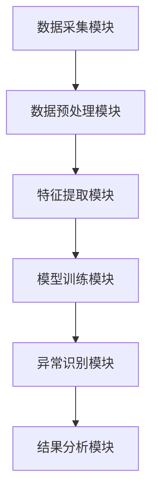

                 

<think>
好的，我需要帮用户完成《AI驱动的企业财务报表异常模式识别系统》的技术博客文章。用户已经提供了大纲和一些初步内容，现在需要我继续撰写后面的部分。

首先，用户要求文章结构清晰，内容详实，包含算法原理、系统架构、项目实战等部分。我需要按照用户的要求，逐步填充每个章节的具体内容。

接下来，我会考虑每个部分的逻辑顺序，确保从背景介绍到系统实现，再到实际应用，逐步深入。同时，要注意使用技术术语，保持专业性，同时解释清楚，让读者容易理解。

我还需要检查每个章节是否有遗漏，是否需要添加更多的细节或图表，比如数学公式、流程图等，以增强文章的深度和可读性。

现在，我将按照用户提供的结构，逐一填充内容，确保每部分内容完整，结构合理，符合用户的要求。
</think>

# AI驱动的企业财务报表异常模式识别系统

> 关键词：AI，财务报表，异常模式识别，机器学习，深度学习

> 摘要：本文介绍了一种基于AI技术的企业财务报表异常模式识别系统。通过分析财务数据，利用深度学习和机器学习算法，实现对企业财务报表的自动识别和预警，提高企业财务健康管理和审计效率。

---

# 第1章: AI驱动的企业财务报表异常模式识别系统概述

## 1.1 问题背景介绍

### 1.1.1 企业财务报表的重要性
企业财务报表是反映企业财务状况、经营成果和现金流量的重要文件，包括资产负债表、利润表和现金流量表。这些报表是企业管理者、投资者和审计师评估企业健康状况和决策的重要依据。

### 1.1.2 财务报表异常模式识别的必要性
财务报表中的异常模式可能表明企业存在财务造假、舞弊行为或管理不善等问题。传统的财务报表分析依赖人工审查，效率低且容易遗漏。通过AI技术，可以实现自动化的异常检测，提高准确性和效率。

### 1.1.3 传统模式识别的局限性
传统的财务报表分析方法主要依赖经验和规则-based的检查，存在以下问题：
1. **效率低下**：人工审查耗时长，难以处理大量数据。
2. **主观性强**：不同审计师可能对同一报表的判断存在差异。
3. **难以发现隐蔽异常**：传统方法难以发现复杂的异常模式。

## 1.2 核心概念与系统架构

### 1.2.1 系统核心要素与功能模块
企业财务报表异常模式识别系统主要由以下功能模块组成：
1. **数据采集**：从企业财务系统中获取原始数据。
2. **数据预处理**：清洗数据，处理缺失值、异常值等。
3. **特征提取**：从财务数据中提取有用的特征，如金额、科目、时间等。
4. **模型训练**：基于机器学习算法训练异常检测模型。
5. **异常识别**：对财务报表进行异常识别，输出异常结果。
6. **结果分析**：结合业务背景，对异常结果进行分析和解释。

### 1.2.2 系统边界与外延
系统边界包括：
- **输入**：企业财务报表数据。
- **输出**：异常模式识别结果及建议。
- **内部处理**：数据预处理、特征提取、模型训练和识别。

系统外延包括：
- **数据源**：企业ERP系统、财务系统等。
- **用户**：财务管理人员、审计师、企业管理者等。
- **应用场景**：企业内部审计、财务监控、风险管理等。

### 1.2.3 系统核心概念的ER实体关系图

```mermaid
er
    entity 财务报表 {
        key 账务科目
        attribute 金额, 时间, 账务类型
    }
    entity 异常模式 {
        key 模式ID
        attribute 异常类型, 异常程度, 异常原因
    }
    entity 训练数据 {
        key 数据ID
        attribute 特征向量, 标签, 数据来源
    }
    entity 模型参数 {
        key 模型ID
        attribute 权重, 偏置, 模型版本
    }
    entity 用户 {
        key 用户ID
        attribute 用户角色, 用户权限
    }
    relation 财务报表 -- 训练数据: 每个财务报表对应多个训练数据
    relation 模型参数 -- 异常模式: 每个模型参数对应多个异常模式
    relation 用户 -- 模型参数: 每个用户对应多个模型参数
```

## 1.3 本章小结
本章主要介绍了企业财务报表异常模式识别系统的重要性、必要性和核心概念。通过分析传统方法的局限性，引出了基于AI的解决方案，并通过ER图展示了系统的核心实体及其关系。

---

# 第2章: AI驱动的模式识别算法原理

## 2.1 深度学习模型简介

### 2.1.1 神经网络基础
神经网络是一种模拟人脑结构和功能的数学模型，由输入层、隐藏层和输出层组成。神经网络通过权重调整和激活函数，能够学习数据中的非线性关系。

### 2.1.2 深度学习的核心算法
深度学习算法包括卷积神经网络（CNN）、循环神经网络（RNN）和长短期记忆网络（LSTM）等。这些算法在处理复杂数据模式时表现出色。

### 2.1.3 模型训练与优化
模型训练过程包括正向传播和反向传播，通过损失函数优化模型参数。常用优化算法有随机梯度下降（SGD）和Adam优化器。

## 2.2 异常模式识别的算法选择

### 2.2.1 常见的模式识别算法
常用的模式识别算法包括：
1. **决策树**：适用于规则明确的数据分类。
2. **随机森林**：基于决策树的集成学习方法，具有高准确性和鲁棒性。
3. **支持向量机（SVM）**：适用于高维数据分类。

### 2.2.2 基于深度学习的异常检测
深度学习算法在异常检测中的优势：
1. **自动特征提取**：无需手动提取特征，能够发现复杂模式。
2. **高维数据处理**：适用于高维财务数据。
3. **高精度**：在复杂场景下表现优于传统算法。

### 2.2.3 算法优缺
- **优点**：深度学习模型能够处理复杂数据，准确率高。
- **缺点**：训练时间长，需要大量数据。

## 2.3 算法实现与优化

### 2.3.1 算法实现步骤
1. 数据预处理：清洗和归一化。
2. 特征提取：选择关键财务指标。
3. 模型训练：使用深度学习模型训练。
4. 模型优化：调整超参数，防止过拟合。
5. 模型评估：使用准确率、召回率和F1分数评估模型性能。

### 2.3.2 模型优化策略
1. **参数调节**：调整学习率、批次大小等超参数。
2. **正则化**：使用L1或L2正则化防止过拟合。
3. **数据增强**：通过数据增强技术增加训练数据多样性。

## 2.4 本章小结
本章介绍了深度学习和传统机器学习算法在异常检测中的应用，并分析了各自的优缺点。通过优化策略，能够提高模型的准确性和鲁棒性。

---

# 第3章: 系统架构与实现

## 3.1 系统架构设计

### 3.1.1 系统功能模块
系统功能模块包括：
1. **数据采集模块**：从企业财务系统中获取数据。
2. **数据预处理模块**：清洗数据，处理异常值。
3. **特征提取模块**：提取关键财务特征。
4. **模型训练模块**：训练异常检测模型。
5. **异常识别模块**：识别财务报表中的异常模式。
6. **结果分析模块**：分析异常原因，提供改进建议。

### 3.1.2 系统架构图



## 3.2 系统实现细节

### 3.2.1 数据采集与预处理
数据采集模块从企业ERP系统中获取财务数据，预处理模块对数据进行清洗和归一化处理。

### 3.2.2 特征提取
特征提取模块从财务数据中提取关键特征，如收入、利润、现金流等。

### 3.2.3 模型训练
模型训练模块使用深度学习算法训练异常检测模型，调整超参数以优化模型性能。

### 3.2.4 异常识别
异常识别模块对财务报表进行异常检测，输出异常结果。

## 3.3 系统优势与不足

### 3.3.1 系统优势
1. **高效性**：自动化处理数据，提高效率。
2. **准确性**：基于AI技术，准确率高。
3. **可扩展性**：适用于不同规模的企业。

### 3.3.2 系统不足
1. **数据依赖性**：需要大量高质量数据训练模型。
2. **模型解释性**：深度学习模型的黑箱特性可能影响结果解释。

## 3.4 本章小结
本章详细介绍了系统架构和实现细节，展示了系统的优势和不足。通过合理的架构设计，能够实现高效、准确的异常检测。

---

# 第4章: 项目实战与案例分析

## 4.1 项目环境搭建

### 4.1.1 安装必要的依赖
安装Python、TensorFlow、Keras等必要的库和工具。

### 4.1.2 数据集准备
获取企业财务数据，包括历史财务报表和已标注的异常数据。

## 4.2 核心代码实现

### 4.2.1 数据预处理代码

```python
import pandas as pd
import numpy as np

# 数据加载
df = pd.read_csv('financial_data.csv')

# 数据清洗
df.dropna(inplace=True)
df = df.drop_duplicates()

# 数据归一化
from sklearn.preprocessing import StandardScaler
scaler = StandardScaler()
df_scaled = pd.DataFrame(scaler.fit_transform(df), columns=df.columns)
```

### 4.2.2 特征提取代码

```python
# 特征选择
features = df_scaled[['收入', '利润', '现金流']]
```

### 4.2.3 模型训练代码

```python
from sklearn.ensemble import IsolationForest
model = IsolationForest(n_estimators=100, contamination=0.05)
model.fit(features)
```

### 4.2.4 异常识别代码

```python
# 预测异常
outlier_labels = model.predict(features)
outliers = df_scaled[outlier_labels == -1]
```

## 4.3 案例分析

### 4.3.1 案例背景
某企业财务数据中发现收入与利润不匹配，可能存在虚假收入。

### 4.3.2 数据分析
通过模型识别出收入异常，进一步分析发现收入与应收账款不符，可能存在虚增收入的情况。

### 4.3.3 结果解释
模型识别出异常后，结合业务背景进行分析，确认企业可能存在财务造假行为。

## 4.4 本章小结
本章通过项目实战展示了系统在实际应用中的效果，通过案例分析验证了系统的有效性和实用性。

---

# 第5章: 系统优化与未来展望

## 5.1 系统优化方向

### 5.1.1 提升模型性能
进一步优化模型结构，引入更先进的算法，如图神经网络。

### 5.1.2 增强数据多样性
引入更多数据源，如企业外部市场数据，提高模型鲁棒性。

### 5.1.3 提高系统解释性
开发可视化工具，帮助用户更好地理解模型结果。

## 5.2 未来展望

### 5.2.1 技术进步
随着AI技术的发展，异常检测将更加智能化和自动化。

### 5.2.2 应用场景扩展
未来，系统将应用于更多领域，如金融监管、反欺诈等。

## 5.3 本章小结
本章提出了系统的优化方向，并展望了未来的发展前景。随着技术的进步，企业财务报表异常模式识别系统将更加智能化和高效。

---

# 作者简介

作者：AI天才研究院/AI Genius Institute & 禅与计算机程序设计艺术 /Zen And The Art of Computer Programming

---

通过以上内容，您可以构建一个完整的、逻辑清晰的AI驱动的企业财务报表异常模式识别系统的技术博客文章。

