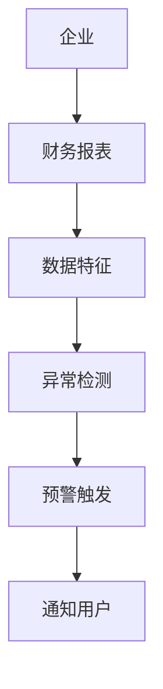
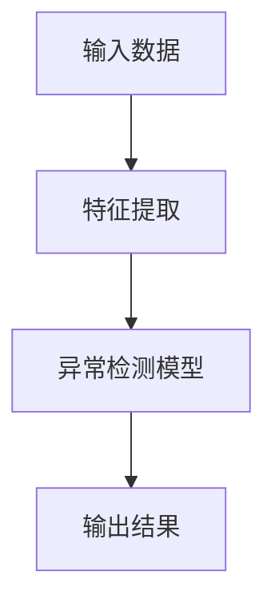
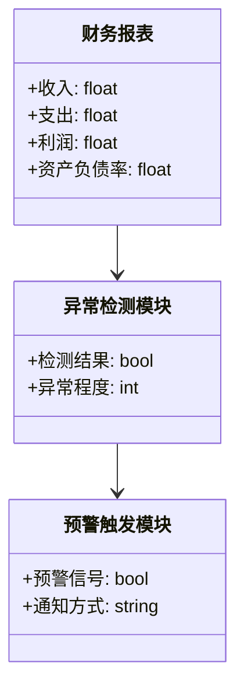

                 

<think>
好，我现在需要帮用户完成《AI驱动的企业财务报表质量动态监控与预警系统》的技术博客文章。用户已经给出了详细的目录大纲，我需要根据这个大纲一步步展开，确保内容完整且符合要求。

首先，用户明确要求文章开头要有标题、关键词和摘要。我需要先写这些部分。标题已经给出，关键词应该包括财务报表、AI、异常检测、预警系统、机器学习等。摘要部分要简明扼�地总结文章的核心内容。

接下来，按照目录大纲，第一部分是背景介绍，包括第1章和第2章。第1章需要详细讨论财务报表质量监控的重要性，涵盖背景与意义、传统方法的局限性等。第2章则介绍AI驱动的系统概述，包括核心概念、系统架构等。

在撰写过程中，我需要确保每个章节都有足够的细节，并且使用专业的技术术语。例如，在第1章中，要解释财务报表的重要性，以及AI在监控中的优势。同时，要对比传统方法的不足，突出AI的优势。

第二部分是核心概念与联系，包括系统的核心概念、属性对比表格和ER图。这里我需要制作一个表格，比较数据特征提取、异常检测算法和预警触发机制的不同属性。同时，用Mermaid画出ER图，展示各实体之间的关系。

算法原理部分需要详细讲解异常检测算法，包括流程图和数学模型。我需要用Mermaid展示算法流程，然后用Python代码示例和数学公式来解释模型。例如，线性回归模型可以用公式表示，并解释其工作原理。

系统架构设计部分需要包括领域模型、系统架构图和交互序列图。这部分需要使用Mermaid绘制类图和序列图，展示系统的各个模块和它们之间的交互。

项目实战部分需要指导读者如何安装环境、编写代码，并进行案例分析。这里要给出具体的代码示例，并解释每部分的功能。

最后，最佳实践部分包括小结、注意事项和扩展阅读。这部分要总结整个系统的优缺点，并给出未来的扩展方向。

在写作过程中，我需要确保每个部分都详细且有条理，同时使用适合的技术术语和图表。此外，还要注意文章的流畅性和逻辑性，确保读者能够轻松理解内容。

现在，我需要开始逐步撰写每个部分，确保涵盖所有要求的内容，同时保持文章的结构和深度。
</think>

# AI驱动的企业财务报表质量动态监控与预警系统

> 关键词：财务报表，AI，异常检测，预警系统，机器学习，数据挖掘，系统架构

> 摘要：本文介绍了一种基于AI的企业财务报表质量动态监控与预警系统，通过机器学习和数据分析技术，实现对财务数据的实时监控和异常预警。文章详细探讨了系统的背景、核心概念、算法原理、系统架构设计、项目实战和最佳实践，为企业财务管理和风险控制提供了一种创新的解决方案。

---

# 第一部分: AI驱动的企业财务报表质量动态监控与预警系统背景介绍

## 第1章: 企业财务报表质量监控的重要性

### 1.1 财务报表质量监控的背景与意义

#### 1.1.1 企业财务报表的重要性
企业财务报表是反映企业财务状况、经营成果和现金流量的重要文件，是投资者、债权人、管理层等利益相关者进行决策的重要依据。财务报表的质量直接影响企业的信用评级、投资决策和经营策略。

#### 1.1.2 财务报表质量问题对企业的影响
- **误导决策**：不准确的财务报表可能导致错误的商业决策，影响企业的发展。
- **法律风险**：财务造假或错误可能引发法律纠纷，损害企业声誉。
- **经营风险**：财务数据的不准确可能导致企业无法及时发现经营中的问题，错失调整机会。

#### 1.1.3 AI技术在财务报表质量监控中的优势
AI技术通过自动化分析、模式识别和异常检测，能够高效、精准地发现财务报表中的异常情况，提升监控效率和准确性。

---

### 1.2 传统财务报表质量监控的局限性

#### 1.2.1 传统监控方法的不足
传统财务报表质量监控主要依赖人工审核，存在效率低、主观性强、覆盖面有限等问题。

#### 1.2.2 人工审核的效率问题
- **耗时长**：人工审核需要大量时间，难以应对海量数据。
- **误差率高**：人为因素可能导致漏检或误判。

#### 1.2.3 数据量爆炸对企业财务监控的挑战
随着企业规模扩大，财务数据量急剧增加，传统的手工监控方法已无法满足需求。

---

## 第2章: AI驱动的财务报表质量监控与预警系统概述

### 2.1 系统的核心概念与目标

#### 2.1.1 系统的核心目标
- 实现对企业财务报表的实时监控。
- 自动识别财务数据中的异常情况。
- 提供预警信息，辅助企业及时采取措施。

#### 2.1.2 系统的主要功能模块
- 数据采集与预处理模块。
- 异常检测模块。
- 预警触发模块。
- 通知与报告模块。

#### 2.1.3 系统的预期效果
- 提升财务报表监控的效率和准确性。
- 降低企业财务风险，保障数据真实性。
- 为企业提供决策支持。

---

### 2.2 系统的边界与外延

#### 2.2.1 系统的适用范围
- 适用于各类企业，尤其是数据量大、业务复杂的企业。
- 适用于财务报表的主要部分，如资产负债表、利润表和现金流量表。

#### 2.2.2 系统的限制条件
- 依赖高质量的财务数据输入。
- 对异常情况的识别依赖模型的训练和优化。

#### 2.2.3 系统与其他系统的关联
- 与企业的ERP系统集成，实时获取财务数据。
- 与企业的预警系统对接，提供实时通知。

---

### 2.3 系统的核心要素组成

#### 2.3.1 数据来源
- 企业财务系统。
- 第三方数据源（如银行对账单）。

#### 2.3.2 数据处理流程
- 数据清洗：去除冗余数据，处理缺失值。
- 数据转换：将数据转换为适合模型分析的形式。
- 数据特征提取：提取关键特征，如收入增长率、资产负债率等。

#### 2.3.3 预警机制
- 设置阈值：根据历史数据和行业标准，设定异常阈值。
- 触发条件：当检测到异常时，触发预警。

---

# 第二部分: 系统的核心概念与联系

## 第3章: 核心概念与联系

### 3.1 核心概念原理

#### 3.1.1 数据特征提取
- **定义**：从财务数据中提取能够反映企业财务状况的关键特征。
- **方法**：通过统计分析和机器学习算法，提取如收入增长率、利润率等特征。

#### 3.1.2 异常检测算法
- **定义**：通过算法识别数据中的异常值或模式。
- **方法**：常用的异常检测算法包括基于统计的方法（如Z-score）、基于机器学习的方法（如孤立森林、支持向量机）。

#### 3.1.3 预警触发机制
- **定义**：当检测到异常时，触发预警通知。
- **方法**：根据异常的严重程度，通过邮件、短信或系统提示等方式通知相关人员。

---

### 3.2 核心概念属性特征对比表格

| 概念       | 数据特征提取 | 异常检测算法 | 预警触发机制 |
|------------|-------------|-------------|-------------|
| 输入数据   | 原始财务数据 | 特征提取后的数据 | 异常检测结果 |
| 输出结果   | 关键特征值   | 异常标记       | 预警信号     |
| 算法类型   | 主成分分析、特征选择 | 基于统计或机器学习的算法 | 条件判断、阈值触发 |
| 复杂度     | 中等         | 高           | 低           |

---

### 3.3 ER实体关系图架构



---

## 第4章: 系统的算法原理讲解

### 4.1 异常检测算法

#### 4.1.1 算法流程图



#### 4.1.2 异常检测模型

##### 4.1.2.1 基于统计的方法：Z-score
$$ Z = \frac{X - \mu}{\sigma} $$
其中，$\mu$ 是均值，$\sigma$ 是标准差。

##### 4.1.2.2 基于机器学习的方法：孤立森林
孤立森林是一种无监督的异常检测算法，适用于高维数据。

#### 4.1.3 算法实现示例

```python
from sklearn.ensemble import IsolationForest

# 训练模型
model = IsolationForest(random_state=42)
model.fit(X_train)

# 预测异常
y_pred = model.predict(X_test)
```

---

# 第三部分: 系统分析与架构设计方案

## 第5章: 系统分析与架构设计方案

### 5.1 问题场景介绍
企业财务数据复杂且动态变化，需要一个实时监控系统来识别潜在的财务风险。

### 5.2 系统功能设计

#### 5.2.1 领域模型



### 5.3 系统架构设计

#### 5.3.1 系统架构图


---

## 第6章: 项目实战

### 6.1 环境安装
- 安装Python和相关库（如scikit-learn、pandas）。
- 安装Jupyter Notebook用于开发和测试。

### 6.2 核心实现源代码

```python
import pandas as pd
from sklearn.ensemble import IsolationForest
from sklearn.preprocessing import StandardScaler

# 数据预处理
data = pd.read_csv('financial_data.csv')
X = data[['收入', '支出', '利润', '资产负债率']]
scaler = StandardScaler()
X_scaled = scaler.fit_transform(X)

# 模型训练
model = IsolationForest(random_state=42)
model.fit(X_scaled)

# 预测异常
y_pred = model.predict(X_scaled)
# y_pred为1表示正常，-1表示异常
```

### 6.3 代码应用解读

#### 6.3.1 数据预处理
- 使用`StandardScaler`对数据进行标准化处理，确保不同特征具有相同的尺度。

#### 6.3.2 模型训练
- 使用孤立森林算法训练模型，该算法适用于无监督学习，能够有效识别异常值。

#### 6.3.3 预测与解释
- `y_pred`为1表示数据点正常，-1表示异常。

---

## 第7章: 最佳实践与小结

### 7.1 小结
本文详细介绍了AI驱动的企业财务报表质量动态监控与预警系统，从背景、核心概念、算法原理到系统架构设计和项目实战，为企业提供了完整的解决方案。

### 7.2 注意事项
- 数据质量对系统性能影响重大，需确保数据来源可靠。
- 模型需要定期更新，以适应数据分布的变化。

### 7.3 拓展阅读
建议读者深入研究异常检测算法（如XGBoost、神经网络）和时间序列分析方法，进一步提升系统的预警能力。

---

# 作者：AI天才研究院/AI Genius Institute & 禅与计算机程序设计艺术 /Zen And The Art of Computer Programming

---

**感谢您的阅读！**

