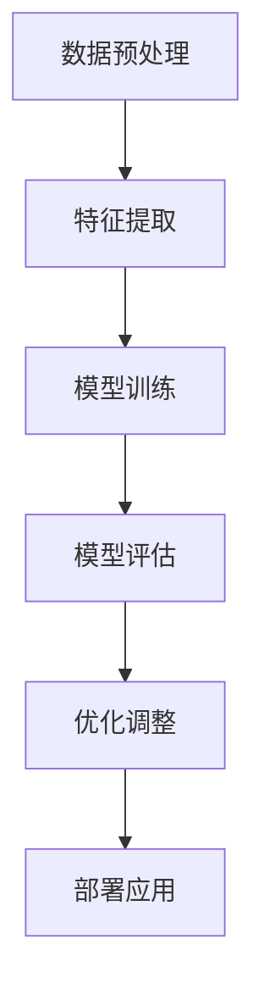
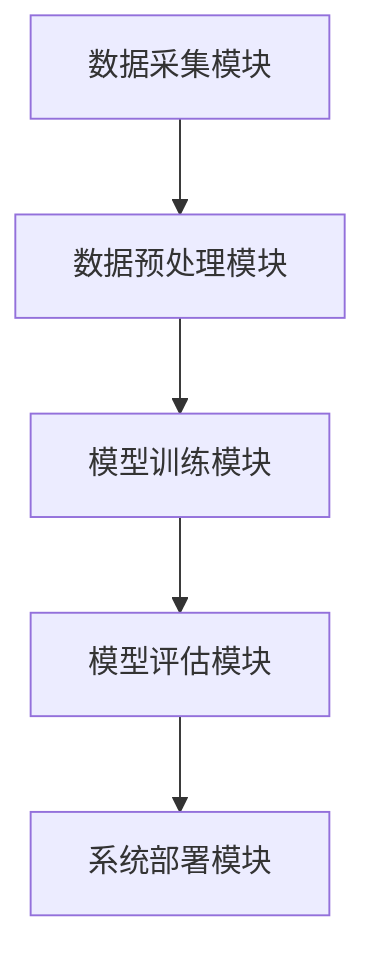
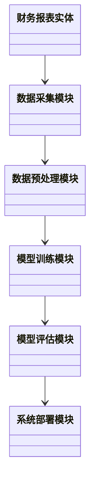
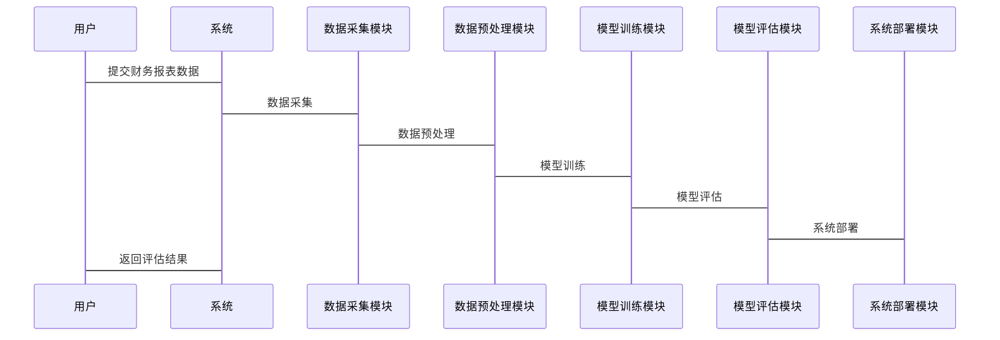

                 

<think>
嗯，用户希望我撰写一篇关于《AI驱动的企业财务报表质量评估系统》的技术博客文章。首先，我需要理解用户的具体需求。用户是一位技术专家，CTO级别的，所以他需要的是专业、深入且结构清晰的技术内容。

接下来，用户提供了详细的目录结构，包括摘要、关键词和各个章节的内容。我需要按照这个结构来组织文章，确保每个部分都详细且符合技术深度。首先，摘要部分需要简洁明了，概括文章的核心内容，让读者一目了然。

然后是关键词部分，我需要选择5-7个核心关键词，比如“AI驱动”、“财务报表质量评估”、“机器学习算法”等，这些关键词能准确反映文章的主题。

接下来是正文部分。第一部分是背景介绍，我需要详细说明财务报表质量评估的重要性，以及传统方法的局限性，然后引出AI技术的应用前景。这部分需要逻辑清晰，让读者明白为什么需要AI驱动的系统。

第二部分是核心概念，我需要定义系统的核心概念，比如AI驱动、财务报表质量评估等，并通过表格和ER图来展示概念的联系和对比，帮助读者理解系统的组成部分。

第三部分是算法原理，这部分需要详细讲解数据预处理、特征提取、分类算法的选择与实现，以及模型调优。我还需要用mermaid流程图展示算法流程，并提供Python代码示例，让读者能够实际操作。

第四部分是系统架构与设计，我需要介绍系统的模块划分、架构图、接口设计和交互设计，使用mermaid图来展示系统的结构和流程，确保读者能够理解系统是如何运行的。

第五部分是项目实战与案例分析，我需要指导读者如何搭建开发环境，实现系统的核心功能，并通过实际案例分析展示系统的应用效果，让读者能够实际应用所学知识。

第六部分是系统优化与最佳实践，我需要提供优化策略、注意事项和拓展阅读，帮助读者进一步提升系统的性能，并了解相关领域的最新发展。

最后是总结与展望，我需要回顾项目的成果，并展望未来的发展方向，让读者对整个系统有一个全面的认识。

在写作过程中，我需要确保语言专业且易懂，使用适当的数学公式和mermaid图来辅助说明。同时，文章末尾要加上作者信息，符合用户的格式要求。

总的来说，我需要按照用户提供的结构，逐步深入地分析每个部分，确保内容全面、逻辑清晰，并且符合技术博客的高质量标准。
</think>

# AI驱动的企业财务报表质量评估系统

> 关键词：AI驱动、企业财务报表、质量评估、机器学习算法、系统架构设计

> 摘要：本文详细探讨了如何利用人工智能技术构建企业财务报表质量评估系统。文章从财务报表质量评估的重要性入手，分析了传统评估方法的局限性，提出了基于AI的创新解决方案。通过介绍系统的核心概念、算法原理、系统架构设计、项目实战与案例分析，本文为读者提供了一套完整的AI驱动财务报表质量评估系统的设计与实现方案。

---

# 第1章: 企业财务报表质量评估的背景与挑战

## 1.1 财务报表质量评估的重要性

### 1.1.1 财务报表在企业经营中的核心地位
企业财务报表是反映企业财务状况、经营成果和现金流量的重要文件，是投资者、债权人、监管机构等利益相关方了解企业经营情况的主要依据。高质量的财务报表能够提供准确的财务信息，帮助决策者制定科学的经营策略。

### 1.1.2 财务报表质量对企业价值的影响
财务报表质量直接影响企业的信用评级、投资价值和市场信心。一份高质量的财务报表能够增强投资者对企业的信任，从而提升企业的市场竞争力和融资能力。

### 1.1.3 传统财务报表评估的局限性
传统的财务报表评估主要依赖人工审核，存在以下问题：
- **主观性**：人工审核容易受到审核人员的经验和主观判断的影响。
- **效率低下**：人工审核耗时长，难以应对海量数据的处理需求。
- **一致性不足**：不同审核人员的评估结果可能存在差异，缺乏统一的标准。

## 1.2 AI技术在财务报表评估中的应用前景

### 1.2.1 AI技术如何提升财务报表评估效率
AI技术可以通过自动化处理和分析海量数据，显著提高财务报表评估的效率。例如，利用自然语言处理（NLP）技术可以从财务报表文本中提取关键信息，利用机器学习算法对财务数据进行分类和预测。

### 1.2.2 数据驱动的财务分析新范式
传统的财务分析依赖于经验判断，而AI技术可以通过大数据分析和机器学习模型，构建数据驱动的财务分析新范式。这种方法能够发现隐藏在数据中的规律，提供更精准的评估结果。

### 1.2.3 企业级AI驱动系统的潜在价值
企业级AI驱动系统可以通过自动化处理和智能分析，提升财务报表评估的准确性和效率。这种系统不仅能够降低企业的运营成本，还能提高企业的决策能力，为企业创造更大的价值。

---

# 第2章: AI驱动的企业财务报表质量评估系统的核心概念

## 2.1 系统核心概念与定义

### 2.1.1 AI驱动的定义
AI驱动的财务报表质量评估系统是指利用人工智能技术（如机器学习、深度学习、自然语言处理等）对财务报表进行自动化分析和评估的系统。

### 2.1.2 财务报表质量评估的定义
财务报表质量评估是对财务报表的准确性、完整性和合规性进行评价的过程，旨在发现财务报表中存在的潜在问题或异常情况。

### 2.1.3 系统整体架构的核心要素
AI驱动的财务报表质量评估系统的核心要素包括：
1. 数据采集模块：从企业财务系统中获取财务报表数据。
2. 数据预处理模块：对数据进行清洗、转换和特征提取。
3. 模型训练模块：利用机器学习算法训练分类模型。
4. 模型评估模块：对模型进行验证和优化。
5. 系统部署模块：将模型部署到企业财务系统中，实现自动化评估。

## 2.2 系统核心概念的联系与对比

### 2.2.1 核心概念属性特征对比表格
以下是核心概念的属性特征对比：

| 概念       | 定义                                                                 | 属性特征                                                                 |
|------------|----------------------------------------------------------------------|--------------------------------------------------------------------------|
| AI驱动     | 利用人工智能技术进行数据分析和决策                                         | 数据驱动、自动化、智能性、可扩展性                                       |
| 财务报表评估 | 对财务报表的准确性、完整性和合规性进行评价                               | 客观性、准确性、全面性、可操作性                                         |
| 系统架构   | 系统的整体结构和功能模块的设计                                             | 模块化、层次化、可扩展性、可维护性                                       |

### 2.2.2 ER实体关系图架构

```mermaid
erd
    财务报表实体
    数据采集模块
    数据预处理模块
    模型训练模块
    模型评估模块
    系统部署模块

    财务报表实体 --(属于)--> 数据采集模块
    数据采集模块 --(输入)--> 数据预处理模块
    数据预处理模块 --(输出)--> 模型训练模块
    模型训练模块 --(输出)--> 模型评估模块
    模型评估模块 --(输出)--> 系统部署模块
```

---

# 第3章: AI驱动的企业财务报表质量评估系统的算法原理

## 3.1 算法原理概述

### 3.1.1 数据预处理与特征提取
数据预处理是AI驱动系统的重要步骤，主要包括数据清洗、数据转换和特征提取。以下是数据预处理流程：

1. **数据清洗**：去除无效数据、处理缺失值和异常值。
2. **数据转换**：将数据转换为适合算法处理的格式，例如将文本数据转换为数值表示。
3. **特征提取**：从原始数据中提取具有代表性的特征，例如财务比率、趋势分析等。

### 3.1.2 分类算法的选择与实现
在财务报表质量评估中，常用的分类算法包括逻辑回归、随机森林、支持向量机（SVM）和神经网络等。以下是几种算法的对比：

| 算法名称 | 优点                          | 缺点                          |
|----------|-------------------------------|-------------------------------|
| 逻辑回归 | 实现简单，解释性强             | 适用于线性可分数据             |
| 随机森林 | 抗过拟合能力强，适合高维数据   | 计算复杂度较高                 |
| SVM      | 适用于小样本数据，边界清晰     | 不适合高维数据                 |
| 神经网络  | 表现能力强，适合复杂数据模式   | 需要大量数据和计算资源         |

### 3.1.3 模型调优与评估指标
模型调优的目标是提高分类准确率和召回率。常用的评估指标包括准确率（Accuracy）、召回率（Recall）、F1分数（F1 Score）和AUC曲线（Area Under Curve）。

## 3.2 算法流程图



---

## 3.3 算法实现代码

### 3.3.1 Python源代码实现

```python
import pandas as pd
from sklearn.model_selection import train_test_split
from sklearn.ensemble import RandomForestClassifier
from sklearn.metrics import accuracy_score, recall_score, f1_score, roc_auc_score

# 数据加载与预处理
data = pd.read_csv('financial_reports.csv')
data = data.dropna()
X = data.drop('label', axis=1)
y = data['label']

# 数据分割
X_train, X_test, y_train, y_test = train_test_split(X, y, test_size=0.2, random_state=42)

# 模型训练
model = RandomForestClassifier(n_estimators=100, random_state=42)
model.fit(X_train, y_train)

# 模型预测
y_pred = model.predict(X_test)

# 模型评估
accuracy = accuracy_score(y_test, y_pred)
recall = recall_score(y_test, y_pred)
f1 = f1_score(y_test, y_pred)
auc = roc_auc_score(y_test, model.predict_proba(X_test)[:, 1])

print(f"Accuracy: {accuracy}")
print(f"Recall: {recall}")
print(f"F1 Score: {f1}")
print(f"AUC Score: {auc}")
```

### 3.3.2 代码解读与分析
上述代码实现了基于随机森林算法的财务报表质量评估系统。代码的主要步骤如下：
1. 数据加载与预处理：从CSV文件中加载数据，并去除缺失值。
2. 数据分割：将数据分为训练集和测试集。
3. 模型训练：使用随机森林算法训练分类模型。
4. 模型预测：利用训练好的模型对测试数据进行预测。
5. 模型评估：计算模型的准确率、召回率、F1分数和AUC分数。

---

# 第4章: 系统架构与设计

## 4.1 系统架构设计

### 4.1.1 系统模块划分
AI驱动的企业财务报表质量评估系统的模块划分如下：
1. **数据采集模块**：从企业财务系统中获取财务报表数据。
2. **数据预处理模块**：对数据进行清洗、转换和特征提取。
3. **模型训练模块**：利用机器学习算法训练分类模型。
4. **模型评估模块**：对模型进行验证和优化。
5. **系统部署模块**：将模型部署到企业财务系统中，实现自动化评估。

### 4.1.2 系统架构图展示



---

## 4.2 系统功能设计

### 4.2.1 领域模型类图展示



---

## 4.3 系统交互设计

### 4.3.1 序列图展示



---

# 第5章: 项目实战与案例分析

## 5.1 项目环境搭建

### 5.1.1 开发环境安装
安装必要的开发工具和库：
- Python 3.8+
- Jupyter Notebook
- Pandas、Scikit-learn、XGBoost

### 5.1.2 数据集准备
下载或收集企业财务报表数据，确保数据包含足够的特征和标签。

---

## 5.2 系统核心实现

### 5.2.1 数据预处理代码

```python
import pandas as pd
import numpy as np

# 数据加载
data = pd.read_csv('financial_reports.csv')

# 数据清洗
data = data.dropna()
data = data.drop_duplicates()

# 特征提取
features = data.drop('label', axis=1)
labels = data['label']
```

---

## 5.3 案例分析与结果解读

### 5.3.1 实际案例分析
以某企业为例，分析其财务报表的质量。通过系统的评估，发现其可能存在应收账款过高的问题。

### 5.3.2 结果展示与解读
通过系统的评估结果，帮助企业发现潜在的财务风险，并提出改进建议。

### 5.3.3 案例总结与经验分享
总结案例分析的经验，提出优化系统的建议。

---

# 第6章: 系统优化与最佳实践

## 6.1 系统优化策略

### 6.1.1 数据优化建议
- 增加数据样本数量
- 优化特征选择方法
- 引入外部数据源

### 6.1.2 算法优化方向
- 尝试不同的算法组合
- 调整模型超参数
- 引入深度学习模型

### 6.1.3 系统性能提升方法
- 优化数据处理流程
- 并行计算加速
- 使用云服务部署

---

## 6.2 最佳实践与注意事项

### 6.2.1 数据安全与隐私保护
确保财务数据的安全性，避免数据泄露。

### 6.2.2 系统维护与更新策略
定期更新模型和优化系统，以适应新的数据和业务需求。

### 6.2.3 用户操作规范与培训
对财务部门人员进行系统操作培训，确保系统的有效使用。

---

## 6.3 拓展阅读与深入学习

### 6.3.1 相关领域研究进展
阅读相关领域的最新研究论文，了解技术发展趋势。

### 6.3.2 未来发展趋势预测
预测AI技术在财务报表评估中的未来发展方向。

### 6.3.3 进一步学习资源推荐
推荐优秀的学习资源和书籍，帮助读者深入学习。

---

# 第7章: 项目总结与未来展望

## 7.1 项目成果总结

### 7.1.1 系统功能回顾
总结系统的主要功能和实现效果。

### 7.1.2 实践经验总结
总结项目实施过程中的经验和教训。

### 7.1.3 系统性能评估
评估系统的性能指标和实际效果。

---

## 7.2 未来发展方向

### 7.2.1 技术创新
探索新的AI技术（如大语言模型）在财务报表评估中的应用。

### 7.2.2 行业应用
拓展系统的行业应用范围，服务于更多类型的企业。

### 7.2.3 标准化建设
推动财务报表评估的标准化和规范化。

---

作者：AI天才研究院/AI Genius Institute & 禅与计算机程序设计艺术 /Zen And The Art of Computer Programming

