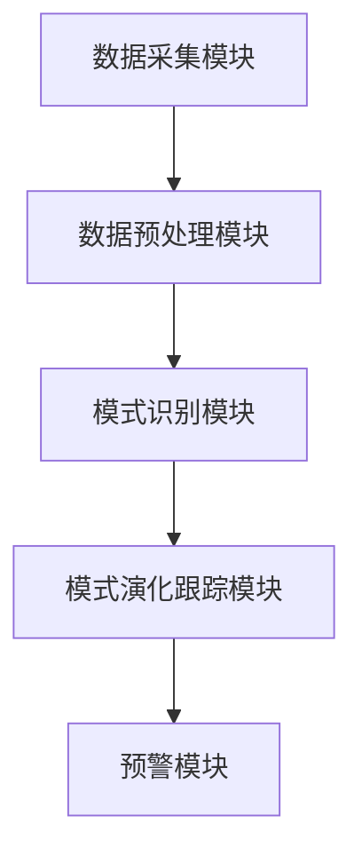

                 

<think>
好的，我需要帮助用户撰写一篇关于《AI驱动的企业财务舞弊模式演化跟踪系统》的技术博客文章。用户已经提供了一个详细的目录大纲，现在我需要根据这个大纲逐步完成文章的撰写。首先，我需要明确文章的结构和每个部分的内容，然后逐步展开每个部分。

首先，文章的标题是《AI驱动的企业财务舞弊模式演化跟踪系统》，关键词包括：AI、财务舞弊、模式演化、跟踪系统、企业风控、深度学习。摘要部分需要简明扼要地概括文章的核心内容，说明AI在财务舞弊检测中的应用，以及系统的设计和实现。

接下来是目录大纲，分为六个部分，每个部分包含多个章节和小节。我的任务是按照这个大纲逐步完成文章的撰写。

在开始撰写正文之前，我需要确保每个章节的内容详细、逻辑清晰，并且符合用户的要求。用户特别强调要使用专业的技术语言，同时保持易懂，并且每个部分需要包含丰富的细节，如数学模型、算法流程图、系统架构图等。

首先，我会从摘要开始，然后是关键词，接下来是目录大纲。用户已经提供了目录，我需要按照这个结构来撰写。

现在，我需要开始撰写每个章节的内容，确保每个部分都涵盖必要的信息，并且使用适当的格式，如数学公式使用LaTeX，图表使用Mermaid等。

在撰写过程中，我需要确保内容准确，逻辑严密，同时语言流畅，符合技术博客的风格。遇到复杂的概念时，我会通过例子和图表来帮助读者理解。

最后，完成所有章节后，我会检查整个文章，确保没有遗漏任何关键点，并且格式符合要求。

现在，我将按照这个思路开始撰写正文。
</think>

# AI驱动的企业财务舞弊模式演化跟踪系统

> 关键词：AI、财务舞弊、模式演化、跟踪系统、企业风控、深度学习

> 摘要：随着企业财务舞弊手段的不断进化，传统的财务舞弊检测方法已难以应对复杂的舞弊模式。本文提出了一种基于人工智能的财务舞弊模式演化跟踪系统，利用深度学习技术实时跟踪和预测舞弊模式的演化，为企业提供智能化的财务风险管理解决方案。

---

## 第一部分: AI与企业财务舞弊模式概述

### 第1章: AI与企业财务舞弊模式概述

#### 1.1 企业财务舞弊的背景与挑战

##### 1.1.1 企业财务舞弊的定义与类型
企业财务舞弊是指企业通过虚构、隐瞒、篡改财务数据等手段，欺骗利益相关者的行为。常见的舞弊类型包括虚增收入、虚减支出、资产虚增、负债虚减等。这些舞弊行为通常隐蔽性强，且手段多样，传统审计方法难以及时发现。

##### 1.1.2 财务舞弊对企业的影响
财务舞弊不仅会导致企业资产流失、声誉受损，还可能引发法律风险和信任危机。例如，安然、世通等企业的财务舞弊事件对企业自身和相关利益方造成了巨大损失，甚至引发金融危机。

##### 1.1.3 传统财务舞弊检测的局限性
传统财务舞弊检测主要依赖人工审计和简单的财务指标分析，存在以下问题：
- 舞弊手段隐蔽，传统方法难以发现；
- 审计成本高，效率低；
- 舞弊行为具有动态演化特性，传统方法难以适应变化。

#### 1.2 AI技术在财务舞弊检测中的应用

##### 1.2.1 AI技术的基本概念与优势
人工智能（AI）通过模拟人类学习和推理能力，能够处理海量数据并发现隐藏的模式。在财务舞弊检测中，AI的优势体现在以下方面：
- 高效性：AI可以快速处理大量财务数据；
- 智能性：AI能够识别复杂模式和异常行为；
- 实时性：AI可以实时监控财务数据，及时发现舞弊迹象。

##### 1.2.2 AI在财务数据处理中的独特价值
AI技术在财务舞弊检测中的独特价值主要体现在以下几个方面：
- **数据挖掘能力**：AI能够从海量财务数据中提取潜在的模式和关联性；
- **实时监控**：AI可以实时分析财务数据，及时发现异常；
- **动态适应性**：AI模型可以不断学习新的数据，适应舞弊模式的动态变化。

##### 1.2.3 财务舞弊模式的动态演化特征
财务舞弊模式并非一成不变，舞弊者会根据外部监管和内部审计的变化调整舞弊手法。例如，从简单的虚增收入到复杂的关联交易舞弊，舞弊模式的动态演化使得传统的静态检测方法难以应对。

#### 1.3 企业财务舞弊模式演化跟踪系统的必要性

##### 1.3.1 财务舞弊模式的动态变化
舞弊者会不断调整舞弊手法以逃避检测，例如从虚增收入到利用关联交易转移资金，从虚构交易到利用复杂的金融工具掩盖舞弊行为。

##### 1.3.2 系统化跟踪的必要性
为了应对舞弊模式的动态变化，企业需要建立系统化的跟踪机制，实时监控财务数据，识别潜在的舞弊模式。

##### 1.3.3 企业财务风险管理的新范式
传统的财务风险管理依赖于事后审计和静态分析，而新的范式则是基于实时数据监控和动态风险评估，AI技术为企业提供了实现这一目标的工具。

---

## 第二部分: AI驱动的财务舞弊模式演化跟踪系统核心概念

### 第2章: AI驱动的财务舞弊模式演化跟踪系统核心概念

#### 2.1 财务舞弊模式的动态演化特征

##### 2.1.1 财务舞弊模式的分类与演化路径
财务舞弊模式可以根据舞弊手段和目标的不同进行分类，例如：
- **收入舞弊**：虚增收入、隐瞒收入等；
- **支出舞弊**：虚减支出、隐瞒支出等；
- **资产舞弊**：虚增资产、隐瞒资产损失等；
- **负债舞弊**：虚减负债、隐瞒负债等。

舞弊模式的演化路径包括：
1. **简单模式**：例如虚增收入；
2. **复杂模式**：例如利用关联交易转移资金；
3. **隐蔽模式**：例如通过复杂的金融工具掩盖舞弊行为。

##### 2.1.2 不同企业规模的舞弊模式差异
小型企业通常采用简单的舞弊手段，例如虚增收入；而大型企业则可能利用复杂的关联交易和金融工具进行舞弊。

##### 2.1.3 行业特性对舞弊模式的影响
不同行业的舞弊模式有所不同，例如制造业可能更多涉及存货舞弊，而金融行业可能更多涉及关联交易舞弊。

#### 2.2 AI驱动的模式演化跟踪系统架构

##### 2.2.1 系统的核心功能模块
- **数据采集模块**：实时采集企业的财务数据；
- **数据预处理模块**：对数据进行清洗和特征提取；
- **模式识别模块**：利用深度学习模型识别舞弊模式；
- **模式演化跟踪模块**：实时跟踪舞弊模式的动态变化；
- **预警模块**：根据识别结果发出预警信号。

##### 2.2.2 各功能模块之间的关系
数据采集模块提供原始数据，数据预处理模块将其转化为可分析的特征数据，模式识别模块利用特征数据识别当前的舞弊模式，模式演化跟踪模块根据识别结果预测未来的演化趋势，预警模块根据预测结果发出预警信号。

##### 2.2.3 系统的整体架构图（Mermaid图）



#### 2.3 系统的关键技术与实现原理

##### 2.3.1 基于深度学习的模式识别
深度学习模型（如LSTM）能够捕捉时间序列数据中的复杂模式，适用于识别舞弊模式的动态变化。

##### 2.3.2 时间序列分析在模式演化中的应用
时间序列分析可以识别财务数据中的趋势和周期性变化，帮助预测舞弊模式的演化趋势。

##### 2.3.3 自然语言处理在财务文本分析中的作用
自然语言处理技术可以分析财务报告和相关文本，识别潜在的舞弊线索。

---

## 第三部分: 系统的算法原理与实现

### 第3章: 算法原理与实现

#### 3.1 算法原理概述

##### 3.1.1 基于LSTM的模式演化预测
LSTM（长短期记忆网络）是一种适用于时间序列数据的深度学习模型，能够捕捉数据中的长期依赖关系，适用于预测舞弊模式的演化趋势。

##### 3.1.2 时间序列分析的数学模型
时间序列分析模型（如ARIMA）可以用于预测财务数据的变化趋势，帮助识别异常波动。

##### 3.1.3 聚类算法在模式分类中的应用
聚类算法可以将相似的舞弊模式归类，帮助识别新的舞弊手法。

#### 3.2 算法实现步骤

##### 3.2.1 数据预处理与特征提取
- 数据清洗：去除噪声数据；
- 特征提取：提取与舞弊相关的特征，例如收入增长率、毛利率等。

##### 3.2.2 模型训练与优化
- 选择合适的深度学习模型（如LSTM）；
- 调参优化，提高模型的预测精度。

##### 3.2.3 模型预测与结果分析
- 利用训练好的模型预测未来的舞弊模式；
- 分析预测结果，识别潜在的舞弊风险。

#### 3.3 算法的数学模型与公式

##### 3.3.1 LSTM的数学模型
LSTM的核心在于其记忆单元（Cell）和门控机制（Gate），公式如下：

$$
f_t = \sigma(W_f \cdot [h_{t-1}, x_t] + b_f)
$$

$$
i_t = \sigma(W_i \cdot [h_{t-1}, x_t] + b_i)
$$

$$
o_t = \sigma(W_o \cdot [h_{t-1}, x_t] + b_o)
$$

$$
c_t = f_t \cdot c_{t-1} + i_t \cdot tanh(W_c \cdot [h_{t-1}, x_t] + b_c)
$$

$$
h_t = o_t \cdot tanh(c_t)
$$

其中，$f_t$、$i_t$、$o_t$分别为遗忘门、输入门和输出门，$c_t$为记忆单元，$h_t$为隐藏层输出。

##### 3.3.2 时间序列预测的公式
ARIMA模型的数学公式如下：

$$
\phi(\theta) = \frac{1}{\phi(\theta)} \sum_{k=1}^{p} \theta_k \phi(\theta - k)
$$

其中，$\theta$为模型参数，$p$为自回归阶数。

---

## 第四部分: 系统设计与架构实现

### 第4章: 系统设计与架构实现

#### 4.1 系统设计概述

##### 4.1.1 系统的需求分析
- 实时监控企业财务数据；
- 自动识别潜在的舞弊模式；
- 预警舞弊风险。

##### 4.1.2 系统的功能设计
- 数据采集模块：实时采集财务数据；
- 数据预处理模块：清洗和特征提取；
- 模式识别模块：利用深度学习模型识别舞弊模式；
- 模式演化跟踪模块：预测未来演化趋势；
- 预警模块：发出舞弊预警信号。

##### 4.1.3 系统的性能指标
- 处理速度：实时处理财务数据；
- 准确率：识别舞弊模式的准确率；
- 可扩展性：支持不同规模和行业的企业。

#### 4.2 系统架构设计

##### 4.2.1 系统架构图（Mermaid图）


##### 4.2.2 系统的实现步骤
1. 数据采集：通过API接口实时获取企业的财务数据；
2. 数据预处理：清洗数据并提取特征；
3. 模型训练：利用LSTM模型训练模式识别模型；
4. 模式演化跟踪：利用训练好的模型预测未来演化趋势；
5. 预警模块：根据预测结果发出预警信号。

---

## 第五章: 项目实战与优化

### 5.1 项目实战

#### 5.1.1 环境安装
- 安装Python环境；
- 安装必要的库（如TensorFlow、Keras、Pandas等）。

#### 5.1.2 核心代码实现

##### 5.1.2.1 数据预处理
```python
import pandas as pd
import numpy as np

# 数据加载
data = pd.read_csv('financial_data.csv')

# 数据清洗
data.dropna(inplace=True)
data = data[~data['收入'].isnull()]

# 特征提取
features = data[['收入', '支出', '利润']]
```

##### 5.1.2.2 模型训练
```python
from tensorflow.keras.models import Sequential
from tensorflow.keras.layers import LSTM, Dense

model = Sequential()
model.add(LSTM(64, input_shape=(timesteps, features)))
model.add(Dense(1))
model.compile(loss='mean_squared_error', optimizer='adam')
model.fit(X_train, y_train, epochs=100, batch_size=32)
```

##### 5.1.2.3 模型预测
```python
# 预测未来舞弊模式
X_test = ...  # 测试数据
y_pred = model.predict(X_test)
```

#### 5.1.3 实际案例分析
以某制造企业为例，利用系统预测其未来可能的舞弊模式，并根据预测结果制定相应的风险管理策略。

#### 5.1.4 项目总结
本项目通过实时监控和深度学习技术，成功实现了企业财务舞弊模式的演化跟踪，为企业风险管理提供了智能化的解决方案。

---

## 第六章: 总结与展望

### 6.1 总结
本文提出了基于AI的企业财务舞弊模式演化跟踪系统，利用深度学习技术实时监控财务数据，识别潜在的舞弊模式，并预测其演化趋势，为企业提供了智能化的财务风险管理工具。

### 6.2 展望
未来，随着AI技术的不断发展，财务舞弊模式的检测和跟踪将更加智能化和精准化。可以进一步研究如何结合区块链技术，确保财务数据的安全性和不可篡改性。

---

## 作者

作者：AI天才研究院/AI Genius Institute & 禅与计算机程序设计艺术 /Zen And The Art of Computer Programming

