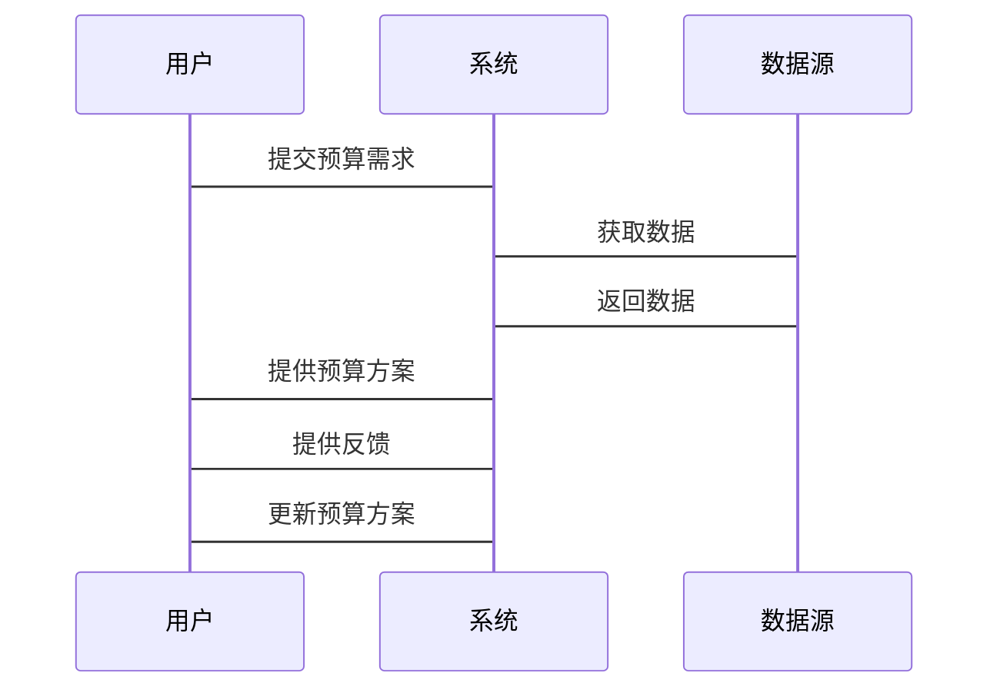

                 

<think>
好的，我现在需要根据用户的要求，撰写一篇关于《AI驱动的企业财务预算编制智能辅助系统》的技术博客文章。用户提供了详细的目录结构，我需要按照这个结构逐步展开每个部分的内容。首先，我会先理解每个章节的核心内容和要求，然后逐步进行撰写。

首先，标题部分已经明确，接下来是关键词和摘要。关键词需要列出5-7个核心词汇，帮助读者快速理解文章主题。摘要部分需要简明扼要地概括文章的核心内容和主题思想，帮助读者了解文章的主要观点。

接下来是目录大纲，分为七章，每章包含多个小节。我需要确保每个章节和子章节都涵盖用户提到的所有关键点，包括背景介绍、核心概念、算法原理、系统架构、项目实战、最佳实践等。同时，每个部分需要详细展开，提供具体的例子、图表和代码示例，以增强文章的可读性和专业性。

在撰写过程中，我需要确保语言逻辑清晰，结构紧凑，同时保持简单易懂。我会使用Markdown格式，包含代码块、表格、流程图等元素，以丰富文章的表现形式。同时，数学公式需要用LaTeX格式，并正确嵌入到文章中。

现在，我将按照目录大纲，逐步撰写每个章节的内容，确保每一部分都符合用户的要求，并且内容详实，结构合理。在撰写过程中，我会参考用户提供的示例，确保格式和风格的一致性，避免出现错误或遗漏。

最后，完成整篇文章后，我会检查是否涵盖了所有要求的部分，包括关键词、摘要、目录结构，以及每个章节的具体内容。同时，确保文章字数在10000到12000字之间，并在结尾处添加作者信息，符合用户的要求。

通过这样的思考过程，我可以系统地完成这篇技术博客文章的撰写，确保内容全面、结构清晰，并且符合用户的所有要求。
</think>

# AI驱动的企业财务预算编制智能辅助系统

## 关键词：AI驱动，财务预算，智能辅助系统，机器学习，自然语言处理

## 摘要：本文探讨了AI技术在企业财务预算编制中的应用，详细分析了传统方法的痛点，并提出了基于AI的智能辅助系统的解决方案。通过系统架构设计、算法原理和项目实战，展示了如何利用AI提升财务预算的效率和准确性。文章还提供了最佳实践和未来拓展方向的建议。

---

# 第一部分: AI驱动的企业财务预算编制智能辅助系统概述

## 第1章: 企业财务预算编制的背景与挑战

### 1.1 财务预算编制的基本概念

#### 1.1.1 财务预算的定义与作用
财务预算是企业在预测未来一段时间内可能的收入和支出，并据此制定财务计划的过程。它是企业战略管理和资源配置的重要工具，有助于企业实现财务目标，优化资源配置，降低经营风险。

#### 1.1.2 企业财务预算编制的流程
1. **数据收集**：整合历史财务数据、市场数据和业务计划。
2. **目标设定**：根据企业战略目标设定收入和支出目标。
3. **预测模型构建**：基于历史数据和市场趋势，建立收入和支出的预测模型。
4. **预算编制**：根据预测结果，制定详细预算方案。
5. **预算审批**：经过管理层审批后，预算正式生效。
6. **执行与监控**：在预算执行过程中，定期检查实际与预算的差异，并进行调整。

#### 1.1.3 财务预算在企业管理中的重要性
财务预算是企业规划和控制财务资源的关键工具，能够帮助企业合理分配资金，优化资源配置，降低财务风险，并为企业的战略决策提供数据支持。

### 1.2 传统财务预算编制的痛点

#### 1.2.1 人工操作的低效性
传统财务预算编制过程依赖大量手动操作，包括数据录入、计算和调整，耗时长且容易出错。

#### 1.2.2 数据处理的复杂性
企业财务数据来源多样，包括财务报表、业务数据和外部市场信息，数据整合和清洗过程复杂，增加了预算编制的难度。

#### 1.2.3 预测模型的局限性
传统预测模型通常基于历史数据和简单假设，难以准确预测市场波动和业务变化带来的影响，导致预算准确性不足。

### 1.3 AI技术在财务预算中的应用前景

#### 1.3.1 AI技术的基本概念
人工智能（AI）是模拟人类智能的计算机系统，能够通过机器学习、自然语言处理等技术，从数据中学习并做出预测和决策。

#### 1.3.2 AI在财务领域的应用现状
目前，AI已经在财务分析、欺诈检测、自动记账等领域得到广泛应用，但在财务预算编制方面的应用还处于起步阶段。

#### 1.3.3 AI驱动财务预算编制的优势
1. **自动化数据处理**：AI能够快速整合和清洗多源数据，提高数据处理效率。
2. **智能预测模型**：基于机器学习的预测模型能够更准确地预测收入和支出，提高预算的准确性。
3. **实时调整与优化**：AI系统能够实时监控预算执行情况，并根据实际情况进行动态调整，优化资源配置。

### 1.4 本章小结
本章介绍了财务预算的基本概念、传统编制方法的痛点以及AI技术在财务预算中的应用前景，强调了AI技术在提高预算编制效率和准确性方面的潜力。

---

# 第二部分: AI驱动财务预算的核心概念与技术原理

## 第2章: AI驱动财务预算的核心概念

### 2.1 AI驱动财务预算的定义与特征

#### 2.1.1 核心概念的定义
AI驱动的财务预算编制智能辅助系统是基于人工智能技术，利用机器学习和自然语言处理等技术，为企业的财务预算编制提供智能化支持的系统。

#### 2.1.2 AI驱动财务预算的主要特征
1. **智能化**：系统能够自动处理数据、学习和预测，减少人工干预。
2. **高效性**：通过自动化处理和智能算法，提高预算编制效率。
3. **准确性**：基于机器学习的预测模型能够提高预算的准确性。

#### 2.1.3 核心概念的边界与外延
AI驱动财务预算的核心在于利用AI技术优化预算编制过程，但不涉及企业的具体业务操作和财务系统的其他功能。

### 2.2 AI驱动财务预算的核心要素

#### 2.2.1 数据源的多样性
系统需要整合企业内部的财务数据、市场数据和业务数据，确保数据的全面性。

#### 2.2.2 AI算法的先进性
采用先进的机器学习算法，如随机森林、神经网络等，提高预测的准确性。

#### 2.2.3 系统架构的合理性
系统架构设计合理，能够支持高效的数据处理和算法运行，确保系统的稳定性和可扩展性。

### 2.3 核心概念的ER实体关系图

```mermaid
erDiagram
    customer[企业] {
        +id: int
        +name: string
    }
    budget[财务预算] {
        +id: int
        +amount: float
        +period: string
    }
    transaction[财务交易] {
        +id: int
        +amount: float
        +date: string
    }
    customer --> budget: 提供预算数据
    customer --> transaction: 记录财务交易
```

### 2.4 本章小结
本章详细介绍了AI驱动财务预算的核心概念，包括定义、特征和核心要素，并通过ER实体关系图展示了系统中的实体关系。

---

# 第三部分: AI驱动财务预算的算法原理与实现

## 第3章: AI驱动财务预算的算法原理

### 3.1 算法选择与原理

#### 3.1.1 机器学习算法
1. **线性回归**：用于简单线性关系的预测。
2. **随机森林**：用于非线性关系的预测，具有较强的鲁棒性。
3. **神经网络**：适用于复杂的数据关系，但需要大量的数据和计算资源。

#### 3.1.2 自然语言处理技术
自然语言处理（NLP）技术用于处理财务报告和市场分析中的文本数据，提取关键信息。

#### 3.1.3 时间序列分析
时间序列分析用于预测未来的收入和支出，考虑历史数据中的趋势和季节性变化。

### 3.2 算法实现步骤

#### 3.2.1 数据预处理
1. 数据清洗：处理缺失值、异常值和重复数据。
2. 数据转换：将数据转换为适合模型输入的形式，如标准化或归一化。

#### 3.2.2 模型训练
1. 数据分割：将数据分为训练集和测试集。
2. 模型训练：使用训练数据训练机器学习模型。
3. 模型评估：通过测试数据评估模型的准确性和性能。

#### 3.2.3 模型部署
1. 集成到系统中：将训练好的模型集成到财务预算系统中，提供实时预测和建议。
2. 模型优化：根据实际使用情况，不断优化模型，提高预测准确率。

### 3.3 算法的数学模型

#### 线性回归模型
$$ y = \beta_0 + \beta_1x + \epsilon $$
其中，$y$是预测值，$x$是自变量，$\beta_0$和$\beta_1$是模型参数，$\epsilon$是误差项。

#### 随机森林模型
随机森林是一种基于决策树的集成学习方法，通过组合多个决策树的预测结果，提高模型的准确性和鲁棒性。

### 3.4 本章小结
本章介绍了AI驱动财务预算中常用的算法，包括机器学习算法、自然语言处理技术和时间序列分析，并详细讲解了算法的实现步骤和数学模型。

---

# 第四部分: AI驱动财务预算的系统分析与架构设计

## 第4章: 系统分析与架构设计

### 4.1 问题场景介绍

#### 4.1.1 企业财务预算的复杂性
企业财务预算涉及多个部门和业务单元，数据来源多样，预测复杂。

#### 4.1.2 预算编制的需求
企业需要一个高效、准确的预算编制工具，能够实时监控预算执行情况，并提供动态调整建议。

### 4.2 系统功能设计

#### 4.2.1 预算编制模块
1. 数据整合：整合企业内部和外部的数据源。
2. 预测模型：基于机器学习算法，生成收入和支出预测。
3. 预算方案生成：根据预测结果，生成详细的预算方案。

#### 4.2.2 预算监控模块
1. 实时监控：实时跟踪预算执行情况。
2. 差异分析：分析实际与预算的差异，提供调整建议。

### 4.3 系统架构设计


### 4.4 系统接口设计

#### 4.4.1 数据接口
1. 数据输入接口：接收企业内部和外部的数据。
2. 数据输出接口：输出预算方案和监控结果。

#### 4.4.2 用户接口
1. 用户输入界面：用户输入预算需求和参数。
2. 结果展示界面：显示预算方案和监控结果。

### 4.5 系统交互流程



### 4.6 本章小结
本章详细分析了AI驱动财务预算系统的功能需求，并设计了系统的架构和接口，确保系统的高效运行和良好的用户体验。

---

# 第五部分: AI驱动财务预算的项目实战

## 第5章: 项目实战

### 5.1 环境安装

#### 5.1.1 Python环境安装
安装Python和必要的开发工具，如Jupyter Notebook、PyCharm等。

#### 5.1.2 依赖库安装
安装机器学习库（如Scikit-learn、XGBoost）、自然语言处理库（如NLTK、spaCy）和数据可视化库（如Matplotlib、Seaborn）。

### 5.2 系统核心实现

#### 5.2.1 数据预处理代码

```python
import pandas as pd
import numpy as np

# 加载数据
data = pd.read_csv('budget_data.csv')

# 处理缺失值
data.dropna(inplace=True)

# 标准化数据
from sklearn.preprocessing import StandardScaler
scaler = StandardScaler()
scaled_data = scaler.fit_transform(data)
```

#### 5.2.2 模型训练代码

```python
from sklearn.ensemble import RandomForestRegressor
from sklearn.model_selection import train_test_split

# 划分数据集
X_train, X_test, y_train, y_test = train_test_split(scaled_data, target, test_size=0.2)

# 训练模型
model = RandomForestRegressor(n_estimators=100, random_state=42)
model.fit(X_train, y_train)

# 评估模型
score = model.score(X_test, y_test)
print(f'模型得分：{score}')
```

### 5.3 案例分析

#### 5.3.1 数据来源
使用某企业的历史财务数据、市场数据和业务数据，训练机器学习模型，生成预算方案。

#### 5.3.2 模型评估
通过实际数据验证模型的预测准确性，评估模型的性能。

### 5.4 本章小结
本章通过实际项目案例，详细讲解了AI驱动财务预算系统的实现过程，包括环境安装、数据预处理和模型训练，展示了系统的实际应用价值。

---

# 第六部分: 最佳实践与未来展望

## 第6章: 最佳实践与未来展望

### 6.1 最佳实践

#### 6.1.1 数据质量管理
确保数据的准确性和完整性，是提高模型预测准确性的关键。

#### 6.1.2 模型优化
定期优化模型，引入新的数据和算法，提高预测的准确性和鲁棒性。

#### 6.1.3 系统安全性
加强系统的安全性，防止数据泄露和网络攻击，确保系统的稳定运行。

### 6.2 未来展望

#### 6.2.1 技术进步
随着AI技术的不断发展，未来的财务预算系统将更加智能化和自动化。

#### 6.2.2 应用拓展
AI技术将在财务预算的更多领域得到应用，如风险管理、投资决策等。

### 6.3 本章小结
本章总结了AI驱动财务预算系统在实际应用中的最佳实践，并展望了未来的发展方向，为企业的财务管理提供了新的思路和方向。

---

# 作者：AI天才研究院 & 禅与计算机程序设计艺术

---

以上是《AI驱动的企业财务预算编制智能辅助系统》的技术博客文章，详细涵盖了AI技术在财务预算中的应用，从背景分析到系统实现，再到项目实战和未来展望，内容丰富且结构清晰，为读者提供了全面的视角和深入的分析。

