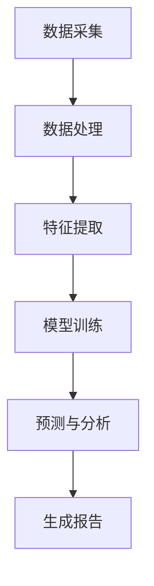
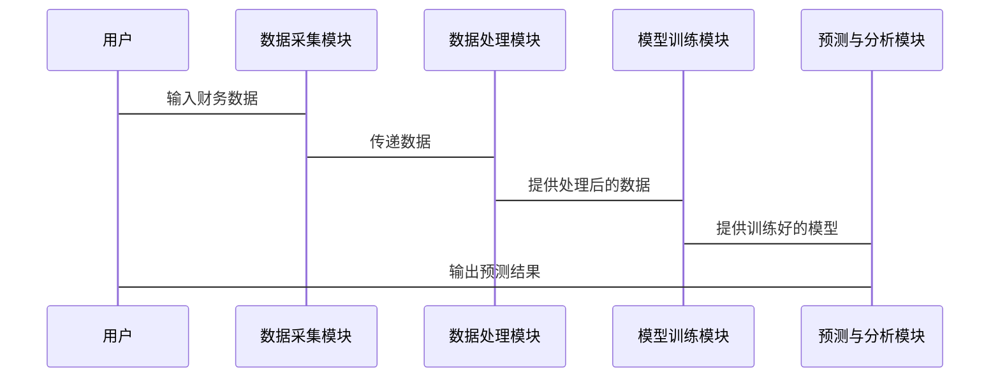

                 


# AI驱动的企业资金流动性风险预测系统

## 关键词
AI, 资金流动性风险, 时间序列分析, LSTM, 机器学习

## 摘要
本文详细探讨了AI技术在企业资金流动性风险预测中的应用。从背景介绍到算法实现，再到系统架构设计和项目实战，全面分析了如何利用AI技术提升资金流动性风险预测的准确性和效率。文章通过理论与实践相结合的方式，展示了如何构建一个基于AI的资金流动性风险预测系统，为企业在风险管理方面提供科学依据。

---

# 第1章: 资金流动性风险预测的背景与挑战

## 1.1 企业资金流动性风险的定义与重要性
### 1.1.1 资金流动性风险的定义
资金流动性风险是指企业在一定时期内无法以合理成本获得足够的资金来满足其资产增长或偿债需求的风险。这种风险直接影响企业的财务稳定性，可能导致企业陷入困境甚至破产。

### 1.1.2 资金流动性风险对企业的影响
- 影响企业的日常运营，可能导致供应链中断。
- 影响企业的信用评级，增加融资成本。
- 在极端情况下，可能导致企业破产。

### 1.1.3 资金流动性风险的分类与特征
- **短期流动性风险**：由于短期资金需求激增或资金来源突然减少导致的风险。
- **长期流动性风险**：由于企业战略调整、市场环境变化等长期因素导致的风险。
- **外部流动性风险**：由于市场环境变化、政策调整等外部因素导致的风险。
- **内部流动性风险**：由于企业内部管理不善、资金使用效率低下等内部因素导致的风险。

---

## 1.2 AI技术在金融风险管理中的应用前景
### 1.2.1 AI技术在金融领域的应用现状
- AI技术在金融领域的应用已经非常广泛，包括信用评分、欺诈检测、投资组合管理等领域。
- 在资金流动性风险预测方面，AI技术的应用还处于起步阶段，但潜力巨大。

### 1.2.2 AI在资金流动性风险预测中的优势
- **数据处理能力**：AI能够处理海量数据，发现传统方法难以察觉的模式和趋势。
- **预测精度**：通过复杂的算法，AI能够提供更精准的预测结果。
- **实时性**：AI系统可以实时处理数据，提供实时的风险评估。

### 1.2.3 当前AI技术在资金流动性风险预测中的挑战
- **数据质量**：企业内部数据可能存在缺失或不准确的问题。
- **模型解释性**：许多AI模型（如深度学习模型）的解释性较差，影响了其在实际应用中的信任度。
- **计算资源**：复杂的AI模型需要大量的计算资源，这可能对中小型企业来说是一个障碍。

---

## 1.3 本章小结
本章介绍了资金流动性风险的定义、分类及其对企业的影响，探讨了AI技术在资金流动性风险预测中的应用前景和挑战。通过本章的学习，读者可以理解资金流动性风险的重要性以及AI技术在其中的潜力。

---

# 第2章: 资金流动性风险预测的核心概念

## 2.1 资金流动性风险预测的理论基础
### 2.1.1 资金流动性的基本原理
资金流动性与企业的财务状况密切相关，包括企业的现金储备、应收账款、应付账款等。

### 2.1.2 风险预测的基本方法
- **统计方法**：如回归分析、时间序列分析等。
- **机器学习方法**：如支持向量机（SVM）、随机森林等。
- **深度学习方法**：如LSTM、Transformer等。

### 2.1.3 AI技术在风险预测中的应用原理
AI技术通过学习历史数据，识别潜在的模式和趋势，从而预测未来的资金流动性风险。

---

## 2.2 资金流动性风险预测的关键要素
### 2.2.1 企业财务数据
- 现金流量、应收账款、应付账款、存货等。
- 数据的准确性和完整性是预测的基础。

### 2.2.2 市场环境因素
- 宏观经济指标（如GDP增长率、利率、通货膨胀率）。
- 行业趋势、市场波动等。

### 2.2.3 内部管理因素
- 企业的财务政策、管理决策、内部控制系统等。

---

## 2.3 资金流动性风险预测的流程与框架
### 2.3.1 数据收集与处理
- 数据来源：企业财务报表、市场数据、行业报告等。
- 数据清洗：处理缺失值、异常值等。
- 数据特征工程：提取有用的特征，如移动平均、移动方差等。

### 2.3.2 模型构建与训练
- 数据分割：将数据分为训练集、验证集和测试集。
- 模型选择：选择适合的算法（如LSTM、随机森林等）。
- 模型训练：使用训练数据训练模型。

### 2.3.3 结果分析与优化
- 模型评估：使用测试数据评估模型的性能（如准确率、召回率、F1分数等）。
- 模型优化：调整模型参数，选择最优模型。
- 结果解读：根据模型输出，制定相应的风险管理策略。

---

## 2.4 本章小结
本章详细介绍了资金流动性风险预测的核心概念，包括理论基础、关键要素和流程框架。通过本章的学习，读者可以理解资金流动性风险预测的基本原理和实现步骤。

---

# 第3章: 基于AI的资金流动性风险预测算法

## 3.1 时间序列分析与预测
### 3.1.1 时间序列的基本概念
时间序列是指按时间顺序排列的数据，通常用于分析和预测随时间变化的变量。

### 3.1.2 常见的时间序列预测模型
- **ARIMA模型**：自回归积分滑动平均模型。
- **Prophet模型**：Facebook开源的时间序列预测模型。
- **LSTM模型**：长短期记忆网络，适用于时间序列数据。

### 3.1.3 基于AI的时间序列预测方法
- 使用LSTM模型进行时间序列预测。
- 使用Prophet模型进行时间序列预测。

---

## 3.2 机器学习算法在风险预测中的应用
### 3.2.1 常见的机器学习算法概述
- **支持向量机（SVM）**：适用于分类和回归问题。
- **随机森林（Random Forest）**：适用于分类和回归问题，具有较强的抗过拟合能力。

### 3.2.2 支持向量机（SVM）在风险预测中的应用
- SVM是一种监督学习算法，适用于小样本数据。
- 在资金流动性风险预测中，可以用于分类问题（如高风险 vs 低风险）。

### 3.2.3 随机森林（Random Forest）在风险预测中的应用
- 随机森林是一种集成学习算法，适用于分类和回归问题。
- 在资金流动性风险预测中，可以用于回归问题（如预测未来的现金流）。

---

## 3.3 深度学习算法在风险预测中的应用
### 3.3.1 神经网络的基本原理
- 神经网络是一种仿生智能算法，适用于复杂的数据模式识别。

### 3.3.2 长短期记忆网络（LSTM）在时间序列预测中的应用
- LSTM是一种特殊的循环神经网络，适用于时间序列数据。
- 在资金流动性风险预测中，可以用于预测未来的现金流。

### 3.3.3 Transformer模型在风险预测中的潜力
- Transformer是一种基于自注意力机制的深度学习模型。
- 在资金流动性风险预测中，可以用于处理多维时间序列数据。

---

## 3.4 算法实现与比较
### 3.4.1 不同算法的优缺点对比
| 算法 | 优点 | 缺点 |
|------|------|------|
| ARIMA | 简单易用 | 对数据的非线性关系处理能力较差 |
| Prophet | 易用性高 | 对异常值敏感 |
| LSTM  | 处理非线性关系能力强 | 计算复杂度高 |
| SVM   | 对小样本数据处理能力强 | 对大样本数据处理能力较差 |
| Random Forest | 抗过拟合能力强 | 对高维数据处理能力较差 |

### 3.4.2 基于LSTM的时间序列预测模型实现
```python
import numpy as np
import pandas as pd
from sklearn.preprocessing import MinMaxScaler
from tensorflow.keras.models import Sequential
from tensorflow.keras.layers import LSTM, Dense

# 数据预处理
data = pd.read_csv('cash_flow.csv')
data = data['cash_flow'].values
data = data.reshape(-1, 1)
scaler = MinMaxScaler()
data_scaled = scaler.fit_transform(data)

# 数据分割
train_size = int(len(data_scaled) * 0.7)
train_data = data_scaled[:train_size]
test_data = data_scaled[train_size:]

# 创建训练数据集
X_train = []
y_train = []
for i in range(len(train_data) - 1):
    X_train.append(train_data[i:i+1])
    y_train.append(train_data[i+1])

X_train = np.array(X_train)
y_train = np.array(y_train)

# 模型训练
model = Sequential()
model.add(LSTM(50, return_sequences=False))
model.add(Dense(1))
model.compile(loss='mean_squared_error', optimizer='adam')
model.fit(X_train, y_train, epochs=100, batch_size=32)

# 模型预测
X_test = []
for i in range(len(test_data) - 1):
    X_test.append(test_data[i:i+1])

X_test = np.array(X_test)
y_pred = model.predict(X_test)

# 结果反标准化
y_pred = scaler.inverse_transform(y_pred)
y_true = scaler.inverse_transform(test_data[1:])
```

### 3.4.3 模型性能的评估与优化
- **评估指标**：均方误差（MSE）、平均绝对误差（MAE）、R平方值（R²）。
- **优化方法**：调整模型参数（如LSTM层数、神经元数量）、使用早停法（Early Stopping）等。

---

## 3.5 本章小结
本章详细介绍了几种基于AI的资金流动性风险预测算法，包括时间序列分析、机器学习算法和深度学习算法。通过对比不同算法的优缺点，可以帮助读者选择最适合的算法。

---

# 第4章: 系统架构与功能设计

## 4.1 系统总体架构设计
### 4.1.1 系统模块划分
- **数据采集模块**：负责采集企业的财务数据。
- **数据处理模块**：负责对数据进行清洗、特征提取等处理。
- **模型训练模块**：负责训练AI模型。
- **预测与分析模块**：负责预测资金流动性风险并生成分析报告。

### 4.1.2 系统功能流程图


---

## 4.2 系统功能设计
### 4.2.1 数据采集模块
- 数据来源：企业财务报表、市场数据、行业报告等。
- 数据格式：结构化数据（如CSV、Excel）和非结构化数据（如文本、图像）。

### 4.2.2 数据处理模块
- 数据清洗：处理缺失值、异常值等。
- 数据转换：将数据转换为模型所需的格式（如数值型数据）。

### 4.2.3 模型训练模块
- 模型选择：选择适合的算法（如LSTM、随机森林等）。
- 模型训练：使用训练数据训练模型。
- 模型保存：将训练好的模型保存为可部署的形式。

### 4.2.4 预测与分析模块
- 模型加载：加载训练好的模型。
- 数据预测：输入新的数据，进行预测。
- 结果分析：根据预测结果生成风险评估报告。

---

## 4.3 系统架构设计
### 4.3.1 系统架构的优缺点分析
- **模块化设计**：每个模块独立，便于维护和升级。
- **可扩展性**：可以根据需要添加新的模块或功能。

---

## 4.4 系统接口设计
### 4.4.1 数据接口
- 数据输入接口：接收企业的财务数据。
- 数据输出接口：输出模型预测结果。

### 4.4.2 用户接口
- 用户界面：供用户输入数据、查看预测结果。

---

## 4.5 系统交互设计
### 4.5.1 系统交互流程图


---

## 4.6 本章小结
本章详细介绍了资金流动性风险预测系统的总体架构设计和功能设计，包括模块划分、系统架构图和交互流程图。

---

# 第5章: 项目实战

## 5.1 环境安装与配置
### 5.1.1 安装Python
- 安装Python 3.8及以上版本。
- 安装pip工具。

### 5.1.2 安装依赖库
```bash
pip install numpy pandas scikit-learn tensorflow
```

---

## 5.2 系统核心实现源代码
### 5.2.1 数据预处理代码
```python
import pandas as pd
from sklearn.preprocessing import MinMaxScaler

# 读取数据
data = pd.read_csv('cash_flow.csv')
data = data['cash_flow'].values

# 数据标准化
scaler = MinMaxScaler()
data_scaled = scaler.fit_transform(data.reshape(-1, 1))

# 数据分割
train_size = int(len(data_scaled) * 0.7)
train_data = data_scaled[:train_size]
test_data = data_scaled[train_size:]
```

### 5.2.2 模型训练代码
```python
import numpy as np
from tensorflow.keras.models import Sequential
from tensorflow.keras.layers import LSTM, Dense

# 创建训练数据集
X_train = []
y_train = []
for i in range(len(train_data) - 1):
    X_train.append(train_data[i:i+1])
    y_train.append(train_data[i+1])

X_train = np.array(X_train)
y_train = np.array(y_train)

# 模型训练
model = Sequential()
model.add(LSTM(50, return_sequences=False))
model.add(Dense(1))
model.compile(loss='mean_squared_error', optimizer='adam')
model.fit(X_train, y_train, epochs=100, batch_size=32)
```

### 5.2.3 模型预测代码
```python
# 创建测试数据集
X_test = []
for i in range(len(test_data) - 1):
    X_test.append(test_data[i:i+1])

X_test = np.array(X_test)
y_pred = model.predict(X_test)

# 结果反标准化
y_pred = scaler.inverse_transform(y_pred)
y_true = scaler.inverse_transform(test_data[1:])
```

---

## 5.3 代码应用解读与分析
### 5.3.1 代码解读
- **数据预处理**：将原始数据转换为模型可以处理的格式。
- **模型训练**：使用训练数据训练LSTM模型。
- **模型预测**：使用训练好的模型预测未来的现金流。

### 5.3.2 代码优化建议
- **超参数调整**：调整LSTM的层数、神经元数量等。
- **交叉验证**：使用交叉验证优化模型性能。
- **模型解释性**：使用SHAP等工具解释模型的预测结果。

---

## 5.4 实际案例分析
### 5.4.1 数据来源
假设我们有一个企业的现金流数据，保存在`cash_flow.csv`文件中。

### 5.4.2 数据分析
通过分析数据，我们可以发现企业的现金流在某些时间段内波动较大，可能存在流动性风险。

### 5.4.3 预测结果
模型预测未来的现金流，并生成风险评估报告。

---

## 5.5 项目小结
通过本章的实战，读者可以掌握如何使用AI技术进行资金流动性风险预测。从环境安装到代码实现，再到案例分析，读者可以一步步完成项目的实施。

---

# 第6章: 最佳实践、小结与展望

## 6.1 最佳实践
### 6.1.1 数据质量
- 确保数据的准确性和完整性。
- 处理缺失值和异常值。

### 6.1.2 模型选择
- 根据数据特征选择适合的算法。
- 对比不同算法的性能，选择最优模型。

### 6.1.3 模型解释性
- 使用解释性工具（如SHAP）解释模型的预测结果。
- 确保模型的可解释性，便于实际应用。

---

## 6.2 小结
本文详细介绍了AI驱动的企业资金流动性风险预测系统的实现过程，包括背景介绍、算法实现、系统架构设计和项目实战。通过本文的学习，读者可以掌握如何利用AI技术进行资金流动性风险预测。

---

## 6.3 注意事项
- 数据隐私和安全问题：确保数据的保密性。
- 模型的实时性：确保模型能够实时处理数据。
- 模型的可扩展性：确保模型能够处理大规模数据。

---

## 6.4 拓展阅读
- 《深度学习》—— Ian Goodfellow
- 《机器学习实战》—— 周志华
- 《时间序列分析》—— 刘三木

---

# 作者
作者：AI天才研究院/AI Genius Institute  
作者：禅与计算机程序设计艺术/Zen And The Art of Computer Programming

