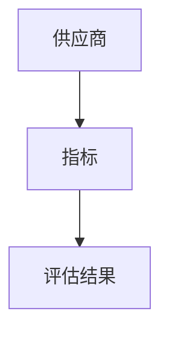
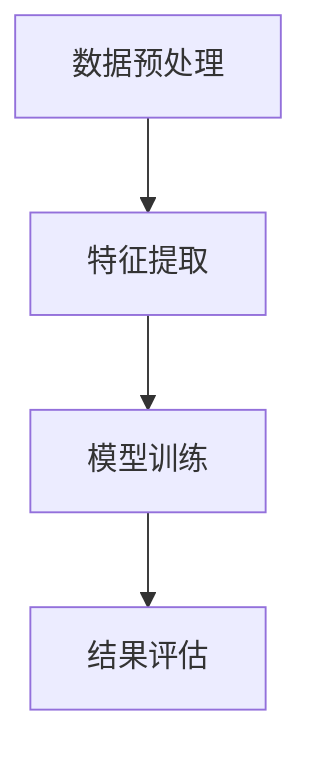
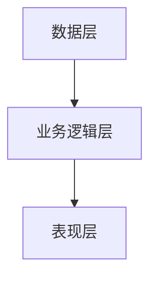
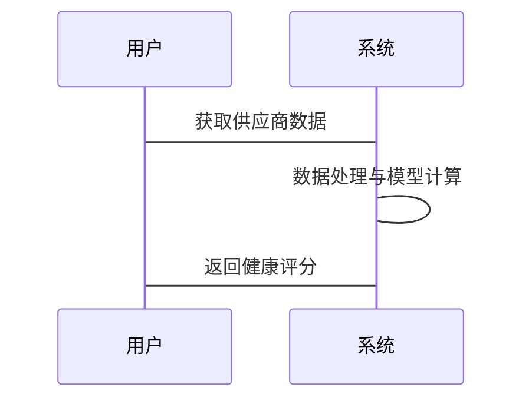

                 


# AI驱动的供应商健康度分析：评估上游风险

---

## 关键词：AI，供应商健康度，供应链管理，风险评估，机器学习

---

## 摘要：本文深入探讨了如何利用人工智能技术评估供应商的健康状况，以降低供应链中的上游风险。通过分析供应商的多维度数据，构建基于机器学习的健康度评分模型，帮助企业优化供应链管理，提升风险预警能力。

---

## 第一部分：AI驱动的供应商健康度分析背景与核心概念

### 第1章：供应商健康度分析的背景与问题描述

#### 1.1 供应链管理的重要性

供应链管理是现代企业运营的核心环节，涉及原材料采购、生产制造、物流配送等多个环节。供应商作为供应链的上游关键节点，其稳定性和可靠性直接影响企业的运营效率和成本控制。

#### 1.2 供应商健康度分析的定义与目标

供应商健康度分析是指通过对供应商的财务状况、交付能力、产品质量等多维度数据的综合评估，量化供应商的整体健康状况，从而帮助企业做出更明智的供应链决策。

#### 1.3 问题背景与挑战

- **供应链中断的典型案例**：近年来，全球供应链中断事件频发，如疫情导致的芯片短缺、地缘政治冲突引发的原材料供应问题等，给企业带来了巨大的经济损失。
- **供应商健康度评估的难点**：传统评估方法依赖人工经验，存在主观性强、数据分散、实时性差等问题。如何快速、准确地评估供应商的健康状况成为企业的迫切需求。
- **数据驱动决策的重要性**：通过AI技术分析海量数据，提取关键特征，构建预测模型，帮助企业实现数据驱动的决策。

#### 1.4 问题解决与边界

- **AI技术在供应链管理中的应用**：利用机器学习、自然语言处理等技术，从非结构化数据中提取有价值的信息，构建供应商健康度预测模型。
- **供应商健康度分析的边界与外延**：仅关注供应商的健康状况，不涉及企业内部的生产管理。核心要素包括财务数据、交付记录、客户评价等。

---

### 第2章：供应商健康度分析的核心概念

#### 2.1 供应商健康度分析的原理

- **数据驱动的分析方法**：基于供应商的历史交易数据、财务报表、行业信息等，构建多维度的评估指标体系。
- **多维度指标评估体系**：包括财务健康度、交付能力、质量稳定性、合作意愿等多个维度。
- **AI算法在评估中的应用**：使用机器学习模型对供应商的健康状况进行预测和评分。

#### 2.2 核心概念的对比分析

- **供应商健康度与其他评估指标的对比**：供应商健康度关注整体风险，而传统评估指标可能只关注单一维度（如价格或交货时间）。
- **不同评估方法的优劣势分析**：
  | 评估方法 | 优点 | 缺点 |
  |----------|------|------|
  | 传统人工评估 | 灵活性高 | 主观性强，效率低 |
  | 数据驱动评估 | 客观性高，覆盖面广 | 数据获取难度大，模型复杂 |

#### 2.3 实体关系图（ER图）架构

供应商、指标、评估结果之间的关系可以用以下Mermaid图表示：



---

## 第二部分：供应商健康度分析的算法原理与数学模型

### 第3章：供应商健康度分析的算法原理

#### 3.1 算法原理概述

- **基于机器学习的供应商评分模型**：使用回归分析或分类算法，根据供应商的历史数据预测其健康状况。
- **算法选择与优化策略**：根据数据特征选择合适的算法，如线性回归、随机森林或支持向量机（SVM）。
- **模型训练与验证过程**：通过交叉验证评估模型性能，调整超参数优化模型效果。

#### 3.2 算法流程图



#### 3.3 算法实现代

以下是一个简单的供应商评分模型的Python代码示例：

```python
# 数据加载与预处理
import pandas as pd
from sklearn.model_selection import train_test_split
from sklearn.linear_model import LinearRegression
from sklearn.metrics import mean_squared_error

# 加载数据
data = pd.read_csv('suppliers.csv')

# 特征提取
features = ['financial_health', 'delivery_time', 'quality_score']
target = 'health_score'

X = data[features]
y = data[target]

# 数据分割
X_train, X_test, y_train, y_test = train_test_split(X, y, test_size=0.2, random_state=42)

# 模型训练
model = LinearRegression()
model.fit(X_train, y_train)

# 模型预测
y_pred = model.predict(X_test)

# 模型评估
mse = mean_squared_error(y_test, y_pred)
print(f"均方误差: {mse}")
```

#### 3.4 数学模型与公式

供应商健康度评分函数可以表示为：

$$
\text{健康度评分} = \alpha \cdot \text{财务健康度} + \beta \cdot \text{交付能力} + \gamma \cdot \text{质量稳定性}
$$

其中，$\alpha$、$\beta$、$\gamma$是模型训练得到的权重系数。

---

## 第三部分：供应商健康度分析的系统架构与实现

### 第4章：系统架构设计

#### 4.1 问题场景介绍

企业需要实时监控供应商的健康状况，以便在供应链出现问题时及时采取应对措施。

#### 4.2 系统功能设计

- **数据采集模块**：从ERP系统、财务报表、物流系统中获取供应商相关数据。
- **健康度评估模块**：基于机器学习模型计算供应商的健康评分。
- **风险预警模块**：当评分低于阈值时，触发预警机制。

#### 4.3 系统架构设计

分层架构图：



#### 4.4 系统接口设计

- **获取供应商数据接口**：`GET /api/suppliers/data`
- **计算健康度评分接口**：`POST /api/suppliers/health_score`

#### 4.5 系统交互设计



---

## 第四部分：项目实战与最佳实践

### 第5章：项目实战

#### 5.1 环境安装

安装必要的Python库：

```bash
pip install pandas scikit-learn mermaid
```

#### 5.2 核心代码实现

```python
import pandas as pd
from sklearn.ensemble import RandomForestRegressor
from sklearn.metrics import mean_absolute_error

# 加载数据
data = pd.read_csv('suppliers.csv')

# 特征工程
features = ['revenue', 'net_profit', 'delivery_time']
target = 'health_score'

X = data[features]
y = data[target]

# 数据分割
X_train, X_test, y_train, y_test = train_test_split(X, y, test_size=0.2, random_state=42)

# 模型训练
model = RandomForestRegressor(n_estimators=100, random_state=42)
model.fit(X_train, y_train)

# 模型预测
y_pred = model.predict(X_test)

# 模型评估
mae = mean_absolute_error(y_test, y_pred)
print(f"平均绝对误差: {mae}")
```

#### 5.3 代码解读与分析

- **数据加载**：读取CSV文件中的供应商数据。
- **特征工程**：选择与供应商健康度相关的特征变量。
- **模型训练**：使用随机森林回归模型进行训练。
- **模型预测**：对测试数据进行预测并计算误差。

#### 5.4 实际案例分析

以一个真实的供应商数据为例，训练模型并输出健康评分。分析结果，找出评分较低的供应商，并提出改进建议。

#### 5.5 项目小结

通过项目实战，我们验证了基于AI的供应商健康度分析方法的有效性，并展示了如何将其应用于实际场景中。

---

### 第6章：最佳实践与注意事项

#### 6.1 小贴士

- **数据质量**：确保数据的完整性和准确性，数据清洗是关键。
- **模型调优**：根据数据特征选择合适的算法，通过交叉验证优化模型。
- **结果可视化**：用图表展示供应商健康度分布，便于决策者理解。

#### 6.2 注意事项

- 定期更新模型，避免因数据变化导致评估结果失效。
- 结合业务场景，灵活调整评估指标和权重。

---

## 总结与展望

供应商健康度分析是企业供应链管理中的重要环节。通过AI技术，我们可以更高效、更准确地评估供应商的健康状况，降低供应链风险。未来，随着AI技术的不断发展，供应商健康度分析将更加智能化和实时化，为企业创造更大的价值。

---

## 作者：AI天才研究院/AI Genius Institute & 禅与计算机程序设计艺术 /Zen And The Art of Computer Programming

---

感谢您的阅读！希望本文对您在AI驱动的供应商健康度分析方面的探索有所帮助。

