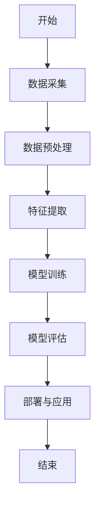
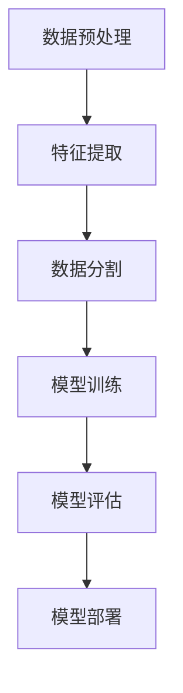
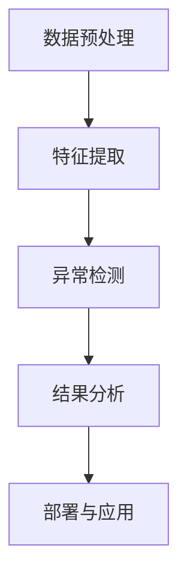
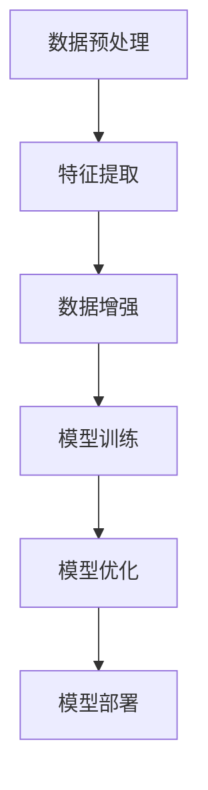
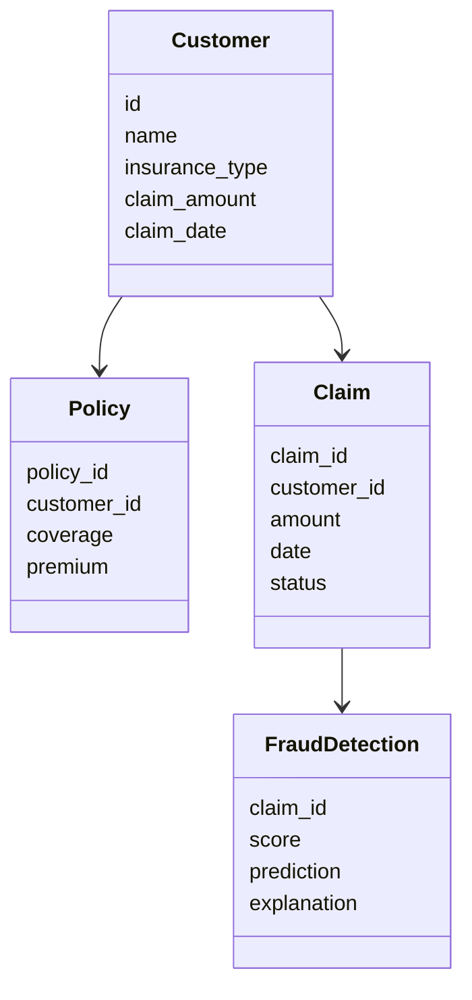
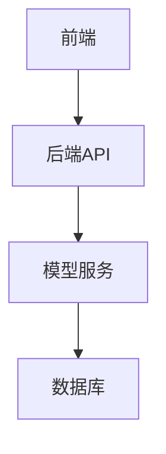
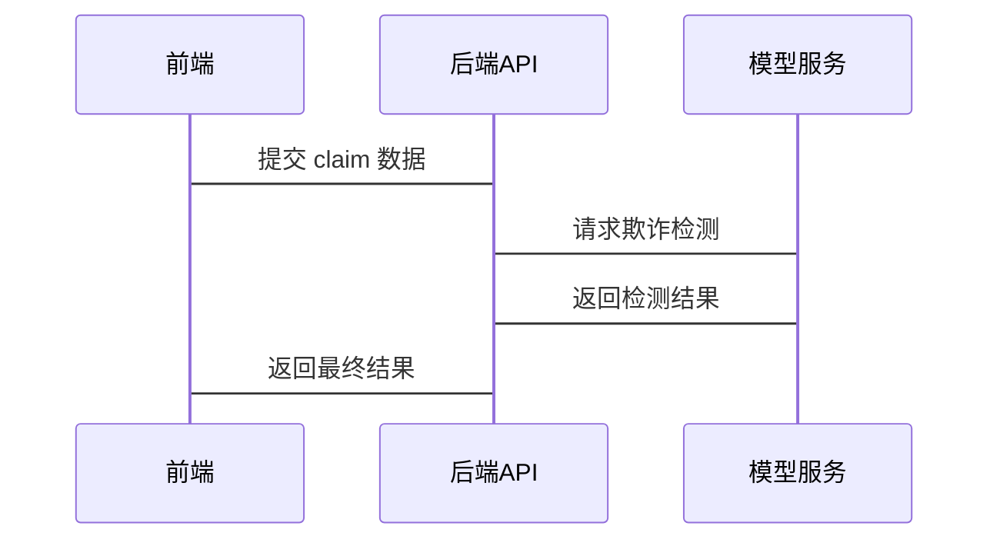

                 


# AI驱动的保险欺诈模式识别

> 关键词：AI，保险欺诈，模式识别，机器学习，深度学习，数据分析

> 摘要：随着保险行业的快速发展，保险欺诈问题日益严重，传统的欺诈识别方法逐渐暴露出效率低下、准确性差等问题。本文将详细探讨如何利用人工智能技术，特别是机器学习和深度学习算法，来识别保险欺诈模式。通过分析欺诈行为的特征，构建高效的AI驱动模型，以提高欺诈检测的准确性和效率，为保险行业提供有力的技术支持。

---

## 第一部分: AI驱动的保险欺诈模式识别概述

### 第1章: 保险欺诈模式识别的背景与挑战

#### 1.1 保险欺诈的现状与问题

保险欺诈是指通过故意制造虚假的保险事件，骗取保险公司赔偿的行为。随着保险行业的快速发展，保险欺诈手段也在不断升级，给保险公司带来了巨大的经济损失。根据统计数据显示，保险欺诈的损失每年高达保险行业总收入的5%~10%，这一比例还在逐年上升。

传统的保险欺诈识别方法主要依赖于人工审核和简单的规则匹配，这种方法存在以下问题：
- **效率低下**：人工审核需要大量的人力和时间，难以应对海量的保险 claim。
- **准确性差**：规则匹配方法依赖于预先设定的规则，很难覆盖所有可能的欺诈场景，容易漏判和误判。

#### 1.2 AI技术在保险欺诈识别中的作用

人工智能技术，特别是机器学习和深度学习算法，具有以下显著优势：
- **数据处理能力**：AI能够处理海量的非结构化数据，发现隐藏在数据中的模式和规律。
- **实时性**：AI模型可以在实时或近实时的情况下进行欺诈检测，显著提高检测效率。
- **可扩展性**：AI模型可以轻松扩展，适应不同类型的保险产品和欺诈场景。

#### 1.3 保险欺诈模式识别的挑战与解决方案

尽管AI技术在保险欺诈识别中具有显著优势，但在实际应用中仍面临以下挑战：
- **数据质量**：保险数据可能存在缺失、噪声和偏差，影响模型的准确性。
- **模型解释性**：复杂的深度学习模型往往缺乏可解释性，影响实际应用的可信度。
- **模型更新**：欺诈手段不断变化，需要定期更新模型以保持检测能力。

---

### 第2章: 保险欺诈模式识别的核心概念与联系

#### 2.1 保险欺诈模式识别的核心要素

保险欺诈模式识别涉及多个核心要素：
- **数据特征提取**：从保险 claim 中提取关键特征，如 claim 金额、时间、地点、客户行为等。
- **模型训练与优化**：利用机器学习算法对提取的特征进行训练，构建分类模型。
- **结果分析与决策**：根据模型输出的结果，结合业务规则进行最终的欺诈判定。

#### 2.2 AI驱动的保险欺诈模式识别原理

AI驱动的保险欺诈模式识别流程如下：
1. **数据采集**：收集保险 claim 相关数据，包括客户信息、claim 记录、交易历史等。
2. **数据预处理**：清洗数据，处理缺失值、异常值等。
3. **特征提取**：提取有助于欺诈识别的关键特征。
4. **模型训练**：利用机器学习算法训练分类模型。
5. **模型评估**：通过测试数据评估模型的准确率、召回率等性能指标。
6. **部署与应用**：将模型部署到生产环境，实时检测保险 claim 中的欺诈行为。

#### 2.3 实体关系图与流程图

##### 实体关系图
```mermaid
erDiagram
    customer {
        id
        name
        insurance_type
        claim_amount
        claim_date
    }
    policy {
        policy_id
        customer_id
        coverage
        premium
    }
    claim {
        claim_id
        customer_id
        amount
        date
        status
    }
    fraud_detection {
        claim_id
        score
        prediction
        explanation
    }
```

##### 流程图


---

### 第3章: 保险欺诈模式识别的算法原理

#### 3.1 常见算法概述

在保险欺诈模式识别中，常用的算法包括：
- **监督学习算法**：如逻辑回归、随机森林、支持向量机（SVM）。
- **无监督学习算法**：如聚类分析、异常检测。
- **深度学习算法**：如卷积神经网络（CNN）、循环神经网络（RNN）、长短期记忆网络（LSTM）。

#### 3.2 算法流程图

##### 监督学习算法流程图


##### 无监督学习算法流程图


##### 深度学习算法流程图


#### 3.3 算法实现与代码示例

##### 逻辑回归实现
```python
import pandas as pd
from sklearn.linear_model import LogisticRegression
from sklearn.metrics import accuracy_score

# 数据加载与预处理
data = pd.read_csv('insurance_fraud.csv')
X = data.drop('fraud', axis=1)
y = data['fraud']

# 模型训练
model = LogisticRegression()
model.fit(X, y)

# 模型预测
y_pred = model.predict(X)
print("准确率:", accuracy_score(y, y_pred))
```

##### 神经网络实现
```python
import numpy as np
from sklearn.neural_network import MLPClassifier

# 数据加载与预处理
data = pd.read_csv('insurance_fraud.csv')
X = data.drop('fraud', axis=1)
y = data['fraud']

# 模型训练
model = MLPClassifier(hidden_layer_sizes=(100, 50), max_iter=1000)
model.fit(X, y)

# 模型预测
y_pred = model.predict(X)
print("准确率:", accuracy_score(y, y_pred))
```

#### 3.4 数学公式与模型解释

##### 逻辑回归公式
$$ P(y=1 | x) = \frac{1}{1 + e^{-\beta x}} $$

##### 神经网络公式
$$ y = \sigma(w_2 \cdot \sigma(w_1 \cdot x + b_1) + b_2) $$
其中，$\sigma$ 是sigmoid函数，定义为：
$$ \sigma(a) = \frac{1}{1 + e^{-a}} $$

---

## 第四部分: 系统分析与架构设计

### 第4章: 保险欺诈识别系统分析与架构设计

#### 4.1 系统功能设计

##### 领域模型类图


#### 4.2 系统架构设计

##### 系统架构图


##### 系统接口设计

- **前端接口**：
  - POST /api/claim
  - GET /api/fraud_detection/{claim_id}
  
- **后端接口**：
  - POST /api/train_model
  - GET /api/predict

##### 系统交互流程图


---

## 第五部分: 项目实战

### 第5章: 保险欺诈模式识别项目实战

#### 5.1 环境安装与配置

```bash
pip install pandas numpy scikit-learn matplotlib
```

#### 5.2 核心代码实现

##### 数据加载与预处理
```python
import pandas as pd
import numpy as np

# 数据加载
data = pd.read_csv('insurance_fraud.csv')

# 数据清洗
data.dropna(inplace=True)
data = pd.get_dummies(data)
```

##### 模型训练与优化
```python
from sklearn.model import *
from sklearn.metrics import *

# 划分训练集和测试集
X_train, X_test, y_train, y_test = train_test_split(X, y, test_size=0.2)

# 模型训练
model = LogisticRegression()
model.fit(X_train, y_train)

# 模型优化
from sklearn.model_selection import GridSearchCV
param_grid = {
    'C': [0.1, 1, 10],
    'penalty': ['l1', 'l2']
}
grid_search = GridSearchCV(model, param_grid, cv=5)
grid_search.fit(X_train, y_train)
best_model = grid_search.best_estimator_
```

#### 5.3 实际案例分析

##### 案例背景
某保险公司收集了过去三年的 claim 数据，希望利用AI技术识别欺诈 claim。

##### 数据分析
通过对 claim 金额、时间、地点等特征进行分析，发现某些 claim 在特定时间段内集中出现，可能存在欺诈行为。

##### 模型部署
将训练好的模型部署到生产环境，实时检测新的 claim 是否为欺诈。

##### 案例总结
通过AI驱动的保险欺诈模式识别，该保险公司成功降低了欺诈 claim 的比例，提高了欺诈检测的准确性和效率。

---

## 第六部分: 最佳实践与总结

### 第6章: 最佳实践与总结

#### 6.1 最佳实践

- **数据质量**：确保数据的完整性和准确性，进行适当的数据清洗和特征工程。
- **模型选择**：根据具体场景选择合适的算法，进行模型调参和优化。
- **模型解释性**：尽量选择具有可解释性的模型，便于业务理解和应用。
- **模型更新**：定期更新模型，适应不断变化的欺诈手段。

#### 6.2 小结

本文详细探讨了AI驱动的保险欺诈模式识别的核心概念、算法原理、系统架构和项目实战。通过结合理论与实践，展示了如何利用人工智能技术有效识别保险欺诈行为，为保险行业提供了重要的技术支持。

#### 6.3 注意事项

- **数据隐私**：在处理保险数据时，需严格遵守数据隐私保护法规。
- **模型评估**：在实际应用中，需定期评估模型的性能，确保检测效果。
- **团队协作**：AI项目需要数据科学家、开发人员和业务专家的密切合作。

#### 6.4 拓展阅读

- 《机器学习实战》
- 《深度学习入门：基于Python的CNN、RNN、神经网络案例分析》
- 《数据挖掘导论》

---

## 作者

作者：AI天才研究院/AI Genius Institute & 禅与计算机程序设计艺术 /Zen And The Art of Computer Programming

