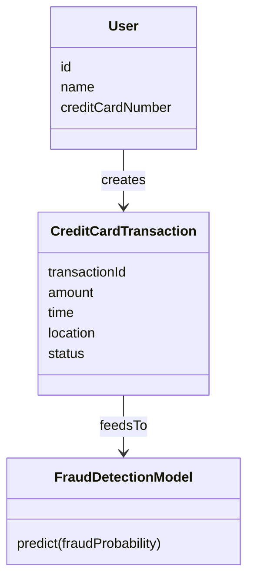
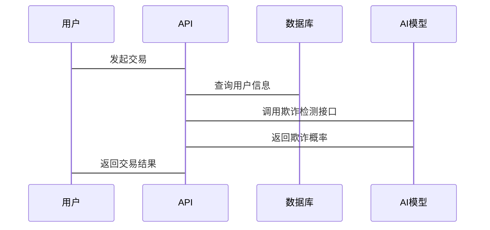

                 


# AI驱动的信用卡fraud检测模型

> 关键词：信用卡欺诈检测，人工智能，机器学习，深度学习，金融风控，欺诈识别

> 摘要：随着信用卡欺诈问题的日益严重，利用人工智能技术构建高效的欺诈检测模型变得至关重要。本文将详细介绍信用卡欺诈检测的背景、核心概念、算法原理、系统架构以及项目实战，帮助读者全面理解如何利用AI技术来提升信用卡欺诈检测的准确性和效率。通过本文的学习，读者将能够掌握从数据准备、模型训练到系统实现的完整流程，从而在实际项目中有效应用这些技术。

---

## 第一章: 信用卡fraud检测的背景与挑战

### 1.1 信用卡fraud检测的背景

#### 1.1.1 信用卡fraud的现状与趋势
信用卡欺诈是指通过非法手段获取他人信用卡信息并进行未经授权的交易。随着电子商务的快速发展，信用卡欺诈问题日益严重，造成的经济损失也在不断增加。据统计，每年全球因信用卡欺诈造成的损失高达数百亿美元。

#### 1.1.2 AI技术在fraud检测中的应用价值
传统的信用卡欺诈检测主要依赖于规则-based系统，这种方式虽然简单，但容易被欺诈者绕过。AI技术的引入，尤其是机器学习和深度学习算法，能够从海量数据中提取复杂的特征，并识别出传统规则难以捕捉的异常模式。

#### 1.1.3 当前信用卡fraud检测的主要问题
1. **数据量大**：信用卡交易数据通常非常庞大，传统的检测方法难以高效处理。
2. **欺诈手段多样化**：欺诈者不断变换手段，传统的规则-based系统难以适应。
3. **实时性要求高**：信用卡交易需要在极短时间内完成欺诈检测，这对计算效率提出了更高要求。

### 1.2 信用卡fraud检测的核心概念

#### 1.2.1 问题背景与问题描述
信用卡欺诈检测的目标是通过分析交易数据，识别出异常交易行为。这些异常行为可能包括盗用他人信用卡、伪造交易等。

#### 1.2.2 问题解决的必要性与目标
- **必要性**：保护持卡人和发卡机构的财产安全。
- **目标**：通过AI技术实现高精度、低延迟的欺诈检测。

#### 1.2.3 边界与外延
- **边界**：仅关注信用卡交易中的欺诈行为。
- **外延**：不涉及其他类型的金融欺诈，如网络诈骗、账户盗用等。

#### 1.2.4 核心要素组成
1. **交易数据**：包括交易时间、金额、地点、交易类型等。
2. **用户行为模式**：包括用户的消费习惯、交易频率等。
3. **欺诈特征**：包括异常交易金额、异常交易时间、异常交易地点等。

## 第二章: AI驱动的信用卡fraud检测模型

### 2.1 核心概念与联系

#### 2.1.1 检测模型的核心概念原理
AI驱动的信用卡欺诈检测模型通过分析交易数据，利用机器学习算法识别出异常交易行为。模型的核心在于特征提取和分类算法的选择。

#### 2.1.2 关键概念属性特征对比表格

| 特征类型 | 正常交易 | 欺诈交易 |
|----------|----------|----------|
| 交易时间 | 集中在白天 | 集中在深夜 |
| 交易金额 | 金额较小 | 金额较大 |
| 交易地点 | 集中在常用地点 | 集中在非常用地点 |

#### 2.1.3 ER实体关系图架构

```mermaid
er
actor: User
object: CreditCardTransaction
relationship: contains
```

---

## 第三章: 信用卡fraud检测的算法原理

### 3.1 传统方法与机器学习方法对比

#### 3.1.1 传统规则-based方法
- **优点**：简单易实现，易于解释。
- **缺点**：难以应对复杂的欺诈手段，容易被绕过。

#### 3.1.2 机器学习方法的优势
- **优势**：能够从数据中自动提取特征，适应性强，能够发现复杂的欺诈模式。

### 3.2 常见算法介绍

#### 3.2.1 逻辑回归
- **原理**：通过构建一个线性回归模型，将输入特征映射到0和1的概率空间。
- **代码示例**：
  ```python
  import numpy as np
  from sklearn.linear_model import LogisticRegression

  # 示例数据
  X = np.array([[1, 2], [3, 4], [5, 6]])
  y = np.array([0, 1, 0])

  # 训练模型
  model = LogisticRegression()
  model.fit(X, y)
  ```

#### 3.2.2 随机森林
- **原理**：通过构建多个决策树，并将它们的结果进行集成，提高模型的准确性和鲁棒性。
- **代码示例**：
  ```python
  from sklearn.ensemble import RandomForestClassifier

  # 示例数据
  X = np.array([[1, 2], [3, 4], [5, 6]])
  y = np.array([0, 1, 0])

  # 训练模型
  model = RandomForestClassifier(n_estimators=10)
  model.fit(X, y)
  ```

#### 3.2.3 支持向量机
- **原理**：通过构建一个超平面，将数据分成两类。
- **代码示例**：
  ```python
  from sklearn.svm import SVC

  # 示例数据
  X = np.array([[1, 2], [3, 4], [5, 6]])
  y = np.array([0, 1, 0])

  # 训练模型
  model = SVC()
  model.fit(X, y)
  ```

#### 3.2.4 神经网络
- **原理**：通过构建多层神经网络，模拟人脑的神经网络结构，实现复杂的特征提取和分类。
- **代码示例**：
  ```python
  import keras
  from keras.layers import Dense, Input
  from keras.models import Model

  # 示例数据
  X = np.array([[1, 2], [3, 4], [5, 6]])
  y = np.array([0, 1, 0])

  # 构建模型
  input_layer = Input(shape=(2,))
  dense_layer = Dense(4, activation='relu')(input_layer)
  output_layer = Dense(1, activation='sigmoid')(dense_layer)
  model = Model(inputs=input_layer, outputs=output_layer)
  model.compile(optimizer='adam', loss='binary_crossentropy', metrics=['accuracy'])
  model.fit(X, y, epochs=10)
  ```

### 3.3 算法原理的数学模型和公式

#### 3.3.1 逻辑回归的数学模型
$$ P(y=1|x) = \frac{1}{1 + e^{-\beta x}} $$

#### 3.3.2 神经网络的数学模型
$$ y = f(Wx + b) $$

### 3.4 通俗易懂的举例说明

#### 3.4.1 逻辑回归的简单例子
假设我们有一个简单的数据集，其中只有两个特征（交易金额和交易时间）。我们可以通过逻辑回归模型来预测交易是否为欺诈交易。

#### 3.4.2 神经网络的实际应用
通过构建一个简单的神经网络模型，我们可以从复杂的交易数据中提取特征，并准确识别欺诈交易。

---

## 第四章: 深度学习在信用卡fraud检测中的应用

### 4.1 深度学习的基本原理

#### 4.1.1 神经网络结构
- **输入层**：接收交易数据。
- **隐藏层**：提取复杂的特征。
- **输出层**：输出欺诈概率。

#### 4.1.2 卷积神经网络（CNN）
- **原理**：通过卷积操作提取空间特征，常用于图像识别任务。

#### 4.1.3 循环神经网络（RNN）
- **原理**：适合处理序列数据，如时间序列分析。

### 4.2 深度学习模型的训练

#### 4.2.1 模型训练流程
1. **数据准备**：收集和预处理交易数据。
2. **模型构建**：定义模型结构。
3. **模型训练**：使用训练数据训练模型。
4. **模型评估**：使用测试数据评估模型性能。

---

## 第五章: 系统分析与架构设计

### 5.1 问题场景介绍

#### 5.1.1 系统需求
- 高交易量处理能力。
- 实时性要求。
- 高准确性要求。

### 5.2 系统功能设计

#### 5.2.1 领域模型


#### 5.2.2 系统架构设计


#### 5.2.3 系统接口设计
- **输入接口**：接收交易数据。
- **输出接口**：返回欺诈概率。

#### 5.2.4 系统交互流程图


---

## 第六章: 项目实战

### 6.1 环境安装

#### 6.1.1 安装Python环境
- 使用Anaconda或虚拟环境安装Python 3.x。

#### 6.1.2 安装依赖库
```bash
pip install numpy
pip install scikit-learn
pip install keras
pip install tensorflow
```

### 6.2 系统核心实现源代码

#### 6.2.1 数据预处理代码
```python
import pandas as pd
from sklearn.model_selection import train_test_split

# 示例数据
data = {
    'amount': [100, 200, 300, 400],
    'time': [1, 2, 3, 4],
    'is_fraud': [0, 0, 1, 1]
}

df = pd.DataFrame(data)
X = df[['amount', 'time']]
y = df['is_fraud']

X_train, X_test, y_train, y_test = train_test_split(X, y, test_size=0.2)
```

#### 6.2.2 模型训练代码
```python
from sklearn.linear_model import LogisticRegression

model = LogisticRegression()
model.fit(X_train, y_train)
```

#### 6.2.3 模型评估代码
```python
from sklearn.metrics import accuracy_score

y_pred = model.predict(X_test)
print('Accuracy:', accuracy_score(y_test, y_pred))
```

### 6.3 代码解读与分析

#### 6.3.1 数据预处理
- 数据清洗：处理缺失值、异常值。
- 特征工程：提取关键特征，如交易时间、金额、地点等。

#### 6.3.2 模型训练
- 选择合适的算法：如逻辑回归、随机森林、神经网络等。
- 调参优化：通过网格搜索等方法优化模型参数。

#### 6.3.3 模型评估
- 评估指标：准确率、召回率、F1分数等。
- 模型调优：通过交叉验证等方法进一步优化模型性能。

### 6.4 实际案例分析

#### 6.4.1 数据集准备
- 数据来源：真实交易数据或合成数据。
- 数据清洗：处理缺失值、异常值。

#### 6.4.2 模型训练
- 选择合适的算法。
- 训练模型。

#### 6.4.3 模型评估
- 评估模型性能。
- 调优模型参数。

#### 6.4.4 模型部署
- 部署模型到生产环境。
- 实时检测交易欺诈行为。

### 6.5 项目小结

---

## 第七章: 最佳实践与总结

### 7.1 最佳实践 tips

#### 7.1.1 数据准备
- 确保数据质量，处理缺失值和异常值。
- 提取有用的特征，如交易时间、金额、地点等。

#### 7.1.2 模型选择
- 根据数据量和复杂度选择合适的算法。
- 对比不同算法的性能，选择最优模型。

#### 7.1.3 模型部署
- 将模型部署到生产环境，实时处理交易数据。
- 定期更新模型，适应新的欺诈手段。

### 7.2 小结

通过本文的介绍，读者可以了解到如何利用AI技术构建高效的信用卡欺诈检测模型。从数据准备、模型训练到系统部署，整个流程都需要仔细设计和优化。只有通过不断的学习和实践，才能不断提升模型的准确性和效率。

### 7.3 注意事项

- 数据隐私保护：在处理用户数据时，必须遵守相关法律法规，保护用户隐私。
- 模型更新：欺诈手段不断变化，需要定期更新模型，保持检测能力。
- 系统性能：实时检测需要高效的计算能力和优化的系统架构。

### 7.4 拓展阅读

- 《Hands-On Machine Learning with Scikit-Learn and TensorFlow》
- 《Deep Learning for Credit Card Fraud Detection》

---

## 作者：AI天才研究院/AI Genius Institute & 禅与计算机程序设计艺术 /Zen And The Art of Computer Programming

---

以上是《AI驱动的信用卡fraud检测模型》的完整目录大纲和详细内容。

