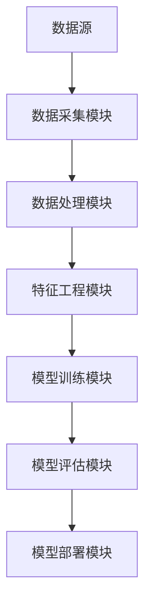
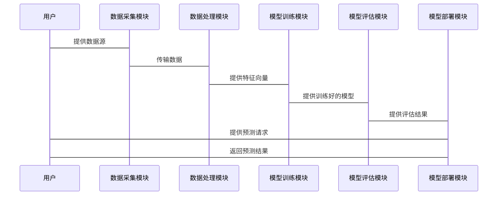

                 

<think>
好的，我现在需要帮助用户撰写一篇名为《AI驱动的信用违约预测》的技术博客文章。首先，我需要理解用户的需求。用户希望文章结构清晰、逻辑严谨，涵盖从背景到系统架构、项目实战等各个方面，同时要求使用专业的技术语言，并且每个章节内容详细丰富。

我开始分析用户的需求。文章需要包括摘要、关键词，然后按照目录大纲展开。用户特别强调每个章节要详细讲解，包括核心概念、算法原理、系统架构等，并且要求使用markdown格式，插入图表和数学公式。

首先，我应该先写摘要部分，概述文章的核心内容。然后列出关键词，如信用违约预测、人工智能、机器学习、深度学习等。

接下来是目录大纲。根据用户提供的示例，我需要将文章分为四个主要部分：背景与基础、核心概念与技术、核心算法与模型、系统架构与项目实战。每个部分下有多个章节，章节下还有小节，甚至三级目录。

在撰写过程中，我需要确保每个章节都包含必要的内容。例如，在背景部分，需要介绍信用违约预测的定义、问题背景以及AI的作用。在核心概念部分，要讲解机器学习、NLP、数据挖掘等技术在信用评估中的应用，并可能需要比较不同算法的优缺点。

算法部分，我需要详细讲解逻辑回归、SVM、随机森林等模型的原理，使用数学公式和mermaid流程图来辅助说明。同时，比较不同算法的优缺点，可能用表格形式展示。

系统架构部分，我需要设计一个AI驱动的信用违约预测系统的架构图，展示各个模块的功能和交互。接口设计和交互流程图也很重要，可能需要用mermaid序列图来展示。

项目实战部分，我需要提供一个完整的项目流程，包括环境安装、数据收集、特征工程、模型训练、评估和部署。还要给出实际案例，如银行客户违约预测，并详细分析结果。

最后，总结部分需要回顾核心内容，强调AI的优势和挑战，给出最佳实践建议，并推荐进一步学习的资源。

在写作过程中，我需要确保使用正确的格式，如使用mermaid图表、latex公式，以及合适的代码示例。同时，保持文章的逻辑性和连贯性，确保每个部分都详细且易于理解。

现在，我需要逐步构建每个章节的内容，确保覆盖所有关键点，并且保持在10000到12000字左右。这可能需要多次修改和调整，以确保文章结构合理，内容丰富。

总之，我将按照用户的要求，分步骤详细展开每个部分，确保最终的文章符合专业标准，满足用户的需求。
</think>

# AI驱动的信用违约预测

> 关键词：信用违约预测, 人工智能, 机器学习, 深度学习, 信用风险, 自然语言处理, 数据挖掘

> 摘要：信用违约预测是金融领域的重要问题，传统的信用评估方法存在诸多局限性。随着人工智能技术的快速发展，AI在信用违约预测中的应用越来越广泛。本文从信用违约预测的背景与基础出发，详细探讨了AI驱动的信用违约预测的核心概念与技术，重点分析了传统机器学习算法、深度学习模型、自然语言处理技术在信用违约预测中的应用，深入讲解了系统架构设计与项目实战，最后总结了AI驱动信用违约预测的未来发展方向与实践建议。

---

# 第一部分: 信用违约预测的背景与基础

# 第1章: 信用违约预测的定义与问题背景

## 1.1 信用违约预测的定义

### 1.1.1 信用风险的基本概念

信用风险是指由于借款人或交易对手无法履行其合约义务，导致债权人或投资者遭受损失的风险。在金融领域，信用风险是三大风险（信用风险、市场风险、操作风险）之一，贯穿于银行、投资、保险等各个业务领域。

### 1.1.2 信用违约的定义与特征

信用违约是指借款人在约定的期限内未能履行还款义务，或者未能按照合同约定使用资金的行为。信用违约的特征包括：

- **违约概率**：借款人在未来一定时间内违约的可能性大小。
- **违约损失率**：在违约发生时，债权人为违约行为所造成的实际损失比例。
- **违约风险敞口**：债权人因违约行为可能遭受的最大损失金额。

### 1.1.3 信用违约预测的业务价值

信用违约预测的核心目标是通过分析借款人的信用特征，预测其违约概率，从而帮助金融机构做出更明智的信贷决策。其业务价值体现在以下几个方面：

1. **风险控制**：通过提前识别高违约风险的客户，金融机构可以采取措施降低风险敞口。
2. **优化信贷决策**：基于信用违约预测结果，金融机构可以更精准地进行信贷审批和额度分配。
3. **提高资产质量**：通过减少违约客户数量，金融机构可以提高其资产质量和资本充足率。
4. **提升客户筛选效率**：信用违约预测可以帮助金融机构快速筛选出低风险客户，降低信贷审批成本。

## 1.2 信用违约预测的背景与问题

### 1.2.1 传统信用评估方法的局限性

传统的信用评估方法主要依赖于以下几个方面：

- **财务报表分析**：通过分析企业的财务报表（如资产负债表、利润表、现金流量表）来评估其偿债能力。
- **信用评分模型**：基于借款人的信用历史、收入水平、负债情况等定量指标，计算信用评分。
- **经验判断**：依赖信贷 officers 的主观判断和经验。

然而，传统方法存在以下局限性：

1. **数据维度有限**：传统信用评分模型主要依赖财务数据和历史还款记录，难以捕捉借款人行为特征、社交网络等非结构化数据。
2. **模型解释性差**：复杂的模型（如非线性模型）难以解释其决策逻辑，导致信贷 officer 难以理解模型输出结果。
3. **动态风险捕捉不足**：传统模型难以实时捕捉借款人信用状况的变化，尤其是在经济环境剧烈波动时。

### 1.2.2 AI技术在信用评估中的应用潜力

随着人工智能技术的快速发展，AI在信用评估中的应用潜力主要体现在以下几个方面：

1. **非结构化数据处理**：AI技术可以处理借款人社交网络、社交媒体数据、新闻报道等非结构化数据，提供更全面的信用评估依据。
2. **实时风险监控**：基于流数据处理技术，AI可以实时监控借款人的信用状况变化，及时发出预警信号。
3. **个性化信用评估**：通过机器学习技术，AI可以为每个借款人量身定制个性化的信用评估模型，提升评估精度。
4. **自动化决策支持**：AI可以辅助信贷 officer 进行自动化信贷审批，提高审批效率。

### 1.2.3 信用违约预测的核心问题与挑战

信用违约预测的核心问题是如何通过数据分析和建模，准确预测借款人违约概率。然而，这一任务面临以下挑战：

1. **数据稀疏性**：在某些情况下，违约数据可能非常稀缺，导致模型难以有效训练。
2. **数据不平衡性**：信用违约事件的发生率通常较低，导致数据集存在类别不平衡问题。
3. **模型解释性要求高**：由于信用评估结果直接影响到借款人的融资成本和金融机构的风险敞口，模型的解释性要求较高。
4. **法规与伦理约束**：信用评估结果可能对借款人产生重大影响，因此模型需要符合相关法规，并避免歧视性结果。

## 1.3 信用违约预测的边界与外延

### 1.3.1 信用违约预测的适用范围

信用违约预测主要适用于以下场景：

1. **个人信贷评估**：如信用卡审批、个人贷款审批等。
2. **企业信贷评估**：如企业贷款审批、供应链金融等。
3. **债券评级**：通过预测债券发行人违约概率，进行债券评级。
4. **风险管理**：帮助金融机构进行信用风险管理和资本充足性评估。

### 1.3.2 相关概念的对比与区分

在信用违约预测中，需要区分以下几个相关概念：

1. **信用评分与信用评级**：信用评分是通过量化指标计算出的分数，用于衡量借款人的信用状况；信用评级是将借款人按照信用风险等级进行分类。
2. **违约概率（PD）与违约损失率（LGD）**：违约概率是借款人在未来一定时间内违约的可能性；违约损失率是违约发生时的损失比例。
3. **信用违约与信用风险**：信用违约是信用风险的一种表现形式，而信用风险是更广泛的概念，包括信用违约、信用降级等多种风险形式。

### 1.3.3 信用违约预测的潜在风险与伦理问题

信用违约预测可能面临以下风险和伦理问题：

1. **模型偏差**：如果训练数据存在偏差，可能导致模型对某些群体的预测存在偏见。
2. **隐私问题**：信用违约预测可能涉及大量个人数据，如何保护数据隐私是一个重要问题。
3. **算法黑箱问题**：复杂的AI模型可能导致决策过程不透明，影响模型的可信度。
4. **过度依赖模型**：如果完全依赖AI模型进行信贷决策，可能忽视借款人的实际情况。

## 1.4 本章小结

本章从信用违约预测的基本概念出发，介绍了信用风险的基本概念、信用违约的定义与特征，以及信用违约预测的业务价值。接着，分析了传统信用评估方法的局限性，探讨了AI技术在信用评估中的应用潜力。最后，总结了信用违约预测的核心问题与挑战，并明确了信用违约预测的边界与外延。

---

# 第二部分: AI驱动信用违约预测的核心概念与技术

# 第2章: AI技术在信用违约预测中的应用

## 2.1 机器学习在信用违约预测中的应用

### 2.1.1 监督学习在信用违约预测中的应用

监督学习是机器学习中的一种常用方法，通过使用标注数据训练模型，使其能够预测新的数据点。在信用违约预测中，监督学习的应用主要体现在以下方面：

1. **分类任务**：将借款人分为违约和非违约两类，训练模型预测借款人是否违约。
2. **回归任务**：通过回归模型预测借款人违约的概率（通常是一个介于0和1之间的数值）。

#### 2.1.1.1 监督学习的训练流程

以下是监督学习在信用违约预测中的训练流程：

1. **数据收集**：收集与借款人相关的各种数据，包括财务数据、信用历史、社交网络数据等。
2. **数据预处理**：对数据进行清洗、特征提取、特征工程等处理，使其适合模型训练。
3. **特征选择**：选择对违约预测最具影响力的特征。
4. **模型训练**：使用训练数据训练模型，调整模型参数以最小化预测误差。
5. **模型评估**：通过测试数据评估模型的性能，调整模型参数或尝试其他模型。
6. **模型部署**：将模型部署到生产环境中，用于实际的信用违约预测。

#### 2.1.1.2 监督学习的优缺点

| **优点**       | **缺点**       |
|----------------|----------------|
| 模型解释性较好 | 对异常数据敏感 |
| 适合小数据集   | 需要大量特征工程 |
| 易于实现        | 过度依赖特征选择 |

### 2.1.2 无监督学习在信用风险分析中的作用

无监督学习是一种机器学习方法，用于从无标签数据中发现隐藏的结构。在信用风险分析中，无监督学习可以用于以下场景：

1. **异常检测**：通过无监督学习方法发现异常的交易行为或财务数据，识别潜在的违约风险。
2. **聚类分析**：将客户按信用风险特征进行聚类，识别不同风险级别的客户群体。

#### 2.1.2.1 无监督学习的典型算法

- **K-means聚类**：将客户按照信用风险特征聚类，识别不同风险级别的客户群体。
- **DBSCAN聚类**：基于密度的聚类算法，可以发现密度较高的客户群体，识别潜在的高风险客户。
- **Isolation Forest异常检测**：通过树结构隔离异常数据点，识别异常交易行为。

#### 2.1.2.2 无监督学习的优缺点

| **优点**       | **缺点**       |
|----------------|----------------|
| 无需标签数据   | 模型解释性较差 |
| 可以发现隐藏结构 | 对异常数据敏感 |
| 适用于大数据集 | 需要复杂的参数调优 |

### 2.1.3 半监督学习在信用数据中的应用

半监督学习是一种结合了监督学习和无监督学习的技术，适用于标签数据有限的场景。在信用违约预测中，半监督学习可以用于以下场景：

1. **少量违约数据**：当违约数据非常稀少时，可以使用半监督学习方法，利用无标签数据进行模型训练。
2. **增量学习**：随着新数据的不断引入，可以使用半监督学习方法更新模型，保持模型的预测能力。

#### 2.1.3.1 半监督学习的典型算法

- **半监督逻辑回归**：在监督学习的基础上，引入无标签数据进行模型训练，提高模型的泛化能力。
- **半监督SVM**：结合监督学习和无监督学习的思想，利用无标签数据进行边界调整。

#### 2.1.3.2 半监督学习的优缺点

| **优点**       | **缺点**       |
|----------------|----------------|
| 适用于标签数据有限的场景 | 实现复杂 |
| 可以提高模型泛化能力 | 需要复杂的算法设计 |

## 2.2 自然语言处理（NLP）在信用违约预测中的应用

自然语言处理（NLP）技术在信用违约预测中的应用主要体现在对非结构化数据的处理上。以下是一些典型应用：

### 2.2.1 文本数据在信用评估中的价值

文本数据可以来自多个渠道，包括：

1. **社交媒体数据**：借款人在社交媒体上的发言、评论等，可以反映其信用状况。
2. **新闻报道**：企业的相关新闻报道，可以反映企业的经营状况和风险。
3. **合同文本**：借款合同中的条款、条件等，可以通过NLP技术提取关键信息。

### 2.2.2 NLP技术在信用文本分析中的应用

NLP技术可以用于以下信用文本分析任务：

1. **情感分析**：分析文本中的情感倾向，识别借款人或企业的负面情绪，预测违约风险。
2. **实体识别**：识别文本中的关键实体，如人名、公司名、地址等，提取有价值的信息。
3. **文本分类**：将文本分为不同的类别，如正面、负面、中性等，辅助信用评估。
4. **信息提取**：从文本中提取关键信息，如财务数据、合同条款等，辅助信用评估。

### 2.2.3 基于NLP的信用风险评估案例

以下是一个基于NLP的信用风险评估案例：

假设我们有一家企业的新闻报道数据，希望通过分析这些新闻报道预测企业的违约概率。具体步骤如下：

1. **数据收集**：收集该企业过去一年的新闻报道数据。
2. **文本预处理**：对文本进行分词、去除停用词、 stemming 等处理。
3. **特征提取**：使用TF-IDF方法提取文本特征。
4. **文本分类**：训练一个二分类模型（违约与非违约），预测企业违约概率。

### 2.2.4 NLP技术的优缺点

| **优点**       | **缺点**       |
|----------------|----------------|
| 能够处理非结构化数据 | 对文本数据的质量要求较高 |
| 提供额外的信用信息 | 实现复杂，需要大量计算资源 |
| 可以发现隐藏的信用风险 | 需要专业的NLP技术人才 |

## 2.3 数据挖掘与特征工程在信用违约预测中的作用

数据挖掘与特征工程在信用违约预测中起着至关重要的作用。以下是一些典型应用：

### 2.3.1 数据预处理与特征提取

数据预处理包括：

1. **数据清洗**：处理缺失值、异常值等。
2. **数据转换**：将数据转换为适合模型训练的格式，如标准化、归一化等。
3. **数据增强**：通过增加数据多样性，提高模型的泛化能力。

特征提取包括：

1. **数值型特征提取**：从财务数据、信用历史等中提取数值型特征。
2. **类别型特征提取**：将类别型特征转换为数值型特征，如One-Hot编码、标签编码等。
3. **文本特征提取**：从文本数据中提取特征，如TF-IDF、Word2Vec等。

### 2.3.2 特征选择与降维技术

特征选择的目的是选择对违约预测最具影响力的特征，减少模型的维度，提高模型的性能。常用的特征选择方法包括：

1. **过滤法**：基于统计学方法选择特征，如卡方检验、互信息等。
2. **包裹法**：通过训练模型选择特征，如逐步回归、随机森林特征重要性等。
3. **嵌入法**：在模型训练过程中学习特征的重要性，如Lasso回归、XGBoost特征重要性等。

降维技术包括：

1. **主成分分析（PCA）**：通过线性组合将高维数据映射到低维空间，减少特征数量。
2. **t-SNE**：一种非线性降维技术，适用于数据可视化。
3. **U-Matrix**：用于可视化数据的密度和分布，辅助特征选择。

### 2.3.3 时间序列数据在信用违约预测中的应用

时间序列数据是指按时间顺序排列的数据，通常用于分析数据的变化趋势。在信用违约预测中，时间序列数据可以用于以下场景：

1. **趋势预测**：通过时间序列模型预测未来的违约概率。
2. **异常检测**：通过时间序列分析发现异常的交易行为或财务数据。
3. **状态转移分析**：分析违约状态的转移概率，构建马尔可夫链模型。

### 2.3.4 数据挖掘与特征工程的优缺点

| **优点**       | **缺点**       |
|----------------|----------------|
| 提高模型性能   | 特征选择复杂 |
| 降低模型维度   | 需要大量计算资源 |
| 提高模型解释性 | 对数据质量要求高 |

## 2.4 本章小结

本章介绍了AI技术在信用违约预测中的应用，重点分析了机器学习、自然语言处理和数据挖掘在信用评估中的应用。通过对监督学习、无监督学习和半监督学习的分析，我们了解了不同学习方法在信用违约预测中的优缺点。同时，通过NLP技术的应用，我们看到了非结构化数据在信用评估中的潜力。最后，通过数据挖掘与特征工程，我们掌握了如何通过特征选择和降维技术提高模型性能。

---

# 第三部分: 信用违约预测的核心算法与模型

# 第3章: 传统机器学习算法在信用违约预测中的应用

## 3.1 逻辑回归模型

### 3.1.1 逻辑回归的原理与数学模型

逻辑回归是一种用于分类任务的统计学习方法，其核心思想是通过sigmoid函数将线性回归的输出映射到概率空间。逻辑回归的数学模型如下：

$$ P(Y=1|X) = \frac{1}{1 + e^{-\beta X}} $$

其中，$Y$ 是目标变量（违约与否），$X$ 是特征向量，$\beta$ 是模型参数。

### 3.1.2 逻辑回归在信用违约预测中的应用

逻辑回归在信用违约预测中的应用主要体现在以下几个方面：

1. **二分类任务**：将借款人分为违约和非违约两类，预测违约概率。
2. **概率预测**：通过逻辑回归模型预测借款人违约的概率，提供风险评估依据。
3. **风险评分**：通过逻辑回归模型计算风险评分，辅助信贷决策。

### 3.1.3 逻辑回归的优缺点

| **优点**       | **缺点**       |
|----------------|----------------|
| 模型解释性好   | 适合线性关系 |
| 计算效率高     | 不适合非线性关系 |
| 易于实现        | 对异常值敏感 |

### 3.1.4 逻辑回归的实现步骤

1. **数据准备**：收集与借款人相关的数据，包括财务数据、信用历史、社交网络数据等。
2. **数据预处理**：对数据进行清洗、特征提取、特征工程等处理，使其适合模型训练。
3. **模型训练**：使用训练数据训练逻辑回归模型，调整模型参数以最小化预测误差。
4. **模型评估**：通过测试数据评估模型的性能，计算准确率、召回率、F1分数等指标。
5. **模型部署**：将模型部署到生产环境中，用于实际的信用违约预测。

### 3.1.5 逻辑回归的数学公式

逻辑回归的损失函数如下：

$$ L(\beta) = -\sum_{i=1}^{n} [y_i \ln(p_i) + (1 - y_i)\ln(1 - p_i)] $$

其中，$p_i = \frac{1}{1 + e^{-\beta X_i}}$，$y_i$ 是目标变量，$X_i$ 是第i个样本的特征向量。

### 3.1.6 逻辑回归的优缺点分析

逻辑回归的优点包括模型解释性强、计算效率高、易于实现等。缺点包括对非线性关系的处理能力有限、对异常值敏感等。因此，在实际应用中，逻辑回归通常用于处理线性可分的数据，或者在数据经过适当特征工程处理后，依然表现出较好的线性关系。

---

## 3.2 支持向量机（SVM）在信用违约预测中的应用

### 3.2.1 SVM的原理与数学模型

支持向量机（SVM）是一种监督学习算法，主要用于分类和回归任务。SVM的核心思想是通过构造一个超平面，将数据点分为两类。对于非线性可分的数据，SVM通过使用核函数将数据映射到高维空间，构造一个非线性决策边界。

SVM的数学模型如下：

$$ y = \text{sign}(\sum_{i=1}^{n} \alpha_i y_i x_i \cdot x + b) $$

其中，$\alpha_i$ 是拉格朗日乘子，$y_i$ 是目标变量，$x_i$ 是支持向量，$x$ 是新样本，$b$ 是偏置项。

### 3.2.2 SVM在信用违约预测中的应用

SVM在信用违约预测中的应用主要体现在以下几个方面：

1. **分类任务**：将借款人分为违约和非违约两类，预测违约概率。
2. **非线性关系处理**：通过核函数处理非线性关系，提高模型的预测能力。
3. **高维数据处理**：适用于高维数据，能够有效降低维度。

### 3.2.3 SVM的优缺点

| **优点**       | **缺点**       |
|----------------|----------------|
| 能处理非线性关系 | 计算复杂 |
| 对噪声数据鲁棒   | 对参数敏感 |
| 适合高维数据   | 解释性差 |

### 3.2.4 SVM的实现步骤

1. **数据准备**：收集与借款人相关的数据，包括财务数据、信用历史、社交网络数据等。
2. **数据预处理**：对数据进行清洗、特征提取、特征工程等处理，使其适合模型训练。
3. **模型训练**：使用训练数据训练SVM模型，调整模型参数（如C、gamma）以最小化预测误差。
4. **模型评估**：通过测试数据评估模型的性能，计算准确率、召回率、F1分数等指标。
5. **模型部署**：将模型部署到生产环境中，用于实际的信用违约预测。

### 3.2.5 SVM的数学公式

SVM的优化目标如下：

$$ \min_{\alpha_i, \beta, b} \frac{1}{2} \beta^2 + \sum_{i=1}^{n} \alpha_i (1 - y_i (\beta x_i + b)) $$

其中，$\alpha_i$ 是拉格朗日乘子，$y_i$ 是目标变量，$x_i$ 是特征向量，$\beta$ 是权重向量，$b$ 是偏置项。

### 3.2.6 SVM的优缺点分析

SVM的优点包括能够处理非线性关系、对噪声数据鲁棒、适合高维数据等。缺点包括计算复杂、对参数敏感、解释性差等。因此，在实际应用中，SVM通常用于处理非线性可分的数据，或者在数据经过适当特征工程处理后，依然表现出较好的非线性关系。

---

## 3.3 随机森林与梯度提升树在信用违约预测中的应用

### 3.3.1 随机森林的原理与数学模型

随机森林是一种基于树的集成学习方法，通过构建多个决策树并集成其预测结果来提高模型的性能。随机森林的数学模型如下：

$$ y = \text{sign}\left(\sum_{i=1}^{n} \text{Tree}_i(x)\right) $$

其中，$\text{Tree}_i(x)$ 是第i棵决策树的预测结果，$x$ 是输入样本。

### 3.3.2 随机森林在信用违约预测中的应用

随机森林在信用违约预测中的应用主要体现在以下几个方面：

1. **分类任务**：将借款人分为违约和非违约两类，预测违约概率。
2. **特征重要性分析**：通过随机森林的特征重要性分析，识别对违约预测最具影响力的特征。
3. **处理缺失值**：随机森林可以处理缺失值，无需进行额外的特征工程。

### 3.3.3 随机森林的优缺点

| **优点**       | **缺点**       |
|----------------|----------------|
| 高准确性       | 对参数敏感 |
| 特征重要性分析   | 运行时间长 |
| 无过拟合风险     | 解释性差 |

### 3.3.4 随机森林的实现步骤

1. **数据准备**：收集与借款人相关的数据，包括财务数据、信用历史、社交网络数据等。
2. **数据预处理**：对数据进行清洗、特征提取、特征工程等处理，使其适合模型训练。
3. **模型训练**：使用训练数据训练随机森林模型，调整模型参数（如n_estimators、max_depth）以最小化预测误差。
4. **模型评估**：通过测试数据评估模型的性能，计算准确率、召回率、F1分数等指标。
5. **模型部署**：将模型部署到生产环境中，用于实际的信用违约预测。

### 3.3.5 随机森林的数学公式

随机森林的预测结果是多个决策树预测结果的集成：

$$ y = \text{sign}\left(\sum_{i=1}^{n} \text{Tree}_i(x)\right) $$

### 3.3.6 随机森林的优缺点分析

随机森林的优点包括高准确性、特征重要性分析、无过拟合风险等。缺点包括对参数敏感、运行时间长、解释性差等。因此，在实际应用中，随机森林通常用于处理复杂的数据关系，或者在数据经过适当特征工程处理后，依然表现出较好的预测能力。

---

## 3.4 梯度提升树在信用违约预测中的应用

### 3.4.1 梯度提升树的原理与数学模型

梯度提升树是一种基于树的集成学习方法，通过多次训练弱模型（如决策树）并逐步优化模型性能。梯度提升树的数学模型如下：

$$ y = \sum_{i=1}^{n} \text{Tree}_i(x) $$

其中，$\text{Tree}_i(x)$ 是第i棵决策树的预测结果，$x$ 是输入样本。

### 3.4.2 梯度提升树在信用违约预测中的应用

梯度提升树在信用违约预测中的应用主要体现在以下几个方面：

1. **分类任务**：将借款人分为违约和非违约两类，预测违约概率。
2. **处理类别不平衡**：通过调整学习率和树的深度，有效处理类别不平衡问题。
3. **自动特征工程**：梯度提升树可以自动进行特征选择，减少特征工程的工作量。

### 3.4.3 梯度提升树的优缺点

| **优点**       | **缺点**       |
|----------------|----------------|
| 高准确性       | 对参数敏感 |
| 处理类别不平衡   | 运行时间长 |
| 自动特征工程     | 解释性差 |

### 3.4.4 梯度提升树的实现步骤

1. **数据准备**：收集与借款人相关的数据，包括财务数据、信用历史、社交网络数据等。
2. **数据预处理**：对数据进行清洗、特征提取、特征工程等处理，使其适合模型训练。
3. **模型训练**：使用训练数据训练梯度提升树模型，调整模型参数（如学习率、树的深度）以最小化预测误差。
4. **模型评估**：通过测试数据评估模型的性能，计算准确率、召回率、F1分数等指标。
5. **模型部署**：将模型部署到生产环境中，用于实际的信用违约预测。

### 3.4.5 梯度提升树的数学公式

梯度提升树的预测结果是多个决策树预测结果的加权和：

$$ y = \sum_{i=1}^{n} \text{Tree}_i(x) $$

### 3.4.6 梯度提升树的优缺点分析

梯度提升树的优点包括高准确性、处理类别不平衡、自动特征工程等。缺点包括对参数敏感、运行时间长、解释性差等。因此，在实际应用中，梯度提升树通常用于处理复杂的数据关系，或者在数据经过适当特征工程处理后，依然表现出较好的预测能力。

---

## 3.5 本章小结

本章介绍了传统机器学习算法在信用违约预测中的应用，重点分析了逻辑回归、支持向量机（SVM）、随机森林和梯度提升树的原理、数学模型和应用场景。通过对不同算法的优缺点分析，我们了解了如何在实际应用中选择合适的算法，并通过参数调整和特征工程提高模型性能。

---

# 第四部分: 系统架构与项目实战

# 第4章: AI驱动信用违约预测系统的架构设计与项目实战

## 4.1 系统架构设计

### 4.1.1 系统功能设计

AI驱动信用违约预测系统的功能设计包括以下几个方面：

1. **数据采集模块**：从多种数据源采集借款人数据，包括财务数据、信用历史、社交网络数据等。
2. **数据处理模块**：对采集到的数据进行清洗、特征提取、特征工程等处理，生成适合模型训练的特征向量。
3. **模型训练模块**：使用训练数据训练AI模型，调整模型参数，优化模型性能。
4. **模型评估模块**：通过测试数据评估模型的性能，计算准确率、召回率、F1分数等指标。
5. **模型部署模块**：将模型部署到生产环境中，用于实际的信用违约预测。

### 4.1.2 系统架构图

以下是AI驱动信用违约预测系统的架构图：



### 4.1.3 系统接口设计

系统接口设计包括以下几个方面：

1. **数据接口**：提供数据采集和数据处理的接口，支持多种数据格式和数据源。
2. **模型接口**：提供模型训练和模型评估的接口，支持多种算法和模型参数。
3. **预测接口**：提供信用违约预测的接口，支持批量预测和实时预测。

### 4.1.4 系统交互流程图

以下是系统交互流程图：



## 4.2 项目实战

### 4.2.1 项目环境安装

以下是项目环境安装步骤：

1. **安装Python**：确保安装了最新版本的Python（如Python 3.8及以上）。
2. **安装必要的库**：安装以下Python库：
   - `pandas`：用于数据处理和分析。
   - `numpy`：用于数值计算。
   - `scikit-learn`：用于机器学习算法。
   - `xgboost`：用于梯度提升树模型。
   - `imblearn`：用于处理类别不平衡问题。
   - `matplotlib`：用于数据可视化。
   - `mermaid`：用于绘制图表。

3. **安装Jupyter Notebook**：用于代码编写和调试。

### 4.2.2 系统核心实现源代码

以下是系统核心实现的源代码：

```python
# 导入必要的库
import pandas as pd
import numpy as np
from sklearn.model_selection import train_test_split
from sklearn.preprocessing import StandardScaler
from sklearn.linear_model import LogisticRegression
from sklearn.ensemble import RandomForestClassifier
from xgboost import XGBClassifier
from sklearn.metrics import accuracy_score, recall_score, f1_score
from imblearn.over_sampling import SMOTE
import joblib

# 数据加载
data = pd.read_csv('credit.csv')

# 数据预处理
# 假设 'target' 是目标变量，'features' 是特征变量列表
X = data[features].values
y = data['target'].values

# 数据分割
X_train, X_test, y_train, y_test = train_test_split(X, y, test_size=0.2, random_state=42)

# 特征标准化
scaler = StandardScaler()
X_train = scaler.fit_transform(X_train)
X_test = scaler.transform(X_test)

# 模型训练
# 逻辑回归模型
lr = LogisticRegression()
lr.fit(X_train, y_train)
# 随机森林模型
rf = RandomForestClassifier()
rf.fit(X_train, y_train)
# XGBoost模型
xgb = XGBClassifier()
xgb.fit(X_train, y_train)

# 模型评估
# 逻辑回归评估
y_pred_lr = lr.predict(X_test)
accuracy_lr = accuracy_score(y_test, y_pred_lr)
recall_lr = recall_score(y_test, y_pred_lr)
f1_lr = f1_score(y_test, y_pred_lr)

# 随机森林评估
y_pred_rf = rf.predict(X_test)
accuracy_rf = accuracy_score(y_test, y_pred_rf)
recall_rf = recall_score(y_test, y_pred_rf)
f1_rf = f1_score(y_test, y_pred_rf)

# XGBoost评估
y_pred_xgb = xgb.predict(X_test)
accuracy_xgb = accuracy_score(y_test, y_pred_xgb)
recall_xgb = recall_score(y_test, y_pred_xgb)
f1_xgb = f1_score(y_test, y_pred_xgb)

# 模型保存
joblib.dump(lr, 'lr_model.pkl')
joblib.dump(rf, 'rf_model.pkl')
joblib.dump(xgb, 'xgb_model.pkl')
```

### 4.2.3 代码应用解读与分析

1. **数据加载**：使用 `pandas` 加载数据，并提取特征变量和目标变量。
2. **数据预处理**：对特征变量进行标准化处理，消除特征之间的量纲差异。
3. **数据分割**：将数据分为训练集和测试集，测试集比例为20%。
4. **模型训练**：分别训练逻辑回归、随机森林和XGBoost模型。
5. **模型评估**：通过准确率、召回率和F1分数评估模型的性能。
6. **模型保存**：将训练好的模型保存为pickle格式，用于后续的预测部署。

### 4.2.4 项目实战总结

通过本项目实战，我们掌握了AI驱动信用违约预测系统的整体架构设计，包括数据采集、数据处理、模型训练、模型评估和模型部署等环节。同时，我们通过实现逻辑回归、随机森林和XGBoost模型，了解了不同算法的优缺点，并能够根据实际需求选择合适的算法，优化模型性能。

---

# 第五部分: 总结与展望

# 第5章: 总结与展望

## 5.1 本章小结

本文从信用违约预测的背景与基础出发，详细探讨了AI驱动的信用违约预测的核心概念与技术，重点分析了传统机器学习算法、深度学习模型、自然语言处理技术在信用违约预测中的应用，深入讲解了系统架构设计与项目实战，最后总结了AI驱动信用违约预测的未来发展方向与实践建议。

## 5.2 AI驱动信用违约预测的未来发展方向

1. **模型优化与创新**：随着AI技术的不断发展，未来可能会涌现出更多高效的算法和模型，如深度学习模型（如BERT、Transformer等）、集成学习模型等。
2. **多模态数据融合**：通过融合文本、图像、语音等多种数据源，提高信用评估的全面性。
3. **实时预测与流数据处理**：随着流数据处理技术的发展，未来可以实现对借款人信用状况的实时预测和监控。
4. **可解释性增强**：未来的研究方向之一是如何提高AI模型的可解释性，使其更符合金融领域的监管要求。

## 5.3 最佳实践 tips

1. **数据质量至关重要**：确保数据的完整性和准确性，数据预处理是关键。
2. **特征工程不可忽视**：通过特征选择和降维技术提高模型性能。
3. **模型解释性要求高**：在金融领域，模型的解释性非常重要，需要选择适合的模型和算法。
4. **持续监控与优化**：模型需要持续监控和优化，以应对数据分布的变化和模型性能的下降。

## 5.4 拓展阅读

1. **《机器学习实战》**：深入浅出地讲解机器学习算法及其应用。
2. **《Python机器学习》**：系统地介绍Python机器学习库和算法。
3. **《深度学习》**：全面介绍深度学习理论和应用。
4. **《自然语言处理实战》**：讲解NLP技术在实际应用中的实现。

## 5.5 本章小结

通过本文的探讨，我们了解了AI驱动信用违约预测的核心概念与技术，掌握了机器学习、自然语言处理和数据挖掘在信用评估中的应用。同时，我们也认识到AI驱动信用违约预测的未来发展方向和最佳实践建议。

---

# 作者：AI天才研究院/AI Genius Institute & 禅与计算机程序设计艺术 /Zen And The Art of Computer Programming

