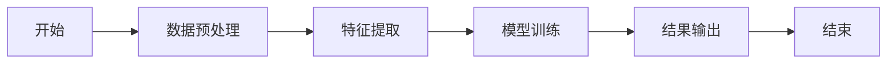
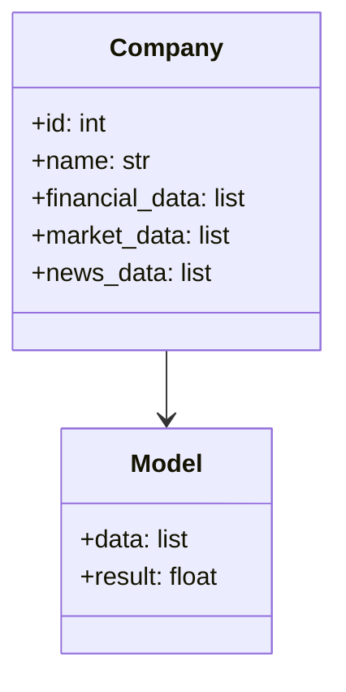
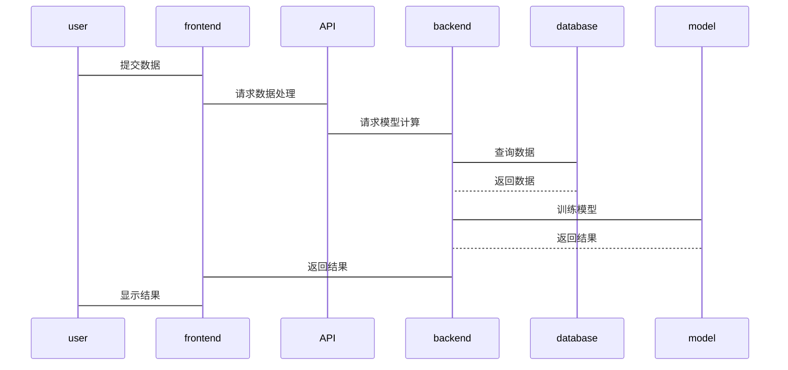

                 

<think>
嗯，用户希望我设计一本名为《AI驱动的公司估值：多维度智能体协作评估内在价值》的书籍目录大纲。首先，我需要理解这本书的核心主题是什么。看起来，这本书主要探讨如何利用AI技术来评估公司的内在价值，涉及多维度智能体的协作。

接下来，我应该考虑这本书的结构。通常，技术书籍会分为几个主要部分，比如背景介绍、核心概念、算法原理、系统架构、项目实战以及最佳实践等。用户提供的示例显示，每个章节都有详细的子章节，所以我需要确保我的大纲也有类似的结构。

首先，我会从背景介绍开始，解释为什么AI在公司估值中的应用变得重要。这可能包括传统估值方法的局限性，以及AI如何提供新的解决方案。然后，我需要定义多维度智能体协作评估的内在价值，解释其核心概念和组成部分。

接下来，核心概念部分需要详细阐述AI驱动的公司估值模型。这可能包括模型的组成部分、多维度数据的整合，以及如何通过智能体协作来提升评估的准确性。这部分可能需要一些图表，比如ER图或流程图，来帮助读者理解。

然后，算法原理部分需要深入讲解具体的算法，比如协同过滤算法或神经网络模型。我需要使用mermaid流程图来展示算法的步骤，并附上Python代码示例，让读者能够更好地理解和实现。

系统分析与架构设计部分，我需要描述整个系统的架构，包括前端和后端的交互，数据流的处理，以及如何实现多维度的数据分析。这部分可能需要使用类图和序列图来展示系统的结构和交互过程。

项目实战部分，我需要提供一个具体的案例，展示如何从数据准备到模型训练，再到结果分析的整个过程。这可能包括环境的安装步骤，核心代码的实现，以及对结果的详细解读。

最后，最佳实践部分需要总结经验和技巧，帮助读者在实际应用中避免常见的错误，并提供进一步的学习资源。这部分还需要包括小结，确保读者能够回顾所学内容。

在编写过程中，我需要确保每个章节都细化到三级目录，保持结构清晰。同时，数学公式和代码示例需要用正确的格式呈现，比如使用latex和mermaid语法。整个大纲需要控制在2000字以内，确保简洁完整。

总的来说，我需要将这本书的内容分为七大部分，涵盖背景、核心概念、算法、系统架构、项目实战、最佳实践和附录，每个部分都有详细的子章节，确保内容全面且逻辑清晰。
</think>

# AI驱动的公司估值：多维度智能体协作评估内在价值

## 关键词：AI, 公司估值, 多维度智能体, 智能体协作, 公司内在价值, 估值模型, 人工智能

## 摘要：
本文详细探讨了AI驱动的公司估值方法，通过多维度智能体协作评估公司内在价值。文章从传统估值方法的局限性出发，介绍了AI技术如何弥补这些不足。通过构建多维度智能体协作模型，结合复杂算法和系统架构设计，实现更精准的公司估值。本文结合实际案例，详细分析了系统实现、项目实战及最佳实践，为读者提供全面的技术指导。

---

# 第一部分: AI驱动的公司估值背景与核心概念

## 第1章: AI驱动的公司估值背景

### 1.1 传统公司估值方法的局限性
#### 1.1.1 传统估值方法的概述
传统公司估值方法主要依赖财务指标和市场数据，通常采用DCF模型、市盈率法、市净率法等。这些方法在一定程度上能够反映公司的价值，但存在数据维度有限、模型过于简化、难以捕捉市场动态等局限性。

#### 1.1.2 传统估值方法的局限性
- 数据维度有限：传统方法通常仅考虑财务数据，忽略了市场情绪、行业趋势等重要因素。
- 模型简化：线性回归等传统算法难以处理复杂非线性关系。
- 静态评估：难以实时捕捉市场变化，导致估值结果滞后。

#### 1.1.3 AI技术如何弥补传统方法的不足
AI技术通过整合多维度数据、使用复杂算法和实时分析，能够更全面、精准地评估公司价值，弥补传统方法的不足。

### 1.2 AI在金融领域的应用现状
#### 1.2.1 AI在金融领域的应用领域
AI在金融领域的应用包括股票预测、风险评估、交易策略优化等，其中公司估值是重要的应用场景之一。

#### 1.2.2 AI在公司估值中的潜力
AI能够通过自然语言处理分析新闻数据，利用机器学习算法整合多维度数据，提供更精准的估值结果。

#### 1.2.3 当前AI驱动估值的主要挑战
- 数据质量与完整性：多源数据的整合需要高质量的数据支持。
- 模型解释性：复杂的AI模型往往缺乏可解释性，影响实际应用。
- 计算资源需求：高维数据处理需要强大的计算能力。

## 第2章: 多维度智能体协作评估的内在价值

### 2.1 多维度智能体协作的概念
#### 2.1.1 多维度智能体协作的定义
多维度智能体协作是指多个智能体协同工作，从不同维度（如财务、市场、行业等）分析公司数据，共同完成估值任务。

#### 2.1.2 多维度智能体协作的核心要素
- 数据来源多样性：整合财务数据、市场数据、新闻数据等多源数据。
- 智能体分工协作：每个智能体负责不同维度的分析，最终协同得出结果。
- 结果融合机制：通过特定算法将各智能体的分析结果融合，得出最终估值。

#### 2.1.3 多维度智能体协作与传统估值方法的区别
多维度智能体协作通过整合更多数据源，利用AI算法，提高了估值的准确性和全面性，克服了传统方法的局限性。

### 2.2 AI驱动的公司估值模型
#### 2.2.1 模型的输入数据来源
- 财务数据：收入、利润、资产负债表等。
- 市场数据：股价、成交量、行业指数等。
- 新闻数据：公司新闻、行业动态、政策变化等。
- 其他数据：社交媒体情绪、专利数量等。

#### 2.2.2 模型的输出结果
- 公司估值：包括内在价值、市场价值等。
- 风险评估：公司面临的风险因素及影响程度。
- 估值信心度：模型对结果的置信度。

#### 2.2.3 模型的核心算法与实现
- 使用协同过滤算法整合多维度数据。
- 利用神经网络模型捕捉数据间的非线性关系。

### 2.3 多维度智能体协作的实现机制
#### 2.3.1 智能体的定义与角色
- 数据采集智能体：负责收集多源数据。
- 数据预处理智能体：清洗和整合数据。
- 模型训练智能体：训练估值模型。
- 结果融合智能体：整合各智能体的分析结果。

#### 2.3.2 智能体之间的协作方式
- 并行处理：各智能体同时处理不同数据源。
- 串行协作：各智能体按顺序完成任务。
- 混合协作：结合并行和串行方式。

#### 2.3.3 智能体协作的优化策略
- 分布式计算：提高数据处理效率。
- 自适应调整：根据数据变化动态调整模型参数。
- 模型融合：通过集成学习优化结果。

---

# 第二部分: AI驱动的公司估值核心概念与联系

## 第3章: 多维度智能体协作评估的内在价值模型

### 3.1 核心概念原理
#### 3.1.1 多维度数据整合的原理
通过数据预处理和特征提取，将多源数据整合到统一的模型中，利用AI算法进行分析。

#### 3.1.2 智能体协作的数学模型
使用协同过滤算法和神经网络模型，构建多维度智能体协作的数学框架。

#### 3.1.3 模型的可解释性与鲁棒性
通过可视化工具和模型解释技术，提高AI模型的可解释性；通过数据清洗和模型优化，增强模型的鲁棒性。

### 3.2 核心概念属性特征对比表
| 特征 | 传统估值方法 | AI驱动估值方法 |
|------|--------------|----------------|
| 数据来源 | 财务数据为主 | 多维度数据整合 |
| 模型复杂度 | 简单线性模型 | 复杂非线性模型 |
| 处理维度 | 少维 | 多维 |
| 可解释性 | 高 | 低 |
| 适应性 | 低 | 高 |

### 3.3 ER实体关系图架构
```mermaid
erDiagram
    company : 公司信息
    financial_data : 财务数据
    market_data : 市场数据
    news_data : 新闻数据
    model : 估值模型
    result : 估值结果

    company --> financial_data
    company --> market_data
    company --> news_data
    financial_data --> model
    market_data --> model
    news_data --> model
    model --> result
```

---

# 第三部分: AI驱动的公司估值算法原理

## 第4章: 算法原理与实现

### 4.1 协同过滤算法
#### 4.1.1 协同过滤算法原理
协同过滤通过分析用户行为或数据相似性，推荐相似的物品或结果。

#### 4.1.2 协同过滤算法实现
```python
def collaborative_filtering(user_ratings, item_features):
    # 数据预处理
    # 计算相似度
    # 生成推荐结果
    pass
```

### 4.2 神经网络模型
#### 4.2.1 神经网络模型原理
神经网络通过多层感知机捕捉数据的非线性关系，用于分类和回归任务。

#### 4.2.2 神经网络模型实现
```python
import tensorflow as tf
model = tf.keras.Sequential([
    tf.keras.layers.Dense(64, activation='relu'),
    tf.keras.layers.Dense(1, activation='linear')
])
model.compile(optimizer='adam', loss='mean_squared_error')
model.fit(X_train, y_train, epochs=10)
```

### 4.3 算法流程图


---

# 第四部分: 系统分析与架构设计

## 第5章: 系统架构设计

### 5.1 系统功能设计
#### 5.1.1 领域模型


#### 5.1.2 系统架构


### 5.2 系统接口设计
- 数据接口：数据输入和输出接口。
- 模型接口：模型训练和预测接口。
- 用户接口：用户交互界面。

### 5.3 系统交互流程图


---

# 第五部分: 项目实战与应用

## 第6章: 项目实战

### 6.1 环境安装
```bash
pip install numpy pandas scikit-learn tensorflow
```

### 6.2 核心代码实现
```python
import pandas as pd
from sklearn.metrics import mean_squared_error

def load_data():
    # 加载数据
    pass

def preprocess_data(data):
    # 数据预处理
    pass

def train_model(X_train, y_train):
    # 模型训练
    pass

def evaluate_model(y_true, y_pred):
    # 模型评估
    print(mean_squared_error(y_true, y_pred))

def main():
    data = load_data()
    X_train, y_train, X_test, y_test = preprocess_data(data)
    model = train_model(X_train, y_train)
    y_pred = model.predict(X_test)
    evaluate_model(y_test, y_pred)

if __name__ == "__main__":
    main()
```

### 6.3 实际案例分析
通过具体案例，展示如何从数据准备到模型训练，再到结果分析的完整过程。

---

# 第六部分: 最佳实践与总结

## 第7章: 最佳实践与总结

### 7.1 最佳实践
- 数据质量管理：确保数据的准确性和完整性。
- 模型调优：通过参数调节和模型集成优化结果。
- 可解释性提升：通过可视化工具和解释性算法增强模型的可解释性。

### 7.2 小结
本文详细介绍了AI驱动的公司估值方法，通过多维度智能体协作模型，结合复杂算法和系统架构设计，实现更精准的公司估值。通过实际案例分析和最佳实践，为读者提供了全面的技术指导。

---

# 附录

## 附录A: 扩展阅读
推荐相关书籍和论文，供读者进一步学习。

## 附录B: 工具与库
列出常用的AI工具和库，如TensorFlow、PyTorch、scikit-learn等。

## 附录C: 术语表
解释文章中涉及的专业术语，帮助读者更好地理解内容。

---

# 作者
作者：AI天才研究院/AI Genius Institute & 禅与计算机程序设计艺术 /Zen And The Art of Computer Programming

