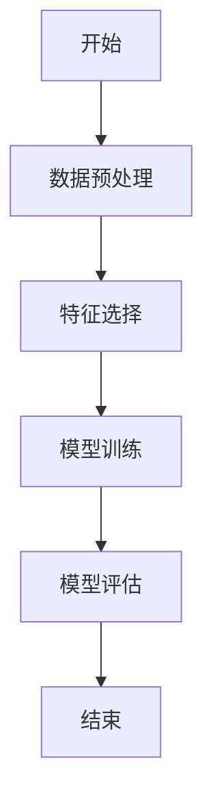

                 


# AI驱动的公司信用风险评估：增强价值投资的安全性

> 关键词：AI驱动、公司信用风险评估、信用评分模型、投资决策优化、机器学习算法、风险管理

> 摘要：本文探讨了AI技术如何在公司信用风险评估中发挥作用，通过分析信用风险评估的核心概念、AI算法的应用、数学模型的构建以及系统架构设计，展示了如何利用AI技术增强价值投资的安全性。文章详细介绍了从数据采集到模型部署的整个流程，并通过实际案例分析，证明了AI驱动的信用风险评估在提升投资决策准确性方面的优势。

---

## 第一部分: 公司信用风险评估的背景与AI驱动的机遇

### 第1章: 公司信用风险评估概述

#### 1.1 信用风险评估的基本概念
信用风险是指公司在履行债务时可能发生的违约风险。评估信用风险的核心在于分析公司的财务状况、市场表现和经营环境等因素。传统的信用评估方法依赖于人工分析和简单的统计模型，存在效率低、主观性强的问题。

#### 1.2 价值投资与信用风险评估的关系
价值投资强调以低于内在价值的价格买入优质资产。信用风险评估是价值投资中的关键环节，通过评估公司的信用状况，投资者可以更好地识别潜在风险，优化投资组合。

#### 1.3 AI技术在信用风险评估中的应用前景
AI技术，特别是机器学习算法，能够处理海量数据，发现复杂模式，显著提升信用风险评估的准确性和效率。AI在信用风险评估中的应用前景广阔，尤其是在数据量大、复杂性高的场景下表现突出。

---

### 第2章: AI驱动信用风险评估的核心概念与联系

#### 2.1 核心概念原理
- **数据特征提取**：从公司财务报表、市场数据、行业趋势等多源数据中提取关键特征，用于模型训练。
- **模型评估指标**：如准确率、召回率、F1分数等，用于评估模型的性能。
- **结果解释方法**：通过可解释性模型（如线性回归）或特征重要性分析，帮助理解模型决策依据。

#### 2.2 核心概念属性特征对比表格
以下表格对比了传统方法和AI方法在信用风险评估中的表现：

| 特性 | 传统方法 | AI方法 |
|------|----------|--------|
| 数据处理 | 简单特征提取 | 多维特征提取 |
| 模型复杂度 | 线性模型为主 | 非线性模型为主 |
| 精度 | 较低 | 较高 |
| 计算效率 | 较低 | 较高 |

#### 2.3 ER实体关系图架构
以下是信用风险评估的实体关系图：

```mermaid
er
    %% 信用风险评估实体关系图
    entity 公司 {
        key: 公司ID
        attributes: 公司名称、行业、成立时间、注册资本
    }
    entity 财务数据 {
        key: 财务数据ID
        attributes: 营业收入、净利润、资产负债率
    }
    entity 信用评分 {
        key: 评分ID
        attributes: 评分值、评分时间
    }
    公司 --> 财务数据: 关联关系
    财务数据 --> 信用评分: 关联关系
```

---

### 第3章: AI驱动信用风险评估的算法原理

#### 3.1 常见算法概述
- **逻辑回归**：用于分类问题，通过logit函数预测违约概率。
- **决策树**：通过树状结构进行分类，适合处理多分类问题。
- **神经网络**：通过多层感知机模拟非线性关系，适合复杂场景。

#### 3.2 算法流程图
以下是逻辑回归算法的流程图：



#### 3.3 算法数学公式
- 逻辑回归模型：
  $$ P(y=1|x) = \frac{1}{1 + e^{-\beta x}} $$
  
  其中，$\beta$ 是模型参数，$x$ 是输入特征。

---

### 第4章: 数学模型与公式

#### 4.1 信用风险评估模型
- 线性回归模型：
  $$ y = \beta_0 + \beta_1x_1 + \beta_2x_2 + \ldots + \beta_nx_n $$
  
- 非线性回归模型（如支持向量机）：
  $$ y = \text{sign}(\beta_0 + \beta_1x_1 + \beta_2x_2 + \ldots + \beta_nx_n) $$
  
- 集成学习模型（如随机森林）：
  $$ y = \text{多数投票}(\text{树模型结果}) $$

---

### 第5章: 系统分析与架构设计方案

#### 5.1 问题场景介绍
- **数据来源**：公司财务数据、行业指数、市场波动等。
- **目标**：预测公司违约概率，优化投资组合。
- **技术需求**：高效数据处理、实时模型更新。

#### 5.2 系统功能设计
- **数据采集模块**：接口对接财务系统和市场数据源。
- **模型训练模块**：定期更新模型参数，确保评估准确。
- **风险评估模块**：输出公司信用评分和风险提示。

#### 5.3 系统架构设计
以下是系统架构图：


---

### 第6章: 项目实战与案例分析

#### 6.1 环境安装
- **Python版本**：3.8+
- **依赖库安装**：`pip install pandas scikit-learn matplotlib`

#### 6.2 核心代码实现
以下是信用评分模型的实现代码：

```python
import pandas as pd
from sklearn.model_selection import train_test_split
from sklearn.linear_model import LogisticRegression
from sklearn.metrics import accuracy_score

# 数据加载
data = pd.read_csv('company_data.csv')

# 特征选择
X = data[['revenue', 'profit', 'debt']]
y = data['default']

# 数据分割
X_train, X_test, y_train, y_test = train_test_split(X, y, test_size=0.2)

# 模型训练
model = LogisticRegression()
model.fit(X_train, y_train)

# 模型预测
y_pred = model.predict(X_test)

# 模型评估
print("准确率:", accuracy_score(y_test, y_pred))
```

#### 6.3 案例分析
以某公司为例，通过模型预测其违约概率为30%，建议投资者谨慎考虑。

---

## 第七部分: 总结与展望

### 7.1 总结
AI技术显著提升了信用风险评估的效率和准确性，为价值投资提供了有力支持。

### 7.2 展望
未来，随着深度学习和强化学习的发展，信用风险评估将更加智能化和个性化。

---

## 附录: 最佳实践 tips

- **数据清洗**：确保数据质量，避免偏差。
- **模型解释性**：选择可解释的模型，便于决策。
- **实时更新**：定期更新模型，应对市场变化。

---

作者：AI天才研究院/AI Genius Institute & 禅与计算机程序设计艺术 /Zen And The Art of Computer Programming

