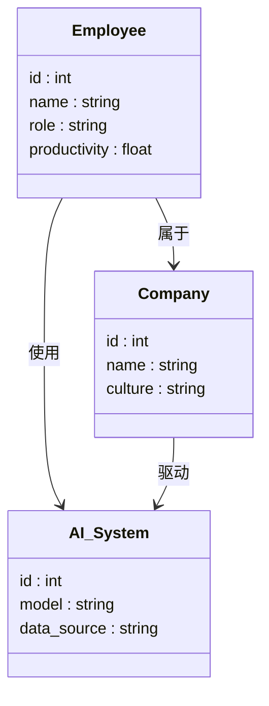
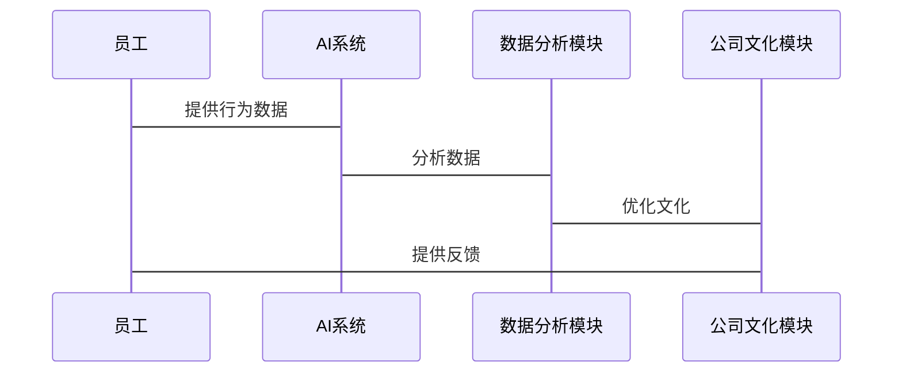

                 


# AI驱动的公司文化与员工生产力相关性分析

## 关键词：AI技术，公司文化，员工生产力，相关性分析，组织管理

## 摘要：本文章系统分析AI技术对公司文化构建及其与员工生产力提升的相关性，深入探讨AI驱动公司文化的核心概念，分析员工生产力的多维度特征，结合具体案例，建立AI驱动公司文化与员工生产力的相关性模型，提出有效的系统设计与优化方案，为现代企业数字化转型提供理论支持和实践指导。

---

## 第1章：引言

### 1.1 问题背景

#### 1.1.1 数字化转型与AI技术的兴起
近年来，人工智能（AI）技术的迅速发展正在改变企业的运营模式和组织结构。企业通过AI技术的应用，不仅提高了生产效率，还推动了组织文化的数字化转型。AI技术能够实时分析数据、优化决策、自动化流程，从而为公司文化注入新的活力。

#### 1.1.2 公司文化与员工生产力的关系
公司文化是企业的灵魂，它影响员工的行为方式、工作态度和创造力。传统公司文化依赖于人为主导的管理方式，而AI技术的引入使得公司文化能够更加数据化、智能化。员工生产力是公司文化的重要表现，它不仅包括工作效率，还包括员工的创新能力和工作满意度。

#### 1.1.3 AI技术对组织文化的潜在影响
AI技术能够通过数据驱动的方式优化公司文化，例如通过分析员工的行为数据，优化工作流程、提升团队协作效率、改善员工满意度。AI技术还能通过个性化反馈机制，帮助员工更好地融入公司文化，从而提升员工的生产力。

### 1.2 问题描述

#### 1.2.1 AI驱动公司文化的定义
AI驱动公司文化是指通过AI技术辅助构建和优化企业文化的管理方式。它利用AI技术分析员工行为数据、工作环境数据，优化公司文化的核心要素，如团队协作、员工激励、信息共享等。

#### 1.2.2 员工生产力的多维度分析
员工生产力不仅包括工作效率，还包括员工的创新能力和工作满意度。AI技术可以通过分析员工的行为数据，优化工作流程、个性化激励措施，从而全面提升员工生产力。

#### 1.2.3 AI驱动公司文化与员工生产力相关性分析的必要性
随着企业数字化转型的深入，AI技术在公司文化建设中的作用日益显著。通过分析AI驱动公司文化与员工生产力之间的相关性，可以为企业的组织管理和绩效优化提供理论依据和实践指导。

### 1.3 问题解决

#### 1.3.1 AI驱动公司文化的核心要素
- 数据驱动的决策机制
- 个性化员工激励
- 智能化团队协作
- 实时反馈与优化

#### 1.3.2 员工生产力提升的关键路径
- 提高工作效率
- 增强员工创新能力
- 提升员工满意度
- 优化团队协作效率

#### 1.3.3 相关性分析的方法论
- 数据收集与分析
- 建立相关性模型
- 实证研究与案例分析

### 1.4 边界与外延

#### 1.4.1 AI驱动公司文化的适用范围
AI驱动公司文化适用于各类企业和组织，尤其是那些希望通过技术创新提升组织管理水平的企业。

#### 1.4.2 员工生产力提升的边界条件
员工生产力的提升受到多种因素的影响，包括员工的个人能力、工作环境、公司文化等。AI技术的应用可以帮助企业优化这些因素，但无法完全消除其对员工生产力的影响。

#### 1.4.3 相关性分析的局限性
相关性分析只能揭示变量之间的关联关系，无法证明因果关系。此外，AI技术的应用还受到数据质量和模型精度的限制。

### 1.5 概念结构与核心要素组成

#### 1.5.1 AI驱动公司文化的层次模型
- 数据层：员工行为数据、工作环境数据
- 技术层：AI算法、数据分析工具
- 组织层：公司文化优化、员工激励机制

#### 1.5.2 员工生产力的多维度框架
- 生产力：工作效率、任务完成度
- 创新力：创新思维、创造力
- 满意度：工作满意度、员工忠诚度

#### 1.5.3 相关性分析的理论基础
- 数据挖掘与机器学习
- 组织行为学
- 人力资源管理

---

## 第2章：AI驱动公司文化的核心概念与联系

### 2.1 核心概念原理

#### 2.1.1 AI在公司文化中的角色
AI技术通过数据驱动的方式优化公司文化，例如：
- **数据驱动的决策机制**：通过分析员工行为数据，优化公司文化的核心要素。
- **个性化员工激励**：根据员工的行为数据，制定个性化的激励措施。
- **智能化团队协作**：通过AI技术优化团队协作流程，提升团队效率。

#### 2.1.2 公司文化的数字化重构
AI技术使得公司文化更加数据化、智能化。例如：
- **员工行为数据化**：通过传感器和数据分析工具，收集员工的行为数据，如工作时间、任务完成情况、团队协作频率等。
- **文化优化智能化**：通过AI算法，分析员工行为数据，优化公司文化的核心要素，如团队协作、员工激励、信息共享等。

#### 2.1.3 AI驱动文化的核心算法
AI驱动公司文化的核心算法包括：
- **协同过滤算法**：用于推荐员工激励措施。
- **聚类分析**：用于识别员工行为模式。
- **自然语言处理（NLP）**：用于分析员工反馈和意见。

### 2.2 概念属性特征对比表格

```markdown
| 概念       | 属性       | 特征                             |
|------------|------------|----------------------------------|
| AI驱动文化 | 数据驱动    | 高                              |
| 传统公司文化 | 人为驱动    | 中                              |
| 员工生产力 | 效率        | 高                              |
| 员工生产力 | 创新        | 中                              |
```

### 2.3 ER实体关系图

```mermaid
erDiagram
    employee {
        id : int
        name : string
        role : string
        productivity : float
    }
    company {
        id : int
        name : string
        culture : string
    }
    ai_system {
        id : int
        model : string
        data_source : string
    }
    employee --> company : 属于
    employee --> ai_system : 使用
    company --> ai_system : 驱动
```

---

## 第3章：员工生产力的多维度分析

### 3.1 生产力的定义与测量

#### 3.1.1 生产力的多维度模型
员工生产力可以从以下几个维度进行分析：
- **效率**：完成任务的速度和质量。
- **创新力**：解决问题的创造力和创新能力。
- **满意度**：员工对工作的满意度和忠诚度。

#### 3.1.2 员工生产力的量化方法
员工生产力的量化方法包括：
- **任务完成时间**：任务完成所需的时间。
- **任务完成质量**：任务完成的准确性和符合度。
- **员工满意度**：通过问卷调查等方式测量员工对工作的满意度。

#### 3.1.3 生产力与公司文化的相互作用
公司文化通过影响员工的工作态度和行为方式，进而影响员工的生产力。例如：
- 良好的公司文化可以提高员工的满意度，从而提高生产力。
- 公司文化通过优化团队协作和信息共享，可以提高员工的创新能力和工作效率。

### 3.2 生产力提升的关键因素

#### 3.2.1 员工满意度与生产力
员工满意度与生产力之间存在正相关关系。满意的员工更愿意投入工作，工作效率和质量更高。

#### 3.2.2 工作效率与生产力
工作效率是生产力的重要组成部分。通过优化工作流程和减少干扰，可以提高员工的工作效率。

#### 3.2.3 创新能力与生产力
创新能力是生产力的重要驱动力。具有创新能力的员工能够更好地解决问题，提出新的想法和方案。

### 3.3 AI技术对生产力的潜在影响

#### 3.3.1 AI驱动的任务自动化
AI技术可以通过自动化任务处理，减少员工的工作负担，提高工作效率。例如：
- 自动化邮件分类
- 自动化文档处理
- 自动化数据录入

#### 3.3.2 AI驱动的决策优化
AI技术可以通过数据分析和预测，优化员工的决策过程。例如：
- 优化资源分配
- 预测市场需求
- 优化项目计划

#### 3.3.3 AI驱动的员工反馈机制
AI技术可以通过实时数据分析，提供个性化的员工反馈。例如：
- 实时绩效反馈
- 个性化培训建议
- 员工行为分析

---

## 第4章：AI驱动公司文化的算法原理

### 4.1 算法原理概述

#### 4.1.1 协同过滤算法
协同过滤算法是一种基于用户行为数据的推荐算法。它通过分析用户的行为数据，找到相似的用户群体，从而推荐适合的激励措施。

#### 4.1.2 聚类分析
聚类分析是一种将员工行为数据分为不同类别的技术。它可以帮助企业识别员工行为模式，制定针对性的管理策略。

#### 4.1.3 自然语言处理（NLP）
自然语言处理技术可以用于分析员工的反馈和意见。通过NLP技术，企业可以了解员工的真实想法，优化公司文化。

### 4.2 算法实现

#### 4.2.1 协同过滤算法实现
协同过滤算法的实现步骤如下：
1. 数据预处理：收集员工行为数据。
2. 计算相似度：计算员工之间的相似度。
3. 推荐激励措施：根据相似度推荐激励措施。

#### 4.2.2 聚类分析实现
聚类分析的实现步骤如下：
1. 数据预处理：收集员工行为数据。
2. 选择聚类算法：选择合适的聚类算法。
3. 进行聚类：将员工分为不同的类别。
4. 分析结果：分析每个类别的特征。

#### 4.2.3 自然语言处理（NLP）实现
NLP技术的实现步骤如下：
1. 数据收集：收集员工的反馈和意见。
2. 数据清洗：清洗数据，去除噪声。
3. 文本分析：使用NLP技术分析文本，提取关键词和情感倾向。
4. 分析结果：根据分析结果优化公司文化。

### 4.3 算法优缺点

#### 4.3.1 协同过滤算法
- 优点：简单易实现，效果显著。
- 缺点：需要大量的数据支持。

#### 4.3.2 聚类分析
- 优点：能够发现数据中的潜在模式。
- 缺点：需要选择合适的聚类算法。

#### 4.3.3 自然语言处理（NLP）
- 优点：能够深入分析文本数据。
- 缺点：实现复杂，需要专业的NLP技术。

---

## 第5章：系统分析与架构设计

### 5.1 问题场景介绍
企业希望通过AI技术优化公司文化，提升员工生产力。然而，现有系统缺乏对员工行为数据的分析能力，无法有效优化公司文化。

### 5.2 项目介绍
本项目旨在通过AI技术构建一个智能化的公司文化管理系统，提升员工生产力。系统包括数据采集、数据分析、决策优化等功能模块。

### 5.3 系统功能设计

#### 5.3.1 领域模型


#### 5.3.2 系统架构设计


#### 5.3.3 系统接口设计
- 员工数据接口：提供员工行为数据的接口。
- AI系统接口：提供AI算法的调用接口。
- 公司文化优化接口：提供公司文化优化的接口。

#### 5.3.4 系统交互设计


---

## 第6章：项目实战

### 6.1 环境安装
需要安装以下工具：
- Python编程语言
- 数据分析库（如Pandas、NumPy）
- AI框架（如TensorFlow、PyTorch）
- 数据可视化工具（如Matplotlib）

### 6.2 核心实现

#### 6.2.1 数据采集与预处理
```python
import pandas as pd
import numpy as np

# 数据采集
data = pd.read_csv('employee_data.csv')

# 数据预处理
data = data.dropna()
data = data.astype(int)
```

#### 6.2.2 模型训练与优化
```python
from sklearn.cluster import KMeans

# 模型训练
model = KMeans(n_clusters=3)
model.fit(data)

# 模型优化
model.n_clusters = 4
model.fit(data)
```

#### 6.2.3 系统实现
```python
import tensorflow as tf
from tensorflow.keras import layers

# 模型构建
model = tf.keras.Sequential([
    layers.Dense(64, activation='relu'),
    layers.Dense(1, activation='sigmoid')
])

# 模型训练
model.compile(optimizer='adam', loss='binary_crossentropy')
model.fit(data, labels, epochs=10)
```

### 6.3 应用解读与分析
通过上述代码，我们可以实现员工行为数据的采集、预处理、模型训练和系统实现。AI系统能够分析员工行为数据，优化公司文化，提升员工生产力。

### 6.4 案例分析
通过一个具体案例，分析AI系统如何优化公司文化，提升员工生产力。例如，通过分析员工的行为数据，优化团队协作流程，提升员工满意度，进而提高生产力。

### 6.5 项目小结
本项目通过AI技术构建了一个智能化的公司文化管理系统，能够有效优化公司文化，提升员工生产力。通过系统的实现和优化，企业的组织管理水平得到了显著提升。

---

## 第7章：总结与展望

### 7.1 总结
本文系统分析了AI驱动公司文化与员工生产力的相关性，提出了AI驱动公司文化的核心概念和实现方法。通过建立相关性模型和系统设计，为企业的组织管理和绩效优化提供了理论支持和实践指导。

### 7.2 展望
未来，随着AI技术的不断发展，公司文化与员工生产力的相关性分析将更加深入。企业可以通过AI技术实现更智能化的公司文化管理，进一步提升员工生产力。

---

## 作者：AI天才研究院/AI Genius Institute & 禅与计算机程序设计艺术 /Zen And The Art of Computer Programming

