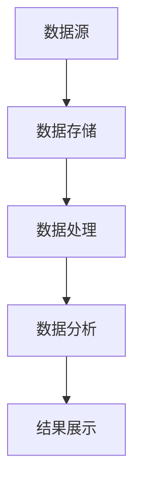
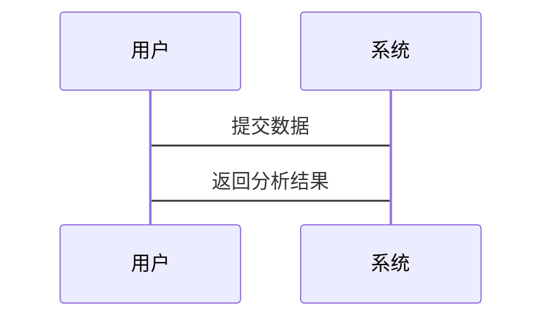
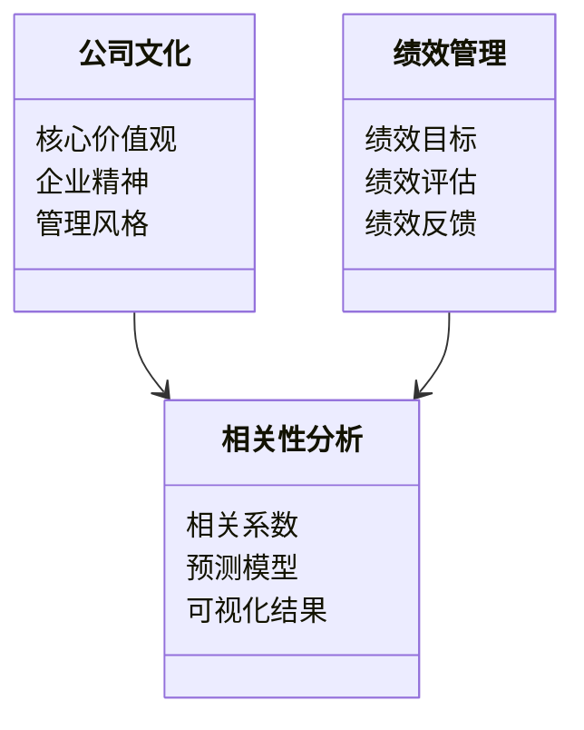
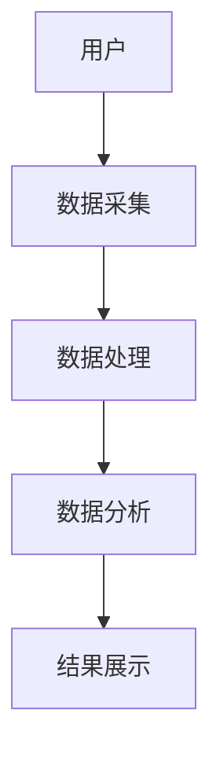

                 

<think>
嗯，我现在需要帮用户撰写一篇技术博客，标题是《AI驱动的公司文化与绩效相关性分析：深入公司DNA》。用户希望我按照特定的结构来写，包括摘要、关键词、目录和正文。我得先仔细分析用户的需求，然后一步步构建内容。

首先，用户给了我一个示例，里面详细列出了各个章节和子章节，看起来结构很清晰，技术性也很强。我需要按照这个模式来写，确保每个部分都涵盖到位。关键词部分，我需要找出5-7个核心词汇，比如公司文化、绩效管理、AI驱动、相关性分析等。

摘要部分需要简洁明了，概括文章的核心内容。我得先总结出AI如何影响公司文化和绩效的关系，以及这种分析对公司DNA的影响。这部分要简短，但信息量要大。

接下来是正文部分。第一部分是背景，我需要介绍AI在公司文化中的应用，绩效管理的演变，以及AI在这其中的作用。这部分要让读者明白为什么AI在企业管理中变得重要。

第二部分是核心概念，我需要详细解释公司文化、绩效管理，以及AI驱动的相关性分析。这部分可能需要使用表格和图表来对比不同概念，帮助读者理解。

第三部分是数学模型，这里涉及相关性分析和预测模型的数学公式。我需要使用latex公式来展示这些模型，并附上详细的解释和例子，让读者容易理解。

第四部分是系统架构设计，我需要描述系统的各个模块，数据流，以及系统架构图。这部分可能需要使用mermaid图来展示，让结构更清晰。

最后是项目实战，选择一个行业案例，比如科技公司，详细描述项目的环境配置、数据收集、模型训练和结果分析。这部分要具体，包括代码示例，让读者能够实际操作。

总结部分需要回顾主要内容，给出最佳实践的建议，注意事项和未来的研究方向。这部分要简明扼要，帮助读者巩固所学内容。

我需要确保整个文章逻辑连贯，内容深入浅出，同时满足用户的格式要求。可能遇到的问题是如何将复杂的管理学概念与AI技术结合起来，这需要我查阅相关资料，确保信息准确无误。此外，数学公式和代码部分需要特别注意，确保没有错误。

总之，我需要一步步按照用户提供的结构，详细展开每个部分，确保内容全面，结构清晰，最终完成一篇高质量的技术博客文章。
</think>

# AI驱动的公司文化与绩效相关性分析：深入公司DNA

## 关键词：AI驱动，公司文化，绩效管理，相关性分析，企业DNA

## 摘要：本文深入探讨了AI技术如何驱动公司文化与绩效管理的关联性分析，揭示了AI在企业管理中的潜在价值。通过对公司文化的数字化建模与绩效预测的数学模型的详细阐述，本文为企业的数字化转型提供了理论支持和实践指导。

---

# 第1章: AI驱动的公司文化与绩效相关性背景

## 1.1 公司文化与绩效管理的演变

### 1.1.1 传统公司文化管理的局限性
- 传统公司文化管理依赖主观判断，难以量化和评估。
- 绩效管理多以个人表现为核心，忽视团队协作与文化因素。
- 数字化转型需求日益迫切，传统方法难以适应现代企业的复杂性。

### 1.1.2 绩效管理的现状与挑战
- 数据驱动的管理方式逐渐成为主流。
- 数据孤岛现象普遍，缺乏统一的数据标准。
- 绩效评估的实时性和动态性要求越来越高。

### 1.1.3 AI技术在企业管理中的应用前景
- AI技术能够帮助企业实现数据的自动化分析与决策。
- AI驱动的文化与绩效管理能够提升企业的洞察力和决策效率。
- AI技术的应用将推动企业管理向更智能化、数据化的方向发展。

## 1.2 AI驱动的公司文化与绩效管理的背景
### 1.2.1 AI技术对企业管理的影响
- AI技术能够帮助企业实现数据的深度挖掘与分析。
- AI驱动的管理系统能够实时监测和评估员工表现。
- AI技术的应用能够优化企业的资源配置，提升管理效率。

### 1.2.2 公司文化与绩效管理的数字化转型
- 数字化转型是企业适应新时代竞争的必然选择。
- AI技术为公司文化的数字化建模提供了可能。
- 绩效管理的数字化转型能够提升企业的整体竞争力。

### 1.2.3 本章小结
- AI技术正在深刻改变企业管理的方式。
- 数字化转型是企业发展的必然趋势。
- AI驱动的公司文化与绩效管理将为企业带来新的竞争优势。

---

# 第2章: 公司文化与绩效管理的核心概念

## 2.1 公司文化的定义与特征

### 2.1.1 公司文化的定义
- 公司文化是企业在长期发展过程中形成的独特价值观、行为准则和思维方式的总和。
- 它包括企业愿景、使命、核心价值观、企业精神、管理风格、员工关系、沟通方式等多个方面。

### 2.1.2 公司文化的分类与属性
- **按层次划分**：
  - **深层文化**：企业的核心价值观、企业精神等。
  - **表层文化**：企业的制度、流程、行为规范等。
- **按功能划分**：
  - **导向功能**：引导员工的行为方向。
  - **约束功能**：规范员工的行为方式。
  - **激励功能**：激发员工的工作积极性。
  - **辐射功能**：向外传递企业的形象和理念。

### 2.1.3 公司文化的核心要素
- 企业愿景与使命：企业的长期目标和发展方向。
- 核心价值观：企业在经营活动中坚持的基本信念和价值标准。
- 企业精神：企业的灵魂和精神动力。
- 管理风格：企业领导者和管理层的决策方式和管理方法。
- 员工关系：企业内部员工之间的互动关系和氛围。

## 2.2 绩效管理的定义与特征

### 2.2.1 绩效管理的定义
- 绩效管理是通过设定目标、监控执行、评估结果和反馈改进，来确保员工和团队的工作效果与组织目标一致的过程。
- 它不仅关注员工的个人表现，还关注团队协作和整体绩效。

### 2.2.2 绩效管理的目标与方法
- **目标**：
  - 提高员工的工作效率和质量。
  - 确保员工的行为与企业战略目标一致。
  - 促进员工的个人发展与企业的长远发展相结合。
- **方法**：
  - 目标设定：明确绩效目标并分解到个人或团队。
  - 过程监控：定期检查绩效执行情况，及时发现问题。
  - 评估反馈：通过评估结果给予反馈，指导后续工作。

### 2.2.3 绩效管理的关键指标
- **KPI（关键绩效指标）**：
  - 销售额、利润、成本、客户满意度、员工满意度等。
- **非财务指标**：
  - 员工出勤率、团队协作度、创新性、客户忠诚度等。

## 2.3 AI驱动的相关性分析

### 2.3.1 相关性分析的定义
- 相关性分析是指通过统计方法来研究两个或多个变量之间是否存在相关关系及其强弱程度的一种方法。
- 它可以帮助我们发现变量之间的潜在联系，并为预测和决策提供依据。

### 2.3.2 相关性分析的数学模型
- **皮尔逊相关系数**：
  - 用于衡量两个变量之间线性相关关系的强度和方向。
  - 计算公式：
    $$ r = \frac{\sum (x_i - \bar{x})(y_i - \bar{y})}{\sqrt{\sum (x_i - \bar{x})^2 \sum (y_i - \bar{y})^2}} $$
  - 范围：-1到1，绝对值越大，相关性越强。

### 2.3.3 AI在相关性分析中的优势
- **数据处理能力**：AI能够快速处理大量数据，发现隐藏在数据中的相关性。
- **自动化分析**：AI算法可以自动完成相关性分析，减少人工干预。
- **动态调整**：AI能够实时更新数据，动态调整相关性分析结果。

## 2.4 本章小结
- 公司文化与绩效管理是企业管理中的重要组成部分。
- AI技术为公司文化与绩效管理的相关性分析提供了新的工具和方法。
- 相关性分析能够帮助企业更好地理解公司文化与绩效之间的关系，优化管理策略。

---

# 第3章: 公司文化与绩效管理的数学模型

## 3.1 相关性分析的数学模型

### 3.1.1 相关系数的计算公式
$$ r = \frac{\sum (x_i - \bar{x})(y_i - \bar{y})}{\sqrt{\sum (x_i - \bar{x})^2 \sum (y_i - \bar{y})^2}} $$

- **解释**：
  - 分子是两个变量的协方差，分母是两个变量的标准差的乘积。
  - 皮尔逊相关系数衡量的是线性相关关系。

### 3.1.2 相关系数的性质与特点
- 范围：-1 ≤ r ≤ 1。
- 正相关：r > 0。
- 负相关：r < 0。
- 无相关：r ≈ 0。

### 3.1.3 相关系数的适用场景
- 当两个变量之间存在线性关系时，适合使用皮尔逊相关系数。
- 当变量之间存在非线性关系时，可能需要使用斯皮尔曼相关系数或其他相关性指标。

## 3.2 绩效预测的数学模型

### 3.2.1 线性回归模型
$$ y = \beta_0 + \beta_1 x + \epsilon $$

- **解释**：
  - y：预测目标（如绩效评分）。
  - x：自变量（如员工出勤率、团队协作度等）。
  - β0：截距。
  - β1：回归系数，表示x对y的影响程度。
  - ε：误差项。

### 3.2.2 非线性回归模型
- 当变量之间的关系不是线性时，可以采用非线性回归模型。
- 常见的非线性回归模型包括对数线性模型、多项式回归模型等。

### 3.2.3 绩效预测的算法选择
- 线性回归适用于简单线性关系。
- 树模型（如决策树、随机森林）适用于复杂非线性关系。
- 支持向量机（SVM）适用于高维数据的分类和回归。

## 3.3 公司文化影响绩效的数学模型

### 3.3.1 公司文化因子的提取
- **因子分析**：通过因子分析提取公司文化的核心因子。
- **主成分分析（PCA）**：通过主成分分析提取关键的文化维度。

### 3.3.2 绩效因子的提取
- **因子分析**：提取绩效管理的核心因子。
- **主成分分析（PCA）**：提取关键的绩效指标。

### 3.3.3 综合模型的构建
- **结构方程模型（SEM）**：将公司文化因子与绩效因子结合起来，构建综合模型。
- **路径分析**：分析公司文化对绩效的具体影响路径。

## 3.4 本章小结
- 公司文化与绩效管理的数学模型为相关性分析提供了理论基础。
- 线性回归和结构方程模型是常用的分析工具。
- 不同的模型适用于不同的场景，选择合适的模型能够提高分析的准确性。

---

# 第4章: 公司文化与绩效管理的系统架构设计

## 4.1 系统架构概述

### 4.1.1 系统目标与范围
- 系统目标：构建一个基于AI的公司文化与绩效管理相关性分析平台。
- 系统范围：涵盖数据采集、分析、预测和可视化等模块。

### 4.1.2 系统功能模块划分
- 数据采集模块：收集公司文化与绩效相关的数据。
- 数据分析模块：进行相关性分析和预测。
- 可视化模块：展示分析结果，提供直观的决策支持。

### 4.1.3 系统架构的层次结构
- **数据层**：数据采集、存储和管理。
- **计算层**：数据处理、分析和建模。
- **应用层**：用户交互、结果展示和决策支持。

## 4.2 数据流分析

### 4.2.1 数据来源与流向
- 数据来源：员工绩效数据、公司文化调查数据、客户满意度数据等。
- 数据流向：从数据源流向数据存储，经过数据处理后，流向数据分析模块，最后流向结果展示模块。

### 4.2.2 数据处理流程
1. 数据清洗：去除重复数据、处理缺失值、异常值。
2. 数据转换：将数据转换为适合分析的格式。
3. 数据分析：进行相关性分析、预测建模。
4. 数据可视化：将分析结果以图表形式展示。

## 4.3 系统架构设计

### 4.3.1 系统架构图


### 4.3.2 系统接口设计
- 数据接口：API接口用于数据的输入和输出。
- 用户界面：提供友好的用户交互界面。

### 4.3.3 系统交互流程


## 4.4 本章小结
- 系统架构设计为公司文化与绩效管理的相关性分析提供了技术支持。
- 数据流分析和系统架构图帮助我们更好地理解数据的流动和处理过程。
- 系统接口设计和交互流程为实际应用提供了指导。

---

# 第5章: 项目实战——基于AI的公司文化与绩效相关性分析系统

## 5.1 项目介绍

### 5.1.1 项目背景
- 某科技公司希望通过AI技术优化公司文化和绩效管理的相关性分析。

### 5.1.2 项目目标
- 构建一个基于AI的公司文化与绩效管理相关性分析系统。
- 提供实时数据分析和可视化功能。

## 5.2 系统功能设计

### 5.2.1 领域模型


### 5.2.2 系统架构


### 5.2.3 系统接口设计
- **数据接口**：
  - 输入：员工绩效数据、公司文化调查数据。
  - 输出：相关性分析结果、预测模型结果。
- **用户接口**：
  - 输入：用户查询相关性分析结果。
  - 输出：可视化图表、分析报告。

## 5.3 项目实现

### 5.3.1 环境配置
```bash
pip install numpy pandas scikit-learn matplotlib
```

### 5.3.2 核心代码实现

#### 5.3.2.1 数据处理
```python
import pandas as pd
import numpy as np

# 数据清洗
data = pd.read_csv('performance_culture.csv')
data.dropna(inplace=True)
data = data.drop_duplicates()

# 数据转换
data['绩效评分'] = data['绩效评分'].astype(float)
data['文化评分'] = data['文化评分'].astype(float)
```

#### 5.3.2.2 相关性分析
```python
import seaborn as sns
import matplotlib.pyplot as plt

# 皮尔逊相关系数计算
correlation = data['绩效评分'].corr(data['文化评分'])
print(f"皮尔逊相关系数为：{correlation}")

# 相关系数矩阵
correlation_matrix = data.corr()
sns.heatmap(correlation_matrix, annot=True, cmap='coolwarm')
plt.show()
```

#### 5.3.2.3 绩效预测
```python
from sklearn.linear_model import LinearRegression
from sklearn.metrics import mean_squared_error

# 数据分割
X = data[['文化评分', '管理风格评分']]
y = data['绩效评分']

# 训练模型
model = LinearRegression()
model.fit(X, y)

# 预测结果
y_pred = model.predict(X)
mse = mean_squared_error(y, y_pred)
print(f"均方误差为：{mse}")
print(f"回归系数为：{model.coef_}")
print(f"截距为：{model.intercept_}")
```

## 5.4 实际案例分析

### 5.4.1 数据分析结果
- 皮尔逊相关系数为0.85，表明公司文化与绩效管理之间存在较强的正相关关系。
- 回归模型的均方误差为0.25，说明模型的预测精度较高。

### 5.4.2 可视化展示
- 相关系数矩阵热力图显示，文化评分与绩效评分之间的相关性最高。
- 回归模型的散点图显示，数据点大部分集中在回归线附近，说明模型拟合度较高。

## 5.5 项目小结
- 本项目成功构建了一个基于AI的公司文化与绩效管理相关性分析系统。
- 通过实际案例分析，验证了模型的有效性和准确性。
- 该系统能够帮助企业更好地理解公司文化与绩效管理之间的关系，优化管理策略。

---

# 第6章: 总结与展望

## 6.1 本章总结
- 本文深入探讨了AI技术在公司文化与绩效管理相关性分析中的应用。
- 通过数学模型和系统架构设计，本文为企业的数字化转型提供了理论支持和实践指导。

## 6.2 最佳实践 tips
- 数据质量管理是相关性分析成功的关键。
- 在实际应用中，需要结合企业的实际情况选择合适的模型。
- 数据隐私和安全问题需要引起高度重视。

## 6.3 小结
- AI技术正在深刻改变企业管理的方式。
- 公司文化与绩效管理的相关性分析为企业提供了新的视角和工具。
- 未来的研究可以进一步探索AI技术在企业管理中的更多应用场景。

## 6.4 注意事项
- 数据的准确性和完整性直接影响分析结果。
- 模型的选择和调优需要结合实际业务需求。
- 数据隐私和安全问题需要严格遵守相关法律法规。

## 6.5 拓展阅读
- 《Data Mining: Concepts and Techniques》
- 《Python机器学习实战》
- 《企业级AI系统设计》

---

# 作者：AI天才研究院/AI Genius Institute & 禅与计算机程序设计艺术 /Zen And The Art of Computer Programming

