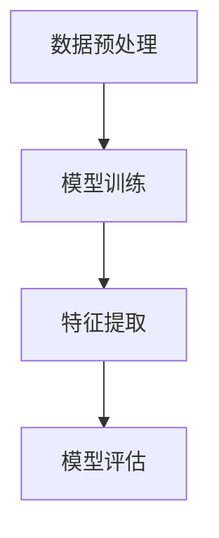
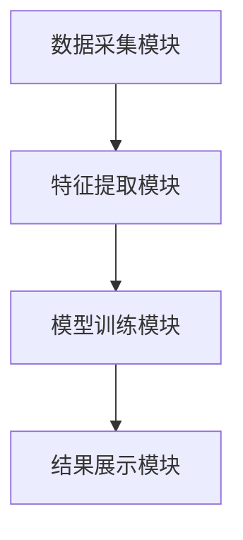

                 


# AI驱动的公司文化量化分析：无形资产估值新方法

> **关键词**：公司文化、量化分析、无形资产、人工智能、机器学习、企业估值

> **摘要**：随着企业竞争的加剧，公司文化作为企业的重要无形资产，其价值越来越受到关注。然而，如何量化公司文化的价值一直是企业面临的难题。本文通过引入人工智能技术，提出了一种新的公司文化量化分析方法，能够有效评估无形资产的价值，为企业决策提供数据支持。

---

## 第1章: 公司文化量化分析的背景与挑战

### 1.1 问题背景
公司文化是企业的灵魂，直接影响员工的工作态度、团队协作能力和企业的长期发展。然而，公司文化的评估通常依赖于主观判断，难以量化其价值。传统的方法主要通过员工满意度调查、管理评估等方式进行，但这些方法存在以下问题：
- 数据来源单一，难以全面反映公司文化的真实情况。
- 评估结果缺乏客观性，难以为企业决策提供可靠依据。
- 无法实时跟踪公司文化的动态变化。

随着人工智能技术的快速发展，利用AI技术对 company culture进行量化分析成为可能。通过自然语言处理、机器学习等技术，可以将非结构化的文本数据转化为可量化的指标，从而实现对公司文化的精准评估。

### 1.2 问题描述
公司文化量化分析的核心目标是将公司文化的相关因素转化为可量化的指标，并通过这些指标评估公司文化的健康程度和对企业发展的影响。具体来说，需要解决以下几个问题：
- 如何采集和处理公司文化相关的数据？
- 如何构建能够反映公司文化特征的数学模型？
- 如何将文化特征与企业绩效进行关联，量化其价值？

### 1.3 问题解决
AI技术在公司文化量化分析中的应用主要体现在以下几个方面：
- **数据采集**：通过自然语言处理技术，从员工反馈、公司文档、社交媒体等多种来源提取文化特征。
- **特征提取**：利用机器学习算法，从文本数据中提取关键的文化指标。
- **模型构建**：通过训练模型，将文化特征与企业绩效（如员工满意度、企业利润）进行关联，量化文化价值。

### 1.4 边界与外延
公司文化量化分析的边界主要在于数据的可获取性和模型的适用性。由于公司文化涉及主观因素，模型的准确性和可解释性是需要重点关注的问题。此外，公司文化量化分析可以与其他企业估值方法相结合，形成更加全面的企业价值评估体系。

---

## 第2章: AI驱动的文化量化分析原理

### 2.1 核心概念与联系
公司文化量化分析的核心在于将非结构化的文本数据转化为结构化的文化指标。具体步骤包括：
1. **数据采集**：从员工反馈、公司政策、社交媒体等多种来源获取文化相关数据。
2. **特征提取**：利用自然语言处理技术，从文本中提取关键词、情感倾向等文化特征。
3. **模型训练**：通过机器学习算法，建立文化特征与企业绩效之间的关联模型。

通过上述步骤，可以将公司文化转化为可量化的指标，并通过这些指标评估公司文化的价值。

### 2.2 核心概念属性对比
以下是几种文化评估方法的对比：

| 评估方法 | 数据来源 | 评估维度 | 评估结果 |
|----------|----------|----------|----------|
| 传统员工满意度调查 | 员工反馈 | 员工满意度 | 定性结果 |
| 文本挖掘分析 | 员工反馈、社交媒体 | 情感倾向、关键词 | 定量结果 |
| AI驱动的文化量化分析 | 多源数据 | 文化特征、情感倾向 | 定量结果 |

### 2.3 ER实体关系图
```mermaid
er
    Company: id, name, industry
    CultureFeature: feature_id, feature_name, feature_description
    EmployeeSurvey: survey_id, employee_id, survey_content, survey_time
    SocialMediaPost: post_id, company_id, post_content, post_time
    CultureScore: company_id, feature_id, score, time
```

---

## 第3章: 算法原理讲解

### 3.1 算法选择与优化
我们选择基于深度学习的自然语言处理模型（如BERT）进行文化特征提取。模型的输入是公司文化相关的文本数据，输出是文化特征向量。

### 3.2 算法实现步骤
1. 数据预处理：清洗文本数据，去除停用词，提取关键词。
2. 模型训练：使用预训练的BERT模型进行微调，提取文化特征。
3. 特征提取：将文本数据映射为特征向量。
4. 模型评估：通过交叉验证评估模型性能。

### 3.3 算法流程图


### 3.4 核心代码实现
以下是文化特征提取的Python代码示例：

```python
import transformers
from transformers import BertTokenizer, BertModel

tokenizer = BertTokenizer.from_pretrained('bert-base-uncased')
model = BertModel.from_pretrained('bert-base-uncased')

def extract_features(text):
    inputs = tokenizer(text, return_tensors='np')
    outputs = model(**inputs)
    return outputs.last_hidden_state[:, 0, :].numpy()

text = "我们公司非常注重团队合作和创新精神。"
features = extract_features(text)
print(features)
```

---

## 第4章: 数学模型与公式

### 4.1 文化价值评分模型
文化价值评分公式如下：
$$
\text{文化价值评分} = \sum_{i=1}^{n} w_i \cdot f_i
$$
其中，$w_i$ 是第$i$个文化特征的权重，$f_i$ 是第$i$个文化特征的评分。

### 4.2 权重分配公式
权重分配可以通过主成分分析（PCA）实现：
$$
\mathbf{W} = \text{PCA}(\mathbf{X})
$$
其中，$\mathbf{X}$ 是文化特征矩阵。

---

## 第5章: 系统分析与架构设计

### 5.1 系统功能设计
- **数据采集模块**：从多源数据中获取文化相关数据。
- **特征提取模块**：利用自然语言处理技术提取文化特征。
- **模型训练模块**：训练文化价值评分模型。
- **结果展示模块**：可视化文化价值评分结果。

### 5.2 系统架构设计


---

## 第6章: 项目实战

### 6.1 环境安装
需要安装以下Python库：
```bash
pip install transformers pandas numpy matplotlib
```

### 6.2 核心代码实现
以下是文化价值评估的Python代码示例：

```python
import pandas as pd
import numpy as np
from sklearn.decomposition import PCA

# 假设我们有一个包含文化特征的数据框
features = pd.DataFrame({
    '团队合作': [8, 7, 9, 6],
    '创新精神': [7, 8, 6, 7],
    '员工满意度': [8, 9, 7, 8]
})

# 使用PCA进行权重分配
pca = PCA(n_components=1)
weights = pca.fit_transform(features)

# 计算文化价值评分
cultural_value = np.dot(features.values, weights.T)
print("文化价值评分：", cultural_value)
```

---

## 第7章: 最佳实践与总结

### 7.1 最佳实践
1. 数据来源要多样化，以提高评估结果的准确性。
2. 定期更新模型，以适应公司文化的动态变化。
3. 结果展示要直观，便于企业理解和应用。

### 7.2 小结
通过AI技术，我们可以将公司文化量化为可评估的指标，从而为企业决策提供数据支持。这种方法不仅可以提高评估效率，还能为企业创造更大的价值。

---

**作者：AI天才研究院/AI Genius Institute & 禅与计算机程序设计艺术 /Zen And The Art of Computer Programming**

