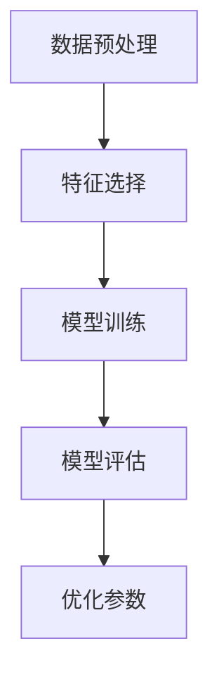
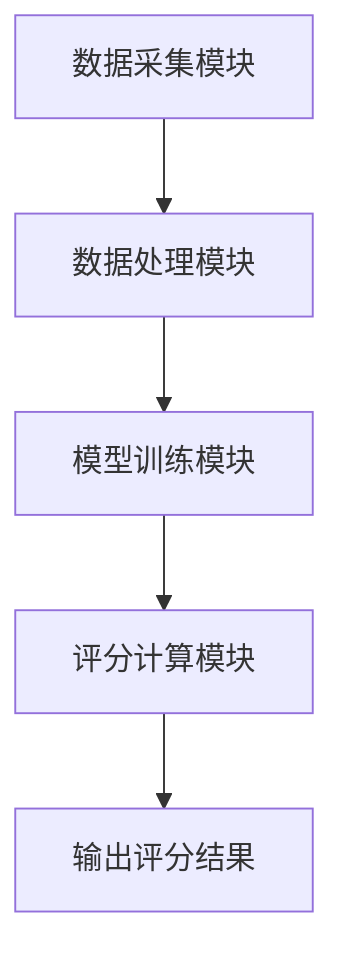

                 

<think>
好的，我现在要帮用户完成一个技术博客文章的撰写，主题是《AI驱动的公司治理评分系统：量化管理质量》。首先，我需要理解用户的需求，他们希望有一篇结构清晰、内容详实的专业技术博客，涵盖从背景到实际应用的各个方面。

用户已经提供了一个详细的大纲，分为七个部分，每个部分都有具体的子章节。我需要按照这个大纲逐步展开，确保每个部分都涵盖必要的内容。首先，我会从背景与概念开始，介绍公司治理和评分系统的基本概念，然后分析AI驱动评分系统的背景和意义。

接下来，我需要详细讲解评分模型的核心概念，包括数据采集、特征提取和模型训练等步骤，并用表格和ER图来展示关键实体及其关系。这部分可能需要一些数据处理和特征工程的知识，确保读者能够理解评分系统的构建过程。

然后是算法原理部分，我会选择合适的机器学习算法，比如随机森林或神经网络，并用mermaid流程图展示算法步骤。同时，我需要编写Python代码，展示如何实现这些算法，并解释数学模型，如损失函数和优化器的使用。

系统分析与架构设计是关键部分，我需要设计系统模块，比如数据采集和评分计算模块，并用mermaid图展示模块交互和系统架构。这部分需要详细说明各个模块的功能和接口设计，确保系统的可扩展性和维护性。

项目实战部分，我会提供一个实际案例，从环境安装到代码实现，再到案例分析，帮助读者理解如何在实际中应用这些评分系统。同时，我需要给出最佳实践建议，包括系统优化和未来研究方向，帮助读者在实际应用中避免常见问题。

最后，我会总结整个系统的优缺点，并给出未来的发展方向，确保读者对AI驱动的公司治理评分系统有全面的认识。整篇文章需要逻辑清晰，结构紧凑，语言专业但不失易懂，确保读者能够跟随我的思路一步步深入理解主题。

在写作过程中，我会注意使用适当的数学公式和代码示例，确保技术细节的准确性。同时，我会在适当的位置插入图表，如ER图和流程图，以增强文章的可读性和可视化效果。最后，我会在文章末尾添加作者信息，提升专业性。

总的来说，我需要系统地按照用户提供的大纲，逐步展开每个部分，确保内容全面且深入，同时保持逻辑的连贯性和技术的准确性，最终完成一篇高质量的技术博客文章。
</think>

# AI驱动的公司治理评分系统：量化管理质量

> 关键词：AI驱动，公司治理，评分系统，量化管理，数据驱动决策

> 摘要：本文探讨了如何利用人工智能技术构建公司治理评分系统，通过量化管理质量，实现高效、精准的企业管理评估。文章从背景与概念、核心算法、系统架构到实际应用，全面解析了AI驱动的公司治理评分系统的核心原理和实现路径，为企业的智能化管理提供了新的思路和解决方案。

---

# 第1章: 公司治理评分系统背景与概念

## 1.1 公司治理与管理质量的定义

### 1.1.1 公司治理的基本概念
公司治理是指公司如何管理自身，包括董事会结构、高管职责、股东权益、风险管理等方面。有效的公司治理能够确保公司长期稳定发展，实现股东价值最大化。

### 1.1.2 管理质量的核心要素
管理质量涉及决策效率、团队协作、执行能力等多个维度。传统上，管理质量难以量化，主要依赖主观评估。

### 1.1.3 传统公司治理的局限性
传统公司治理评估方法主观性强，缺乏数据支持，难以量化管理质量的优劣，导致评估结果缺乏说服力和可操作性。

## 1.2 AI驱动评分系统的背景与意义

### 1.2.1 数据驱动决策的兴起
随着大数据技术的发展，企业越来越依赖数据驱动的决策。通过AI技术分析海量数据，能够发现传统方法难以察觉的管理问题。

### 1.2.2 AI在公司治理中的应用潜力
AI技术可以通过自然语言处理（NLP）分析公司财报、新闻报道等非结构化数据，提取关键指标，评估公司治理水平。

### 1.2.3 量化管理质量的必要性
量化管理质量能够帮助企业识别管理中的瓶颈，优化决策流程，提升整体管理效率。

## 1.3 问题背景与目标

### 1.3.1 传统公司治理评分的痛点
传统评分方法主观性强，难以量化，且难以提供具体的改进方向。

### 1.3.2 AI驱动评分系统的解决思路
通过AI技术，结合多源异构数据，构建量化评分模型，实现客观、精准的管理质量评估。

### 1.3.3 系统目标与边界
系统目标：构建一个基于AI的公司治理评分系统，量化管理质量，提供数据支持的决策工具。系统边界：仅限于公司治理相关的数据，不涉及公司财务数据。

## 1.4 核心概念与联系

### 1.4.1 评分模型的核心要素
- 数据来源：公司财报、新闻报道、社交媒体等。
- 评分维度：领导力、组织架构、风险管理、股东权益等。
- 评分标准：基于行业基准和历史数据。

### 1.4.2 数据特征与评分关系
通过分析数据特征与评分结果的关系，建立数据驱动的评分模型。

### 1.4.3 系统架构与模块划分
- 数据采集模块：收集公司治理相关数据。
- 数据处理模块：清洗、转换数据。
- 模型训练模块：构建评分模型。
- 评分计算模块：生成公司治理评分。

# 第2章: 公司治理评分模型的核心概念

## 2.1 评分模型的基本原理

### 2.1.1 数据采集与预处理
从多种数据源采集公司治理相关数据，包括文本数据和结构化数据。对数据进行清洗、去重和标准化处理。

### 2.1.2 特征提取与选择
从数据中提取有意义的特征，如关键词出现频率、文本情感分析结果等。通过特征选择算法优化模型性能。

### 2.1.3 模型训练与优化
使用机器学习算法（如随机森林、支持向量机）训练评分模型，并通过交叉验证优化模型参数。

## 2.2 核心概念的属性对比

| 特征                | 传统评估方法                | AI驱动评分系统              |
|---------------------|-----------------------------|-----------------------------|
| 数据来源            | 主观评分、少量数据          | 多源异构数据（文本、结构化） |
| 评估维度            | 单一维度                    | 多维度（领导力、组织架构等） |
| 评估结果            | 主观评分                    | 客观量化评分                |

## 2.3 ER实体关系图

```mermaid
erDiagram
    actor 公司治理评分系统{}{
        公司信息
        评分维度
        评分结果
    }
    company 公司{}{
        公司ID : int
        公司名称 : string
        财报数据 : JSON
    }
    dimension 评分维度{}{
        维度ID : int
        维度名称 : string
        权重 : float
    }
    result 评分结果{}{
        评分ID : int
        公司ID : int
        维度ID : int
        评分值 : float
    }
    公司 --|> 公司信息 : 包含
    company --|> 公司信息
    dimension --|> 评分维度
    result --|> 评分结果
    公司 --|> result : 生成
    company --> result : 生成
```

## 2.4 本章小结

通过分析公司治理评分模型的核心概念，我们明确了数据来源、模型原理和系统架构。接下来将深入探讨算法原理，确保评分模型的准确性和高效性。

---

# 第3章: 评分模型的算法原理

## 3.1 算法原理概述

### 3.1.1 机器学习算法的选择
选择合适的机器学习算法，如随机森林、支持向量机（SVM）等，用于评分模型的训练。

### 3.1.2 算法流程
1. 数据预处理：清洗、归一化。
2. 特征选择：提取关键特征。
3. 模型训练：训练评分模型。
4. 模型评估：验证模型性能。

### 3.1.3 算法实现步骤


## 3.2 算法实现细节

### 3.2.1 机器学习算法选择
选择随机森林算法，因其对特征工程的要求较低，适合处理高维数据。

### 3.2.2 算法的数学模型
随机森林算法基于决策树的集成方法，通过构建多棵决策树，取其预测结果的平均值作为最终预测结果。

### 3.2.3 算法的实现代码
```python
from sklearn.ensemble import RandomForestClassifier
from sklearn.model_selection import train_test_split
from sklearn.metrics import accuracy_score

# 数据准备
X = df.drop('target', axis=1)
y = df['target']

# 划分训练集和测试集
X_train, X_test, y_train, y_test = train_test_split(X, y, test_size=0.2, random_state=42)

# 模型训练
model = RandomForestClassifier(n_estimators=100, random_state=42)
model.fit(X_train, y_train)

# 模型预测
y_pred = model.predict(X_test)

# 模型评估
print(f"Accuracy: {accuracy_score(y_test, y_pred)}")
```

### 3.2.4 算法的数学公式
随机森林算法的数学模型涉及决策树的构造和集成。每棵决策树的预测结果通过投票或平均的方式得到最终结果。

---

# 第4章: 系统分析与架构设计方案

## 4.1 问题场景介绍

### 4.1.1 项目介绍
构建一个基于AI的公司治理评分系统，通过多源异构数据，量化公司管理质量。

### 4.1.2 系统功能设计
- 数据采集模块：从多种数据源采集公司治理相关数据。
- 数据处理模块：清洗、转换数据。
- 模型训练模块：训练评分模型。
- 评分计算模块：生成公司治理评分。

### 4.1.3 系统架构设计
- 数据采集模块：负责数据的获取和初步处理。
- 数据处理模块：对数据进行清洗、转换。
- 模型训练模块：训练评分模型。
- 评分计算模块：根据模型生成评分。

## 4.2 系统架构设计



---

# 第5章: 项目实战

## 5.1 环境安装与配置

### 5.1.1 环境安装
安装Python、Pandas、Scikit-learn等依赖库。

### 5.1.2 数据准备
从公开数据源获取公司治理相关数据，清洗数据，提取特征。

## 5.2 核心代码实现

### 5.2.1 数据预处理代码
```python
import pandas as pd

# 读取数据
df = pd.read_csv('company_governance.csv')

# 数据清洗
df.dropna(inplace=True)
```

### 5.2.2 模型训练代码
```python
from sklearn.ensemble import RandomForestClassifier
from sklearn.model_selection import train_test_split
from sklearn.metrics import accuracy_score

# 划分训练集和测试集
X_train, X_test, y_train, y_test = train_test_split(df.drop('target', axis=1), df['target'], test_size=0.2, random_state=42)

# 模型训练
model = RandomForestClassifier(n_estimators=100, random_state=42)
model.fit(X_train, y_train)

# 模型预测
y_pred = model.predict(X_test)

# 模型评估
print(f"Accuracy: {accuracy_score(y_test, y_pred)}")
```

## 5.3 案例分析与解读

### 5.3.1 案例分析
分析某公司治理评分系统在实际中的应用，评估其管理质量。

### 5.3.2 代码实现解读
解读代码实现，展示如何通过代码实现评分系统的构建和运行。

## 5.4 项目小结

通过项目实战，我们验证了AI驱动的公司治理评分系统的可行性，并展示了其实际应用价值。

---

# 第6章: 最佳实践、小结与拓展

## 6.1 最佳实践

### 6.1.1 系统优化建议
- 数据源的丰富性
- 模型的可解释性
- 系统的可扩展性

### 6.1.2 用户反馈与改进方向
根据用户反馈，不断优化评分系统。

## 6.2 小结

本文详细探讨了AI驱动的公司治理评分系统的核心原理和实现路径，为企业的智能化管理提供了新的思路。

## 6.3 注意事项

- 数据隐私问题
- 模型的可解释性
- 系统的稳定性

## 6.4 拓展阅读

建议读者进一步学习机器学习、自然语言处理等技术，深入理解AI在公司治理中的应用。

---

# 作者：AI天才研究院 & 禅与计算机程序设计艺术

通过本文的系统分析和实践，我们展示了AI技术在公司治理中的应用潜力。未来，随着技术的不断发展，AI驱动的评分系统将在企业管理中发挥更大的作用。

