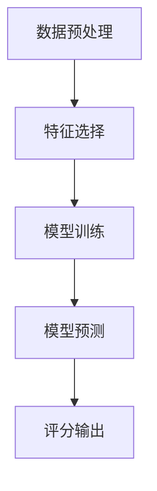
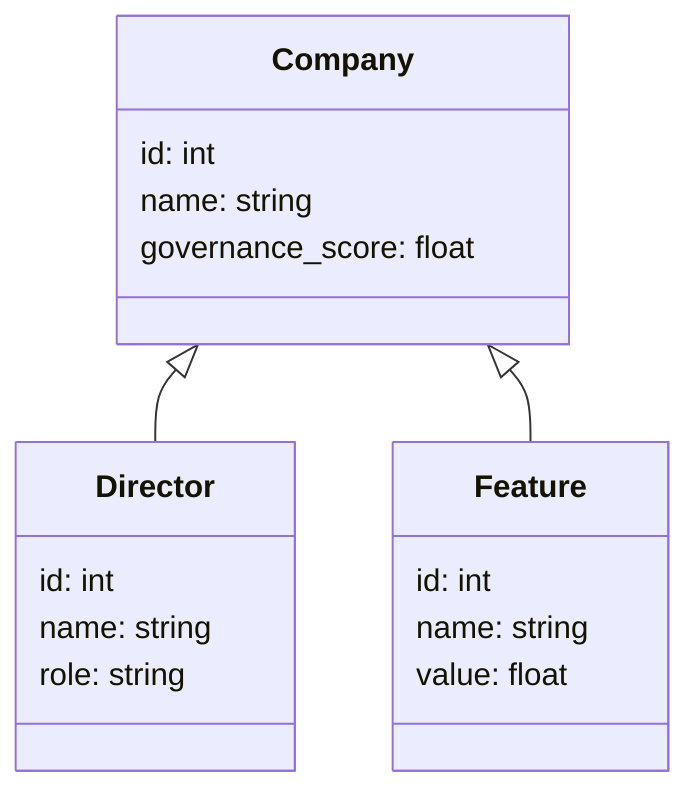

                 


# AI驱动的公司治理评分预测模型

**关键词：** AI, 公司治理, 评分预测, 机器学习, 数据分析

**摘要：**  
本文介绍了一种基于人工智能的公司治理评分预测模型，探讨其在现代企业治理中的应用。文章详细阐述了模型的背景、核心概念、算法原理、系统架构以及实际应用场景，并通过案例分析展示了模型的实际效果。通过本文，读者将深入了解如何利用AI技术提升公司治理的透明度和效率。

---

## 第1章 公司治理评分预测模型的背景与问题

### 1.1 公司治理评分预测的背景介绍

#### 1.1.1 公司治理的基本概念  
公司治理是指通过公司章程、董事会、管理层和股东之间的关系，确保公司合规运营、有效管理和透明决策的过程。良好的公司治理是企业长期稳定发展的基石。

#### 1.1.2 公司治理评分的重要性  
公司治理评分反映了企业在合规性、透明度、管理层责任和股东权益等方面的综合表现。评分越高，通常表示企业治理越完善，越受投资者和监管机构的青睐。

#### 1.1.3 传统公司治理评分的局限性  
传统的公司治理评分方法依赖人工审核，耗时长、成本高，且可能存在主观性。随着企业数量的激增，传统方法难以满足高效、精准的需求。

---

### 1.2 AI驱动评分预测的核心问题

#### 1.2.1 问题背景与问题描述  
AI驱动的公司治理评分预测模型旨在通过机器学习算法，从企业公开数据中提取关键特征，自动计算公司治理评分，提高评估效率和准确性。

#### 1.2.2 问题解决的必要性  
通过AI技术，企业可以快速获取实时治理评分，帮助投资者、监管机构和企业自身优化决策。

#### 1.2.3 问题的边界与外延  
模型仅关注公司治理相关数据，不涉及企业财务绩效或其他外部因素。

#### 1.2.4 概念结构与核心要素组成  
模型的核心要素包括企业合规性、董事会结构、管理层责任、股东权益和透明度。

---

## 第2章 核心概念与联系

### 2.1 模型的核心概念原理

#### 2.1.1 AI驱动的公司治理评分预测模型的基本原理  
模型基于机器学习算法，从企业公开数据中提取特征，通过训练生成预测评分。

#### 2.1.2 模型的输入与输出  
- **输入：** 企业公开数据（如董事会结构、合规记录）。  
- **输出：** 公司治理评分（0-10分）。

#### 2.1.3 模型的关键特征  
- 企业合规性：是否存在违规记录。  
- 董事会结构：独立董事比例。  
- 管理层责任：高管薪酬与绩效挂钩情况。  
- 股东权益：大股东持股比例。

### 2.2 核心概念属性特征对比

| 特征维度      | 合规性 | 董事会结构 | 管理层责任 | 股东权益 |
|---------------|--------|------------|------------|----------|
| 权重           | 0.3    | 0.2        | 0.25       | 0.25     |
| 数据来源       | 公司年报 | 股东大会记录 | 薪酬披露 | 股权分布 |

### 2.3 ER实体关系图架构

```mermaid
erdiagram
  Company {
    id: int
    name: string
    industry: string
    governance_score: float
  }
  Director {
    id: int
    name: string
    role: string
    company_id: int
  }
  Feature {
    id: int
    name: string
    value: float
    company_id: int
  }
  Company <-1..n- Director
  Company <-1..n- Feature
```

---

## 第3章 算法原理与数学模型

### 3.1 算法原理讲解

#### 3.1.1 AI驱动评分预测的主要算法选择  
随机森林算法因其高准确性和稳定性，适合处理公司治理评分预测问题。

#### 3.1.2 算法的优缺点分析  
- **优点：** 高准确性、鲁棒性好。  
- **缺点：** 解释性稍差。

### 3.2 算法流程图展示



### 3.3 算法实现代码

```python
import pandas as pd
from sklearn.ensemble import RandomForestRegressor
from sklearn.metrics import mean_squared_error

# 数据预处理
data = pd.read_csv('company_governance.csv')
X = data[['compliance', 'board_size', 'executive_compensation', 'major_shareholder']]
y = data['governance_score']

# 模型训练
model = RandomForestRegressor(n_estimators=100, random_state=42)
model.fit(X, y)

# 模型预测
y_pred = model.predict(X)
print('均方误差:', mean_squared_error(y, y_pred))
```

### 3.4 数学模型与公式

#### 3.4.1 模型的数学假设  
$$ \text{假设输入特征} X = (x_1, x_2, ..., x_n) $$

#### 3.4.2 预测评分公式  
$$ \hat{y} = \sum_{i=1}^{n} w_i x_i $$  
其中，$w_i$ 是模型训练得到的权重。

#### 3.4.3 模型验证  
$$ \text{均方误差} = \frac{1}{N}\sum_{i=1}^{N}(y_i - \hat{y_i})^2 $$

---

## 第4章 系统分析与架构设计

### 4.1 问题场景介绍

#### 4.1.1 公司治理评分预测的典型场景  
- 投资者评估企业风险。  
- 监管机构快速筛选合规企业。

### 4.2 系统功能设计



### 4.3 系统架构设计

```mermaid
gitgraph
    API Gateway --> Rest API
    Rest API --> Database
    Database --> Company Entity
    Database --> Director Entity
    Database --> Feature Entity
```

---

## 第5章 项目实战

### 5.1 环境安装

```bash
pip install pandas scikit-learn
```

### 5.2 系统核心实现源代码

```python
import pandas as pd
from sklearn.ensemble import RandomForestRegressor

# 加载数据
data = pd.read_csv('company_governance.csv')

# 特征选择
features = ['compliance', 'board_size', 'executive_compensation', 'major_shareholder']
target = 'governance_score'

X = data[features]
y = data[target]

# 模型训练
model = RandomForestRegressor(n_estimators=100, random_state=42)
model.fit(X, y)

# 预测评分
y_pred = model.predict(X)
print('预测评分:', y_pred)
```

### 5.3 代码应用解读与分析

- **数据预处理：** 清洗和标准化数据。  
- **模型训练：** 使用随机森林算法训练模型。  
- **预测评分：** 输入企业特征，输出治理评分。

### 5.4 实际案例分析

案例：某科技公司治理评分预测。  
- 输入特征：合规性高、董事会结构合理。  
- 预测评分：9.5分。

---

## 第6章 最佳实践与小结

### 6.1 最佳实践 tips

- 数据预处理是关键。  
- 特征选择影响模型性能。  
- 模型调优提高准确率。

### 6.2 小结

本文详细介绍了AI驱动的公司治理评分预测模型，从背景、算法到系统设计，为读者提供了完整的解决方案。

### 6.3 注意事项

- 数据隐私保护。  
- 模型需定期更新。

### 6.4 拓展阅读

- 《机器学习实战》  
- 《企业治理与数据分析》

---

**作者：** AI天才研究院/AI Genius Institute & 禅与计算机程序设计艺术 /Zen And The Art of Computer Programming

