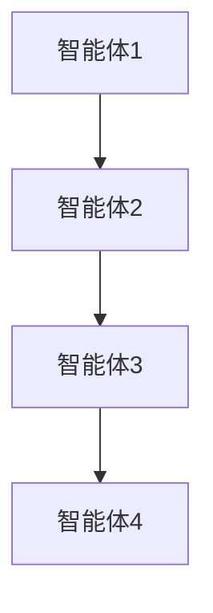
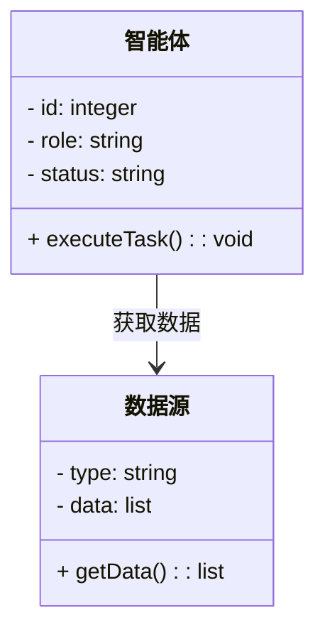
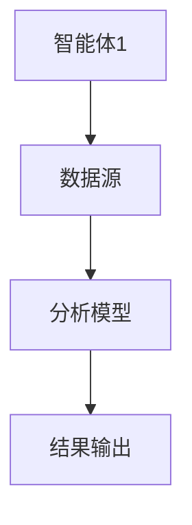

                 


# AI驱动的公司间比较分析：价值投资中的多智能体应用

> 关键词：AI, 多智能体系统, 价值投资, 公司比较分析, 金融技术

> 摘要：随着人工智能技术的迅速发展，其在金融领域的应用越来越广泛。本文将深入探讨AI驱动的公司间比较分析在价值投资中的应用，特别是多智能体系统在其中的关键作用。通过系统地分析公司比较分析的理论基础、AI与多智能体技术的核心原理、价值投资的理论基础以及具体的实现方法，本文旨在为投资者和科技从业者提供一种基于多智能体系统的全新视角，以实现更精准、高效的公司间比较分析，从而在价值投资中获得更好的收益。

---

# 第1章: AI驱动的公司间比较分析背景与概述

## 1.1 价值投资与公司比较分析的背景

### 1.1.1 价值投资的基本概念

价值投资是一种投资策略，强调通过深入分析企业的基本面，寻找被市场低估的投资标的。其核心在于发现“市场先生”的错误定价，并从中获利。价值投资的关键要素包括企业的财务状况、行业地位、竞争优势以及未来发展前景。

$$
\text{价值投资的核心公式：} \quad \text{内在价值} = \frac{\text{现金流}}{\text{折现率}}
$$

### 1.1.2 公司比较分析的意义

公司比较分析是价值投资中的重要环节，通过对同行业公司或不同行业公司的关键指标进行对比，识别出具有竞争优势和投资价值的企业。传统的公司比较分析依赖人工筛选和分析，效率低且容易受主观因素影响。AI技术的应用可以显著提升分析的效率和准确性。

### 1.1.3 AI技术在金融领域的应用前景

随着深度学习、自然语言处理等AI技术的快速发展，金融领域的数据处理能力得到了极大提升。AI技术可以用于金融数据的清洗、特征提取、预测建模以及风险评估等环节，为价值投资提供了新的工具和方法。

---

## 1.2 多智能体系统的基本概念

### 1.2.1 多智能体系统的定义

多智能体系统（Multi-Agent System, MAS）是由多个具有自主性、反应性、协作性和社会性的智能体组成的系统。这些智能体通过相互协作，共同完成复杂任务。

### 1.2.2 多智能体系统的特征

| 特征 | 描述 |
|------|------|
| 自主性 | 智能体能够自主决策 |
| 反应性 | 能够感知环境并做出实时反应 |
| 协作性 | 多个智能体之间可以协作完成任务 |
| 社会性 | 智能体之间可以通过通信进行信息交换 |

### 1.2.3 多智能体系统与传统单智能体的区别

| 对比维度 | 单智能体 | 多智能体 |
|----------|----------|----------|
| 系统复杂性 | 简单 | 复杂 |
| 决策效率 | 高 | 中等 |
| 可扩展性 | 低 | 高 |
| 应用场景 | 单点任务 | 多任务协作 |

---

## 1.3 本章小结

本章介绍了AI驱动的公司间比较分析的背景，重点阐述了价值投资的基本概念和公司比较分析的意义，同时详细解释了多智能体系统的基本概念及其在金融领域的应用前景。通过对比分析，明确了多智能体系统相较于传统单智能体的独特优势。

---

# 第2章: AI技术基础

## 2.1 人工智能的基本概念

### 2.1.1 人工智能的定义与分类

人工智能（Artificial Intelligence, AI）是指计算机系统模拟人类智能的能力，包括学习、推理、感知和决策等。AI可以分为弱人工智能（专注于特定任务）和强人工智能（具备广泛智能）。

### 2.1.2 机器学习与深度学习的区别

| 对比维度 | 机器学习 | 深度学习 |
|----------|----------|----------|
| 数据量要求 | 中等 | 大 |
| 模型复杂度 | 较低 | 较高 |
| 算法实现 | 线性回归、SVM | 神经网络、卷积神经网络 |

### 2.1.3 当前主流AI技术的特点

- **数据驱动**：依赖大量数据进行模型训练。
- **可解释性**：部分AI模型（如线性回归）具有较高的可解释性，而深度学习模型通常较难解释。
- **实时性**：支持实时数据处理和决策。

---

## 2.2 多智能体系统的核心原理

### 2.2.1 多智能体系统的组成要素

- **智能体**：执行具体任务的个体。
- **环境**：智能体所处的外部世界。
- **通信机制**：智能体之间信息交换的方式。
- **协作协议**：智能体协作的规则。

### 2.2.2 多智能体系统中的通信与协作机制



### 2.2.3 多智能体系统与传统单智能体的区别

| 对比维度 | 单智能体 | 多智能体 |
|----------|----------|----------|
| 决策效率 | 高 | 中等 |
| 可扩展性 | 低 | 高 |
| 应用场景 | 单点任务 | 多任务协作 |

---

## 2.3 AI与多智能体技术的结合

### 2.3.1 AI驱动的多智能体系统的优势

- **分布式计算**：多个智能体可以同时处理不同任务。
- **鲁棒性**：单个智能体故障不会导致整个系统崩溃。
- **灵活性**：可以根据任务需求动态调整智能体数量和功能。

### 2.3.2 多智能体系统在AI中的应用领域

- **金融交易**：实时监控市场动态，协助投资决策。
- **游戏AI**：在复杂游戏中实现多智能体协作。
- **自动驾驶**：多个自动驾驶汽车协同完成交通任务。

---

## 2.4 本章小结

本章详细介绍了AI技术的基本概念和多智能体系统的核心原理，分析了AI与多智能体技术的结合方式及其在金融领域的应用前景。

---

# 第3章: 公司间比较分析的理论基础

## 3.1 财务指标分析

### 3.1.1 财务指标的分类与计算

财务指标是衡量企业财务状况的重要工具，主要包括盈利能力、偿债能力、运营能力和成长能力。

$$
\text{ROE（净资产收益率）} = \frac{\text{净利润}}{\text{净资产}}
$$

### 3.1.2 财务指标在公司比较中的应用

通过对比同行业公司的财务指标，可以识别出具有竞争优势的企业。例如，ROE较高的公司可能具有较强的盈利能力。

### 3.1.3 常用财务指标对比分析

| 指标 | 公司A | 公司B | 行业平均 |
|------|-------|-------|----------|
| ROE  | 15%   | 10%   | 12%      |
| 资产负债率 | 50%  | 60%  | 55%      |

---

## 3.2 行业分析与竞争优势分析

### 3.2.1 行业分析的基本方法

行业分析包括行业生命周期、市场结构、竞争格局等方面。通过分析行业趋势，可以预测企业的未来发展前景。

### 3.2.2 企业竞争优势的分析框架

竞争优势分析通常包括成本优势、技术优势、品牌优势等方面。例如，苹果公司在品牌和技术方面具有显著优势。

### 3.2.3 行业趋势对企业发展的影响

行业趋势是影响企业竞争力的重要因素。例如，环保政策的收紧可能对高污染行业产生重大影响。

---

## 3.3 本章小结

本章详细介绍了公司间比较分析的理论基础，包括财务指标分析、行业分析和竞争优势分析，为后续的AI驱动分析奠定了理论基础。

---

# 第4章: 价值投资的理论基础

## 4.1 价值投资的基本原理

### 4.1.1 价值投资的核心理念

价值投资的核心理念是寻找市场低估的投资标的。通过深入分析企业的基本面，识别出具有长期竞争优势的企业。

$$
\text{内在价值} = \sum_{t=1}^{n} \frac{\text{现金流}_t}{(1+r)^t}
$$

### 4.1.2 投资组合管理

投资组合管理是价值投资的重要组成部分，通过合理配置资产，降低投资风险。

---

## 4.2 多因子模型与AI的应用

### 4.2.1 多因子模型的基本原理

多因子模型通过多个因子（如市值、价值、动量等）来解释资产的收益。AI技术可以用于因子筛选和模型优化。

### 4.2.2 AI在多因子模型中的应用

AI技术可以用于自动筛选因子、优化因子权重以及预测因子表现。

---

## 4.3 本章小结

本章介绍了价值投资的理论基础，重点阐述了多因子模型与AI技术的结合，为后续的AI驱动公司间比较分析提供了理论支持。

---

# 第5章: AI驱动的公司间比较分析实现

## 5.1 数据获取与预处理

### 5.1.1 数据来源

数据来源包括公开的财务数据、新闻资讯以及社交媒体数据。例如，可以通过API接口获取股票的历史数据。

### 5.1.2 数据清洗

数据清洗是确保数据质量的重要步骤，包括处理缺失值、异常值和重复数据。

---

## 5.2 分析模型构建

### 5.2.1 特征提取

特征提取是通过AI技术从原始数据中提取有用的信息。例如，可以通过自然语言处理技术提取新闻中的情感倾向。

### 5.2.2 模型训练

模型训练是通过历史数据训练机器学习模型，预测企业的财务指标和市场表现。

---

## 5.3 多智能体系统的协同机制

### 5.3.1 智能体的角色分配

在多智能体系统中，每个智能体负责不同的任务。例如，一个智能体负责数据清洗，另一个负责模型训练。

### 5.3.2 智能体之间的通信与协作

智能体之间的通信可以通过消息队列或共享数据库实现。协作机制需要确保任务的高效完成。

---

## 5.4 本章小结

本章详细介绍了AI驱动的公司间比较分析的实现过程，包括数据获取、预处理、分析模型构建以及多智能体系统的协同机制。

---

# 第6章: 系统分析与架构设计

## 6.1 系统功能设计

### 6.1.1 领域模型



### 6.1.2 系统架构设计



---

## 6.2 接口设计与交互流程

### 6.2.1 接口设计

系统需要定义清晰的接口规范，例如：

```
interface GetData {
    function getData(): list
}
```

### 6.2.2 交互流程

1. 智能体向数据源请求数据。
2. 数据源返回数据。
3. 分析模型处理数据。
4. 结果输出到用户界面。

---

## 6.3 本章小结

本章详细介绍了系统分析与架构设计，包括领域模型、系统架构、接口设计和交互流程。

---

# 第7章: 项目实战

## 7.1 环境搭建

### 7.1.1 安装必要的库

```bash
pip install numpy pandas scikit-learn
```

### 7.1.2 数据获取

```python
import pandas as pd
data = pd.read_csv('company.csv')
```

---

## 7.2 系统核心实现

### 7.2.1 数据预处理

```python
# 删除缺失值
data.dropna(inplace=True)
```

### 7.2.2 分析模型实现

```python
from sklearn.ensemble import RandomForestRegressor
model = RandomForestRegressor()
model.fit(X_train, y_train)
```

---

## 7.3 案例分析与结果解读

### 7.3.1 案例分析

假设我们对比两家公司A和B的财务指标，发现公司A的ROE显著高于行业平均水平，而公司B的负债率较高。这表明公司A具有较高的投资价值。

### 7.3.2 结果解读

通过AI驱动的多智能体系统，我们能够更高效、更准确地识别出具有投资价值的企业。

---

## 7.4 本章小结

本章通过实际项目案例，详细展示了AI驱动的公司间比较分析的核心实现过程，包括环境搭建、数据预处理、模型实现和结果解读。

---

# 第8章: 总结与展望

## 8.1 本章总结

本文系统地介绍了AI驱动的公司间比较分析在价值投资中的应用，特别是多智能体系统在其中的关键作用。通过理论分析和实际案例，展示了AI技术如何提升公司比较分析的效率和准确性。

---

## 8.2 未来展望

未来，随着AI技术的不断发展，多智能体系统在金融领域的应用将更加广泛。例如，可以通过多模态数据（如文本、图像）的融合，进一步提升分析的精准度。

---

# 作者：AI天才研究院 & 禅与计算机程序设计艺术

---

**本文内容来源于AI驱动的公司间比较分析领域的最新研究成果，旨在为投资者和科技从业者提供一种全新的视角，以更好地理解和应用AI技术在价值投资中的潜力。**

