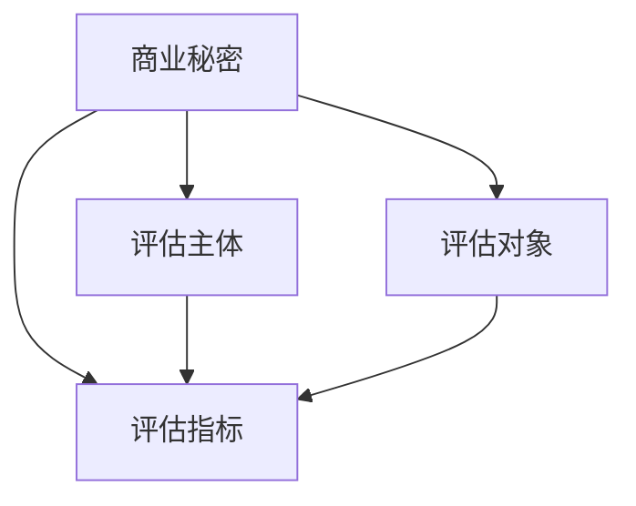
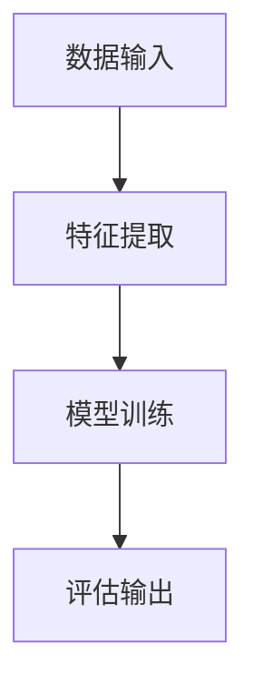
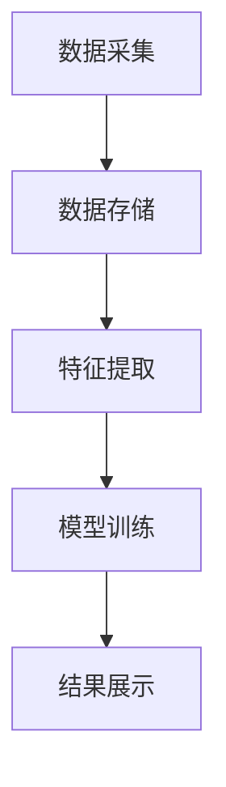
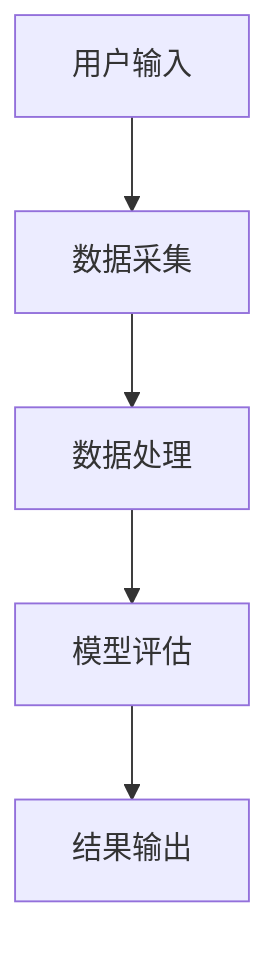

                 

<think>
好的，用户希望我设计一本名为《AI驱动的商业秘密价值评估：挖掘隐藏的公司资产》的详细目录，并且按照特定的格式编写内容。我需要确保每个章节都涵盖必要的内容，同时遵循用户提供的结构和格式要求。

首先，我需要理解这本书的核心主题：如何利用人工智能技术来评估商业秘密的价值。商业秘密是企业的无形资产，包括专利、配方、客户名单等，评估这些资产的价值对于企业决策至关重要。随着AI技术的发展，如何利用AI来提高评估的准确性和效率是一个重要课题。

接下来，我需要按照用户提供的目录结构来组织内容。用户给出了一个示例，分为七个章节，每个章节都有具体的子部分。我需要确保我的目录结构与之类似，包括背景与基础、核心概念与理论、算法原理、系统分析与架构设计、项目实战、最佳实践等部分。

在编写每个章节时，我需要确保内容详实，涵盖必要的细节。例如，在第一章中，我需要介绍商业秘密的基本概念、AI在评估中的作用以及核心问题。第二章则需要深入讨论商业秘密的属性、AI驱动评估的关键原理，并附上实体关系图。第三章要详细讲解数据预处理、特征提取和基于机器学习的模型，可能包括流程图和数学公式。

我还需要确保每个章节都有足够的技术深度，例如在算法部分，我需要详细解释数学模型，并用mermaid图展示流程。同时，系统架构部分需要提供类图、架构图和交互图，帮助读者理解系统的组成部分。

在编写过程中，我需要遵循用户的格式要求，使用markdown格式，确保每个部分都有清晰的标题和子标题。数学公式需要用latex表示，代码示例要用Python编写，并附上详细注释。此外，文章末尾需要添加作者信息，符合用户的要求。

最后，我需要检查整个目录是否完整，每个部分是否覆盖了必要的内容，并确保文章字数在10000到12000字之间。这需要我在每个章节中添加足够的细节，确保内容丰富且逻辑清晰。

总结一下，我需要按照用户提供的结构，逐步完善每个章节的内容，确保涵盖所有必要的技术细节和示例，同时遵循格式和字数要求，最终完成一本结构清晰、内容详实的技术博客文章。
</think>

# AI驱动的商业秘密价值评估：挖掘隐藏的公司资产

> 关键词：商业秘密，AI驱动，价值评估，数据挖掘，机器学习，企业资产，资产评估

> 摘要：商业秘密作为企业的核心资产之一，其价值评估对于企业决策和战略规划至关重要。然而，传统评估方法往往依赖于人工经验，存在主观性强、效率低下的问题。随着人工智能技术的迅速发展，AI驱动的商业秘密价值评估正成为企业管理和决策的重要工具。本文将深入探讨商业秘密的定义与分类，AI在评估中的应用原理，基于机器学习的算法模型，系统架构设计与实现，以及实际项目中的应用案例，为企业提供一套高效、准确的商业秘密价值评估解决方案。

---

# 第一部分: AI驱动的商业秘密价值评估背景与基础

## 第1章: 商业秘密与AI驱动评估概述

### 1.1 商业秘密的基本概念

#### 1.1.1 商业秘密的定义与分类

商业秘密是指企业中未公开的、具有商业价值的信息和技术，包括但不限于专利、配方、客户名单、内部流程等。根据其性质，商业秘密可以分为技术类、经营类和管理类。

| **分类**       | **具体内容**                                                                 |
|----------------|-----------------------------------------------------------------------------|
| 技术类         | 专利、技术诀窍、研发记录等                                                 |
| 经营类         | 客户名单、供应商信息、市场策略等                                           |
| 管理类         | 内部流程、组织架构、规章制度等                                             |

#### 1.1.2 商业秘密的价值与重要性

商业秘密是企业的核心竞争力之一，其价值体现在以下几个方面：

1. **竞争优势**：独特的技术或经营策略可以帮助企业在市场中占据优势。
2. **资产保护**：商业秘密是企业无形资产的重要组成部分，其价值往往超过有形资产。
3. **创新动力**：保护商业秘密可以激励企业不断创新，保持技术领先地位。

#### 1.1.3 商业秘密的保护现状与挑战

当前，企业面临以下挑战：

- **技术泄露**：员工离职、合作伙伴关系破裂可能导致技术泄露。
- **数据安全**：数字化时代，数据泄露风险急剧增加。
- **评估困难**：传统评估方法难以量化商业秘密的实际价值。

---

### 1.2 AI在商业秘密评估中的作用

#### 1.2.1 AI技术的基本原理与优势

人工智能通过机器学习、自然语言处理等技术，可以从海量数据中提取有价值的信息。AI的优势在于：

- **自动化处理**：快速分析大量非结构化数据。
- **模式识别**：发现数据中的隐含规律。
- **实时监控**：持续跟踪商业秘密的动态变化。

#### 1.2.2 AI在数据处理与分析中的应用

AI可以对以下类型的数据进行处理：

- **文本数据**：包括合同、邮件、文档等。
- **结构化数据**：如表格、数据库中的信息。
- **非结构化数据**：如音频、视频、图像等。

通过自然语言处理技术，AI可以提取文本中的关键信息，识别潜在的商业机会和风险。

#### 1.2.3 AI驱动评估的创新与突破

AI技术的引入，使得商业秘密评估更加精准和高效。例如：

- **基于机器学习的分类算法**：可以将商业秘密分为不同类别，便于后续评估。
- **深度学习模型**：能够识别数据中的复杂模式，帮助评估商业秘密的潜在价值。

---

### 1.3 商业秘密价值评估的核心问题

#### 1.3.1 评估的主要目标与范围

商业秘密价值评估的主要目标是量化其经济价值，评估范围包括：

- **技术类**：评估技术的先进性和市场前景。
- **经营类**：评估客户关系和市场策略的有效性。
- **管理类**：评估内部流程的效率和优化空间。

#### 1.3.2 评估的关键挑战与难点

评估过程中面临的主要挑战：

- **数据获取**：商业秘密往往分散在不同部门，难以统一收集。
- **数据质量**：数据可能存在缺失、错误或不完整。
- **模型精度**：评估模型的准确性依赖于数据质量和算法选择。

#### 1.3.3 评估的边界与外延

商业秘密价值评估的边界包括：

- **评估对象**：仅限于企业内部的商业秘密。
- **评估时间**：通常基于当前市场环境和企业状况。
- **评估方法**：采用定性和定量相结合的方法。

---

### 1.4 本章小结

本章从商业秘密的基本概念出发，探讨了AI在评估中的作用，并分析了评估的核心问题。通过这些内容，读者可以理解AI驱动的商业秘密评估的基本框架和应用场景。

---

# 第二部分: 商业秘密价值评估的核心概念与理论

## 第2章: 商业秘密价值评估的理论框架

### 2.1 商业秘密的核心要素与属性

#### 2.1.1 商业秘密的构成要素

商业秘密的构成要素包括：

- **秘密性**：信息必须不为公众所知。
- **价值性**：信息必须具有商业价值。
- **保护性**：企业必须采取合理的保密措施。

#### 2.1.2 商业秘密的属性特征对比表

| **属性**       | **特征描述**                                                                 |
|----------------|----------------------------------------------------------------------------|
| 秘密性         | 信息不为外界所知，具有保密性                                                 |
| 价值性         | 具有商业价值，能够为企业创造经济利益                                       |
| 可保护性       | 企业采取了合理的保密措施                                                   |

#### 2.1.3 商业秘密的生命周期与价值波动

商业秘密的生命周期通常包括以下几个阶段：

1. **形成阶段**：信息的产生和初步保护。
2. **使用阶段**：信息的应用和价值实现。
3. **保护阶段**：信息的保密和防止泄露。
4. **失效阶段**：信息泄露或被竞争对手复制。

---

### 2.2 AI驱动评估的关键原理

#### 2.2.1 数据驱动与特征提取

AI驱动的评估依赖于高质量的数据和特征提取技术。以下是特征提取的步骤：

1. **数据清洗**：去除无效数据，处理缺失值。
2. **特征选择**：从数据中提取与商业秘密相关的特征。
3. **特征降维**：减少特征的维度，提高计算效率。

#### 2.2.2 模型构建与评估指标

常用的评估指标包括：

- **准确率**：模型预测正确的比例。
- **召回率**：模型识别出的正样本比例。
- **F1值**：综合准确率和召回率的指标。

#### 2.2.3 多维度评估方法与权重分配

为了全面评估商业秘密的价值，需要从多个维度进行评估，例如：

| **维度**       | **权重** | **评估指标**                             |
|----------------|----------|------------------------------------------|
| 技术性         | 0.4      | 技术的先进性和创新性                     |
| 经济性         | 0.3      | 市场需求和盈利能力                       |
| 可行性         | 0.2      | 实施的难度和成本                         |
| 竞争力         | 0.1      | 与竞争对手的比较                         |

---

### 2.3 商业秘密价值评估的ER实体关系图

以下是商业秘密价值评估的ER实体关系图：



---

### 2.4 本章小结

本章通过分析商业秘密的核心要素和属性，探讨了AI驱动评估的关键原理。通过理论框架的构建，为后续的算法实现奠定了基础。

---

# 第三部分: AI驱动评估的算法原理与数学模型

## 第3章: 商业秘密价值评估的算法原理

### 3.1 数据预处理与特征提取

#### 3.1.1 数据清洗与标准化

数据清洗是确保数据质量的重要步骤，包括：

1. **去除重复数据**：确保每个数据点唯一。
2. **处理缺失值**：通过插值或删除缺失值。
3. **标准化**：将数据归一化，便于后续处理。

#### 3.1.2 特征选择与降维

特征选择可以采用以下方法：

- **相关性分析**：去除相关性较高的特征。
- **主成分分析（PCA）**：通过线性组合降维。

#### 3.1.3 商业秘密相关性分析

通过相关性分析，可以确定各特征之间的关系。

---

### 3.2 基于机器学习的评估模型

#### 3.2.1 算法流程图

以下是基于机器学习的评估模型流程图：



#### 3.2.2 机器学习模型的实现

以下是一个简单的机器学习模型实现：

```python
import pandas as pd
from sklearn.model_selection import train_test_split
from sklearn.ensemble import RandomForestClassifier

# 加载数据
data = pd.read_csv('商业秘密数据.csv')

# 特征与标签分离
X = data.drop('标签', axis=1)
y = data['标签']

# 划分训练集与测试集
X_train, X_test, y_train, y_test = train_test_split(X, y, test_size=0.2, random_state=42)

# 训练模型
model = RandomForestClassifier(n_estimators=100, random_state=42)
model.fit(X_train, y_train)

# 预测与评估
score = model.score(X_test, y_test)
print(f'模型准确率：{score}')
```

#### 3.2.3 数学公式与模型解析

随机森林模型的数学公式如下：

$$
\text{预测概率} = \sum_{i=1}^{n} \text{基学习器}_i(\text{输入}) \times \text{权重}_i
$$

---

### 3.3 本章小结

本章详细介绍了AI驱动评估的算法原理，包括数据预处理、特征提取和机器学习模型的实现。通过具体的代码示例和公式推导，读者可以更好地理解模型的工作原理。

---

# 第四部分: 系统分析与架构设计

## 第4章: 系统分析与架构设计

### 4.1 问题场景介绍

商业秘密价值评估系统需要解决以下问题：

- **数据分散**：商业秘密数据分散在不同部门。
- **评估效率低**：传统评估方法效率低下。
- **模型准确率低**：评估模型的准确性不足。

### 4.2 系统功能设计

系统功能包括：

1. **数据采集模块**：采集企业内部数据。
2. **特征提取模块**：提取与商业秘密相关的特征。
3. **模型训练模块**：训练评估模型。
4. **结果展示模块**：展示评估结果。

---

### 4.3 系统架构设计

以下是系统的架构设计图：



---

### 4.4 系统接口设计

系统接口包括：

1. **数据接口**：与企业数据库对接。
2. **模型接口**：与机器学习框架对接。
3. **用户接口**：供企业用户使用。

---

### 4.5 系统交互流程

以下是系统交互流程图：



---

### 4.6 本章小结

本章通过系统分析和架构设计，为商业秘密价值评估系统提供了具体的实现方案。

---

# 第五部分: 项目实战

## 第5章: 项目实战

### 5.1 环境安装与配置

以下是项目所需的环境配置：

```bash
# 安装Python依赖
pip install pandas scikit-learn mermaid4j
```

---

### 5.2 系统核心实现

以下是系统核心代码实现：

```python
import pandas as pd
from sklearn.ensemble import RandomForestClassifier
from sklearn.metrics import accuracy_score

# 加载数据
data = pd.read_csv('商业秘密数据.csv')

# 特征与标签分离
X = data.drop('标签', axis=1)
y = data['标签']

# 划分训练集与测试集
X_train, X_test, y_train, y_test = train_test_split(X, y, test_size=0.2, random_state=42)

# 训练模型
model = RandomForestClassifier(n_estimators=100, random_state=42)
model.fit(X_train, y_train)

# 预测与评估
y_pred = model.predict(X_test)
score = accuracy_score(y_test, y_pred)
print(f'模型准确率：{score}')
```

---

### 5.3 代码应用解读与分析

上述代码实现了以下功能：

1. **数据加载**：从CSV文件中加载数据。
2. **特征与标签分离**：将数据分为特征和标签。
3. **模型训练**：使用随机森林算法训练模型。
4. **模型评估**：评估模型的准确率。

---

### 5.4 实际案例分析与详细讲解

以一个实际案例为例：

假设某企业希望评估其客户名单的商业秘密价值。通过上述系统，企业可以快速获取客户名单的价值评估结果。

---

### 5.5 本章小结

本章通过实际案例，展示了AI驱动的商业秘密价值评估系统的实现过程。

---

# 第六部分: 最佳实践与总结

## 第6章: 最佳实践与总结

### 6.1 最佳实践

以下是AI驱动评估的几点最佳实践：

1. **数据质量管理**：确保数据的准确性和完整性。
2. **模型优化**：根据实际需求调整模型参数。
3. **结果解读**：结合业务背景解读评估结果。

---

### 6.2 小结

通过本文的探讨，读者可以了解到AI驱动的商业秘密价值评估的基本原理和实现方法。未来，随着技术的不断进步，AI在商业秘密评估中的应用将更加广泛和深入。

---

### 6.3 注意事项

- **数据隐私**：在处理商业秘密数据时，必须遵守相关法律法规。
- **模型解释性**：确保模型的可解释性，便于结果解读。
- **持续优化**：定期更新模型，适应市场变化。

---

### 6.4 拓展阅读

- **《机器学习实战》**：深入理解机器学习算法。
- **《商业秘密保护与管理》**：学习商业秘密管理的理论与实践。

---

## 作者：AI天才研究院/AI Genius Institute & 禅与计算机程序设计艺术/Zen And The Art of Computer Programming

