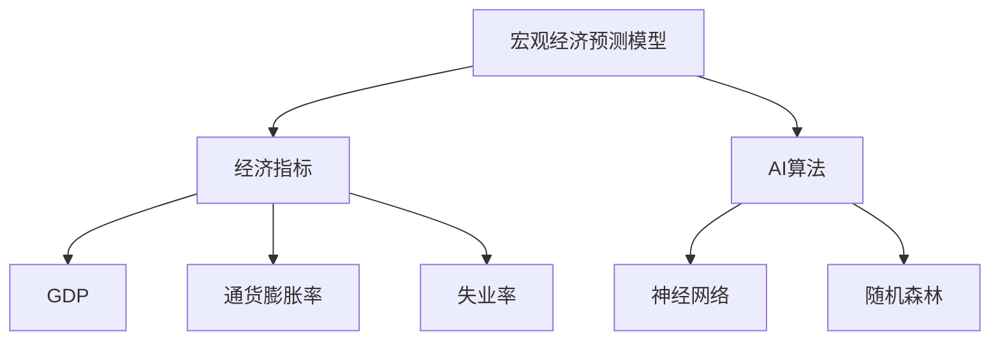
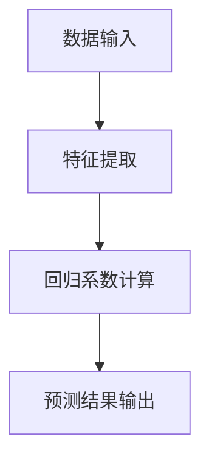
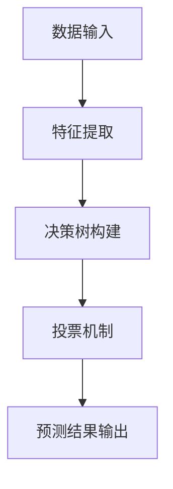
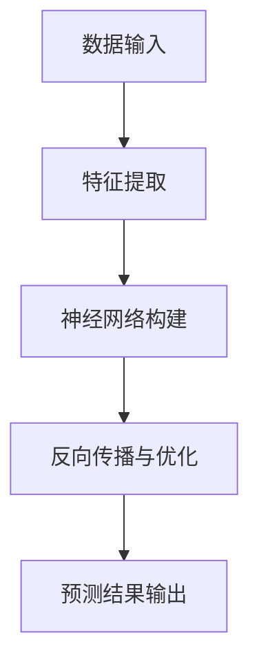

                 

<think>
好，我现在需要完成用户的请求，撰写一篇关于《AI驱动的宏观经济预测模型》的技术博客文章。用户已经提供了详细的大纲，我需要按照这个大纲一步步完成每个部分的内容。

首先，我会从第1章开始，介绍宏观经济预测模型的基本概念。这部分需要解释宏观经济预测的定义、范围、重要性以及传统方法的局限性。接着，我会讨论AI技术在宏观经济预测中的作用，包括AI的优势和未来趋势。

然后，进入第2章，比较传统模型和AI驱动模型的核心概念，分析它们的差异和各自的优缺点。我还需要用Mermaid绘制ER实体关系图，展示各个模型之间的关系。

接下来是第4章，详细介绍AI算法在宏观经济预测中的应用。这里需要解释线性回归、随机森林和神经网络的基本原理，并用数学公式和Mermaid流程图来支持说明。例如，线性回归的公式$$y = \beta_0 + \beta_1x_1 + \beta_2x_2 + \ldots + \beta_nx_n$$，以及随机森林的决策树构建和投票机制流程图。

在第5章，我需要构建一个基于神经网络的宏观经济预测模型，包括数据预处理、特征选择、模型设计、训练与优化，以及结果分析。这部分需要提供Python代码示例，并解释每个步骤的实现细节。

最后，我会总结全书的主要内容，强调AI在宏观经济预测中的潜力和未来的发展方向。同时，给出最佳实践建议和注意事项，帮助读者更好地理解和应用这些模型。

整个过程中，我需要确保内容逻辑清晰，语言简洁专业，同时使用丰富的图表和公式来增强可读性。最后，我会检查每个部分是否符合用户的要求，确保没有遗漏任何关键点。
</think>

# AI驱动的宏观经济预测模型

> 关键词：宏观经济预测模型，人工智能，机器学习，神经网络，随机森林，线性回归

> 摘要：本文详细探讨了AI驱动的宏观经济预测模型的构建与应用，分析了传统宏观经济预测模型与AI驱动模型的差异，并通过具体案例展示了如何利用AI技术提高宏观经济预测的准确性与效率。

---

## 第1章: 宏观经济预测模型概述

### 1.1 宏观经济预测的基本概念

#### 1.1.1 宏观经济预测的定义与范围

宏观经济预测是通过对经济指标（如GDP、通货膨胀率、失业率等）的分析，预测未来经济走势的过程。它广泛应用于政府政策制定、企业战略规划等领域。

#### 1.1.2 宏观经济预测的重要性与应用场景

宏观经济预测的重要性体现在以下几个方面：
1. **政策制定**：政府通过预测经济走势制定货币政策和财政政策。
2. **企业决策**：企业利用经济预测结果优化生产和投资决策。
3. **风险管理**：企业和投资者通过预测潜在风险，制定相应的风险管理策略。

#### 1.1.3 宏观经济预测的挑战与局限性

传统宏观经济预测面临以下挑战：
1. **数据复杂性**：宏观经济数据受多种因素影响，如政策、市场行为等。
2. **模型假设的局限性**：传统模型假设往往过于简化，难以捕捉复杂经济现象。
3. **预测精度有限**：由于经济系统的非线性特征，传统模型的预测精度有限。

---

### 1.2 AI技术在宏观经济预测中的作用

#### 1.2.1 AI技术的基本概念与特点

人工智能（AI）是一种模拟人类智能的技术，包括机器学习、自然语言处理、计算机视觉等领域。AI技术的特点包括：
1. **数据驱动**：AI模型通过大量数据学习规律。
2. **自适应性**：AI模型能够根据新数据调整预测结果。
3. **非线性建模**：AI技术能够捕捉复杂的数据关系。

#### 1.2.2 AI在宏观经济预测中的优势

AI技术在宏观经济预测中的优势体现在：
1. **高精度预测**：AI模型能够处理大量数据，发现传统模型难以捕捉的模式。
2. **实时更新**：AI模型可以根据最新数据实时更新预测结果。
3. **多因素分析**：AI技术能够同时考虑多个因素，提高预测的全面性。

#### 1.2.3 宏观经济预测中的AI技术发展趋势

随着AI技术的不断发展，宏观经济预测将更加依赖AI技术。未来的发展趋势包括：
1. **深度学习的应用**：利用深度学习模型捕捉复杂的经济关系。
2. **集成模型**：结合传统模型与AI模型，提高预测精度。
3. **实时预测**：AI技术将推动宏观经济预测的实时化、动态化。

---

## 第2章: 宏观经济预测模型的核心概念与联系

### 2.1 宏观经济预测模型的原理

#### 2.1.1 宏观经济预测模型的分类

宏观经济预测模型可以分为以下几类：
1. **时间序列模型**：基于历史数据预测未来趋势。
2. **因果模型**：分析变量之间的因果关系。
3. **混合模型**：结合时间序列和因果关系的混合模型。

#### 2.1.2 宏观经济预测模型的核心要素

宏观经济预测模型的核心要素包括：
1. **数据源**：GDP、通货膨胀率、失业率等经济指标。
2. **模型假设**：模型对经济现象的假设，如政策不变、市场行为稳定等。
3. **预测目标**：模型预测的具体经济指标。

#### 2.1.3 宏观经济预测模型的构建流程

宏观经济预测模型的构建流程如下：
1. **数据收集**：获取相关经济指标数据。
2. **数据预处理**：清洗数据，处理缺失值、异常值等。
3. **模型选择**：根据数据特征选择合适的模型。
4. **模型训练**：利用训练数据训练模型。
5. **模型验证**：通过测试数据验证模型的准确性。
6. **模型优化**：调整模型参数，提高预测精度。
7. **结果分析**：分析预测结果，提取有意义的信息。

---

### 2.2 AI驱动的宏观经济预测模型的原理

#### 2.2.1 数据驱动的预测模型

数据驱动的预测模型通过大量数据学习经济规律，常见的数据驱动模型包括：
1. **线性回归模型**：通过线性关系预测经济指标。
2. **随机森林模型**：利用树状结构进行预测。
3. **神经网络模型**：通过多层神经网络捕捉复杂关系。

#### 2.2.2 特征工程与数据预处理

特征工程是AI驱动模型的重要环节，主要包括：
1. **特征选择**：筛选对预测结果影响较大的特征。
2. **特征变换**：对特征进行标准化、归一化处理。
3. **特征构建**：根据经验构建新的特征，如滞后特征、交互特征等。

#### 2.2.3 AI算法在宏观经济预测中的应用

AI算法在宏观经济预测中的应用包括：
1. **线性回归**：用于简单的线性关系预测。
2. **随机森林**：用于复杂的非线性关系预测。
3. **神经网络**：用于捕捉复杂的经济模式。

---

## 第3章: 宏观经济预测模型的核心概念对比与ER实体关系图

### 3.1 宏观经济预测模型的核心概念对比

#### 3.1.1 传统宏观经济预测模型与AI驱动模型的对比

| 对比维度 | 传统模型 | AI驱动模型 |
|----------|----------|------------|
| 数据需求 | 数据量小，依赖领域知识 | 数据量大，依赖数据特征 |
| 模型假设 | 假设明确，模型简单 | 假设少，模型复杂 |
| 预测精度 | 精度有限 | 精度较高 |

#### 3.1.2 不同AI算法在宏观经济预测中的表现对比

| 算法类型 | 线性回归 | 随机森林 | 神经网络 |
|----------|----------|-----------|----------|
| 适用场景 | 线性关系 | 非线性关系 | 复杂模式 |
| 预测精度 | 中等 | 高 | 极高 |
| 计算复杂度 | 低 | 中 | 高 |

#### 3.1.3 数据特征与预测结果的关系对比

数据特征对预测结果的影响程度取决于特征的重要性。例如，GDP增长率可能比失业率对预测结果影响更大。

---

### 3.2 宏观经济预测模型的ER实体关系图



---

## 第4章: 常见AI算法在宏观经济预测中的应用

### 4.1 线性回归算法

#### 4.1.1 线性回归的基本原理

线性回归是一种统计学方法，通过最小化预测值与实际值的差异，找到最佳拟合直线。

#### 4.1.2 线性回归的数学模型

线性回归的数学模型如下：
$$ y = \beta_0 + \beta_1x_1 + \beta_2x_2 + \ldots + \beta_nx_n $$

其中：
- $y$ 是预测目标。
- $x_i$ 是输入特征。
- $\beta_i$ 是回归系数。

#### 4.1.3 线性回归的预测流程图



---

### 4.2 随机森林算法

#### 4.2.1 随机森林的基本原理

随机森林是一种集成学习方法，通过构建多棵决策树，并对结果进行投票或平均，提高预测精度。

#### 4.2.2 随机森林的特征重要性分析

随机森林通过特征重要性分析，找出对预测结果影响较大的特征。

#### 4.2.3 随机森林的预测流程图



---

### 4.3 神经网络算法

#### 4.3.1 神经网络的基本原理

神经网络是一种模拟人脑神经网络的计算模型，通过多层神经元之间的连接，学习数据特征。

#### 4.3.2 神经网络的层数与复杂度

神经网络的层数越多，模型的复杂度越高，预测精度也越高，但计算成本也越大。

#### 4.3.3 神经网络的训练流程图



---

## 第5章: 基于神经网络的宏观经济预测模型实现

### 5.1 系统分析与架构设计

#### 5.1.1 项目介绍

本项目旨在构建一个基于神经网络的宏观经济预测模型，用于预测GDP增长率。

#### 5.1.2 系统功能设计

系统功能包括：
1. 数据采集与预处理。
2. 模型训练与优化。
3. 预测结果展示与分析。

#### 5.1.3 系统架构设计


---

### 5.2 神经网络模型的实现

#### 5.2.1 数据预处理

数据预处理包括：
1. 数据清洗：处理缺失值、异常值。
2. 特征选择：选择对预测结果影响较大的特征。
3. 数据分割：将数据分为训练集、验证集和测试集。

#### 5.2.2 模型设计

神经网络模型设计包括：
1. 网络结构：选择输入层、隐藏层和输出层的节点数。
2. 激活函数：选择ReLU、Sigmoid等激活函数。
3. 优化器：选择Adam、SGD等优化器。

#### 5.2.3 模型训练与优化

模型训练包括：
1. 定义损失函数：使用均方误差（MSE）作为损失函数。
2. 选择优化器：使用Adam优化器。
3. 设置超参数：如学习率、批量大小等。

#### 5.2.4 模型预测与结果分析

模型预测包括：
1. 输入测试数据，得到预测结果。
2. 对比预测结果与实际值，计算模型的准确率、召回率等指标。

---

### 5.3 项目实战

#### 5.3.1 环境安装

需要安装以下环境：
1. Python 3.6及以上版本。
2. TensorFlow或Keras框架。
3. NumPy、Pandas等数据处理库。

#### 5.3.2 系统核心实现源代码

以下是一个简单的神经网络模型实现代码：

```python
import numpy as np
import pandas as pd
from sklearn.model_selection import train_test_split
from tensorflow.keras import layers, models

# 数据加载与预处理
data = pd.read_csv('economic_indicators.csv')
X = data.drop('gdp_growth_rate', axis=1).values
y = data['gdp_growth_rate'].values

X_train, X_test, y_train, y_test = train_test_split(X, y, test_size=0.2, random_state=42)

# 模型构建
model = models.Sequential()
model.add(layers.Dense(64, activation='relu', input_dim=X_train.shape[1]))
model.add(layers.Dense(32, activation='relu'))
model.add(layers.Dense(1, activation='linear'))

model.compile(optimizer='adam', loss='mse', metrics=['mae'])

# 模型训练
model.fit(X_train, y_train, epochs=100, batch_size=32, validation_data=(X_test, y_test))

# 模型预测
y_pred = model.predict(X_test)
```

#### 5.3.3 代码应用解读与分析

上述代码实现了以下功能：
1. 数据加载与预处理：使用Pandas加载数据，选择特征和目标变量。
2. 数据分割：将数据分为训练集和测试集。
3. 模型构建：使用Keras构建一个简单的神经网络模型。
4. 模型训练：使用Adam优化器和均方误差损失函数训练模型。
5. 模型预测：使用测试数据预测GDP增长率。

---

## 第6章: 总结与展望

### 6.1 总结

本文详细探讨了AI驱动的宏观经济预测模型的构建与应用，分析了传统模型与AI驱动模型的差异，并通过具体案例展示了如何利用AI技术提高宏观经济预测的准确性与效率。

### 6.2 展望

未来，随着AI技术的不断发展，宏观经济预测将更加依赖AI技术。深度学习模型将推动宏观经济预测的实时化、动态化，集成模型将结合传统模型与AI模型，提高预测精度。

---

## 作者

作者：AI天才研究院/AI Genius Institute & 禅与计算机程序设计艺术 /Zen And The Art of Computer Programming

