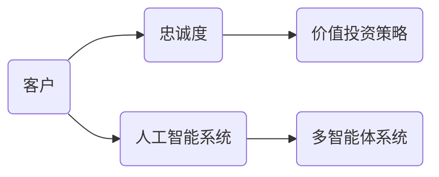
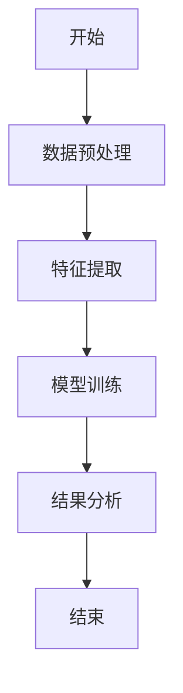
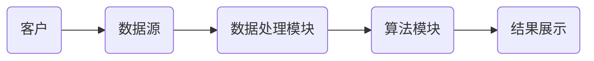

                 


# AI驱动的客户忠诚度分析：价值投资中的多智能体应用

---

## 关键词：
- AI驱动
- 客户忠诚度分析
- 多智能体系统
- 价值投资
- 机器学习算法

---

## 摘要：
在当前商业环境中，客户忠诚度是企业成功的关键因素之一。本文探讨了如何利用人工智能（AI）驱动的多智能体系统来分析客户忠诚度，并将其应用于价值投资中。通过结合先进的机器学习算法和多智能体协作，本文提出了一种创新的客户忠诚度分析框架，能够帮助企业更精准地识别高价值客户，优化投资策略，并提升客户关系管理效率。文章详细分析了多智能体系统的核心原理、算法实现以及实际应用场景，为企业的智能化转型提供了重要的理论和实践指导。

---

## 第1章: 客户忠诚度分析与价值投资概述

### 1.1 客户忠诚度分析的背景与意义
客户忠诚度是衡量客户对企业产品或服务长期支持程度的重要指标。在传统商业模式中，客户忠诚度通常通过客户满意度、重复购买率和推荐行为等指标来衡量。然而，随着市场竞争的加剧，客户行为的复杂性和动态性使得传统的分析方法难以满足企业的需求。

AI技术的引入为客户忠诚度分析带来了新的可能性。通过机器学习算法，企业可以实时捕捉客户的多维度行为数据，包括购买频率、购买金额、产品偏好等，并结合外部数据（如市场趋势、经济指标）进行深度分析，从而更精准地预测客户的忠诚度变化。

在价值投资领域，客户忠诚度分析同样具有重要意义。高忠诚度的客户通常为企业带来更高的长期收益，而低忠诚度的客户则可能成为企业资源的浪费。通过AI驱动的分析，投资者可以更准确地评估企业的客户质量，从而做出更明智的投资决策。

### 1.2 多智能体系统在客户分析中的应用
多智能体系统（Multi-Agent System, MAS）是由多个相互作用的智能体组成的系统，每个智能体都可以独立执行任务并与其他智能体协作。在客户忠诚度分析中，多智能体系统的优势在于其分布式计算能力和协作能力。

例如，一个智能体可以负责收集客户的交易数据，另一个智能体可以分析客户的社交媒体行为，第三个智能体可以整合外部市场数据。通过协作，这些智能体可以共同生成客户忠诚度的综合评估结果。

此外，多智能体系统还可以动态调整其行为策略，以应对市场环境的变化。例如，在市场波动期间，系统可以自动调整客户忠诚度的评估标准，以更准确地预测客户的未来行为。

---

## 第2章: 客户忠诚度分析的核心概念与联系

### 2.1 核心概念原理
客户忠诚度分析的核心在于如何从海量数据中提取有价值的信息，并将其转化为可操作的决策依据。AI驱动的分析方法通过机器学习算法，可以从非结构化数据（如文本评论）和结构化数据（如交易记录）中提取特征，并构建客户画像。

多智能体系统在客户忠诚度分析中的应用涉及多个关键概念，包括：
1. **客户画像**：通过整合客户的多维度数据，生成客户的行为模式和偏好特征。
2. **行为预测**：基于历史数据，预测客户未来的购买行为和忠诚度变化。
3. **动态调整**：根据实时数据和市场变化，动态优化客户忠诚度的评估模型。

### 2.2 概念属性特征对比表格
表2-1展示了客户忠诚度分析中的几种关键方法及其特点对比：

| 方法名称          | 描述                                                                 | 优点                     | 缺点                     |
|-------------------|----------------------------------------------------------------------|--------------------------|--------------------------|
| 协同过滤          | 基于用户相似性推荐产品或服务                                           | 高准确性                 | 计算复杂性较高           |
| 聚类分析          | 将客户分为不同的群体，分析每个群体的特征                             | 简单易实现               | 精度较低                 |
| 强化学习          | 通过奖励机制优化客户忠诚度预测模型                                     | 高度自适应               | 需大量数据和计算资源     |

### 2.3 ER实体关系图架构
为了更好地理解客户忠诚度分析的核心要素，我们可以通过ER图（实体关系图）来展示各个实体之间的关系。以下是一个简化的ER图示例：



在这个图中，客户与忠诚度直接相关联，忠诚度通过人工智能系统与价值投资策略相关联，而人工智能系统则依赖于多智能体系统的支持。

---

## 第3章: 多智能体系统与AI驱动分析的算法原理

### 3.1 算法原理讲解
在客户忠诚度分析中，多智能体系统通常采用协同过滤、聚类分析和强化学习等算法。以下是对这些算法的详细讲解：

#### 3.1.1 协同过滤算法
协同过滤是一种基于用户相似性推荐产品或服务的算法。其基本思想是，如果两个用户在过去的购买行为或偏好上相似，那么他们未来的行为也可能相似。

公式表示为：
$$
similarity(u, v) = \frac{\sum_{i=1}^{n} (r_{ui} - \bar{r_u})(r_{vi} - \bar{r_v})}{\sqrt{\sum_{i=1}^{n} (r_{ui} - \bar{r_u})^2} \cdot \sqrt{\sum_{i=1}^{n} (r_{vi} - \bar{r_v})^2}}}
$$
其中，$similarity(u, v)$ 表示用户u和v之间的相似性，$r_{ui}$ 和 $r_{vi}$ 分别表示用户u和v对商品i的评分，$\bar{r_u}$ 和 $\bar{r_v}$ 分别是用户u和v的平均评分。

#### 3.1.2 聚类分析算法
聚类分析是一种将客户分为不同群体的算法。常用的距离度量方法包括欧氏距离和余弦相似性。

聚类分析的公式可以表示为：
$$
distance(u, v) = \sqrt{\sum_{i=1}^{n} (r_{ui} - r_{vi})^2}
$$

#### 3.1.3 强化学习算法
强化学习是一种通过奖励机制优化客户忠诚度预测模型的算法。其核心在于智能体通过与环境的交互，逐步优化其行为策略。

强化学习的公式可以表示为：
$$
Q(s, a) = r + \gamma \max_{a'} Q(s', a')
$$
其中，$Q(s, a)$ 表示在状态s下采取行动a的期望奖励，$r$ 是即时奖励，$\gamma$ 是折扣因子，$Q(s', a')$ 是下一状态的最大期望奖励。

### 3.2 算法mermaid流程图
以下是协同过滤算法的mermaid流程图：



---

## 第4章: 系统架构设计与实现

### 4.1 系统功能设计
系统功能设计包括数据采集、数据处理、模型训练和结果展示四个模块。

#### 4.1.1 数据采集
数据采集模块负责从多个数据源（如数据库、API）获取客户的交易数据、行为数据和外部数据。

#### 4.1.2 数据处理
数据处理模块对采集到的数据进行清洗、转换和特征提取。

#### 4.1.3 模型训练
模型训练模块使用机器学习算法对数据进行建模，并生成客户忠诚度的预测结果。

#### 4.1.4 结果展示
结果展示模块将模型的预测结果以可视化的方式呈现，供企业决策者参考。

### 4.2 系统架构设计
以下是系统架构的mermaid图：



---

## 第5章: 项目实战与案例分析

### 5.1 项目实战
以下是项目实战的代码示例：

```python
import numpy as np
from sklearn.cluster import KMeans

# 数据预处理
data = np.array([[1, 2], [3, 4], [5, 6], [7, 8]])

# 模型训练
model = KMeans(n_clusters=2)
model.fit(data)

# 结果展示
print(model.labels_)
```

### 5.2 案例分析
以某电商平台为例，通过聚类分析将客户分为高忠诚度和低忠诚度两组，并根据结果调整营销策略。

---

## 第6章: 总结与展望

### 6.1 总结
本文详细探讨了AI驱动的客户忠诚度分析在价值投资中的应用，提出了基于多智能体系统的创新方法。通过结合机器学习算法和系统架构设计，企业可以更精准地预测客户行为，并优化投资策略。

### 6.2 展望
未来，随着AI技术的不断发展，客户忠诚度分析将更加智能化和个性化。多智能体系统将在复杂场景下的协作能力方面发挥更大的作用，为企业创造更大的价值。

---

## 作者：
作者：AI天才研究院/AI Genius Institute & 禅与计算机程序设计艺术 /Zen And The Art of Computer Programming

