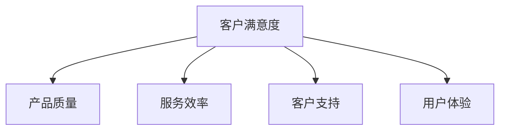
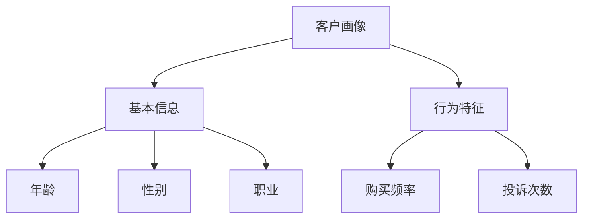
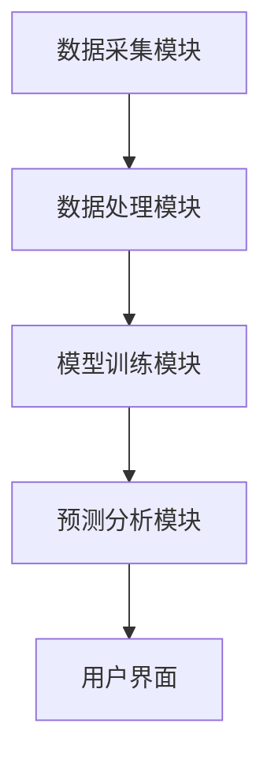
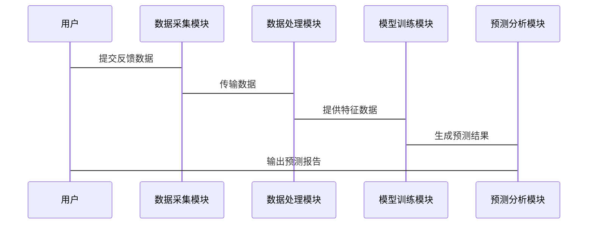

                 

<think>
嗯，用户希望我写一篇关于AI驱动的客户满意度分析的技术博客，还特别要求了一个详细的目录结构，包括关键词、摘要和正文部分。看起来用户需要的是一篇结构清晰、内容详尽的专业文章，目标读者可能是企业中的技术人员或管理人员，他们想了解如何利用AI来提升客户满意度并预测公司长期成功。

首先，我需要分析用户的需求。用户给出的标题和关键词已经明确了文章的主题，所以我需要围绕这个主题展开。关键词包括客户满意度、AI、机器学习、预测分析、长期成功，这些都是文章的核心内容。

接下来，摘要部分要简洁明了，概括文章的核心内容，强调AI在客户满意度分析中的应用及其对企业长期成功的影响。这为读者提供了文章的主旨，帮助他们快速了解文章的价值。

正文部分需要按照目录结构来组织，确保每个章节和子章节都涵盖必要的内容。首先是背景介绍，这部分需要解释客户满意度的重要性以及AI技术如何改变传统的分析方法。然后是核心概念，详细讲解各种指标和模型，帮助读者理解理论基础。接下来是算法原理，使用图表和代码示例来说明机器学习模型的应用，这能让读者更好地掌握技术细节。

系统架构部分可能需要绘制类图和流程图，展示系统的各个模块和它们之间的交互。项目实战则需要提供具体的案例，环境安装步骤和代码实现，让读者能够动手实践。最后，最佳实践部分总结经验，给出注意事项和拓展阅读建议，帮助读者在实际应用中避免错误。

我需要确保文章逻辑清晰，结构紧凑，同时使用专业的技术语言，但又不失易懂。数学公式和图表的使用要恰当，能够准确传达信息。此外，作者信息部分也要正确添加，增加文章的权威性。

在写作过程中，我可能会遇到如何平衡理论和实践的问题，需要确保每个部分既有足够的理论支持，又有实际案例支撑。另外，算法部分可能需要详细解释，避免读者感到困惑。同时，图表的绘制要准确，能够直观展示模型和系统架构。

总的来说，我需要一步步按照用户的要求，从背景到理论，再到实践，全面展开，确保文章内容丰富、结构合理，能够真正帮助读者理解AI在客户满意度分析中的应用及其对企业发展的影响。
</think>

```markdown
# AI驱动的客户满意度分析：预测公司的长期成功

> 关键词：客户满意度、AI、机器学习、预测分析、长期成功

> 摘要：随着人工智能技术的飞速发展，客户满意度分析已不再局限于传统的问卷调查和数据分析方法。通过AI技术，企业可以更精准地预测客户满意度，并以此为基础制定有效的客户 retention 和提升策略，从而为公司的长期成功奠定基础。本文将从客户满意度分析的核心概念、AI驱动的分析方法、算法实现、系统架构设计、项目实战案例以及最佳实践等方面，全面解析AI如何助力企业实现客户满意度提升与长期成功预测。

---

# 第一部分: AI驱动的客户满意度分析基础

## 第1章: 客户满意度分析的背景与重要性

### 1.1 客户满意度分析的定义与核心概念

客户满意度分析是通过收集和分析客户对产品或服务的反馈，评估客户对企业的整体满意度的过程。其核心目标在于识别客户的不满情绪、挖掘潜在的客户需求，并通过改进产品或服务，提升客户忠诚度和满意度。

- **客户满意度的定义**：客户满意度是客户对某一产品或服务的实际体验与期望值之间的差距。差距越大，客户满意度越低。
- **客户满意度的核心要素**：包括产品质量、服务效率、客户支持、用户体验等多个方面。



### 1.2 AI在客户满意度分析中的作用

传统客户满意度分析方法依赖于问卷调查和统计分析，存在效率低、成本高、实时性差等问题。而AI技术的引入，使得客户满意度分析更加智能化、自动化和实时化。

- **AI技术的核心优势**：
  - **自动化数据处理**：通过自然语言处理（NLP）技术，自动提取客户反馈中的情感倾向和关键词。
  - **实时分析**：基于流数据处理技术，实时监控客户满意度变化。
  - **预测能力**：通过机器学习算法，预测客户未来的满意度趋势。

### 1.3 本章小结

本章介绍了客户满意度分析的核心概念和AI技术在其中的重要作用。AI技术的应用不仅提升了分析效率，还为企业提供了更精准的预测能力，为企业的长期成功提供了有力支持。

---

## 第2章: 客户满意度分析的关键指标

### 2.1 客户满意度指标体系

客户满意度指标体系是衡量客户满意度的核心工具，主要包括以下几类指标：

- **定量指标**：
  - Net Promoter Score (NPS)
  - Customer Satisfaction Score (CSAT)
  - Customer Effort Score (CES)
- **定性指标**：
  - 客户反馈关键词（如“满意”、“不满意”、“建议”等）

```mermaid
graph TD
    A[定量指标] --> B[Net Promoter Score (NPS)]
    A --> C[Customer Satisfaction Score (CSAT)]
    A --> D[Customer Effort Score (CES)]
    E[定性指标] --> F[客户反馈关键词]
```

### 2.2 客户满意度分析模型

客户满意度分析模型是基于机器学习算法构建的预测模型，主要用于预测客户满意度的变化趋势。

- **线性回归模型**：
  - 用于预测客户满意度的连续值。
  - 数学模型：$y = \beta_0 + \beta_1x_1 + \beta_2x_2 + ... + \beta_nx_n + \epsilon$
- **随机森林模型**：
  - 用于分类客户满意度的等级（如满意、一般、不满意）。
  - 基于决策树的集成算法，具有较高的准确性和鲁棒性。

```python
# 线性回归模型实现示例
import numpy as np
from sklearn.linear_model import LinearRegression

X = np.array([[1], [2], [3], [4], [5]])
y = np.array([2, 3, 5, 6, 7])

model = LinearRegression()
model.fit(X, y)
print(model.predict([[6]]))  # 输出预测值
```

### 2.3 模型选择与优化

- **模型选择的依据**：
  - 数据类型：连续型数据选择线性回归，分类数据选择随机森林。
  - 数据量：小数据集选择线性回归，大数据集选择随机森林。
- **模型优化方法**：
  - 超参数调优（如网格搜索）。
  - 正则化处理（如L1/L2正则化）。

---

## 第3章: 客户画像与行为分析

### 3.1 客户画像的构建

客户画像是基于客户数据构建的客户特征描述，帮助企业更好地理解客户群体。

- **客户画像的定义**：
  - 包括客户的基本信息（如年龄、性别、职业）和行为特征（如购买频率、投诉次数）。
- **客户画像的构建步骤**：
  1. 数据采集：收集客户的基本信息和行为数据。
  2. 特征提取：通过数据挖掘技术提取关键特征。
  3. 数据可视化：使用图表展示客户画像。



### 3.2 客户行为分析

客户行为分析是通过分析客户的互动行为，识别客户的潜在需求和行为模式。

- **客户行为数据的收集与处理**：
  - 数据源：日志数据、传感器数据、社交媒体数据。
  - 数据清洗：去除异常值和缺失值。
- **客户行为模式识别**：
  - 使用聚类算法识别客户群体（如高频用户、低频用户）。
  - 使用序列分析识别客户行为路径。

### 3.3 本章小结

本章通过构建客户画像和分析客户行为，帮助企业更深入地理解客户群体，为后续的客户满意度分析提供数据支持。

---

## 第4章: 机器学习算法在客户满意度分析中的应用

### 4.1 线性回归模型

线性回归模型是一种经典的预测模型，适用于预测客户满意度的连续值。

- **线性回归的数学模型**：
  $$ y = \beta_0 + \beta_1x_1 + \beta_2x_2 + ... + \beta_nx_n + \epsilon $$
- **线性回归的实现步骤**：
  1. 数据准备：收集和清洗数据。
  2. 特征选择：选择关键特征。
  3. 模型训练：使用最小二乘法训练模型。
  4. 模型评估：计算R²值和残差。

### 4.2 随机森林模型

随机森林模型是一种基于决策树的集成算法，适用于分类客户满意度的等级。

- **随机森林的原理**：
  - 通过随机采样构建多棵决策树。
  - 使用投票法预测最终结果。
- **随机森林的实现步骤**：
  1. 数据准备：收集和清洗数据。
  2. 特征选择：选择关键特征。
  3. 模型训练：构建随机森林模型。
  4. 模型评估：计算准确率和F1值。

```python
# 随机森林模型实现示例
from sklearn.ensemble import RandomForestClassifier

X = np.array([[1, 2], [3, 4], [5, 6], [7, 8], [9, 10]])
y = np.array([0, 1, 0, 1, 0])

model = RandomForestClassifier(n_estimators=5)
model.fit(X, y)
print(model.predict([[11, 12]]))  # 输出预测结果
```

### 4.3 神经网络模型

神经网络模型是一种强大的预测模型，适用于复杂的客户满意度预测任务。

- **神经网络的原理**：
  - 通过多层神经元模拟人脑的神经网络。
  - 使用反向传播算法训练模型。
- **神经网络的实现步骤**：
  1. 数据准备：收集和清洗数据。
  2. 特征选择：选择关键特征。
  3. 模型训练：构建神经网络模型。
  4. 模型评估：计算准确率和损失值。

```python
# 神经网络模型实现示例
import keras
from keras.models import Sequential
from keras.layers import Dense

model = Sequential()
model.add(Dense(64, activation='relu', input_dim=2))
model.add(Dense(1, activation='sigmoid'))
model.compile(optimizer='adam', loss='binary_crossentropy', metrics=['accuracy'])
model.fit(X, y, epochs=10, batch_size=32)
```

---

## 第5章: 系统架构设计与实现

### 5.1 问题场景介绍

客户满意度分析系统需要解决以下问题：
- 如何高效地收集和处理客户反馈数据。
- 如何准确地预测客户满意度。
- 如何实时监控客户满意度的变化。

### 5.2 系统功能设计

- **数据采集模块**：
  - 收集客户的基本信息和行为数据。
  - 支持多种数据源（如问卷、日志、社交媒体）。
- **数据处理模块**：
  - 数据清洗和特征提取。
  - 数据存储和管理。
- **模型训练模块**：
  - 选择合适的机器学习模型。
  - 训练模型并保存模型参数。
- **预测分析模块**：
  - 实时预测客户满意度。
  - 生成预测报告和可视化图表。

### 5.3 系统架构设计



### 5.4 系统接口设计

- **数据接口**：
  - RESTful API接口。
  - 支持JSON格式的数据传输。
- **模型接口**：
  - 提供预测API，支持批量预测和实时预测。

### 5.5 系统交互流程



---

## 第6章: 项目实战与案例分析

### 6.1 项目背景

某电商公司希望通过客户满意度分析，提升客户 retention 率和忠诚度。

### 6.2 环境安装与配置

- **安装Python**：Python 3.8及以上版本。
- **安装依赖库**：`numpy`、`pandas`、`scikit-learn`、`keras`。

### 6.3 核心代码实现

```python
# 数据处理代码
import pandas as pd
import numpy as np
from sklearn.model

