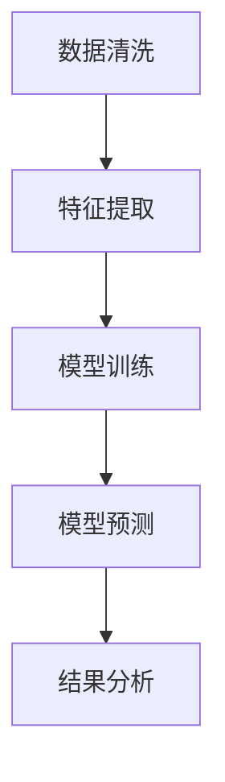
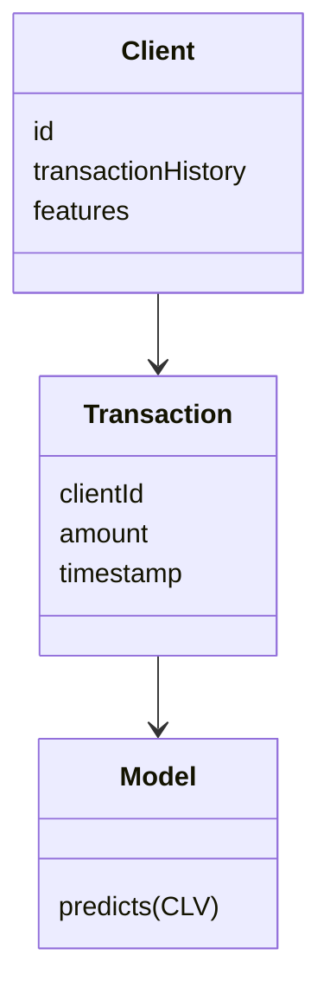

                 


# AI驱动的客户终身价值分析：深入理解公司的收入质量

> **关键词**：客户终身价值（CLV）、AI驱动、收入质量、机器学习、数据建模、客户分析、商业智能

> **摘要**：本文深入探讨了AI技术如何驱动客户终身价值（CLV）的分析，帮助企业提升收入质量。通过分析CLV的核心概念、AI算法原理、系统架构设计以及实际项目案例，本文为读者提供了从理论到实践的全面指导。我们还将讨论如何通过AI技术优化CLV预测模型，以实现更精准的客户价值评估和企业收入管理。

---

## 正文

### 第一部分: AI驱动的客户终身价值分析背景与核心概念

#### 第1章: 客户终身价值（CLV）概述

##### 1.1 客户终身价值（CLV）的定义与意义

客户终身价值（Customer Lifetime Value, CLV）是指一个客户在其生命周期内为企业带来的总收入减去相关成本的净现值。CLV不仅是企业评估客户价值的重要指标，也是制定客户策略、优化收入结构的关键依据。AI技术的应用使得CLV的预测更加精准和动态化。

- **1.1.1 什么是客户终身价值（CLV）**
  - CLV是衡量客户对企业长期贡献的核心指标。
  - 传统CLV计算方法依赖历史数据，而AI驱动的方法能够实时更新预测结果。

- **1.1.2 CLV在企业收入管理中的重要性**
  - 帮助企业识别高价值客户，优化资源配置。
  - 提供客户流失预警，降低客户获取成本。

- **1.1.3 CLV与企业可持续发展的关系**
  - 高CLV客户是企业长期收入的基石。
  - 通过CLV分析，企业能够更好地平衡短期收益与长期发展。

##### 1.2 问题背景与问题描述

- **1.2.1 传统客户价值评估的局限性**
  - 数据采集范围有限，难以覆盖客户全生命周期。
  - 评估方法过于静态，难以反映市场变化。

- **1.2.2 当前企业收入质量分析的挑战**
  - 数据量大且复杂，传统方法难以处理。
  - 客户行为预测不准确，影响收入规划。

- **1.2.3 AI驱动CLV分析的必要性**
  - 利用AI技术实时分析客户数据，提升预测精度。
  - 通过动态模型优化CLV预测，提高企业决策效率。

##### 1.3 AI驱动CLV分析的核心价值

- 提供实时、动态的客户价值评估。
- 优化客户分层管理，提升收入质量。
- 降低客户获取成本，提高客户忠诚度。

---

### 第二部分: 算法原理与技术实现

#### 第2章: 基于AI的CLV预测算法

##### 2.1 数据预处理与特征工程

- 数据清洗：去除噪声数据，处理缺失值。
- 特征提取：从客户交易记录中提取关键特征，如购买频率、平均客单价。

##### 2.2 常见CLV预测算法

- **线性回归模型**
  - 假设CLV与客户特征呈线性关系。
  - 公式：$$CLV = \beta_0 + \beta_1x_1 + \beta_2x_2 + \dots + \beta_nx_n$$

- **随机森林模型**
  - 通过集成学习提升预测精度。
  - 适用于非线性关系的特征组合。

- **神经网络模型**
  - 使用深度学习框架（如TensorFlow）进行复杂模式识别。
  - 适合高维特征和复杂数据结构。

##### 2.3 基于机器学习的CLV预测流程



---

### 第三部分: 系统分析与架构设计

#### 第3章: CLV分析系统架构

##### 3.1 功能模块设计

- 数据采集模块：实时采集客户交易数据。
- 数据处理模块：清洗和转换数据。
- 模型训练模块：训练CLV预测模型。
- 结果展示模块：可视化分析结果。

##### 3.2 系统架构设计



---

### 第四部分: 项目实战与代码实现

#### 第4章: 基于Python的CLV分析项目

##### 4.1 环境安装与数据准备

```bash
pip install numpy pandas scikit-learn
```

##### 4.2 数据清洗与特征工程

```python
import pandas as pd
from sklearn.impute import SimpleImputer

# 加载数据
df = pd.read_csv('customer_data.csv')

# 处理缺失值
imputer = SimpleImputer(strategy='mean')
df_imputed = imputer.fit_transform(df)
```

##### 4.3 模型训练与评估

```python
from sklearn.linear_model import LinearRegression
from sklearn.metrics import mean_squared_error

# 训练模型
model = LinearRegression()
model.fit(X_train, y_train)

# 评估模型
y_pred = model.predict(X_test)
print(mean_squared_error(y_test, y_pred))
```

---

### 第五部分: 最佳实践与小结

#### 第5章: 实践总结与优化建议

##### 5.1 最佳实践

- 数据质量是模型预测的基础，需重视数据清洗和特征工程。
- 根据业务需求选择合适的模型，避免过度复杂化。
- 定期更新模型，适应市场变化和客户行为调整。

##### 5.2 小结与展望

AI驱动的CLV分析正在改变企业的收入管理模式。通过持续优化算法和系统架构，企业能够更精准地预测客户价值，提升收入质量。未来，随着AI技术的不断发展，CLV分析将更加动态化和个性化。

---

### 第六部分: 参考文献

- 书籍：《客户关系管理》
- 工具：Python、scikit-learn、TensorFlow
- 网站：Kaggle、Medium（AI专栏）

---

**作者：AI天才研究院 & 禅与计算机程序设计艺术**

