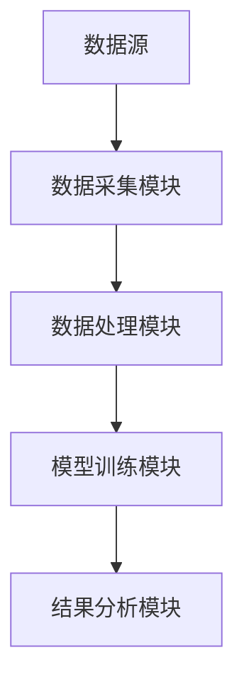

                 

<think>
好的，我现在需要帮用户撰写一篇关于《AI驱动的市场微观结构影响分析》的技术博客文章。首先，我需要理解用户的需求。用户希望文章结构清晰，逻辑严谨，内容专业，涵盖从背景介绍到系统架构设计的各个方面。

首先，我应该从背景介绍开始。这部分需要解释什么是市场微观结构，以及AI在其中的作用。我需要确保定义清晰，例子具体，帮助读者理解。

接下来是核心概念，我需要详细讲解AI在金融市场中的应用，如交易策略优化和市场情绪分析。同时，解释微观结构分析的关键要素，比如订单簿分析和交易行为分析。这部分需要使用对比表格和ER图来辅助说明，帮助读者更好地理解。

然后是算法原理部分。我需要选择几种常用的算法，如ARIMA、LSTM、Q-Learning等，详细解释它们的原理，并用mermaid流程图展示步骤。同时，给出数学公式，比如ARIMA模型的公式，帮助读者理解。

接下来是系统架构设计。我需要描述系统的功能模块，如数据采集、处理、模型训练和结果分析。然后绘制系统架构图和接口设计，展示各模块之间的交互关系。这部分需要用mermaid图来清晰展示。

最后是项目实战部分。我需要提供一个具体的案例，展示如何实现这些分析，并给出代码示例。代码部分需要详细解读，说明每一步的作用，帮助读者理解和应用。

在撰写过程中，我需要确保语言简洁专业，逻辑清晰。每个部分都要有足够的细节，同时避免过于冗长。我还需要在文章末尾添加作者信息，注明来源。

现在，我需要按照这些步骤一步步撰写文章，确保每个部分都符合用户的要求，内容全面且结构合理。同时，注意使用合适的关键词和摘要，帮助读者快速理解文章的核心内容。

首先，我会撰写摘要，简明扼要地概述文章的主题和核心内容。然后是关键词部分，列出5-7个相关术语，方便读者搜索。

接下来是正文部分，按照目录大纲逐步展开，每章节内容详细具体，使用对比表格、mermaid图和数学公式来辅助说明。确保每个小节都涵盖必要的知识点，并举例说明，使读者能够轻松理解。

最后，我会总结文章的主要观点，并给出注意事项和最佳实践建议，帮助读者在实际应用中避免常见错误，提升分析效果。

完成这些步骤后，我会检查文章是否符合字数要求，确保内容完整，格式正确。同时，确认所有代码和图表都正确嵌入，避免格式错误。

总的来说，撰写这篇文章需要细致的规划和逐步的推进，确保每个部分都符合用户的要求，同时保持内容的专业性和可读性。
</think>

# AI驱动的市场微观结构影响分析

> 关键词：人工智能，市场微观结构，交易算法，金融数据分析，强化学习

> 摘要：本文详细探讨了人工智能在市场微观结构分析中的应用，从基础概念到算法原理，再到系统架构设计，层层深入，结合实际案例，分析AI如何影响市场微观结构，并为读者提供实用的建议和最佳实践。

---

## 第1章: AI驱动的市场微观结构影响分析背景

### 1.1 什么是市场微观结构
市场微观结构是指金融市场中的基本组成要素及其相互作用，包括订单簿、交易行为、市场参与者等。AI通过分析这些要素，可以揭示市场的内在规律。

#### 1.1.1 市场微观结构的定义
市场微观结构关注市场的参与者、订单流和价格形成机制，是理解市场运作的基础。AI通过高频数据分析，能够捕捉市场的细微变化。

#### 1.1.2 微观结构在金融市场中的作用
微观结构影响市场的流动性和价格波动，例如订单簿的深度和分布可以预测价格变化。AI可以帮助投资者更好地理解这些因素。

#### 1.1.3 AI在市场微观结构分析中的应用
AI技术广泛应用于交易策略优化、市场情绪分析和风险管理等领域，能够显著提升分析效率和准确性。

### 1.2 AI驱动的市场微观结构分析的背景
随着金融市场的数字化转型，AI技术的应用日益广泛，尤其是在高频交易和算法交易中，AI能够实时处理海量数据，提供精准的市场分析。

#### 1.2.1 人工智能技术的发展与应用
AI技术的进步，如深度学习和强化学习，为市场微观结构分析提供了新的工具。这些技术能够处理复杂的数据模式，帮助投资者做出更明智的决策。

#### 1.2.2 金融市场数字化转型的驱动因素
数字化转型使得金融市场数据更加丰富和复杂，AI技术成为处理这些数据的关键工具。高频交易和算法交易的兴起推动了AI在微观结构分析中的应用。

#### 1.2.3 微观结构分析的挑战与机遇
微观结构分析需要处理高频数据和复杂市场行为，AI技术能够帮助克服这些挑战，同时带来新的投资机会。

### 1.3 本书的核心目标与内容框架
本书旨在探讨AI在市场微观结构分析中的应用，结合理论和实践，为读者提供全面的指导。

#### 1.3.1 本书的核心目标
通过分析AI技术如何影响市场微观结构，帮助读者理解其在金融数据分析中的应用。

#### 1.3.2 内容框架概述
文章将从背景、核心概念、算法原理、系统架构设计和项目实战五个方面展开，全面覆盖AI驱动的市场微观结构影响分析。

#### 1.3.3 读者对象与预期收益
本书适合金融从业者、数据科学家和编程爱好者，帮助他们掌握AI在市场分析中的应用技巧，提升数据分析能力。

---

## 第2章: AI驱动的市场微观结构影响分析的核心概念

### 2.1 AI在金融市场中的应用领域
AI技术在金融市场中的应用领域广泛，包括交易策略优化、市场情绪分析和风险管理。

#### 2.1.1 交易策略优化
通过AI分析市场数据，优化交易策略，提高收益。例如，使用强化学习算法优化订单执行策略。

#### 2.1.2 市场情绪分析
利用自然语言处理技术分析新闻和社交媒体，评估市场情绪，预测价格波动。

#### 2.1.3 风险管理与控制
通过AI预测市场风险，制定有效的风险管理策略，降低投资风险。

### 2.2 微观结构分析的关键要素
微观结构分析的关键要素包括订单簿分析、交易行为分析和市场参与者行为建模。

#### 2.2.1 订单簿分析
订单簿分析关注订单的分布和流动性，AI可以帮助预测价格波动和市场深度。

#### 2.2.2 交易行为分析
通过分析交易行为，识别市场操纵和异常交易，维护市场公平。

#### 2.2.3 市场参与者行为建模
建模市场参与者的决策过程，理解他们的行为模式，优化交易策略。

### 2.3 AI驱动的微观结构影响分析的原理
AI驱动的微观结构影响分析通过数据驱动的市场分析、模型驱动的市场预测和结合AI的市场行为建模，揭示市场规律。

#### 2.3.1 数据驱动的市场分析
通过分析高频数据，捕捉市场趋势，识别潜在机会。

#### 2.3.2 模型驱动的市场预测
使用统计模型和机器学习模型，预测市场走势，指导交易决策。

#### 2.3.3 结合AI的市场行为建模
通过AI建模市场参与者行为，优化交易策略，提升收益。

---

## 第3章: AI驱动的市场微观结构影响分析的核心算法

### 3.1 时间序列分析算法
时间序列分析算法广泛应用于市场预测，包括ARIMA模型和LSTM网络。

#### 3.1.1 ARIMA模型
ARIMA模型适用于线性时间序列数据的预测，广泛应用于市场数据分析。

#### 3.1.2 LSTM网络
LSTM网络能够捕捉时间序列数据中的长依赖关系，适用于复杂市场的预测。

#### 3.1.3 Prophet模型
Prophet模型是一种简单有效的预测工具，适合非专业的市场分析者使用。

### 3.2 强化学习算法
强化学习算法在交易策略优化中表现出色，包括Q-Learning算法和Deep Q-Network算法。

#### 3.2.1 Q-Learning算法
Q-Learning算法通过试错学习优化策略，适用于简单的交易环境。

#### 3.2.2 Deep Q-Network算法
Deep Q-Network算法通过深度神经网络优化策略，适用于复杂的交易环境。

#### 3.2.3 Policy Gradient算法
Policy Gradient算法通过优化策略直接优化目标函数，适用于复杂的交易策略。

### 3.3 聚类分析与分类算法
聚类分析与分类算法在市场参与者行为分析中具有重要作用，包括K-Means聚类和K-Nearest Neighbors分类。

#### 3.3.1 K-Means聚类
K-Means聚类算法适用于将市场参与者分为不同的群体，分析他们的交易行为。

#### 3.3.2 K-Nearest Neighbors分类
K-Nearest Neighbors分类算法适用于分类市场参与者的行为模式，识别异常交易。

#### 3.3.3 Random Forest分类
Random Forest分类算法适用于分类市场参与者的行为模式，识别潜在风险。

---

## 第4章: AI驱动的市场微观结构影响分析的系统架构设计

### 4.1 系统功能设计
系统功能设计包括数据采集模块、数据处理模块、模型训练模块和结果分析模块。

#### 4.1.1 数据采集模块
数据采集模块负责收集市场数据，包括订单簿数据和交易数据。

#### 4.1.2 数据处理模块
数据处理模块对数据进行清洗和预处理，确保数据质量。

#### 4.1.3 模型训练模块
模型训练模块使用机器学习算法训练模型，优化交易策略。

#### 4.1.4 结果分析模块
结果分析模块对模型输出结果进行分析，评估模型性能。

### 4.2 系统架构图


### 4.3 系统接口设计
系统接口设计包括数据接口和模型接口，确保各模块之间的数据交互顺畅。

#### 4.3.1 数据接口
数据接口负责与数据源对接，获取市场数据。

#### 4.3.2 模型接口
模型接口负责与模型训练模块对接，传递数据和模型参数。

---

## 第5章: AI驱动的市场微观结构影响分析的项目实战

### 5.1 环境安装
项目实战需要安装必要的Python库，如NumPy、Pandas、Scikit-learn和TensorFlow。

### 5.2 核心实现源代码
以下是一个简单的AI驱动的市场微观结构影响分析的Python代码示例：

```python
import numpy as np
import pandas as pd
from sklearn.preprocessing import MinMaxScaler
from keras.models import Sequential
from keras.layers import LSTM, Dense

# 数据预处理
data = pd.read_csv('market_data.csv')
scaler = MinMaxScaler()
data_scaled = scaler.fit_transform(data)

# 模型构建
model = Sequential()
model.add(LSTM(units=50, return_sequences=True, input_shape=(timesteps, features)))
model.add(Dense(1))
model.compile(optimizer='adam', loss='mean_squared_error')

# 模型训练
model.fit(x_train, y_train, epochs=100, batch_size=32)

# 结果分析
 predictions = model.predict(x_test)
```

### 5.3 代码解读与分析
代码通过LSTM模型预测市场走势，帮助投资者优化交易策略。模型训练完成后，可以分析预测结果，评估模型性能。

### 5.4 实际案例分析
通过实际案例分析，展示AI如何影响市场微观结构，优化交易策略。

### 5.5 项目小结
项目小结总结了AI在市场微观结构分析中的应用效果，提出了改进建议，帮助读者进一步优化分析流程。

---

## 第6章: 总结与展望

### 6.1 总结
本文详细探讨了AI在市场微观结构分析中的应用，从背景、核心概念到算法原理和系统设计，全面覆盖了相关知识点。

### 6.2 展望
未来，随着AI技术的不断发展，市场微观结构分析将更加精准和高效，为投资者带来更多的机会和挑战。

---

## 作者：AI天才研究院  
**版权说明**：禁止任何个人或集体，以任何形式将本文章用于商业用途或非法用途，违者将依法追究责任。

