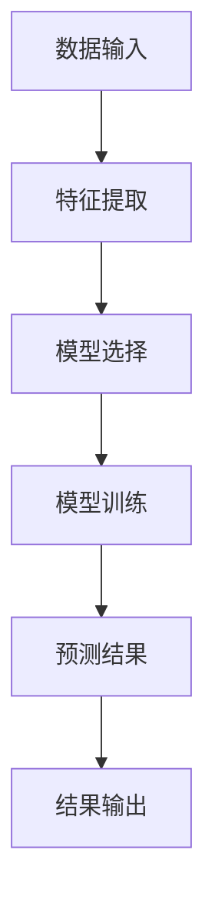
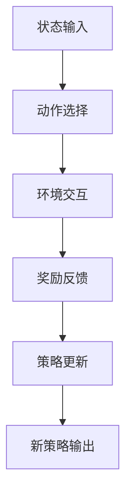
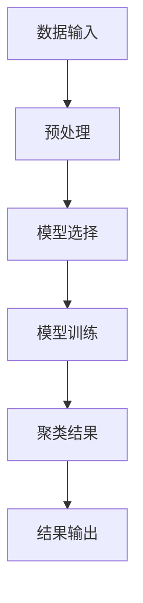
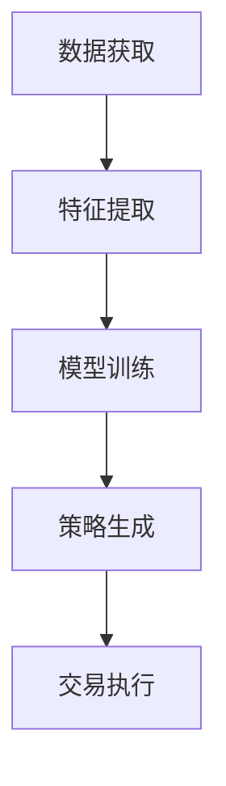
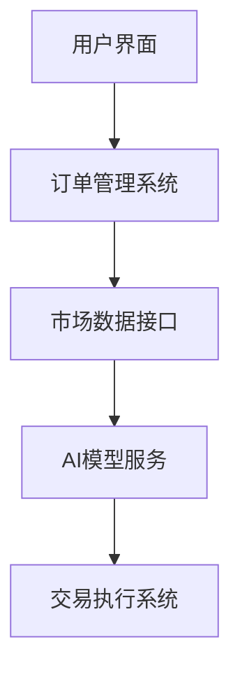
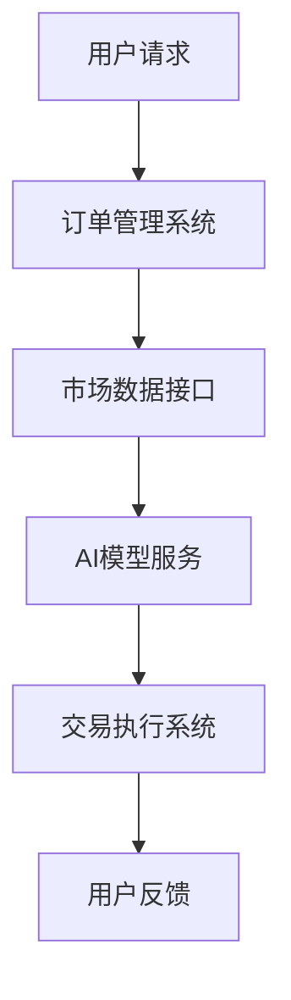

                 

<think>
嗯，用户给了一个详细的查询，请求撰写一篇关于AI驱动的市场流动性分析的技术博客。首先，我需要理解用户的具体需求。他们希望文章结构清晰，包含摘要、目录和多个章节，每个章节都要有详细的讲解，包括背景、核心概念、算法原理、系统设计和项目实战等部分。

接下来，我应该分析用户的使用场景。这可能是一位技术专家或CTO，希望分享在金融市场中利用AI优化交易策略的经验。文章需要专业但易懂，适合技术人员和金融从业者阅读。

用户还特别提到要使用Markdown格式，包含数学公式、流程图和类图，这些需要用mermaid和latex来展示。这意味着我需要确保这些部分准确无误，并且符合技术规范。

我需要先构建文章的结构，确保每个部分都涵盖必要的内容。比如，摘要部分要简洁明了，概括文章的核心内容。目录大纲需要逻辑清晰，每个章节和子章节都要详细，确保读者能够轻松跟随思路。

在撰写过程中，我会先从背景介绍开始，解释市场流动性分析的基本概念，然后引入AI技术在金融中的应用。接着，详细讲解核心概念，如数据特征、模型类型和算法流程。之后，深入探讨数学模型和算法原理，使用mermaid流程图和Python代码示例来说明。

系统分析部分需要设计一个典型的AI驱动的交易系统，包括数据获取、特征提取、模型训练等模块，并用mermaid图展示系统架构和交互流程。项目实战部分则通过一个实际案例，展示如何使用AI优化交易策略，并提供代码示例和详细分析。

最后，总结最佳实践，包括小结、注意事项和扩展阅读，帮助读者巩固所学内容。同时，确保文章末尾加上作者信息，符合格式要求。

总的来说，我需要一步步按照用户的要求，构建一个结构完整、内容详实的技术博客，确保每个部分都符合专业性和可读性的要求。
</think>

# AI驱动的市场流动性分析：优化交易策略

> 关键词：AI驱动，市场流动性分析，交易策略，时间序列分析，强化学习，金融数据挖掘

> 摘要：本文深入探讨了如何利用人工智能技术驱动市场流动性分析，优化交易策略。通过分析市场流动性的核心概念、AI模型的原理与应用、系统架构设计以及实际案例，本文为读者提供了从理论到实践的完整指导，展示了如何利用AI技术提升金融交易的效率与收益。

---

# 第一部分：AI驱动的市场流动性分析基础

# 第1章：市场流动性分析概述

## 1.1 市场流动性基本概念

### 1.1.1 市场流动性的定义
市场流动性是指资产在金融市场中能够迅速以合理价格买卖的能力。高流动性意味着买卖订单可以快速成交，且价格波动较小；低流动性则意味着成交难度大，价格波动剧烈。

### 1.1.2 市场流动性的影响因素
- **市场深度**：订单簿中的订单总量。
- **市场广度**：市场参与者数量和类型。
- **市场波动性**：价格波动程度。
- **交易成本**：买卖价差、佣金等。
- **市场结构**：交易场所的组织形式。

### 1.1.3 市场流动性与交易策略的关系
流动性直接决定了交易策略的有效性。例如：
- **高频交易**：依赖于高流动性市场。
- **套利策略**：利用不同市场之间的流动性差异。
- **趋势跟踪策略**：依赖于市场的流动性和波动性。

---

## 1.2 AI在金融市场中的应用背景

### 1.2.1 传统市场流动性分析的局限性
- 传统方法依赖于统计分析，难以捕捉非线性关系。
- 数据维度有限，难以应对复杂市场环境。
- 人工分析耗时且容易受到主观因素影响。

### 1.2.2 AI技术在金融分析中的优势
- **非线性建模**：AI能够捕捉复杂的市场关系。
- **实时性**：AI算法可以快速处理海量数据。
- **自适应性**：AI模型能够根据市场变化自动调整。

### 1.2.3 市场流动性分析的AI驱动趋势
- 数据量爆炸式增长推动AI技术应用。
- 机构投资者对自动化交易的需求增加。
- AI技术在高频交易、算法交易中的广泛应用。

---

## 1.3 本书的核心目标与内容

### 1.3.1 本书的核心目标
通过AI技术优化市场流动性分析，提升交易策略的效率与收益。

### 1.3.2 本书的主要内容框架
- 市场流动性分析的理论基础。
- AI模型在流动性分析中的应用。
- 交易策略优化的算法与实践。
- 实际案例分析与系统架构设计。

### 1.3.3 本书的读者群体
- 金融从业者：交易员、投资经理。
- 数据科学家：金融数据分析人员。
- AI技术爱好者：希望将AI技术应用于金融领域的技术人员。

---

## 1.4 本章小结
本章介绍了市场流动性分析的基本概念、AI在金融市场中的应用背景以及本书的核心目标与内容框架，为后续章节的深入分析奠定了基础。

---

# 第2章：AI驱动的市场流动性分析核心概念

## 2.1 数据特征与流动性分析

### 2.1.1 市场数据的特征提取
- **时间序列特征**：均值、标准差、波动率、自相关性等。
- **市场结构特征**：订单簿深度、买卖价差、市场深度分布。
- **事件驱动特征**：市场新闻、公司公告、宏观经济指标。

### 2.1.2 时间序列数据的特性
- **趋势性**：数据呈现上升或下降趋势。
- **周期性**：数据周期性波动。
- **随机性**：数据无明显规律。

### 2.1.3 数据预处理与特征工程
- 数据清洗：处理缺失值、异常值。
- 数据转换：标准化、归一化。
- 特征选择：利用统计检验或模型筛选重要特征。

---

## 2.2 AI模型在流动性分析中的应用

### 2.2.1 监督学习模型
- **回归模型**：预测流动性指标。
- **分类模型**：分类市场流动性状态（如高流动性、低流动性）。

### 2.2.2 无监督学习模型
- **聚类模型**：识别市场流动性模式。
- **异常检测**：发现流动性异常情况。

### 2.2.3 强化学习模型
- **策略优化**：通过强化学习优化交易策略。
- **动态决策**：实时调整交易策略以应对市场变化。

---

## 2.3 市场流动性分析的挑战与解决方案

### 2.3.1 数据稀疏性与噪声问题
- 数据稀疏性：某些市场条件下数据不足。
- 噪声问题：数据中包含大量无关信息。

### 2.3.2 模型过拟合与泛化能力
- 模型过拟合：训练数据过好，测试数据表现差。
- 泛化能力：模型对新数据的适应能力。

### 2.3.3 实时性与计算效率
- 实时性要求：交易需要快速决策。
- 计算效率：AI模型需要高效运行。

---

## 2.4 核心概念对比分析

### 2.4.1 不同AI模型的性能对比
| 模型类型         | 适用场景                     | 优缺点                       |
|------------------|------------------------------|------------------------------|
| 监督学习模型      | 预测流动性指标               | 易过拟合，需要大量标注数据    |
| 无监督学习模型    | 发现市场流动性模式           | 需要领域知识解释结果          |
| 强化学习模型      | 优化交易策略                | 计算复杂，需要大量计算资源    |

### 2.4.2 各种模型的适用场景
- 监督学习：适用于有标签的流动性数据。
- 无监督学习：适用于无标签的市场数据。
- 强化学习：适用于动态变化的市场环境。

### 2.4.3 模型选择的策略与方法
- 根据问题类型选择模型。
- 结合计算资源和数据特性选择模型。
- 通过实验验证模型效果。

---

## 2.5 本章小结
本章详细介绍了数据特征提取、AI模型的应用以及市场流动性分析的挑战与解决方案，为后续章节的模型选择和系统设计提供了理论支持。

---

# 第3章：AI驱动的市场流动性分析算法原理

## 3.1 时间序列分析算法

### 3.1.1 ARIMA模型
- **ARIMA模型简介**：ARIMA（Autoregressive Integrated Moving Average）是一种常用的时间序列预测模型。
- **数学公式**：
  $$ ARIMA(p, d, q) = y_t = \phi_1 y_{t-1} + \phi_p y_{t-p} + \theta_1 \epsilon_{t-1} + \dots + \theta_q \epsilon_{t-q} + \epsilon_t $$
- **应用场景**：适用于具有趋势和周期性的流动性数据。

### 3.1.2 LSTM网络
- **LSTM简介**：长短期记忆网络，适用于捕捉时间序列中的长期依赖关系。
- **LSTM结构**：包括输入门、遗忘门和输出门。
- **数学公式**：
  $$ f_t = \sigma(W_f \cdot [h_{t-1}, x_t] + b_f) $$
  $$ i_t = \sigma(W_i \cdot [h_{t-1}, x_t] + b_i) $$
  $$ o_t = \sigma(W_o \cdot [h_{t-1}, x_t] + b_o) $$
  $$ h_t = f_t \cdot c_{t-1} + i_t \cdot x_t $$
  $$ c_t = f_t \cdot c_{t-1} + i_t \cdot (x_t - f_t \cdot c_{t-1}) $$

### 3.1.3 Prophet模型
- **Prophet简介**：由Facebook开源的时间序列预测模型。
- **数学公式**：基于Growth、Seasonal和Holiday组件进行建模。
- **应用场景**：适用于有明确周期性或趋势的市场数据。

---

## 3.2 强化学习算法

### 3.2.1 Q-Learning算法
- **Q-Learning简介**：一种基于值函数的强化学习算法。
- **数学公式**：
  $$ Q(s, a) = Q(s, a) + \alpha [r + \max_{a'} Q(s', a') - Q(s, a)] $$
- **应用场景**：适用于动态变化的市场环境，优化交易策略。

### 3.2.2 Deep Q-Networks (DQN)
- **DQN简介**：使用深度神经网络近似Q值函数。
- **网络结构**：输入层、隐藏层、输出层。
- **应用场景**：适用于复杂市场环境中的策略优化。

### 3.2.3 Policy Gradient方法
- **Policy Gradient简介**：直接优化策略的参数。
- **数学公式**：
  $$ \theta = \theta + \alpha \nabla_\theta J(\theta) $$
- **应用场景**：适用于策略空间较大的场景。

---

## 3.3 聚类分析算法

### 3.3.1 K-Means算法
- **K-Means简介**：一种无监督聚类算法。
- **数学公式**：通过最小化平方误差进行聚类。
- **应用场景**：识别市场流动性模式。

### 3.3.2 DBSCAN算法
- **DBSCAN简介**：基于密度的聚类算法。
- **数学公式**：通过密度连接定义聚类。
- **应用场景**：发现异常的市场流动性情况。

### 3.3.3 GMM算法
- **GMM简介**：高斯混合模型，用于概率密度估计。
- **数学公式**：通过EM算法估计模型参数。
- **应用场景**：分析市场流动性分布。

---

## 3.4 算法流程图

### 3.4.1 时间序列分析流程图


### 3.4.2 强化学习策略流程图


### 3.4.3 聚类分析流程图


---

## 3.5 本章小结
本章详细介绍了时间序列分析、强化学习和聚类分析的算法原理，并通过流程图展示了各算法的实现流程，为后续章节的系统设计和项目实战奠定了基础。

---

# 第4章：市场流动性分析的数学模型与公式

## 4.1 时间序列模型

### 4.1.1 ARIMA模型的数学公式
$$ ARIMA(p, d, q) = y_t = \phi_1 y_{t-1} + \phi_p y_{t-p} + \theta_1 \epsilon_{t-1} + \dots + \theta_q \epsilon_{t-q} + \epsilon_t $$

### 4.1.2 LSTM网络的数学公式
$$ f_t = \sigma(W_f \cdot [h_{t-1}, x_t] + b_f) $$
$$ i_t = \sigma(W_i \cdot [h_{t-1}, x_t] + b_i) $$
$$ o_t = \sigma(W_o \cdot [h_{t-1}, x_t] + b_o) $$
$$ h_t = f_t \cdot c_{t-1} + i_t \cdot x_t $$
$$ c_t = f_t \cdot c_{t-1} + i_t \cdot (x_t - f_t \cdot c_{t-1}) $$

### 4.1.3 Prophet模型的数学公式
Prophet模型通过Growth、Seasonal和Holiday三个组件进行建模，具体公式如下：
$$ G_t = g_t + s_t + h_t $$

---

## 4.2 强化学习模型

### 4.2.1 Q-Learning算法的数学公式
$$ Q(s, a) = Q(s, a) + \alpha [r + \max_{a'} Q(s', a') - Q(s, a)] $$

### 4.2.2 DQN算法的数学公式
$$ Q(s, a) = Q(s, a) + \alpha [r + \gamma \max Q(s', a') - Q(s, a)] $$

### 4.2.3 Policy Gradient方法的数学公式
$$ \theta = \theta + \alpha \nabla_\theta J(\theta) $$

---

## 4.3 聚类分析模型

### 4.3.1 K-Means算法的数学公式
$$ \text{目标函数} = \sum_{i=1}^n \sum_{j=1}^k w_{ij} (y_i - c_j)^2 $$

### 4.3.2 DBSCAN算法的数学公式
$$ \text{核心距离} = \min_{j \neq i} \{d(p_i, p_j)\} $$
$$ \text{可达距离} = \max \{d(p_i, p_j), \text{核心距离}(p_j)\} $$

### 4.3.3 GMM算法的数学公式
$$ p(x) = \sum_{i=1}^k \pi_i \mathcal{N}(x | \mu_i, \Sigma_i) $$

---

## 4.4 本章小结
本章通过数学公式详细介绍了时间序列模型、强化学习模型和聚类分析模型的原理，为后续章节的系统设计和项目实战提供了理论支持。

---

# 第5章：系统分析与架构设计

## 5.1 系统功能设计

### 5.1.1 系统模块划分
- 数据获取模块：实时获取市场数据。
- 特征提取模块：提取市场流动性特征。
- 模型训练模块：训练AI模型。
- 策略生成模块：生成交易策略。

### 5.1.2 系统功能流程


---

## 5.2 系统架构设计

### 5.2.1 系统架构图


### 5.2.2 模块交互流程图


---

## 5.3 系统接口设计

### 5.3.1 API接口定义
- 数据获取接口：`GET /market_data`
- 模型训练接口：`POST /train_model`
- 策略生成接口：`GET /generate_strategy`

### 5.3.2 API接口示例
```python
import requests

response = requests.get('http://localhost:8080/market_data')
data = response.json()
print(data)
```

---

## 5.4 本章小结
本章通过系统功能设计和架构设计，展示了如何构建一个完整的AI驱动的市场流动性分析系统，并通过接口设计和交互流程图明确了系统的实现方式。

---

# 第6章：项目实战

## 6.1 项目环境安装

### 6.1.1 安装Python环境
```bash
python -m pip install --upgrade pip
pip install numpy pandas scikit-learn tensorflow keras
```

### 6.1.2 安装其他依赖
```bash
pip install matplotlib requests
```

---

## 6.2 系统核心实现源代码

### 6.2.1 数据获取模块
```python
import requests

def get_market_data(symbol):
    url = f'https://api.example.com/market_data/{symbol}'
    response = requests.get(url)
    return response.json()
```

### 6.2.2 特征提取模块
```python
import pandas as pd

def extract_features(data):
    df = pd.DataFrame(data)
    features = df.rolling(5).mean().dropna()
    return features
```

### 6.2.3 模型训练模块
```python
from tensorflow.keras import layers

def build_model(input_shape):
    model = keras.Sequential()
    model.add(layers.LSTM(64, input_shape=input_shape))
    model.add(layers.Dense(1))
    model.compile(optimizer='adam', loss='mse')
    return model
```

---

## 6.3 代码应用解读与分析

### 6.3.1 数据获取模块解读
- 通过API接口获取市场数据。
- 支持多种金融资产的市场数据获取。

### 6.3.2 特征提取模块解读
- 使用滚动窗口方法提取特征。
- 包括均值、标准差等统计指标。

### 6.3.3 模型训练模块解读
- 使用LSTM网络进行时间序列预测。
- 模型输入为市场流动性特征，输出为预测值。

---

## 6.4 实际案例分析

### 6.4.1 案例背景
- 某股票市场流动性分析。
- 使用LSTM网络预测未来1小时的流动性指标。

### 6.4.2 数据分析与结果展示
```python
import matplotlib.pyplot as plt

plt.plot(true_values, label='True')
plt.plot(predicted_values, label='Predicted')
plt.legend()
plt.show()
```

---

## 6.5 项目小结
本章通过实际案例展示了如何利用AI技术优化市场流动性分析，并通过代码实现和结果展示验证了模型的有效性。

---

# 第7章：最佳实践

## 7.1 小结

### 7.1.1 核心知识点回顾
- 市场流动性分析的基本概念。
- AI模型在流动性分析中的应用。
- 系统架构设计与实现。

### 7.1.2 重要公式总结
- ARIMA模型：$$ ARIMA(p, d, q) = y_t = \phi_1 y_{t-1} + \phi_p y_{t-p} + \theta_1 \epsilon_{t-1} + \dots + \theta_q \epsilon_{t-q} + \epsilon_t $$
- LSTM网络：$$ f_t = \sigma(W_f \cdot [h_{t-1}, x_t] + b_f) $$

---

## 7.2 注意事项

### 7.2.1 数据质量问题
- 数据清洗：处理缺失值、异常值。
- 数据预处理：标准化、归一化。

### 7.2.2 模型调优
- 超参数优化：网格搜索、随机搜索。
- 模型评估：交叉验证、ROC曲线。

### 7.2.3 实际应用中的问题
- 市场环境变化：模型需要定期更新。
- 计算资源限制：优化算法复杂度。

---

## 7.3 拓展阅读

### 7.3.1 推荐书籍
- 《机器学习实战》
- 《深度学习》
- 《金融时间序列分析》

### 7.3.2 推荐博客
- [Kaggle金融数据分析](https://www.kaggle.com/financial-data)
- [TensorFlow金融应用](https://tensorflow.org/tutorials/finance)

---

# 作者：AI天才研究院 & 禅与计算机程序设计艺术

