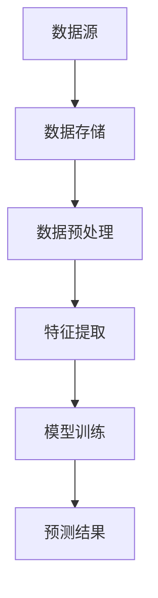
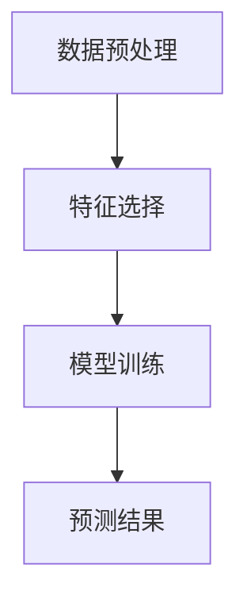

                 

<think>
好的，我现在需要帮用户撰写一篇关于“AI驱动的消费者行为分析：预测公司未来收入”的技术博客文章。首先，我需要理解用户的具体需求。用户提供了一个详细的目录大纲，要求我按照这个大纲来撰写内容。文章需要逻辑清晰、结构紧凑、技术语言专业，同时要包括背景介绍、核心概念、算法原理、系统分析、项目实战和最佳实践等部分。

首先，我应该从背景介绍开始。这部分需要涵盖消费者行为分析的背景、问题背景、问题描述以及解决方法。我需要简明扼要地介绍消费者行为分析的重要性，以及AI在其中的应用。

接下来是核心概念与联系。这部分需要详细讲解消费者行为分析的关键概念，比如消费者行为模型、数据特征和分析目标。我还需要用表格对比不同的分析方法，以及用Mermaid图展示数据流图，帮助读者更好地理解概念之间的联系。

然后是算法原理与数学模型。我需要选择几种常用的算法，如线性回归、决策树、随机森林和神经网络，并用Mermaid流程图展示它们的工作原理。同时，提供Python代码示例和数学公式，确保内容详尽且易于理解。

接下来是系统分析与架构设计。这部分需要介绍项目背景，用Mermaid类图展示领域模型，描述系统架构的分层结构，以及接口和交互序列图。这部分有助于读者理解系统的整体设计。

项目实战部分，我需要指导读者如何安装环境，提供数据预处理、特征工程、模型训练和评估的代码示例。这部分需要实际操作，确保读者能够跟随步骤进行实战。

最后是最佳实践与总结。我需要总结经验和教训，提供一些小结和注意事项，帮助读者在实际应用中避免常见错误。同时，推荐一些拓展阅读材料，供有兴趣的读者深入学习。

在整个过程中，我需要确保文章结构清晰，内容详尽，语言专业但不失易懂。同时，遵守格式要求，使用markdown格式，并在适当的地方插入Mermaid图表和数学公式。完成这些后，我还需要在文章末尾加上作者信息，以符合用户的要求。

现在，我开始按照目录大纲逐步撰写文章内容，确保每个部分都涵盖必要的信息，同时保持逻辑连贯，帮助读者全面理解AI在消费者行为分析中的应用及其对未来收入预测的重要性。
</think>

# AI驱动的消费者行为分析：预测公司未来收入

> 关键词：AI、消费者行为分析、预测、收入预测、机器学习、数据科学

> 摘要：本文详细探讨了如何利用人工智能技术分析消费者行为，从而预测公司未来收入。通过介绍核心概念、算法原理、系统设计和项目实战，为读者提供全面的技术指导。

---

# 第一部分: AI驱动的消费者行为分析基础

## 第1章: 消费者行为分析的背景与问题

### 1.1 消费者行为分析的背景

#### 1.1.1 数据驱动决策的兴起

在现代商业环境中，数据已成为最重要的资产之一。企业通过收集和分析消费者数据，能够洞察消费者行为模式，从而做出更明智的决策。数据驱动决策的兴起源于技术的进步，尤其是大数据和人工智能（AI）的发展，使得企业能够从海量数据中提取有价值的信息。

#### 1.1.2 消费者行为分析的定义与目标

消费者行为分析是指通过收集和分析消费者在购买、使用和评价产品或服务过程中的行为数据，以理解消费者的决策过程、偏好和需求。其目标是帮助企业预测消费者行为，优化营销策略，提高客户满意度和忠诚度。

#### 1.1.3 AI在消费者行为分析中的作用

人工智能技术，特别是机器学习，能够处理和分析大量复杂的数据，发现隐藏在数据中的模式和趋势。通过AI，企业可以实时分析消费者行为，预测未来的收入，并制定更具针对性的营销策略。

---

### 1.2 问题背景与问题描述

#### 1.2.1 传统消费者行为分析的局限性

传统的消费者行为分析方法主要依赖于市场调研、问卷调查和简单的统计分析。这些方法虽然有效，但在处理大量、复杂的数据时显得力不从心。此外，传统方法通常只能提供事后分析，缺乏实时性和预测性。

#### 1.2.2 数据量爆炸与分析需求的增加

随着互联网和移动设备的普及，消费者行为数据呈爆炸式增长。企业每天产生的数据量巨大，包括点击流数据、社交媒体数据、交易数据等。如何高效地处理和分析这些数据，成为企业面临的重要挑战。

#### 1.2.3 企业预测未来收入的核心问题

企业希望通过分析消费者行为，预测未来的收入，以便更好地规划生产和销售策略。然而，消费者行为受到多种因素的影响，包括市场环境、消费者偏好、经济状况等，这使得预测变得更加复杂。

---

### 1.3 问题解决与边界

#### 1.3.1 AI驱动的解决方案

通过AI技术，企业可以实时分析消费者行为数据，识别潜在的消费趋势，预测未来的收入。AI算法能够从数据中提取复杂的模式，提供更准确的预测结果。

#### 1.3.2 解决问题的边界与外延

AI驱动的消费者行为分析主要关注消费者的行为数据，包括点击流、购买记录、社交媒体互动等。其边界在于数据的完整性和质量，以及算法的可解释性和准确性。

#### 1.3.3 核心概念与组成要素

消费者行为分析的核心概念包括消费者行为模型、数据特征、分析目标等。这些概念共同构成了一个完整的消费者行为分析系统。

---

## 第2章: 核心概念与联系

### 2.1 消费者行为分析的核心概念

#### 2.1.1 消费者行为模型

消费者行为模型是描述消费者如何与产品或服务互动的模型。常见的模型包括购买决策树模型、马可夫链模型等。

#### 2.1.2 数据特征与行为模式

数据特征包括消费者的年龄、性别、地理位置、消费频率等。行为模式则描述了消费者如何在不同阶段做出决策。

#### 2.1.3 分析目标与输出结果

分析目标包括预测消费者购买行为、识别高价值客户、优化营销策略等。输出结果通常包括预测模型、客户细分、行为预测等。

---

### 2.2 核心概念的原理与联系

#### 2.2.1 数据流与分析流程

数据流从数据源流向数据存储，经过数据预处理、特征提取、模型训练等步骤，最终生成预测结果。



#### 2.2.2 消费者行为与收入预测的关系

消费者的购买行为直接影响企业的收入。通过分析消费者行为，企业可以预测未来的收入，并制定相应的策略。

#### 2.2.3 AI算法在分析中的应用

AI算法，如支持向量机（SVM）、随机森林等，能够从数据中提取复杂的模式，提高预测的准确性。

---

### 2.3 概念属性对比与ER图

#### 2.3.1 不同分析方法的对比表格

| 分析方法 | 优点 | 缺点 |
|----------|------|------|
| 统计分析 | 简单易懂 | 易受假设影响 |
| 机器学习 | 高准确性 | 需大量数据 |
| 深度学习 | 强大的模式识别 | 需大量计算资源 |

#### 2.3.2 数据模型的ER图架构

```mermaid
er
    actor: 消费者
    action: 消费行为
    product: 产品
    transaction: 交易记录
    relation: 购买关系
    actor --> relation
    product --> relation
    transaction --> relation
```

---

## 第3章: 算法原理与数学模型

### 3.1 常见算法原理

#### 3.1.1 线性回归

线性回归是一种简单而强大的预测模型，适用于线性关系的数据。

#### 3.1.2 决策树

决策树是一种基于树状结构的分类和回归模型，能够处理复杂的非线性数据。

#### 3.1.3 随机森林

随机森林是一种基于决策树的集成学习算法，通过组合多个决策树的结果，提高预测的准确性。

#### 3.1.4 神经网络

神经网络是一种模拟人脑神经网络结构的算法，能够处理复杂的非线性数据。

---

### 3.2 算法流程图

#### 3.2.1 线性回归算法流程图



---

通过以上内容，我们已经详细介绍了AI驱动的消费者行为分析的核心概念和算法原理。接下来的章节将深入探讨系统设计、项目实战和最佳实践，帮助读者更好地理解和应用这些技术。

--- 

作者：AI天才研究院/AI Genius Institute & 禅与计算机程序设计艺术 /Zen And The Art of Computer Programming

