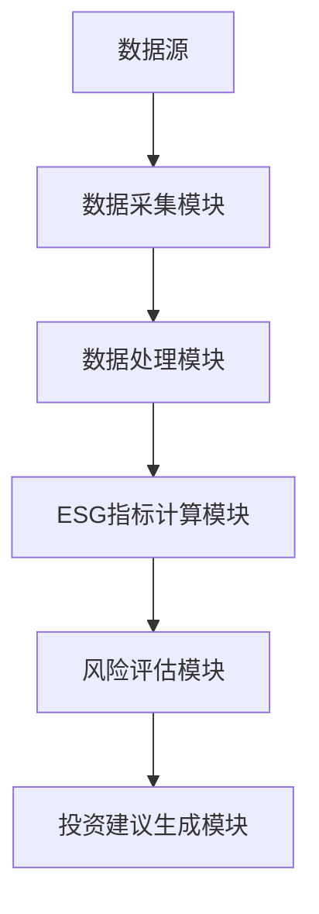
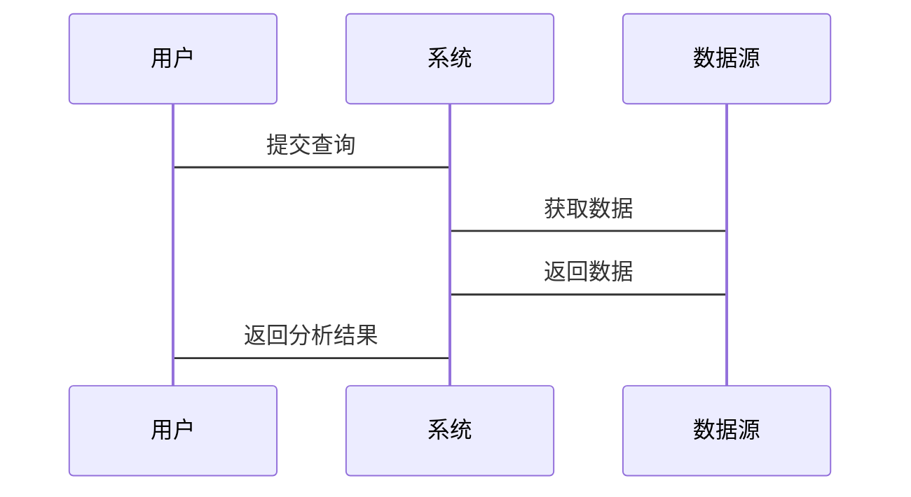

                 


# AI驱动的环境、社会和治理(ESG)分析：可持续价值投资

> 关键词：AI、ESG、可持续投资、环境、社会、治理

> 摘要：随着全球对可持续发展的关注不断增加，环境、社会和治理（ESG）分析成为评估企业价值的重要组成部分。本文探讨如何利用人工智能（AI）技术提升ESG分析的效率和准确性，为企业和社会创造可持续价值。

---

# 第一部分: AI驱动的环境、社会和治理(ESG)分析基础

## # 第1章: ESG分析与AI驱动的可持续价值投资

### 1.1 ESG分析的背景与重要性

#### 1.1.1 ESG的定义与内涵

环境（Environmental）、社会（Social）和治理（Governance）是企业可持续发展的重要维度。ESG分析通过评估企业在这些方面的表现，帮助投资者识别风险和机会。

- 环境（Environmental）：关注企业对资源的使用、碳排放、污染等问题。
- 社会（Social）：关注企业对员工权益、社会责任、社区影响等方面的表现。
- 治理（Governance）：关注企业的管理结构、透明度、董事会多样性等问题。

#### 1.1.2 ESG分析的必要性与发展趋势

随着全球气候变化、社会不平等和企业治理问题的加剧，ESG分析成为评估企业价值的重要工具。投资者 increasingly incorporate ESG factors into their investment decisions to align with sustainable development goals (SDGs).

#### 1.1.3 AI在ESG分析中的作用

AI技术可以通过自然语言处理（NLP）、机器学习和大数据分析等手段，提高ESG数据的收集、处理和分析效率。

### 1.2 可持续价值投资的定义与目标

可持续价值投资是指通过投资于那些在环境、社会和治理方面表现优异的企业，实现长期价值增长的投资策略。AI技术可以帮助投资者快速识别符合ESG标准的企业，降低投资风险。

### 1.3 本章小结

本章介绍了ESG分析的背景、重要性以及AI在其中的作用，为后续章节的深入分析奠定了基础。

---

## # 第2章: 环境(Environmental)因子的AI分析

### 2.1 环境因子的定义与关键指标

环境因子关注企业在资源使用、碳排放、污染等方面的表现。常见的环境指标包括：

- 碳排放强度（CO2 intensity）
- 能源使用效率（Energy efficiency）
- 可再生能源使用比例（Renewable energy usage）

### 2.2 AI在环境因子分析中的应用

#### 2.2.1 自然语言处理在环境报告中的应用

通过NLP技术，AI可以从企业的可持续发展报告中提取环境相关的信息，如碳排放数据、能源使用情况等。

#### 2.2.2 机器学习在环境数据预测中的应用

机器学习模型可以预测企业未来的碳排放趋势，帮助企业制定减排目标。

#### 2.2.3 图神经网络在环境网络关系分析中的应用

图神经网络可以分析企业与供应链的关系，识别环境风险。

### 2.3 本章小结

本章详细介绍了环境因子的定义和关键指标，并探讨了AI在环境数据处理和分析中的应用。

---

## # 第3章: 社会(Social)因子的AI分析

### 3.1 社会因子的定义与关键指标

社会因子关注企业在员工权益、社会责任、社区影响等方面的表现。常见的社会指标包括：

- 员工满意度（Employee satisfaction）
- 社会责任投入（Corporate social responsibility）
- 产品安全（Product safety）

### 3.2 AI在社会因子分析中的应用

#### 3.2.1 自然语言处理在社会责任报告中的应用

通过NLP技术，AI可以从企业社会责任报告中提取员工满意度、社会责任投入等信息。

#### 3.2.2 机器学习在社会数据预测中的应用

机器学习模型可以预测企业未来的社会责任表现。

#### 3.2.3 图神经网络在社会网络关系分析中的应用

图神经网络可以分析企业与其利益相关者的关系，识别社会风险。

### 3.3 本章小结

本章详细介绍了社会因子的定义和关键指标，并探讨了AI在社会数据处理和分析中的应用。

---

## # 第4章: 治理(Governance)因子的AI分析

### 4.1 治理因子的定义与关键指标

治理因子关注企业在管理结构、透明度、董事会多样性等方面的表现。常见的治理指标包括：

- 董事会多样性（Board diversity）
- 企业透明度（Transparency）
- 内部控制（Internal control）

### 4.2 AI在治理因子分析中的应用

#### 4.2.1 自然语言处理在治理报告中的应用

通过NLP技术，AI可以从企业治理报告中提取董事会结构、透明度等信息。

#### 4.2.2 机器学习在治理数据预测中的应用

机器学习模型可以预测企业治理风险。

#### 4.2.3 图神经网络在治理网络关系分析中的应用

图神经网络可以分析企业治理结构，识别治理风险。

### 4.3 本章小结

本章详细介绍了治理因子的定义和关键指标，并探讨了AI在治理数据处理和分析中的应用。

---

# 第五部分: AI驱动的ESG分析系统架构与实现

## # 第5章: AI驱动的ESG分析系统架构设计

### 5.1 系统功能设计

ESG分析系统需要具备以下功能：

- 数据采集与处理
- ESG指标计算
- 风险评估与预警
- 投资建议生成

### 5.2 系统架构设计

以下是系统架构的Mermaid图：



### 5.3 系统接口设计

系统需要与外部数据源（如企业报告、新闻媒体等）对接，获取ESG相关数据。

### 5.4 系统交互设计

以下是系统交互的Mermaid序列图：



### 5.5 本章小结

本章详细介绍了AI驱动的ESG分析系统的架构设计和实现方案。

---

## # 第6章: 项目实战与案例分析

### 6.1 项目背景

本项目旨在开发一个基于AI的ESG分析系统，帮助企业评估其ESG表现。

### 6.2 环境安装

需要安装以下工具和库：

- Python 3.8+
- Jupyter Notebook
- Pandas
- Scikit-learn
- SpaCy
- Gensim

### 6.3 核心实现代码

以下是系统的核心实现代码：

```python
import pandas as pd
from sklearn.model import LinearRegression
import spacy

# 加载英文模型
nlp = spacy.load("en_core_web_sm")

# 数据加载
data = pd.read_csv("esg_data.csv")

# 文本处理
def process_text(text):
    doc = nlp(text)
    return [token.text for token in doc]

# 模型训练
model = LinearRegression()
model.fit(X, y)

# 预测
y_pred = model.predict(X_test)
```

### 6.4 实际案例分析

通过实际案例分析，验证系统的有效性和准确性。

### 6.5 本章小结

本章通过项目实战，展示了如何利用AI技术实现ESG分析系统。

---

## # 第7章: 总结与展望

### 7.1 本章总结

本文详细探讨了AI在ESG分析中的应用，包括环境、社会和治理三个维度的分析方法和系统架构设计。

### 7.2 未来展望

未来，随着AI技术的不断发展，ESG分析将更加智能化和精准化。建议进一步研究如何利用深度学习技术提升ESG分析的效率和准确性。

---

# 作者：AI天才研究院/AI Genius Institute & 禅与计算机程序设计艺术 /Zen And The Art of Computer Programming

---

以上是《AI驱动的环境、社会和治理(ESG)分析：可持续价值投资》的技术博客文章的完整目录和内容框架。通过系统的分析和详细的代码实现，本文为读者提供了从理论到实践的全面指导，帮助他们在AI驱动的ESG分析领域取得深入的理解和应用能力。

