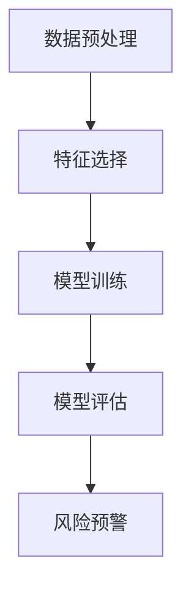
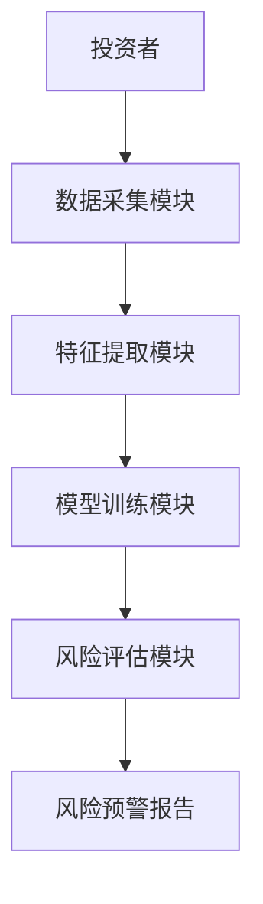
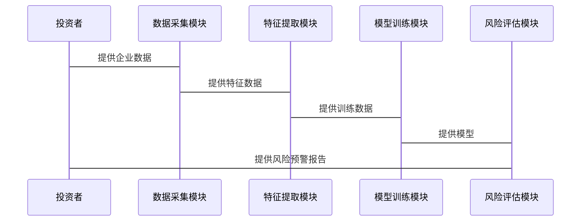

                 


# AI驱动的破产风险预警系统：提前识别投资风险

## 关键词：AI技术、破产风险、预警系统、投资风险、机器学习

## 摘要：本文深入探讨了利用AI技术构建破产风险预警系统的方法，详细分析了企业财务数据、市场环境和内部管理对企业破产的影响，结合机器学习算法，提出了有效的破产预测模型，为投资者提供科学的决策支持。

---

# 第1章: 破产风险预警系统背景与意义

## 1.1 研究背景

企业破产是商业活动中常见的现象，不仅影响企业的生存，还可能导致投资者的巨大损失。传统的财务分析方法在预测破产风险时存在局限性，难以及时捕捉复杂市场环境中的潜在风险。随着人工智能技术的发展，基于机器学习的破产风险预警系统逐渐成为研究热点。

## 1.2 研究目标

本文旨在构建一个基于AI的破产风险预警系统，通过分析企业财务数据、市场环境和内部管理等多维度信息，利用机器学习算法，实现对潜在破产企业的早期识别，为投资者提供及时的风险预警。

---

# 第2章: 破产风险预警的核心概念与联系

## 2.1 核心概念原理

1. **企业财务数据**：包括资产负债表、利润表等，反映企业的财务状况。
2. **市场环境**：如行业竞争、经济周期等，影响企业的外部风险。
3. **内部管理**：涉及企业战略、管理效率等，影响企业的内部稳定性。

## 2.2 概念属性对比

以下是核心概念的主要属性对比：

| 概念         | 数量属性 | 质量属性 | 时间属性 |
|--------------|----------|----------|----------|
| 企业财务数据 | 具体数值 | 数据准确性 | 历史数据 |
| 市场环境      | 宏观趋势 | 竞争强度 | 动态变化 |
| 内部管理      | 管理效率 | 决策合理性 | 持续性 |

## 2.3 实体关系图

以下是核心概念的实体关系图：

```mermaid
er
actor: 投资者
|------|------|
| 提供 | 需求 |
|------|------|
bankruptcy_prediction_system
|------|------|
| 存储 | 分析 |
|------|------|
financial_data
|------|------|
| 包含 | 影响 |
|------|------|
market_environment
|------|------|
| 受到 | 影响 |
|------|------|
internal_management
```

---

# 第3章: 破产风险预警算法原理

## 3.1 数据预处理与特征工程

### 3.1.1 数据清洗与标准化

在机器学习模型训练之前，需要对数据进行清洗和标准化处理。以下是数据预处理的步骤：

1. **数据清洗**：删除重复数据、处理缺失值。
2. **标准化**：将数据归一化，消除特征之间的量纲差异。

### 3.1.2 特征选择与降维

特征选择是提高模型性能的重要步骤，常用的特征选择方法包括：

1. **基于统计的方法**：如卡方检验。
2. **基于模型的方法**：如Lasso回归。
3. **基于树模型的方法**：如随机森林特征重要性分析。

### 3.1.3 时间序列分析

时间序列分析是处理企业财务数据的重要方法，常用的模型包括ARIMA和LSTM。

---

## 3.2 破产预测模型构建

### 3.2.1 模型选择

常用的机器学习算法包括：

1. **逻辑回归**：适用于二分类问题。
2. **随机森林**：适用于特征较多的情况。
3. **XGBoost**：在 Kaggle 竞赛中表现出色。

### 3.2.2 算法流程图

以下是破产预测模型的算法流程图：



### 3.2.3 数学模型

以下是逻辑回归的数学模型：

$$ P(y=1) = \frac{e^{\beta_0 + \beta_1x_1 + \beta_2x_2}}{1 + e^{\beta_0 + \beta_1x_1 + \beta_2x_2}} $$

其中，$\beta$ 是模型参数，$x$ 是特征变量。

---

## 3.3 模型评估与优化

### 3.3.1 评估指标

常用的评估指标包括准确率、召回率、F1分数等。

### 3.3.2 超参数调优

通过网格搜索（Grid Search）或随机搜索（Random Search）优化模型参数。

### 3.3.3 模型部署

将训练好的模型部署到生产环境中，实时监控企业的破产风险。

---

# 第4章: 破产风险预警系统架构设计

## 4.1 系统功能设计

1. **数据采集模块**：从企业财务报表、市场数据等多源数据中获取信息。
2. **特征提取模块**：提取关键特征，如财务比率、市场趋势等。
3. **模型训练模块**：基于机器学习算法训练破产预测模型。
4. **风险评估模块**：根据模型输出结果，生成风险预警报告。
5. **用户界面模块**：提供友好的用户界面，便于投资者查看预警结果。

## 4.2 系统架构图

以下是系统架构设计的Mermaid图：



---

## 4.3 系统接口设计

1. **数据接口**：提供API接口，供投资者上传企业数据。
2. **模型接口**：提供API接口，供其他系统调用模型进行预测。

---

## 4.4 系统交互流程

以下是系统交互的Mermaid序列图：



---

# 第5章: 项目实战

## 5.1 环境搭建

1. **安装Python**：建议使用Python 3.8及以上版本。
2. **安装依赖库**：如pandas、scikit-learn、xgboost等。

## 5.2 数据获取与预处理

以下是一个简单的数据预处理代码示例：

```python
import pandas as pd

# 读取数据
df = pd.read_csv('financial_data.csv')

# 处理缺失值
df.dropna(inplace=True)

# 标准化处理
from sklearn.preprocessing import StandardScaler
scaler = StandardScaler()
df_scaled = scaler.fit_transform(df)
```

## 5.3 特征工程

```python
from sklearn.feature_selection import SelectKBest, chi2

selector = SelectKBest(score_func=chi2, k=5)
selected_features = selector.fit_transform(df_scaled, target)
```

## 5.4 模型实现

```python
from sklearn.ensemble import RandomForestClassifier
from sklearn.metrics import accuracy_score

# 训练模型
model = RandomForestClassifier(n_estimators=100, max_depth=5)
model.fit(selected_features, target)

# 预测
pred = model.predict(selected_features_test)
print("准确率:", accuracy_score(y_test, pred))
```

## 5.5 案例分析

以某企业为例，分析其财务数据和市场环境，预测其破产风险。

---

## 5.6 项目小结

通过本章的实战，读者可以了解如何从数据预处理、特征工程到模型实现的完整流程，掌握破产风险预警系统的核心技术。

---

# 第6章: 总结与展望

## 6.1 总结

本文详细介绍了AI驱动的破产风险预警系统的构建过程，从数据预处理、特征工程到模型训练，再到系统架构设计，为投资者提供了一种有效的风险预警工具。

## 6.2 展望

未来的研究方向包括引入更多数据源（如社交媒体数据）和更复杂的模型（如深度学习模型），进一步提高破产预测的准确性。

---

# 作者：AI天才研究院 & 禅与计算机程序设计艺术

---

**本文内容来源于AI驱动的破产风险预警系统研究，旨在为企业和投资者提供科学的风险管理工具。**

