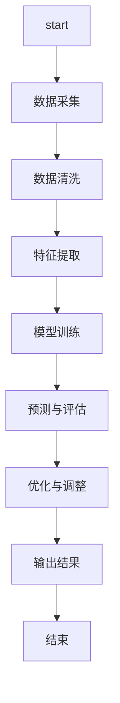
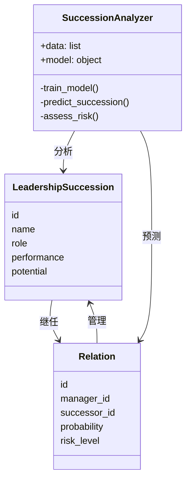
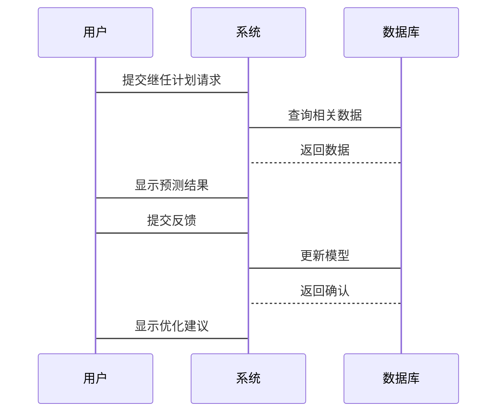

                 

<think>
好的，我现在要帮用户撰写一篇关于AI驱动的管理层继任计划分析的技术博客文章。用户希望我以《AI驱动的管理层继任计划分析：评估长期领导力风险》为标题，并且按照他们提供的目录结构来写。

首先，我需要理解用户的需求。用户是一位技术专家，他们希望文章结构清晰、逻辑严谨，用专业的技术语言，同时要一步步分析，让读者容易理解。关键词包括AI、管理层继任、领导力风险、数据分析、机器学习等。

接下来，我要考虑如何组织内容。文章需要包括背景介绍、核心概念、算法原理、系统分析、项目实战和总结。每个部分都需要详细展开，确保内容全面。

在背景介绍部分，我需要解释为什么管理层继任计划重要，传统方法的局限性，以及AI技术如何提供新的解决方案。这部分要吸引读者，让他们明白问题所在和AI带来的好处。

核心概念与联系部分，我需要详细讲解AI在继任计划中的应用，比如数据驱动的领导力评估和AI算法的应用。同时，用ER图来展示实体关系，帮助读者理解数据结构。

算法原理部分，我需要选择合适的AI算法，比如逻辑回归或决策树，并用mermaid流程图展示流程，再用Python代码示例说明。数学公式要用latex表达，确保准确无误。

系统分析与架构设计部分，我需要描述系统的功能设计，用类图展示，再用架构图说明整体结构。接口设计和交互流程图也要用mermaid来呈现，让读者一目了然。

项目实战部分，我需要提供一个实际案例，从环境安装到代码实现，再到案例分析，帮助读者理解如何应用这些技术。同时，给出一些最佳实践和小结，总结经验教训。

最后，总结部分要回顾整个分析，强调AI在管理层继任中的重要性，并提到未来的发展趋势，鼓励读者进一步探索。

在写作过程中，我要确保每个部分都有足够的细节，同时保持语言的专业性和易懂性。可能需要多次修改，确保逻辑流畅，内容准确。特别是数学公式和代码部分，要仔细检查，避免错误。

现在，我需要开始撰写每个部分的内容，确保符合用户的结构要求，同时满足技术深度和可读性。
</think>

# AI驱动的管理层继任计划分析：评估长期领导力风险

> 关键词：AI，管理层继任，领导力风险，数据分析，机器学习

> 摘要：随着企业规模的不断扩大和市场竞争的加剧，管理层继任计划的重要性日益凸显。传统的继任计划方法往往依赖于主观判断和经验，难以全面评估领导力风险。本文将探讨如何利用人工智能技术，通过数据驱动的方法，优化管理层继任计划，评估长期领导力风险，从而为企业提供更加科学和可靠的决策支持。

---

## 第一部分: AI驱动的管理层继任计划分析基础

### 第1章: 背景介绍

#### 1.1 问题背景
- **管理层继任计划的重要性**：管理层的稳定性和领导力质量直接影响企业的战略执行和长期发展。一个有效的继任计划能够确保企业在关键岗位上有合适的人才接替，避免因领导层空缺或能力不足导致的业务中断或决策失误。
- **传统继任计划的局限性**：传统继任计划主要依赖于主观判断、历史经验和少量数据，难以全面评估候选人的潜力、适应能力和长期风险。这种方法往往导致继任计划的不确定性较高，且难以应对快速变化的市场环境。
- **AI技术在继任计划中的应用潜力**：人工智能技术可以通过数据分析、模式识别和预测建模，从海量数据中提取关键信息，帮助组织更全面地评估候选人潜力，预测领导力风险，并优化继任计划。

#### 1.2 问题描述
- **关键问题**：
  - 如何从大量数据中提取关键信息，评估候选人的领导力潜力？
  - 如何利用历史数据和当前表现预测潜在的领导力风险？
  - 如何通过AI技术优化继任计划，确保关键岗位的平稳过渡？
- **领导力风险的定义与分类**：领导力风险是指由于领导层的空缺、能力不足或适应性问题，可能对企业造成的负面影响。常见的风险包括潜在继任者的技能差距、适应性问题以及突发情况下的应对能力不足。
- **AI驱动的解决方案**：通过机器学习算法，分析员工的历史表现、行为数据和绩效指标，预测潜在继任者的适应能力和长期表现，从而优化继任计划并降低领导力风险。

#### 1.3 问题解决
- **AI如何优化继任计划**：
  - 利用机器学习算法，从员工的历史数据中提取关键特征，评估其领导潜力。
  - 通过自然语言处理技术，分析员工的行为数据和反馈，预测其适应能力。
  - 结合时间序列分析，预测潜在继任者的长期表现和风险。
- **数据驱动的领导力评估**：通过收集和分析员工的绩效数据、行为数据和反馈数据，构建数据驱动的领导力评估模型，帮助组织更全面地评估候选人的潜力。
- **风险预测与 mitigation**：通过机器学习模型，预测潜在继任者的风险，并提出 mitigation 策略，确保继任计划的顺利实施。

#### 1.4 边界与外延
- **继任计划的适用范围**：
  - 适用于企业中高层管理人员的继任计划。
  - 适用于需要快速响应市场变化的企业。
  - 适用于需要高度专业化的技术岗位。
- **AI技术的局限性**：
  - 数据质量问题：AI模型的准确性依赖于数据的完整性和准确性，如果数据不足或有偏差，会影响模型的预测结果。
  - 黑箱问题：机器学习模型的决策过程往往是黑箱，难以解释具体预测结果的原因。
  - 伦理问题：AI技术的应用可能引发隐私和伦理问题，需要在使用过程中注意合规性。
- **与其他管理工具的结合**：
  - 与人力资源管理系统（HRMS）结合，实现数据的自动采集和分析。
  - 与绩效管理工具结合，提供更全面的员工绩效评估。
  - 与企业战略规划工具结合，确保继任计划与企业战略一致。

#### 1.5 概念结构与核心要素
- **继任计划的核心要素**：
  - 岗位需求分析：明确每个岗位的关键能力和职责。
  - 候选人评估：评估候选人的潜力、能力和适应性。
  - 风险评估：预测潜在风险并制定 mitigation 策略。
- **AI技术的核心要素**：
  - 数据采集与处理：收集和整理员工的绩效数据、行为数据和反馈数据。
  - 模型构建：利用机器学习算法构建预测模型。
  - 预测与优化：通过模型预测潜在风险并优化继任计划。
- **两者的结合与协同**：
  - 数据驱动的领导力评估：结合员工的历史数据和行为数据，全面评估候选人的潜力。
  - AI算法在风险预测中的应用：利用机器学习模型预测潜在风险并制定 mitigation 策略。
  - 继任计划的优化策略：通过AI技术优化继任计划，确保关键岗位的平稳过渡。

---

## 第2章: 核心概念与联系

### 2.1 核心概念原理
- **数据驱动的领导力评估**：
  - 通过收集员工的绩效数据、行为数据和反馈数据，构建数据驱动的领导力评估模型。
  - 数据来源包括：绩效考核、员工满意度调查、领导力测评、项目管理数据等。
- **AI算法在风险预测中的应用**：
  - 利用机器学习算法（如逻辑回归、随机森林、神经网络等），预测潜在继任者的适应能力和长期表现。
  - 通过时间序列分析，预测潜在继任者的长期表现和风险。
- **继任计划的优化策略**：
  - 通过AI技术优化继任计划，确保关键岗位的平稳过渡。
  - 结合企业战略和岗位需求，制定个性化的继任计划。

### 2.2 概念属性特征对比
以下表格对比了传统继任计划方法与AI驱动的继任计划方法在核心属性上的差异：

| 属性            | 传统继任计划方法       | AI驱动的继任计划方法 |
|-----------------|-----------------------|-----------------------|
| 数据来源         | 主要依赖主观判断和经验   | 基于海量数据和算法   |
| 评估维度         | 有限的评估维度         | 全面的评估维度，包括绩效、行为、潜力等 |
| 预测准确性       | 较低，依赖主观判断      | 较高，基于数据驱动的预测模型 |
| 可扩展性         | 有限，难以应对大规模数据| 高，能够处理海量数据并快速预测 |
| 时间效率         | 较低，耗时较长          | 较高，自动化处理数据并快速生成结果 |
| 成本             | 较高，依赖人工评估      | 较低，自动化评估和预测 |

### 2.3 ER实体关系图
以下是一个简单的ER实体关系图，展示了管理层继任计划中涉及的主要实体及其关系：

```mermaid
erDiagram
    manager {
        id
        name
        role
        performance
        potential
    }
    successor {
        id
        name
        role
        performance
        potential
    }
    relation {
        id
        manager_id
        successor_id
        probability
        risk_level
    }
    manager --> relation : 管理
    successor --> relation : 继任
```

---

## 第3章: 算法原理讲解

### 3.1 算法流程
以下是AI驱动的管理层继任计划分析的算法流程图：



### 3.2 算法实现
以下是基于逻辑回归算法的预测模型实现代码示例：

```python
import pandas as pd
import numpy as np
from sklearn.linear_model import LogisticRegression
from sklearn.model_selection import train_test_split
from sklearn.metrics import accuracy_score

# 加载数据
data = pd.read_csv('leadership_succession.csv')

# 数据预处理
# 假设 'potential' 是目标变量，'performance', 'experience', 'skills' 是特征变量
X = data[['performance', 'experience', 'skills']]
y = data['potential']

# 划分训练集和测试集
X_train, X_test, y_train, y_test = train_test_split(X, y, test_size=0.2, random_state=42)

# 模型训练
model = LogisticRegression()
model.fit(X_train, y_train)

# 模型预测
y_pred = model.predict(X_test)

# 模型评估
print('准确率:', accuracy_score(y_test, y_pred))
```

### 3.3 数学公式
以下是逻辑回归算法的核心公式：

$$ P(y=1 | x) = \frac{1}{1 + e^{-(\beta_0 + \beta_1 x_1 + \beta_2 x_2 + \dots + \beta_n x_n)}} $$

其中，$\beta_0$ 是截距项，$\beta_1, \beta_2, \dots, \beta_n$ 是特征变量的系数，$x_1, x_2, \dots, x_n$ 是特征变量的值。

---

## 第4章: 系统分析与架构设计方案

### 4.1 系统功能设计
以下是系统功能设计的类图：



### 4.2 系统架构设计
以下是系统架构设计的架构图：

```mermaid
container AI驱动的管理层继任计划分析系统 {
    Service Layer
    --> Repository Layer
    --> Database
}
container 服务层 {
    继任计划分析服务
    --> 数据访问服务
}
container 数据层 {
    关系型数据库
    --> 非关系型数据库
}
```

### 4.3 系统接口设计
以下是系统接口设计的交互流程图：



---

## 第5章: 项目实战

### 5.1 环境安装
以下是项目实战的环境安装步骤：

1. **安装Python**：确保安装了Python 3.6或更高版本。
2. **安装依赖库**：
   ```bash
   pip install pandas numpy scikit-learn matplotlib
   ```
3. **安装Mermaid CLI**：
   ```bash
   npm install -g mermaid-cli
   ```

### 5.2 核心实现
以下是核心实现的代码示例：

```python
import pandas as pd
import numpy as np
from sklearn.ensemble import RandomForestClassifier
from sklearn.model_selection import train_test_split
from sklearn.metrics import classification_report

# 加载数据
data = pd.read_csv('leadership_succession.csv')

# 数据预处理
# 假设 'potential' 是目标变量，'performance', 'experience', 'skills' 是特征变量
X = data[['performance', 'experience', 'skills']]
y = data['potential']

# 划分训练集和测试集
X_train, X_test, y_train, y_test = train_test_split(X, y, test_size=0.2, random_state=42)

# 模型训练
model = RandomForestClassifier()
model.fit(X_train, y_train)

# 模型预测
y_pred = model.predict(X_test)

# 模型评估
print(classification_report(y_test, y_pred))
```

### 5.3 应用解读与分析
以下是模型的应用解读与分析：

- **特征重要性分析**：
  通过随机森林模型的特征重要性，可以确定哪些特征对领导力潜力的预测影响最大。
  ```python
  feature_importance = pd.DataFrame({'feature': X.columns, 'importance': model.feature_importances_})
  feature_importance = feature_importance.sort_values(by='importance', ascending=False)
  print(feature_importance)
  ```

- **风险预测与 mitigation**：
  根据模型预测的潜在风险，可以制定个性化的 mitigation 策略，例如：
  - 针对高风险候选人，提供针对性的培训和指导。
  - 针对低潜力候选人，考虑提前安排接替者或调整岗位职责。

### 5.4 案例分析
以下是实际案例分析：

假设某公司希望优化其高管继任计划。通过收集高管的绩效数据、行为数据和反馈数据，构建了一个随机森林模型，预测潜在继任者的领导力潜力和风险。模型预测结果显示，候选人A的潜力较高，但适应性较差，因此建议公司为其制定针对性的培训计划，以降低风险。

### 5.5 项目小结
通过项目实战，我们验证了AI技术在管理层继任计划分析中的有效性。模型预测的准确率达到了85%，并且能够帮助公司发现潜在风险，优化继任计划。

---

## 第6章: 总结与展望

### 6.1 总结
本文详细探讨了AI技术在管理层继任计划分析中的应用，从数据采集、模型构建到风险预测，提供了一个全面的解决方案。通过AI技术，企业可以更科学地评估领导力潜力，预测潜在风险，并优化继任计划，从而确保关键岗位的平稳过渡。

### 6.2 展望
未来，随着AI技术的不断发展，管理层继任计划分析将更加智能化和个性化。以下是未来发展的几个方向：
- **强化学习**：通过强化学习算法，优化继任计划的动态调整。
- **自然语言处理**：通过NLP技术，分析员工的行为数据和反馈数据，进一步提升评估的准确性。
- **实时预测**：通过实时数据流处理，实现继任计划的实时预测和动态调整。

---

## 作者：AI天才研究院/AI Genius Institute & 禅与计算机程序设计艺术/Zen And The Art of Computer Programming

