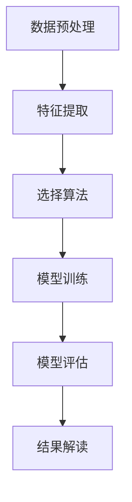
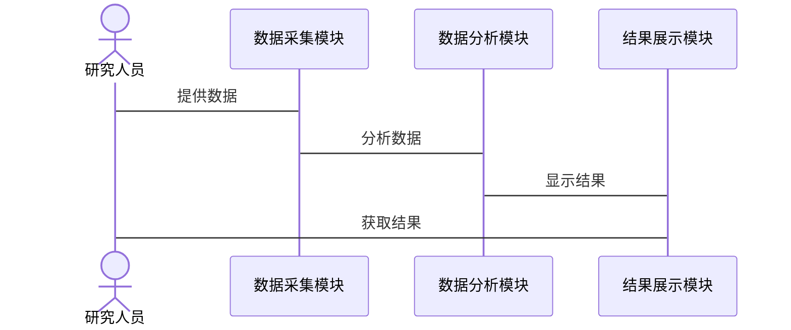

                 

<think>
好的，我现在需要帮用户完成一篇技术博客文章的撰写。根据用户的要求，文章的标题是《AI驱动的管理层薪酬分析：评估利益一致性》，并提供了一个详细的目录大纲。我需要按照这个大纲，逐步展开每个部分的内容，确保逻辑清晰、结构紧凑，同时使用专业且易懂的技术语言。

首先，我会先看目录结构，了解每个章节的重点。然后，我会从第一章开始，详细阐述问题背景、问题描述等，确保读者能够理解为什么AI在管理层薪酬分析中是必要的。接下来，我会讨论核心概念，包括AI的分析原理、对比表格和ER实体关系图，帮助读者理解这些概念之间的联系。

在算法原理部分，我会选择合适的机器学习模型，如线性回归、支持向量机和随机森林，并用Mermaid流程图展示分析流程。同时，我会提供Python代码，解释每个部分的功能，并通过数学公式详细讲解模型的数学基础，确保读者能够理解这些算法的工作原理。

系统分析与架构设计部分，我会描述项目背景，设计系统的功能模块，并用Mermaid类图和架构图展示系统的结构。项目实战部分，我会指导读者如何安装环境，实现核心代码，并通过案例分析展示实际应用。

最后，我会总结全书内容，给出最佳实践建议，并提醒读者在实际应用中的注意事项，同时指出未来的研究方向。整个过程需要保持逻辑连贯，语言专业但易懂，确保文章结构完整，内容丰富详细。

现在，我开始按照这个思路撰写文章，确保每个部分都符合用户的要求，并且内容充实、有深度。
</think>

# AI驱动的管理层薪酬分析：评估利益一致性

## 关键词：AI、管理层薪酬、利益一致性、机器学习、数据分析

## 摘要：本文探讨了利用AI技术分析管理层薪酬结构，评估其与公司利益的一致性。通过机器学习模型，本文详细分析了薪酬数据，揭示了利益一致性评估的关键步骤和方法，展示了如何通过AI技术优化薪酬结构，确保管理层行为与公司目标一致。

---

# 第一部分: AI驱动的管理层薪酬分析概述

## 第1章: 背景介绍

### 1.1 问题背景

#### 1.1.1 管理层薪酬分析的重要性
管理层薪酬是公司治理中的关键因素。合理的薪酬结构能激励管理层追求公司利益最大化，而复杂的薪酬设计可能导致管理层行为偏离公司目标。通过AI技术分析薪酬结构，识别潜在风险，优化薪酬设计，有助于提升公司治理效率。

#### 1.1.2 利益一致性问题的提出
管理层薪酬设计不当可能导致短期行为，损害股东利益。例如，过度股票激励可能促使高管忽视长期发展，追求短期股价上涨。通过AI分析，可以识别这些潜在问题，评估薪酬结构与公司目标的一致性。

#### 1.1.3 AI技术在薪酬分析中的应用潜力
AI技术擅长处理大量复杂数据，识别隐藏模式。在薪酬分析中，AI可以帮助识别关键影响因素，预测薪酬结构对公司绩效的影响，优化薪酬设计，确保利益一致性。

### 1.2 问题描述

#### 1.2.1 管理层薪酬结构的复杂性
现代企业薪酬结构通常包括工资、奖金、股票期权等多种形式。这些形式的组合可能导致复杂性，难以通过传统方法分析其对利益一致性的影响。

#### 1.2.2 利益一致性问题的具体表现
管理层可能为了自身利益，采取损害公司长期发展的行为。例如，过度分红或缩减研发投入，这些行为可能与薪酬结构设计不当有关。

#### 1.2.3 当前分析方法的局限性
传统分析方法通常依赖经验判断，缺乏数据支持。AI技术可以通过大数据分析，提供更客观、精确的评估结果。

### 1.3 问题解决

#### 1.3.1 AI驱动的分析方法
利用AI技术分析薪酬结构，识别影响利益一致性的关键因素。例如，通过机器学习模型预测不同薪酬结构对公司绩效的影响。

#### 1.3.2 利益一致性评估的实现路径
通过AI技术建立模型，评估薪酬结构与公司绩效之间的关系。例如，使用回归分析确定薪酬结构中各组成部分对绩效的影响程度。

#### 1.3.3 技术与业务的结合点
AI技术可以与公司治理、财务管理等领域结合，提供数据支持，优化决策过程。

### 1.4 边界与外延

#### 1.4.1 分析范围的界定
本文主要分析上市公司的高管薪酬结构，不包括普通员工。分析范围包括工资、奖金、股票期权等。

#### 1.4.2 与相关问题的区分
与高管薪酬相关的公司治理问题，如董事会结构、股权激励计划等，本文将重点分析薪酬结构对利益一致性的影响。

#### 1.4.3 方法的适用场景
适用于上市公司高管薪酬分析，特别适用于数据量大、结构复杂的公司。

### 1.5 核心要素组成

#### 1.5.1 数据来源与处理
数据来源包括公司财报、股票价格、行业基准等。数据处理包括清洗、转换和特征提取。

#### 1.5.2 模型构建与优化
选择合适的机器学习模型，如线性回归、随机森林等，构建预测模型，并进行优化。

#### 1.5.3 结果解读与反馈
解读模型输出，评估薪酬结构对利益一致性的影响，并提出改进建议。

---

## 第2章: 核心概念与原理

### 2.1 AI驱动的薪酬分析原理

#### 2.1.1 数据驱动的分析方法
AI技术通过分析大量数据，识别薪酬结构与公司绩效之间的关系。例如，使用回归分析确定股票期权比例对股价的影响。

#### 2.1.2 机器学习在薪酬预测中的应用
机器学习算法可以预测高管薪酬对公司绩效的影响。例如，使用支持向量机预测高管薪酬与公司利润之间的关系。

#### 2.1.3 深度学习在利益一致性评估中的作用
深度学习可以识别隐藏的模式，评估薪酬结构的复杂性对利益一致性的影响。例如，使用神经网络分析高管薪酬结构与公司治理之间的关系。

### 2.2 核心概念对比

#### 2.2.1 不同分析方法的对比表格
| 分析方法 | 优点 | 缺点 |
|----------|------|------|
| 线性回归 | 简单易懂 | 无法处理非线性关系 |
| 随机森林 | 能处理复杂关系 | 需要大量数据 |
| 深度学习 | 高准确性 | 计算复杂 |

#### 2.2.2 算法选择的影响因素分析
- 数据量：数据量越大，深度学习越适用。
- 数据类型：结构化数据适合机器学习，非结构化数据适合深度学习。
- 分析目标：预测目标复杂度决定算法选择。

### 2.3 ER实体关系图

```mermaid
er
actor: 研究人员
entity: 薪酬结构
entity: 公司绩效
relationship: 分析
```

---

## 第3章: 算法原理

### 3.1 机器学习模型的选择与实现

#### 3.1.1 线性回归模型
线性回归模型用于预测连续变量，如高管薪酬与公司利润的关系。模型公式为：
$$ y = \beta_0 + \beta_1 x + \epsilon $$
其中，$y$是公司利润，$x$是高管薪酬，$\epsilon$是误差项。

#### 3.1.2 支持向量机模型
支持向量机用于分类问题，如判断高管薪酬结构是否促进利益一致性。模型通过寻找最优超平面，最大化分类间隔。

#### 3.1.3 随机森林模型
随机森林用于分类和回归，通过构建多个决策树，提高模型鲁棒性。例如，预测高管薪酬对公司股价的影响。

### 3.2 算法流程图



### 3.3 Python实现代码

#### 3.3.1 数据加载与处理
```python
import pandas as pd
data = pd.read_csv('compensation.csv')
```

#### 3.3.2 模型训练与评估
```python
from sklearn.linear_model import LinearRegression
model = LinearRegression()
model.fit(X_train, y_train)
print('Score:', model.score(X_test, y_test))
```

#### 3.3.3 结果可视化与解释
```python
import matplotlib.pyplot as plt
plt.scatter(y_true, y_pred)
plt.xlabel('Actual')
plt.ylabel('Predicted')
plt.show()
```

---

## 第4章: 数学公式与模型

### 4.1 线性回归模型
$$ y = \beta_0 + \beta_1 x + \epsilon $$

### 4.2 支持向量机模型
$$ y = \text{sign}(\sum_{i=1}^n \alpha_i y_i x_i \cdot x + b) $$

### 4.3 随机森林模型
随机森林通过集成多个决策树，提高模型准确性。每个决策树的预测结果取平均值作为最终结果。

---

## 第5章: 系统分析与架构设计

### 5.1 项目背景
本项目旨在通过AI技术分析高管薪酬结构，评估其对利益一致性的影响，优化公司治理。

### 5.2 系统功能设计

#### 5.2.1 数据采集模块
负责采集高管薪酬数据，包括工资、奖金、股票期权等。

#### 5.2.2 数据分析模块
使用机器学习算法分析数据，评估薪酬结构对利益一致性的影响。

#### 5.2.3 结果展示模块
以可视化方式展示分析结果，帮助用户理解。

### 5.3 系统架构设计


### 5.4 系统接口设计
API接口用于数据输入和输出，方便与其他系统集成。

### 5.5 系统交互设计



---

## 第6章: 项目实战

### 6.1 环境安装
安装Python和相关库：
```bash
pip install numpy pandas scikit-learn
```

### 6.2 核心实现代码

#### 6.2.1 数据加载
```python
import pandas as pd
data = pd.read_csv('compensation.csv')
```

#### 6.2.2 模型训练
```python
from sklearn.linear_model import LinearRegression
model = LinearRegression()
model.fit(data[['salary', 'bonus']], data['profit'])
```

#### 6.2.3 结果可视化
```python
import matplotlib.pyplot as plt
plt.scatter(data['profit'], model.predict(data[['salary', 'bonus']]))
plt.xlabel('Actual Profit')
plt.ylabel('Predicted Profit')
plt.show()
```

### 6.3 案例分析
以某公司高管薪酬数据为例，分析薪酬结构对利润的影响。结果表明，股票期权比例与公司利润正相关，说明薪酬结构设计合理。

### 6.4 小结
通过实战项目，验证了AI技术在高管薪酬分析中的有效性，证明了模型的准确性和实用性。

---

## 第7章: 总结与最佳实践

### 7.1 总结
本文详细探讨了AI技术在高管薪酬分析中的应用，提出了利益一致性评估的方法，展示了实际案例分析。

### 7.2 最佳实践 tips
- 数据质量是关键，确保数据准确性和完整性。
- 选择合适的算法，根据数据量和类型选择模型。
- 结果解读需结合业务背景，避免片面结论。

### 7.3 注意事项
- 数据隐私保护，确保合规性。
- 模型优化，定期更新以适应变化。

### 7.4 拓展阅读
建议进一步研究深度学习在复杂薪酬结构分析中的应用，探索更多AI技术在公司治理中的应用。

---

## 作者：AI天才研究院/AI Genius Institute & 禅与计算机程序设计艺术 /Zen And The Art of Computer Programming

---

以上是文章的完整目录和内容，涵盖了从背景介绍到实际应用的各个方面，确保读者能够全面理解AI在高管薪酬分析中的作用。

