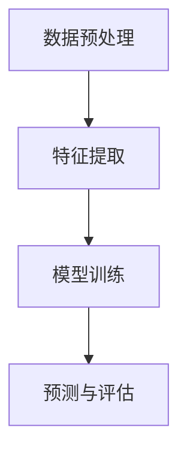
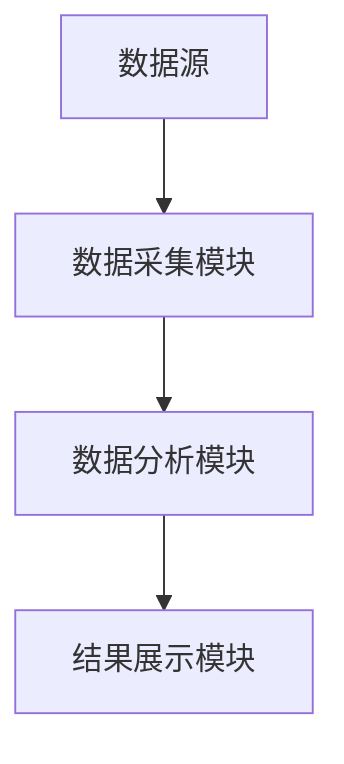

                 

<think>
好，我现在需要帮用户撰写一篇技术博客文章，标题是《AI驱动的管理层诚信度分析：防范公司治理风险》。用户希望文章结构清晰，逻辑严谨，内容专业且有深度。我先回顾一下用户提供的需求，确保我理解所有的要点。

首先，用户希望文章包含摘要、关键词、目录大纲以及正文内容。关键词应该是5-7个，摘要需要简明扼要地概括文章的核心内容。正文部分需要分为几个章节，每个章节都要有吸引人的标题，并且内容详细，包含背景介绍、核心概念、算法原理、系统架构设计、数学模型、项目实战以及总结与展望。

接下来，我需要考虑用户可能的身份和需求。用户可能是一位CTO或技术专家，希望深入探讨如何利用AI技术来分析管理层的诚信度，从而预防公司治理风险。因此，文章需要具备一定的技术深度，同时也要通俗易懂，适合技术人员和管理层阅读。

首先，我会从摘要开始。摘要需要简洁明了，指出AI在分析管理层诚信度中的作用，以及如何通过数学模型和算法来量化诚信度，从而防范治理风险。关键词部分，我需要列出5-7个相关术语，比如AI驱动、管理层诚信度、公司治理风险、NLP、机器学习、数学模型等。

接下来是目录大纲。用户已经提供了一个大纲，我需要按照这个结构来组织内容。第一部分是背景与概念，包括管理层诚信度的重要性、AI的应用现状、研究目标和分析框架。第二部分是AI算法原理，涵盖核心算法、数学模型和流程图。第三部分是系统分析与架构设计，包括问题场景分析、系统需求、架构设计、接口设计和系统实现。第四部分是项目实战，包括数据预处理、模型训练、结果分析和案例解读。最后是总结与展望。

在撰写正文时，我需要确保每个部分都详细展开。例如，在“AI驱动的诚信度分析算法原理”部分，我需要解释NLP和机器学习如何用于分析文本数据，构建评分模型和预测模型，并给出数学公式。同时，使用mermaid图表来展示流程图和架构图，使内容更直观。

项目实战部分，我需要提供具体的代码示例，展示如何进行数据预处理、模型训练和结果分析。通过实际案例分析，帮助读者理解如何应用这些技术来评估管理层的诚信度。

最后，总结部分需要回顾文章的主要内容，并展望未来的发展方向，强调AI在公司治理中的潜力和重要性。

在整个写作过程中，我需要确保语言专业但不晦涩，逻辑清晰，结构紧凑。同时，遵守用户的格式要求，使用markdown格式，并在适当的地方插入公式和图表，使文章更具可读性和专业性。

现在，我开始撰写摘要部分。确保它简明扼要，涵盖文章的核心内容。关键词部分，列出所有相关术语，方便读者检索。接下来，按照目录大纲逐步撰写每个章节，确保每个部分都详细展开，内容丰富且有深度。

在撰写过程中，我需要不断检查是否满足用户的所有要求，包括字数、格式、内容完整性等。确保每个章节都有足够的细节和例子，帮助读者理解复杂的概念和技术。

完成初稿后，我会进行一次全面的校对，检查是否有遗漏或错误的地方，确保文章逻辑严谨，内容准确，结构合理。最终，将文章以markdown格式呈现，附上作者信息，完成整篇技术博客的撰写。
</think>

# AI驱动的管理层诚信度分析：防范公司治理风险

> 关键词：AI驱动、管理层诚信度、公司治理风险、NLP、机器学习、数学模型、系统架构

> 摘要：  
本文探讨如何利用AI技术分析管理层的诚信度，构建数学模型量化诚信度，通过AI算法和系统架构设计，帮助公司防范治理风险，提升企业治理水平。文章详细阐述了AI驱动的诚信度分析算法原理、系统架构设计、项目实战案例，结合数学模型和实际应用，为公司治理提供新的视角和解决方案。

---

## 第一部分：AI驱动的管理层诚信度分析背景与概念

### 第1章：管理层诚信度分析的背景与意义

#### 1.1 管理层诚信度的重要性
- **诚信度对公司治理的影响**  
  管理层的诚信度直接关系到企业的长期发展和价值创造。诚信的管理层更可能做出符合企业利益的决策，降低道德风险和财务造假的可能性。
  
- **现代企业治理中的诚信危机**  
  近年来，全球范围内屡曝企业高管因诚信缺失导致的丑闻，如财务造假、内幕交易等，严重损害了企业的声誉和投资者信任。

- **AI技术在诚信评估中的潜力**  
  AI技术可以通过分析海量数据，识别管理层的潜在诚信风险，为公司治理提供客观、科学的决策支持。

#### 1.2 AI技术在企业管理中的应用现状
- **AI在企业风险管理中的应用**  
  AI技术通过自然语言处理（NLP）分析企业公告、新闻报道等文本数据，识别潜在风险。

- **AI在高管行为分析中的应用**  
  利用机器学习算法分析高管的社交网络、行为模式，预测其诚信风险。

- **当前AI技术在诚信评估中的局限性**  
  数据不足、模型解释性差、伦理问题等仍是AI在诚信评估中的主要挑战。

#### 1.3 本书的研究目标与内容框架
- **研究目标**  
  构建一个基于AI的管理层诚信度分析系统，量化管理层诚信度，识别潜在风险，为公司治理提供决策支持。

- **核心问题**  
  如何通过AI技术，从多维度数据中提取管理层诚信度的关键特征，并建立预测模型。

- **内容框架**  
  本文将从诚信度的定义、AI算法原理、系统架构设计、项目实战等方面展开，全面分析AI驱动的诚信度分析方法。

---

### 第2章：管理层诚信度分析的核心概念

#### 2.1 管理层诚信度的定义与维度
- **诚信度的定义**  
  诚信度是指个人或组织在行为中遵守道德规范、履行承诺的程度。

- **管理层诚信度的维度分析**  
  包括：  
  - **道德风险**：管理层是否存在道德违规行为。  
  - **信息披露质量**：管理层是否如实披露企业信息。  
  - **承诺履行度**：管理层是否兑现承诺。  

- **诚信度与企业治理的关系**  
  诚信度高的管理层更可能做出有利于企业长期发展的决策，降低短期逐利行为。

#### 2.2 AI驱动的诚信度分析框架
- **数据驱动的诚信评估模型**  
  通过分析文本数据、行为数据、财务数据等多源数据，构建诚信度评估模型。

- **多维度诚信度评估指标**  
  包括：  
  - **文本特征**：公告内容的完整性、语言风格的规范性。  
  - **行为特征**：高管的社交网络、决策行为。  
  - **财务特征**：财务数据的合理性、异常性。  

- **案例分析：某企业诚信度评估实例**  
  通过具体案例，展示AI技术如何从文本、行为、财务数据中提取特征，评估管理层诚信度。

#### 2.3 诚信度分析的边界与外延
- **诚信度分析的边界**  
  诚信度分析仅关注管理层的道德行为，不涉及企业经营能力的评价。

- **诚信度分析的外延**  
  包括高管行为预测、企业声誉管理、风险预警等。

- **与其他企业治理问题的关系**  
  诚信度分析是企业治理的重要组成部分，与其他问题（如财务风险、组织文化）密切相关。

---

## 第二部分：AI驱动的管理层诚信度分析算法原理

### 第3章：AI驱动的诚信度分析算法原理

#### 3.1 管理层诚信度分析的核心算法
- **基于NLP的文本分析算法**  
  利用NLP技术分析企业公告、新闻报道等文本数据，提取关键词、情感倾向等特征。

- **基于机器学习的预测模型**  
  使用逻辑回归、随机森林等算法，构建诚信度预测模型。

- **基于图论的关联分析**  
  通过图论分析高管的社交网络，识别潜在的道德风险。

#### 3.2 算法原理的数学模型
- **文本相似度计算模型**  
  使用余弦相似度计算文本间的相似度：  
  $$ \text{相似度} = \frac{\vec{A} \cdot \vec{B}}{|\vec{A}| |\vec{B}|} $$  

- **信用评分模型**  
  使用逻辑回归模型预测诚信评分：  
  $$ P(y=1|x) = \frac{1}{1 + e^{-\beta x}} $$  

- **关联规则挖掘模型**  
  使用Apriori算法挖掘高管行为的关联规则。

#### 3.3 算法流程图  


---

### 第4章：管理层诚信度分析的数学模型

#### 4.1 诚信度评分模型
- **模型定义**  
  基于多维度特征，构建评分模型：  
  $$ S = \sum_{i=1}^{n} w_i x_i $$  
  其中，\( w_i \) 为特征权重，\( x_i \) 为特征值。

- **模型输入变量**  
  包括文本特征、行为特征、财务特征等。

- **模型输出结果**  
  诚信度评分，分为A、B、C、D、E五个等级。

#### 4.2 诚信度预测模型
- **模型假设**  
  管理层的诚信度与其行为、语言、财务数据密切相关。

- **模型参数**  
  包括学习率、正则化系数等。

- **模型评估指标**  
  包括准确率、召回率、F1分数等。

#### 4.3 算法的数学公式
- **评分公式**  
  $$ S = w_1 x_1 + w_2 x_2 + ... + w_n x_n $$  

- **预测公式**  
  $$ P(y|x) = \frac{e^{\beta x}}{1 + e^{\beta x}} $$  

- **优化公式**  
  使用梯度下降优化模型参数：  
  $$ \theta = \theta - \alpha \frac{\partial L}{\partial \theta} $$  

---

## 第三部分：系统分析与架构设计

### 第5章：问题场景与系统需求分析

#### 5.1 问题场景描述
- **企业治理中的诚信风险**  
  管理层的诚信缺失可能导致财务造假、利益输送等问题。

- **管理层诚信度分析的难点**  
  数据分散、特征提取困难、模型解释性差。

- **AI技术的应用需求**  
  需要通过AI技术整合多源数据，构建预测模型。

#### 5.2 系统功能需求
- **数据采集模块**  
  采集文本数据、行为数据、财务数据等。

- **数据分析模块**  
  提取特征、训练模型、生成预测结果。

- **结果展示模块**  
  展示诚信度评分、风险预警信息。

#### 5.3 系统架构设计
- **分层架构设计**  
  包括数据层、计算层、展示层。

- **模块化设计**  
  每个模块独立开发，便于维护。

- **可扩展性设计**  
  支持新增数据源和算法模型。

---

### 第6章：系统架构设计与实现

#### 6.1 系统架构图  


#### 6.2 系统接口设计
- **数据接口**  
  支持CSV、JSON格式数据输入。

- **API接口**  
  提供RESTful API，供其他系统调用。

- **用户接口**  
  提供Web界面，方便用户查看分析结果。

#### 6.3 系统实现
- **数据预处理**  
  清洗数据、填充缺失值、标准化特征。

- **模型训练**  
  使用机器学习算法训练模型，评估性能。

- **结果展示**  
  生成可视化报告，展示诚信度评分和风险预警信息。

---

## 第四部分：项目实战

### 第7章：项目实战与案例分析

#### 7.1 数据预处理与特征提取
- **数据来源**  
  从企业公告、新闻报道、社交媒体等渠道获取数据。

- **特征提取**  
  提取文本特征、行为特征、财务特征等。

#### 7.2 模型训练与优化
- **训练数据集**  
  使用历史数据训练模型，调整参数。

- **模型优化**  
  使用交叉验证优化模型性能。

#### 7.3 结果分析与案例解读
- **分析结果**  
  展示模型预测的诚信度评分。

- **案例解读**  
  通过具体案例，分析模型的预测结果，验证模型的有效性。

---

## 第五部分：总结与展望

### 第8章：总结与展望

#### 8.1 核心成果总结
- 本文构建了一个基于AI的管理层诚信度分析系统，量化诚信度，识别潜在风险。

#### 8.2 未来研究方向
- **算法优化**  
  探索更高效的算法，提高模型预测精度。

- **数据扩展**  
  引入更多数据源，丰富特征维度。

- **应用场景拓展**  
  将AI技术应用于更多企业治理问题，如高管行为预测、企业声誉管理等。

#### 8.3 最佳实践 tips
- 数据质量是关键，需重视数据清洗和特征提取。

- 模型解释性需重视，便于用户理解分析结果。

- 需关注伦理问题，确保AI技术的合理使用。

---

## 附录

### 附录A：相关代码示例
```python
import pandas as pd
from sklearn.linear_model import LogisticRegression
from sklearn.metrics import accuracy_score

# 数据加载
data = pd.read_csv('management.csv')

# 特征提取
X = data.drop('label', axis=1)
y = data['label']

# 模型训练
model = LogisticRegression()
model.fit(X, y)

# 模型预测
y_pred = model.predict(X)

# 模型评估
print(accuracy_score(y, y_pred))
```

---

## 作者

作者：AI天才研究院/AI Genius Institute & 禅与计算机程序设计艺术 /Zen And The Art of Computer Programming

---

通过以上结构，文章详细阐述了AI驱动的管理层诚信度分析的背景、算法原理、系统架构设计、项目实战等内容，为公司治理提供了新的视角和解决方案。

