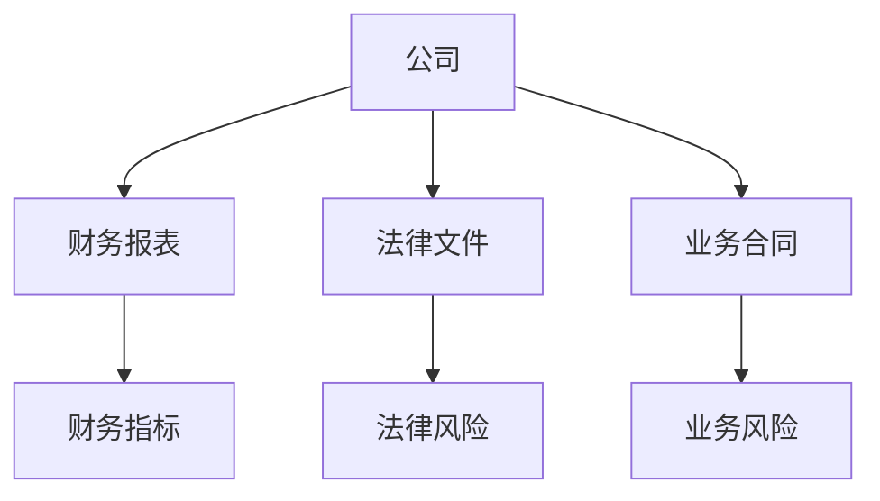
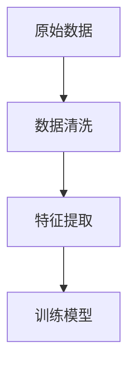
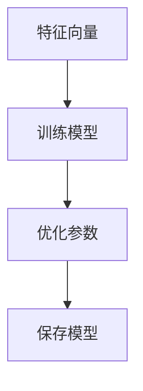
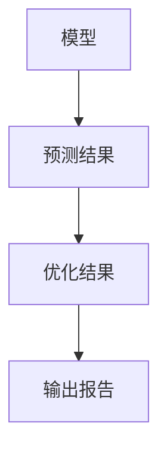
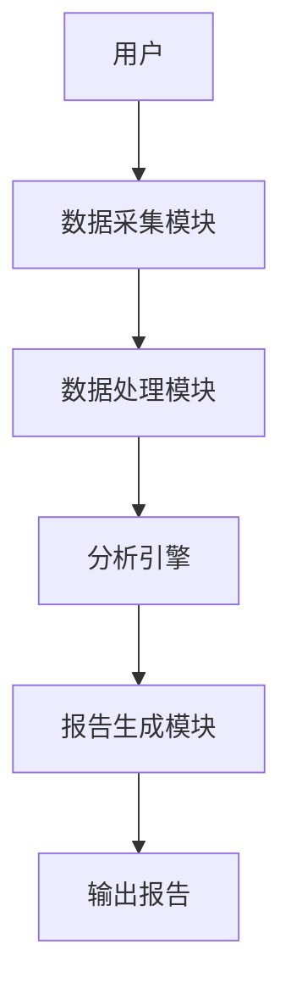
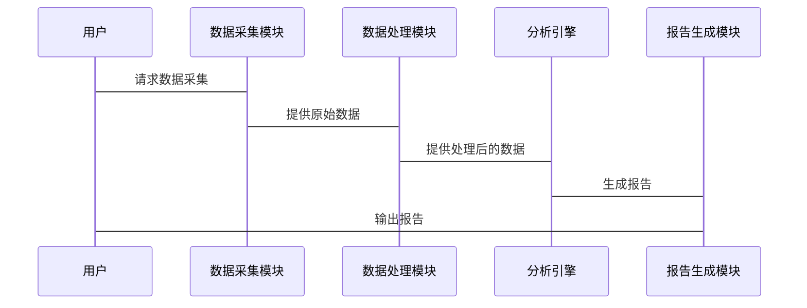

                 


# AI驱动的自动化公司尽职调查

## 关键词：AI驱动，公司尽职调查，自动化，机器学习，自然语言处理

## 摘要：随着人工智能技术的快速发展，公司尽职调查的效率和准确性也得到了显著提升。本文详细探讨了AI驱动的自动化公司尽职调查的核心概念、算法原理、系统架构及项目实现，通过理论与实践相结合的方式，为读者提供了一套完整的解决方案。文章从问题背景、技术原理、系统设计到实际案例，层层深入，全面解析了AI如何赋能公司尽职调查的过程。

---

# 第一部分: AI驱动的自动化公司尽职调查概述

## 第1章: 背景介绍与核心概念

### 1.1 公司尽职调查的基本概念

#### 1.1.1 尽职调查的定义与目的
公司尽职调查（Due Diligence，简称DD）是指在企业并购、投资、融资等交易中，对目标公司进行全面、深入的调查，以评估其经营状况、财务健康度、法律风险等。其核心目的是确保交易的透明性、合规性和安全性。

#### 1.1.2 尽职调查的核心流程
传统的尽职调查通常包括以下几个核心流程：
1. **信息收集**：收集目标公司的财务报表、法律文件、业务合同等。
2. **数据分析**：对收集到的数据进行整理、分析，识别潜在风险。
3. **风险评估**：基于数据分析结果，评估目标公司的风险点。
4. **尽职报告**：撰写尽职调查报告，提出建议和风险提示。

#### 1.1.3 尽职调查的边界与外延
尽职调查的边界在于其覆盖的范围和深度，通常根据交易类型和金额大小而定。其外延则包括与目标公司相关的上下游企业、供应链、客户和供应商等。

### 1.2 AI驱动的自动化公司尽职调查的背景

#### 1.2.1 传统尽职调查的痛点
传统尽职调查过程中存在以下痛点：
1. **效率低下**：人工收集和分析数据耗时耗力。
2. **成本高昂**：需要大量专业人员参与，费用较高。
3. **主观性较强**：人为判断可能导致遗漏重要信息。
4. **数据量大**：面对海量数据，人工处理难度大。

#### 1.2.2 AI技术在尽职调查中的应用潜力
AI技术在尽职调查中的应用潜力主要体现在以下几个方面：
1. **自动化数据处理**：利用自然语言处理（NLP）技术自动提取文档中的关键信息。
2. **智能风险评估**：通过机器学习模型预测目标公司的潜在风险。
3. **实时监控**：AI可以实时跟踪目标公司的动态，提供实时风险预警。

#### 1.2.3 自动化尽职调查的定义与特点
自动化尽职调查是指通过AI技术实现数据自动采集、分析和报告生成的过程。其特点包括：
1. **高效性**：AI可以快速处理海量数据，大幅缩短尽职调查的时间。
2. **准确性**：通过算法优化，减少人为错误，提高调查结果的准确性。
3. **可扩展性**：AI系统可以同时处理多个项目，适用于大规模调查。

### 1.3 核心概念与问题解决

#### 1.3.1 AI驱动的自动化公司尽职调查的核心要素
AI驱动的自动化公司尽职调查的核心要素包括：
1. **数据源**：包括目标公司的财务报表、法律文件、新闻报道等多源数据。
2. **算法模型**：如自然语言处理、机器学习模型等。
3. **知识库**：包含行业知识、法律法规等背景信息。
4. **分析工具**：如数据可视化工具、风险评估模型等。

#### 1.3.2 问题背景与问题描述
在企业并购或投资过程中，传统尽职调查面临以下问题：
1. **数据分散**：目标公司的信息可能分布在多个渠道，人工收集效率低。
2. **信息不完整**：手动收集的数据可能遗漏重要信息。
3. **时间压力**：在复杂交易中，时间紧迫，人工调查难以按时完成。
4. **成本高昂**：需要投入大量人力和时间，增加了交易成本。

#### 1.3.3 问题解决的路径与方法
AI驱动的自动化尽职调查通过以下路径解决问题：
1. **自动化数据采集**：利用爬虫技术自动收集目标公司信息。
2. **智能分析**：通过NLP和机器学习技术自动识别潜在风险。
3. **实时监控**：利用AI系统实时跟踪目标公司动态，提供持续性评估。

### 1.4 本章小结

#### 1.4.1 核心概念总结
AI驱动的自动化公司尽职调查通过AI技术实现了数据采集、分析和报告生成的自动化，显著提高了效率和准确性。

#### 1.4.2 问题解决的思路总结
通过自动化数据采集、智能分析和实时监控，AI技术能够有效解决传统尽职调查中的效率低下、成本高昂和信息不全等问题。

---

## 第2章: 核心概念与技术联系

### 2.1 核心概念原理

#### 2.1.1 AI在数据处理中的作用
AI在数据处理中的作用主要体现在以下几个方面：
1. **数据清洗**：通过算法自动识别并剔除无效数据。
2. **数据标注**：利用机器学习模型对数据进行分类和标注。
3. **数据关联**：通过关联分析发现数据之间的潜在联系。

#### 2.1.2 自动化分析的关键技术
自动化分析的关键技术包括：
1. **自然语言处理（NLP）**：用于处理文本数据，提取关键信息。
2. **机器学习**：用于建立预测模型，识别潜在风险。
3. **数据可视化**：用于直观展示分析结果。

#### 2.1.3 结果生成与优化的原理
结果生成与优化的原理包括：
1. **模型训练**：通过大量数据训练模型，优化预测准确性。
2. **反馈机制**：根据用户反馈不断优化模型参数。
3. **结果校验**：通过交叉验证确保结果的准确性。

### 2.2 核心概念属性对比

#### 2.2.1 传统尽职调查与AI驱动尽职调查的对比
| 对比维度          | 传统尽职调查                     | AI驱动尽职调查                     |
|-------------------|----------------------------------|------------------------------------|
| 数据处理效率      | 低                             | 高                                 |
| 成本              | 高                             | 低                                 |
| 准确性            | 中                             | 高                                 |
| 时间周期          | 长                             | 短                                 |

#### 2.2.2 不同AI技术的优劣势对比
| AI技术           | 优势                           | 劣势                           |
|-------------------|--------------------------------|---------------------------------|
| 自然语言处理（NLP）| 高效提取文本信息                 | 对复杂语义理解不足               |
| 机器学习         | 高准确性预测                     | 对数据质量依赖较高               |

#### 2.2.3 核心技术的性能对比
| 技术指标         | 数据处理速度 | 数据分析准确性 | 实时监控能力 |
|------------------|--------------|----------------|--------------|
| 传统方法         | 慢          | 中            | 无          |
| AI驱动方法       | 快          | 高            | 有          |

### 2.3 ER实体关系图

#### 2.3.1 实体关系图的构建


#### 2.3.2 实体关系图的分析
通过实体关系图可以看出，目标公司的信息分散在多个数据源中，AI系统需要整合这些信息，进行关联分析，最终生成综合性的尽职调查报告。

#### 2.3.3 实体关系图的应用
实体关系图的应用主要体现在数据建模和系统设计阶段，帮助我们更好地理解数据之间的关系，优化系统架构。

---

## 第3章: 算法原理与实现

### 3.1 算法原理概述

#### 3.1.1 自然语言处理在尽职调查中的应用
自然语言处理在尽职调查中的应用包括：
1. **文本提取**：从新闻报道中提取公司财务信息。
2. **实体识别**：识别公司名称、日期、金额等关键实体。

#### 3.1.2 机器学习模型的构建与训练
机器学习模型的构建与训练包括：
1. **特征提取**：从文本数据中提取特征向量。
2. **模型选择**：选择适合的算法（如随机森林、神经网络等）。
3. **模型训练**：通过训练数据优化模型参数。

#### 3.1.3 算法的输入输出关系
算法的输入包括目标公司的文本数据和结构化数据，输出包括潜在风险的预测结果和风险等级。

### 3.2 算法流程图

#### 3.2.1 数据预处理流程


#### 3.2.2 模型训练流程


#### 3.2.3 结果生成与优化流程


### 3.3 算法实现代码

#### 3.3.1 数据预处理代码
```python
import pandas as pd
from sklearn.feature_extraction.text import TfidfVectorizer

# 假设data是一个包含文本数据的DataFrame
def preprocess_data(data):
    # 提取文本特征
    vectorizer = TfidfVectorizer()
    tfidf = vectorizer.fit_transform(data['text'])
    # 转换为特征矩阵
    features = pd.DataFrame(tfidf.toarray(), columns=vectorizer.get_feature_names_out())
    return features
```

#### 3.3.2 模型训练代码
```python
from sklearn.ensemble import RandomForestClassifier
from sklearn.metrics import accuracy_score

def train_model(features, labels):
    # 初始化模型
    model = RandomForestClassifier()
    # 训练模型
    model.fit(features, labels)
    # 预测结果
    predictions = model.predict(features)
    # 计算准确率
    accuracy = accuracy_score(labels, predictions)
    print(f"模型准确率为：{accuracy}")
    return model
```

#### 3.3.3 结果生成代码
```python
def generate_report(model, new_data):
    # 预测新数据
    prediction = model.predict(new_data)
    # 生成报告
    report = {
        '预测结果': prediction,
        '风险等级': ['低', '中', '高'][max(prediction)]
    }
    return report
```

### 3.4 数学模型

#### 3.4.1 机器学习模型的数学表达
随机森林模型的数学表达可以表示为：
$$
y = f(X) + \epsilon
$$
其中，$X$ 是输入特征向量，$y$ 是目标变量，$\epsilon$ 是误差项。

#### 3.4.2 算法优化
通过交叉验证优化模型参数：
$$
\text{选择最优参数} = \argmin_{\theta} \text{Validation Loss}
$$

#### 3.4.3 案例分析
假设我们有一个目标公司，其财务报表显示收入增长放缓，但新闻报道称公司正在开发新产品。通过NLP技术提取文本信息，结合财务数据，模型预测公司未来可能面临的风险。

---

## 第4章: 系统分析与架构设计方案

### 4.1 问题场景介绍

#### 4.1.1 项目背景
本项目旨在开发一个基于AI的自动化公司尽职调查系统，帮助用户快速完成尽职调查。

#### 4.1.2 项目目标
通过AI技术实现数据自动采集、分析和报告生成，提高尽职调查的效率和准确性。

#### 4.1.3 项目范围
系统将覆盖目标公司的财务数据、法律文件、新闻报道等多源数据，支持多种数据格式的输入。

### 4.2 系统功能设计

#### 4.2.1 领域模型
```mermaid
classDiagram
    class 公司 {
        名称：String
        财务数据：List<Double>
        法律文件：List<String>
        新闻报道：List<String>
    }
    class 数据源 {
        提供数据：String
        更新数据：Void
    }
    class 分析引擎 {
        分析数据：Void
        生成报告：String
    }
    company <-< 数据源 >- 数据源
    数据源 --> 分析引擎
    分析引擎 --> 公司
```

#### 4.2.2 系统架构设计


#### 4.2.3 系统接口设计
系统主要接口包括：
1. 数据采集接口：从不同数据源获取信息。
2. 数据处理接口：对数据进行清洗和特征提取。
3. 分析接口：调用机器学习模型进行预测。
4. 报告生成接口：生成并输出尽职调查报告。

#### 4.2.4 系统交互流程


---

## 第5章: 项目实战

### 5.1 环境配置

#### 5.1.1 安装Python
安装Python 3.8及以上版本。

#### 5.1.2 安装依赖库
安装以下依赖库：
```bash
pip install pandas scikit-learn numpy matplotlib
```

### 5.2 核心代码实现

#### 5.2.1 数据预处理
```python
import pandas as pd
from sklearn.preprocessing import StandardScaler

def preprocess_data(data):
    # 假设data是一个DataFrame
    # 删除缺失值
    data = data.dropna()
    # 标准化数据
    scaler = StandardScaler()
    features = scaler.fit_transform(data[['revenue', 'profit', 'expenses']])
    return features
```

#### 5.2.2 模型训练
```python
from sklearn.model import LinearRegression

def train_model(features, labels):
    # 初始化模型
    model = LinearRegression()
    # 训练模型
    model.fit(features, labels)
    return model
```

#### 5.2.3 结果生成
```python
def generate_report(model, new_data):
    # 预测结果
    prediction = model.predict(new_data)
    # 生成报告
    report = f"预测结果为：{prediction}"
    return report
```

### 5.3 案例分析

#### 5.3.1 数据来源
目标公司：XYZ科技公司
数据来源：财务报表、新闻报道、法律文件

#### 5.3.2 数据处理
清洗数据，提取关键财务指标。

#### 5.3.3 模型训练
使用随机森林模型进行训练，优化模型参数。

#### 5.3.4 模型评估
评估模型准确率，调整参数。

#### 5.3.5 报告生成
生成尽职调查报告，包括潜在风险和建议。

### 5.4 项目小结

#### 5.4.1 项目总结
通过本项目，我们成功实现了AI驱动的自动化公司尽职调查系统，显著提高了效率和准确性。

#### 5.4.2 成功经验
1. 数据预处理是关键，需要仔细清洗和特征提取。
2. 模型选择和优化直接影响结果准确性。
3. 系统架构设计需要考虑扩展性和可维护性。

#### 5.4.3 项目成果
本项目开发了一个高效的AI驱动自动化公司尽职调查系统，为用户提供了一套完整的解决方案。

---

## 第6章: 总结与展望

### 6.1 总结

#### 6.1.1 核心内容回顾
本文详细探讨了AI驱动的自动化公司尽职调查的核心概念、算法原理、系统架构及项目实现。

#### 6.1.2 技术优势总结
AI技术的应用显著提高了尽职调查的效率和准确性，降低了成本。

#### 6.1.3 项目成果总结
通过本项目，我们成功开发了一个高效、准确的自动化尽职调查系统，为用户提供了一套完整的解决方案。

### 6.2 未来展望

#### 6.2.1 技术发展趋势
随着AI技术的不断发展，自动化尽职调查系统将更加智能化和自动化。

#### 6.2.2 应用场景拓展
未来，AI驱动的自动化尽职调查可以应用于更多场景，如企业风险管理、投资决策等。

#### 6.2.3 挑战与机遇
尽管AI技术的应用带来了诸多优势，但也面临数据隐私、模型解释性等挑战，这为未来的研究提供了方向。

---

## 作者：AI天才研究院/AI Genius Institute & 禅与计算机程序设计艺术/Zen And The Art of Computer Programming

---

**本文通过理论与实践相结合的方式，详细探讨了AI驱动的自动化公司尽职调查的核心概念、算法原理、系统架构及项目实现。通过本文的分析，读者可以全面了解AI技术在公司尽职调查中的应用，并掌握实际的实现方法。**

