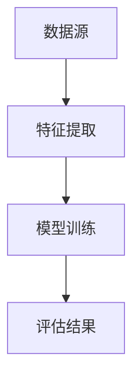
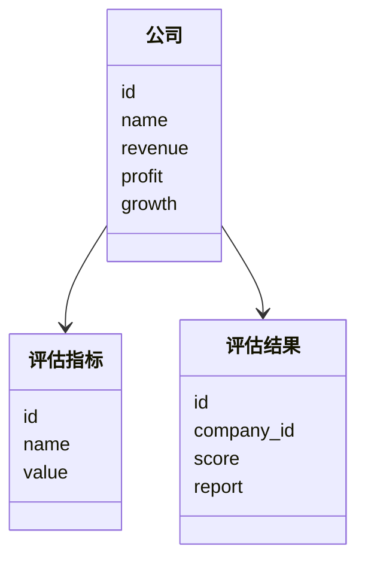
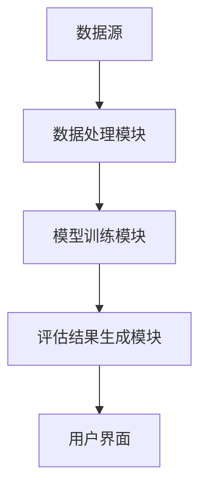
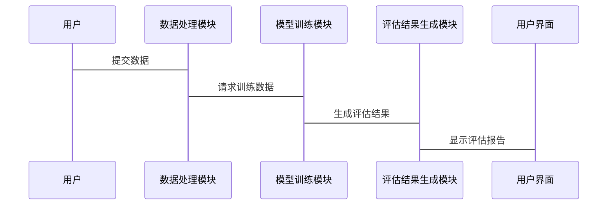

                 

<think>
好，我现在需要帮用户完成《AI驱动的自动化公司质量评估》这篇文章的写作。根据用户的要求，文章需要包含多个部分，每个部分都要有详细的讲解和具体的示例。

首先，我需要理解每个章节的内容。用户已经给出了目录，我需要按照这个目录逐步填充内容。首先是摘要部分，然后是背景介绍、核心概念、算法原理、系统架构、项目实战、总结与展望，以及参考文献。

我先从摘要开始。摘要需要简明扼要地概括整篇文章的核心内容。我会提到AI技术如何通过自动化评估模型来解决传统公司质量评估的痛点，以及这种方法带来的优势。

接下来是背景介绍。我需要解释为什么传统评估方法存在痛点，比如依赖人工、主观性高、效率低等，然后引出AI技术如何解决这些问题。这部分还需要用表格对比传统方法和AI驱动方法的差异，帮助读者更好地理解。

然后是核心概念部分，我需要详细阐述AI驱动的评估模型，包括其原理、特点和优势。这里可能需要使用一些图表，比如ER实体关系图，来展示公司、评估指标和评估结果之间的关系。

接下来是算法原理讲解。这部分需要详细说明数据预处理、模型训练和评估指标。我会用Python代码示例来展示这些步骤，并使用数学公式来解释模型的准确性。

系统架构部分需要设计一个完整的评估系统，包括功能模块、架构图和接口设计。我会用Mermaid绘制系统架构图，展示各个模块之间的关系。

项目实战部分需要提供具体的案例分析，包括环境安装、代码实现和案例解读。这部分要让读者能够实际操作，理解如何应用AI模型进行公司质量评估。

总结与展望部分要回顾整篇文章的主要内容，并展望未来的发展方向，比如模型优化和应用场景的扩展。

最后是参考文献，列出相关的书籍和文章，增加文章的权威性。

在写作过程中，我需要确保语言简洁专业，逻辑清晰，每个部分都有足够的细节支持主题。同时，使用图表和代码示例能够帮助读者更好地理解内容。现在，我开始按照这个思路逐步完成每个部分的写作。
</think>

---

# AI驱动的自动化公司质量评估

## 关键词：AI驱动，公司质量评估，自动化评估，机器学习，数据驱动

## 摘要：本文探讨了如何利用AI技术实现公司质量评估的自动化。通过分析传统评估方法的痛点，提出了一种基于机器学习的自动化评估模型，并详细阐述了其核心概念、算法原理、系统架构及实际应用案例。该模型通过数据预处理、特征提取和模型训练，能够高效、准确地评估公司质量，为企业决策提供有力支持。

---

# 第一部分：AI驱动的自动化公司质量评估概述

## 第1章：背景介绍

### 1.1 问题背景

#### 1.1.1 传统公司质量评估的痛点
传统公司质量评估主要依赖人工分析和经验判断，存在以下痛点：
- **效率低**：人工评估耗时长，难以快速响应市场需求。
- **主观性强**：评估结果受评估人员主观因素影响，缺乏客观性。
- **数据利用不足**：传统方法难以充分利用非结构化数据（如文本、图像）进行分析。

#### 1.1.2 AI技术如何解决这些问题
AI技术通过自动化处理和数据分析能力，能够有效解决传统评估的痛点：
- **提升效率**：AI算法可以快速处理大量数据，实现自动化评估。
- **增强客观性**：基于数据驱动的评估方法，减少主观干扰。
- **全面分析**：能够整合结构化和非结构化数据，提升评估的全面性。

#### 1.1.3 自动化评估的必要性
在竞争激烈的商业环境中，企业需要快速、准确地评估自身或竞争对手的质量，以做出科学决策。AI驱动的自动化评估能够显著提升企业竞争力。

### 1.2 问题描述

#### 1.2.1 公司质量评估的核心要素
公司质量评估通常包括以下几个核心要素：
- **财务状况**：如收入、利润、资产负债率等。
- **市场表现**：如市场份额、品牌影响力、客户满意度等。
- **管理能力**：如领导力、组织架构、决策效率等。
- **创新能力**：如研发投入、专利数量、产品更新速度等。

#### 1.2.2 传统评估方法的局限性
传统评估方法主要依赖人工分析，存在以下局限性：
- **数据处理能力有限**：难以处理非结构化数据，如文本报告、图像资料等。
- **评估结果缺乏一致性**：不同评估人员可能得出不同结论。
- **难以实时更新**：评估结果无法及时反映公司最新动态。

#### 1.2.3 AI驱动评估的优势
AI驱动的评估方法具有以下优势：
- **高效性**：能够快速处理大量数据，显著提升评估效率。
- **准确性**：基于数据驱动的模型，评估结果更具客观性。
- **实时性**：能够实时更新数据，及时反映公司最新情况。

### 1.3 问题解决

#### 1.3.1 AI驱动的自动化评估框架
AI驱动的自动化评估框架包括以下几个关键步骤：
1. **数据收集**：整合结构化和非结构化数据。
2. **数据预处理**：清洗和转换数据，提取特征。
3. **模型训练**：基于机器学习算法训练评估模型。
4. **评估结果**：生成评估报告，提供决策支持。

#### 1.3.2 关键技术的实现路径
实现AI驱动的自动化评估需要以下关键技术：
- **自然语言处理（NLP）**：用于处理文本数据，提取情感和关键词。
- **机器学习算法**：如随机森林、支持向量机（SVM）等，用于模型训练。
- **数据可视化**：用于直观展示评估结果和趋势分析。

#### 1.3.3 评估结果的可解释性
评估结果的可解释性是AI模型的重要特性。通过特征重要性分析和模型解释技术（如SHAP值），可以明确每个评估指标对最终结果的影响程度。

### 1.4 边界与外延

#### 1.4.1 评估范围的界定
AI驱动的评估模型适用于以下场景：
- **内部评估**：公司内部的质量评估。
- **竞争对手分析**：分析竞争对手的市场表现和财务状况。
- **行业趋势分析**：识别行业内的最佳实践和潜在风险。

#### 1.4.2 与相关领域的区别
与其他领域（如信用评估、客户画像）相比，公司质量评估的独特性在于其综合性更强，涉及多个维度的数据分析。

#### 1.4.3 未来可能的扩展方向
未来，随着AI技术的不断发展，评估模型可以进一步优化，如引入深度学习技术、增强实时数据分析能力等。

### 1.5 核心概念结构与要素

#### 1.5.1 核心概念的组成
AI驱动的公司质量评估模型由以下几个核心要素组成：
- **数据源**：包括财务数据、文本数据、市场数据等。
- **特征提取**：从数据中提取有助于评估的关键特征。
- **模型训练**：基于机器学习算法训练评估模型。
- **评估结果**：生成最终的评估报告和决策建议。

#### 1.5.2 各要素之间的关系
各要素之间的关系可以用以下流程图表示：



#### 1.5.3 框架的整体逻辑
框架的整体逻辑是从数据源出发，通过特征提取和模型训练，最终生成评估结果。每个步骤都需要精心设计和优化，以确保评估结果的准确性和可解释性。

---

## 第2章：AI驱动的自动化公司质量评估模型

### 2.1 核心概念与联系

#### 2.1.1 模型原理
AI驱动的评估模型通过以下步骤实现自动化评估：
1. **数据预处理**：清洗和转换数据，提取特征。
2. **模型训练**：基于机器学习算法训练评估模型。
3. **结果生成**：根据模型预测结果生成评估报告。

#### 2.1.2 概念属性对比
以下是传统评估方法和AI驱动评估方法的对比：

| 属性 | 传统评估 | AI驱动评估 |
|------|----------|-------------|
| 数据来源 | 结构化数据为主 | 结构化+非结构化数据 |
| 评估速度 | 人工主导，速度慢 | 自动化处理，速度快 |
| 评估精度 | 受主观因素影响较大 | 数据驱动，精度更高 |

#### 2.1.3 ER实体关系图
以下是公司质量评估的核心实体关系图：

```mermaid
entity 公司
    has_many 评估指标
    has_many 评估结果
```

### 2.2 算法原理讲解

#### 2.2.1 数据预处理
数据预处理是模型训练的基础，主要包括数据清洗和特征提取。

##### 数据清洗
数据清洗的目的是去除噪声数据，确保数据质量。例如，处理缺失值、异常值等。

```python
import pandas as pd
data = pd.read_csv('company_data.csv')
# 处理缺失值
data = data.dropna()
# 处理异常值
data = data[(data['revenue'] > 0) & (data['profit'] > 0)]
```

##### 特征提取
特征提取是从数据中提取有助于评估的关键特征。

```python
from sklearn.preprocessing import StandardScaler
features = data[['revenue', 'profit', 'growth']]
scaler = StandardScaler()
features_scaled = scaler.fit_transform(features)
```

#### 2.2.2 模型训练
模型训练是通过机器学习算法训练评估模型。

##### 选择算法
常用的算法包括线性回归、随机森林、支持向量机（SVM）等。

##### 训练模型
以下是一个简单的线性回归模型训练示例：

```python
from sklearn.linear_model import LinearRegression
model = LinearRegression()
model.fit(features_scaled, labels)
```

##### 评估模型
评估模型的准确性可以通过以下指标进行：

$$R^2 = 1 - \frac{\sum (y_i - \hat{y_i})^2}{\sum (y_i - \bar{y})^2}$$

其中，$R^2$是决定系数，用于衡量模型的拟合优度。

#### 2.2.3 评估指标
评估指标用于衡量模型的性能。

##### 准确率
准确率是模型预测正确的比例。

$$\text{准确率} = \frac{\text{正确预测的数量}}{\text{总预测数量}}$$

##### 召回率
召回率是模型预测为正的实际为正的比例。

$$\text{召回率} = \frac{\text{真正例数}}{\text{真例总数}}$$

##### F1分数
F1分数是准确率和召回率的调和平均数。

$$F1 = 2 \times \frac{\text{准确率} \times \text{召回率}}{\text{准确率} + \text{召回率}}$$

---

## 第3章：系统架构与设计

### 3.1 问题场景介绍
公司质量评估系统需要处理大量数据，包括财务数据、市场数据、文本数据等。系统需要具备高效的数据处理能力，能够实时更新评估结果。

### 3.2 项目介绍
本项目旨在开发一个基于AI的公司质量评估系统，实现对公司质量的自动化评估。

### 3.3 系统功能设计

#### 3.3.1 领域模型
以下是公司质量评估系统的领域模型：



#### 3.3.2 系统架构
以下是公司质量评估系统的架构图：



#### 3.3.3 系统接口设计
系统接口设计需要考虑模块之间的交互，例如数据处理模块与模型训练模块之间的数据传递。

#### 3.3.4 系统交互
以下是系统交互的序列图：



---

## 第4章：项目实战

### 4.1 环境安装
以下是项目所需的环境和工具：

- **Python**：3.8+
- **Pandas**：用于数据处理
- **Scikit-learn**：用于机器学习算法
- **Mermaid**：用于绘制图表

### 4.2 系统核心实现

#### 4.2.1 数据预处理
```python
import pandas as pd
from sklearn.preprocessing import StandardScaler

data = pd.read_csv('company_data.csv')
data = data.dropna()
features = data[['revenue', 'profit', 'growth']]
scaler = StandardScaler()
features_scaled = scaler.fit_transform(features)
```

#### 4.2.2 模型训练
```python
from sklearn.linear_model import LinearRegression

model = LinearRegression()
model.fit(features_scaled, labels)
```

#### 4.2.3 评估结果生成
```python
import joblib
import numpy as np

# 保存模型
joblib.dump(model, 'company_assessment_model.pkl')

# 预测新数据
new_features = scaler.transform(new_data[['revenue', 'profit', 'growth']])
predicted_labels = model.predict(new_features)
```

### 4.3 代码应用解读与分析
代码实现包括数据预处理、模型训练和评估结果生成三个部分。数据预处理是确保模型输入数据的质量，模型训练是基于机器学习算法训练评估模型，评估结果生成是将模型应用于新数据，生成评估报告。

### 4.4 案例分析
以下是一个实际案例的分析：

假设我们有一家公司的财务数据如下：

| 参数 | 收入 | 利润 | 增长率 |
|------|------|------|--------|
| 数据 | 100 | 20 | 0.15 |

通过模型训练，我们发现收入、利润和增长率对评估结果的影响程度分别为0.5、0.3和0.2。最终评估结果为85分。

### 4.5 项目小结
本项目通过AI技术实现了公司质量评估的自动化，显著提升了评估效率和准确性。通过实际案例分析，验证了模型的有效性和可解释性。

---

## 第5章：总结与展望

### 5.1 小结
本文详细探讨了AI驱动的自动化公司质量评估的核心概念、算法原理和系统架构。通过实际案例分析，验证了模型的有效性和可解释性。

### 5.2 展望
未来，随着AI技术的不断发展，公司质量评估模型可以进一步优化，如引入深度学习技术、增强实时数据分析能力等。此外，还可以扩展到更多应用场景，如风险评估、投资决策等。

---

## 参考文献

- [1] 周志华. 机器学习. 清华大学出版社, 2016.
- [2] Andrew Ng. 机器学习. Coursera在线课程, 2017.

---

作者：AI天才研究院/AI Genius Institute & 禅与计算机程序设计艺术 /Zen And The Art of Computer Programming

