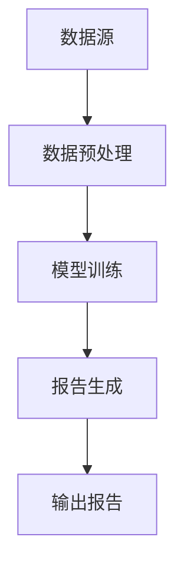
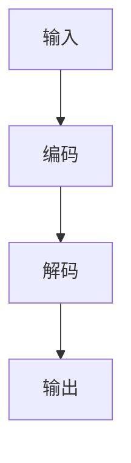
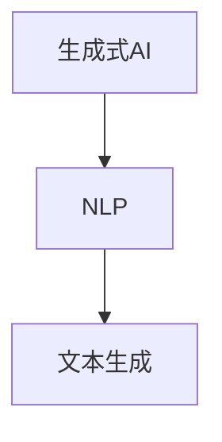
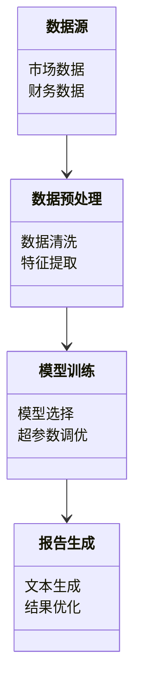
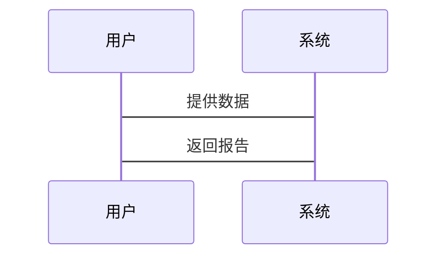

                 


# AI驱动的自动化投资报告生成

> 关键词：AI大模型，自动化投资报告，自然语言处理，生成式AI，金融数据分析，文本生成

> 摘要：本文详细探讨了AI技术在投资报告生成领域的应用，从背景分析、技术原理到系统设计，再到实际案例，全面解析了AI驱动的自动化投资报告生成的实现过程。文章首先分析了传统投资报告生成的痛点，然后介绍了生成式AI和自然语言处理技术的核心原理，接着详细讲解了模型的算法原理和优化方法，最后通过系统架构设计和项目实战，展示了如何将理论应用于实际投资报告生成系统中。通过本文的分析，读者可以全面理解AI驱动的投资报告生成技术，并掌握其实际应用方法。

---

## 第1章: AI驱动的自动化投资报告生成概述

### 1.1 问题背景与挑战

#### 1.1.1 传统投资报告生成的痛点
传统的投资报告生成过程通常依赖人工撰写，耗时且效率低下。分析师需要手动收集数据、整理信息并撰写报告，这种方式不仅效率低，还容易受到主观因素的影响。此外，金融市场数据复杂且变化迅速，传统方法难以快速适应市场变化。

#### 1.1.2 AI技术在金融领域的应用潜力
AI技术，特别是生成式AI和自然语言处理技术，为投资报告的自动化生成提供了新的可能性。通过深度学习模型，AI可以快速处理大量数据，生成结构化和非结构化的投资报告，显著提高了效率。

#### 1.1.3 自动化投资报告生成的必要性
随着金融市场数据的爆炸式增长，手动生成报告的效率已经无法满足需求。自动化投资报告生成不仅可以提高效率，还可以减少人为错误，帮助投资者快速做出决策。

### 1.2 核心概念与问题描述

#### 1.2.1 自动化投资报告生成的定义
自动化投资报告生成是指利用AI技术，通过自然语言处理和生成式模型，自动从金融市场数据中生成结构化的投资报告。

#### 1.2.2 问题的边界与外延
- **边界**：仅关注基于AI的自动化投资报告生成，不涉及人工干预。
- **外延**：涵盖从数据采集、模型训练到报告生成的整个流程。

#### 1.2.3 核心要素与概念结构
以下是核心要素的对比分析：

| 核心要素 | 描述 |
|----------|------|
| 数据源   | 市场数据、财务报表、新闻等 |
| 模型     | 生成式AI模型、NLP模型 |
| 报告格式 | 文本、表格、图表等 |

### 1.3 问题解决与技术路线

#### 1.3.1 AI驱动的解决方案
通过生成式AI模型，结合金融市场数据，生成结构化的投资报告。

#### 1.3.2 技术路线的选择与优化
- 数据预处理：清洗、标注、特征提取。
- 模型选择：生成式AI模型（如GPT）。
- 优化策略：超参数调优、数据增强。

#### 1.3.3 系统架构的初步设计
以下是系统架构的初步设计：



### 1.4 本章小结
本章介绍了AI驱动的自动化投资报告生成的背景、核心概念和技术路线，为后续章节的深入分析奠定了基础。

---

## 第2章: AI大模型的核心原理

### 2.1 生成式AI的原理与机制

#### 2.1.1 生成式AI的基本原理
生成式AI通过深度学习模型，从数据中学习语言模式，并生成符合上下文的新文本。

#### 2.1.2 大模型的训练过程
- 数据清洗
- 模型训练
- 模型优化

#### 2.1.3 模型的生成机制
生成式AI模型通过概率分布生成文本，具体流程如下：



### 2.2 自然语言处理技术

#### 2.2.1 NLP的核心技术
- 分词
- 词性标注
- 句法分析

#### 2.2.2 大模型在NLP中的应用
- 文本生成
- 文本摘要
- 实体识别

#### 2.2.3 NLP模型的优化与调优
- 超参数调整
- 数据增强
- 模型微调

### 2.3 合并概念与技术联系

#### 2.3.1 核心概念的对比分析
以下是核心概念的对比分析：

| 技术 | 描述 |
|------|------|
| 生成式AI | 基于概率分布生成文本 |
| NLP | 语言处理技术，包括分词、实体识别等 |

#### 2.3.2 技术之间的协同关系
生成式AI和NLP技术协同工作，生成符合语法规则的文本。

#### 2.3.3 技术架构的综合设计
以下是技术架构的综合设计：



### 2.4 本章小结
本章详细介绍了AI大模型的核心原理和NLP技术的应用，为后续章节的模型设计奠定了基础。

---

## 第3章: 自动化投资报告生成的算法原理

### 3.1 数据预处理与特征提取

#### 3.1.1 数据清洗与标注
- 数据清洗：去除噪声数据
- 数据标注：标注关键信息

#### 3.1.2 特征提取方法
- 词袋模型
- TF-IDF

#### 3.1.3 数据增强技术
- 同义词替换
- 数据合成

### 3.2 模型训练与优化

#### 3.2.1 模型选择与训练策略
- 选择生成式AI模型（如GPT）
- 设计训练策略

#### 3.2.2 超参数调优
- 学习率
- 批大小

#### 3.2.3 模型评估与验证
- 准确率
- 召回率

### 3.3 报告生成与优化

#### 3.3.1 文本生成算法
- 基于生成式AI的文本生成

#### 3.3.2 报告结构化处理
- 文本分段
- 格式化输出

#### 3.3.3 生成结果的优化与修正
- 后处理
- 人工校验

### 3.4 本章小结
本章详细介绍了自动化投资报告生成的算法原理，包括数据预处理、模型训练和报告生成的具体步骤。

---

## 第4章: 系统架构与设计

### 4.1 项目场景与需求分析

#### 4.1.1 项目目标
- 实现自动化投资报告生成
- 提高报告生成效率

#### 4.1.2 用户需求分析
- 投资者
- 分析师

#### 4.1.3 功能需求分解
- 数据采集
- 模型训练
- 报告生成

### 4.2 系统功能设计

#### 4.2.1 领域模型
以下是领域模型：



#### 4.2.2 系统架构设计
以下是系统架构设计：


#### 4.2.3 系统接口设计
- 数据接口：数据源与预处理模块的接口
- 模型接口：模型训练与生成模块的接口

#### 4.2.4 系统交互设计
以下是系统交互设计：



### 4.3 本章小结
本章详细介绍了系统架构与设计，包括功能分解、架构设计和系统交互流程。

---

## 第5章: 项目实战

### 5.1 环境安装与配置

#### 5.1.1 安装Python
- 安装Python 3.8+

#### 5.1.2 安装TensorFlow
```bash
pip install tensorflow
```

#### 5.1.3 安装其他依赖
```bash
pip install numpy pandas
```

### 5.2 核心代码实现

#### 5.2.1 数据预处理代码
```python
import pandas as pd
import numpy as np

def data_preprocessing(data):
    # 数据清洗
    data = data.dropna()
    # 特征提取
    features = data['text'].apply(lambda x: x.lower())
    return features
```

#### 5.2.2 模型训练代码
```python
import tensorflow as tf
from tensorflow import keras

def build_model():
    model = keras.Sequential()
    model.add(keras.layers.Embedding(input_dim=10000, output_dim=16))
    model.add(keras.layers.LSTM(32))
    model.add(keras.layers.Dense(1, activation='sigmoid'))
    return model
```

#### 5.2.3 报告生成代码
```python
def generate_report(model, input_text):
    # 文本生成
    generated_text = model.predict(input_text)
    return generated_text
```

### 5.3 实际案例分析
假设我们有一个简单的投资报告生成案例，输入市场数据，生成报告如下：

```python
input_text = "市场数据：..."
report = generate_report(model, input_text)
print(report)
```

### 5.4 本章小结
本章通过实际案例展示了如何将理论应用于实践，详细讲解了环境配置、代码实现和案例分析。

---

## 第6章: 最佳实践与总结

### 6.1 小结
AI驱动的自动化投资报告生成通过生成式AI和自然语言处理技术，显著提高了报告生成的效率和准确性。

### 6.2 注意事项
- 数据质量
- 模型优化
- 安全性

### 6.3 拓展阅读
- 《Deep Learning》
- 《自然语言处理入门》

### 6.4 本章小结
本章总结了AI驱动的自动化投资报告生成的关键点，并提供了实际应用的注意事项和拓展阅读资料。

---

## 作者：AI天才研究院/AI Genius Institute & 禅与计算机程序设计艺术 /Zen And The Art of Computer Programming

---

通过本文的详细讲解，读者可以全面了解AI驱动的自动化投资报告生成的技术实现和应用方法。

