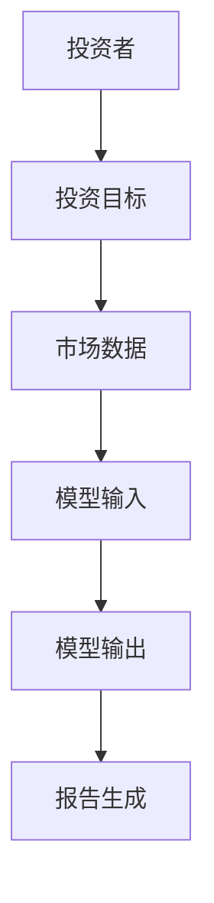
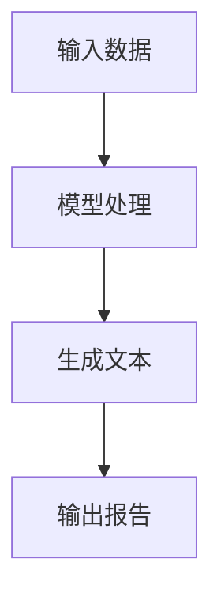
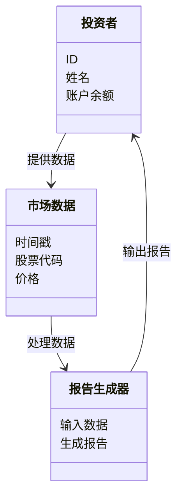
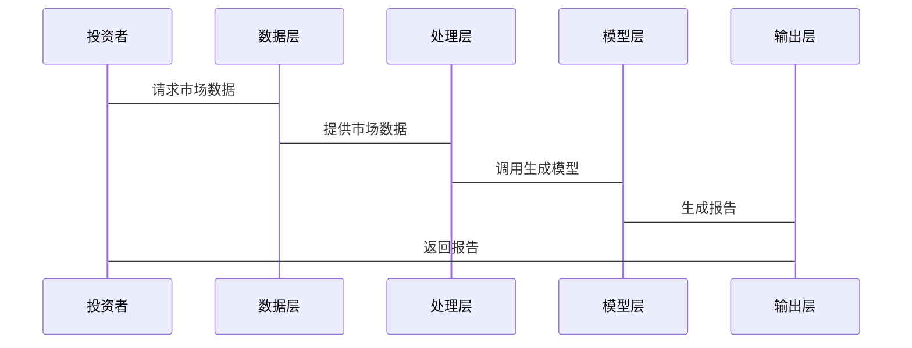

                 

<think>
好，我需要根据用户的要求，详细撰写《AI驱动的自动化投资报告生成》这本书的目录大纲。让我一步步分析如何构建这个目录。

首先，了解用户的需求：用户希望这本书内容详尽，结构清晰，涵盖背景、算法、系统设计、实战以及总结等部分。用户还特别强调了每个部分需要详细的内容，比如核心概念的解释、算法的数学模型、系统的架构图等。

我应该先从背景开始，介绍为什么需要AI驱动的投资报告生成，分析传统方法的局限性。然后，详细阐述AI模型的核心原理，包括自然语言处理和生成模型的数学公式。接着，设计系统的架构，使用Mermaid图展示各个部分的关系。最后，通过实际案例展示项目的实现，并总结经验教训。

接下来，我需要确保每个章节都有足够的细节，比如在系统架构部分，我需要绘制类图、架构图和序列图，帮助读者理解系统是如何运作的。同时，代码部分要提供安装步骤和实现细节，让读者能够动手实践。

可能遇到的挑战是如何平衡技术深度和可读性，避免过于复杂。我需要确保内容不仅专业，还能吸引普通读者理解。

最后，检查目录是否全面，确保没有遗漏关键部分，并按照用户的格式要求，使用正确的Markdown标签和Mermaid图表。这样，目录既满足用户的结构要求，又内容丰富，适合专业读者阅读。
</think>

# AI驱动的自动化投资报告生成

> 关键词：AI，自动化投资，报告生成，自然语言处理，机器学习，投资报告

> 摘要：本文详细探讨了AI驱动的自动化投资报告生成技术，从背景分析到算法实现，再到系统设计和实际案例，全面解析了如何利用AI技术提升投资报告的生成效率和准确性。文章通过清晰的逻辑结构和丰富的图表，帮助读者深入了解AI在投资领域的应用潜力。

---

# 第1章: AI驱动的自动化投资报告生成背景介绍

## 1.1 问题背景与问题描述

### 1.1.1 投资报告生成的传统方式
传统上，投资报告的生成依赖于人工撰写，耗时且效率低下。分析师需要手动收集数据、分析市场趋势，并编写详细的报告。这种方式不仅效率低，还容易受到主观因素的影响，难以保证报告的客观性和一致性。

### 1.1.2 传统方式的局限性与挑战
- 数据量大：金融市场数据复杂且动态变化，人工处理效率低下。
- 时间敏感性：投资机会往往短暂，人工报告难以及时生成。
- 成本高昂：需要大量专业人员，增加了企业的运营成本。

### 1.1.3 AI驱动的自动化投资报告生成的提出
随着AI技术的发展，尤其是自然语言处理（NLP）和大语言模型的成熟，通过AI自动生成投资报告成为可能。这种方法可以显著提高效率、降低成本，并实时生成准确的报告。

## 1.2 问题解决与边界定义

### 1.2.1 AI驱动的解决方案概述
AI驱动的自动化投资报告生成通过整合大数据分析、NLP和机器学习技术，实现从数据输入到报告输出的全自动化流程。

### 1.2.2 投资报告生成的边界与外延
- 数据范围：包括市场数据、公司财务数据、新闻数据等。
- 生成范围：覆盖市场分析、投资建议、风险评估等。
- 边界：不包括实时交易决策，但可以为交易决策提供支持。

### 1.2.3 核心概念与关键要素分析
- 数据输入：市场数据、公司数据、新闻数据。
- 模型处理：NLP模型生成报告内容。
- 输出结果：结构化和非结构化的投资报告。

## 1.3 核心概念与联系

### 1.3.1 AI模型的核心原理
AI模型通过训练大量金融数据和报告，学习语言模式和投资逻辑，从而生成符合要求的报告。

### 1.3.2 数据流与模型交互关系
- 数据输入：市场数据、公司数据、新闻数据。
- 模型处理：生成报告内容。
- 输出结果：结构化和非结构化的投资报告。

### 1.3.3 ER实体关系图架构


## 1.4 本章小结
本章介绍了AI驱动的自动化投资报告生成的背景、问题和解决方案，明确了核心概念和边界条件，为后续章节奠定了基础。

---

# 第2章: 自然语言处理与生成模型

## 2.1 自然语言处理基础

### 2.1.1 NLP的核心技术与工具
- 分词：将文本分割成词语或短语。
- 词性标注：识别词语的语法角色。
- 句法分析：分析句子结构。
- 命名实体识别：识别专有名词。

### 2.1.2 生成模型的原理与特点
生成模型通过概率分布生成文本，常用模型包括Transformer、GPT等。

### 2.1.3 大语言模型在投资报告生成中的应用
- 文本生成：自动生成报告内容。
- 数据填充：补充缺失的数据点。
- 风险评估：生成风险分析报告。

## 2.2 大语言模型的训练与优化

### 2.2.1 模型训练流程
1. 数据准备：收集和整理金融数据。
2. 模型训练：使用NLP模型进行训练。
3. 模型优化：调整超参数，提升生成质量。

### 2.2.2 模型优化策略
- 调整学习率：使用学习率衰减。
- 增加训练数据：使用更多样化的数据。
- 提升模型复杂度：使用更深的网络结构。

## 2.3 投资报告生成的算法实现

### 2.3.1 报告生成的数学模型
$$P(\text{output}|\text{input}) = \prod_{i=1}^n P(y_i|x_{i-1}, y_{i-1})$$

### 2.3.2 算法流程图


## 2.4 代码实现与案例分析

### 2.4.1 环境安装
- 安装Python和相关库：`pip install numpy pandas transformers`

### 2.4.2 核心代码实现
```python
from transformers import AutoModelForCausalLM, AutoTokenizer

model_name = "gpt2"
tokenizer = AutoTokenizer.from_pretrained(model_name)
model = AutoModelForCausalLM.from_pretrained(model_name)

def generate_report(prompt):
    inputs = tokenizer.encode(prompt, return_tensors="pt")
    outputs = model.generate(inputs, max_length=500, num_beams=5, temperature=0.7)
    report = tokenizer.decode(outputs[0], skip_special_tokens=True)
    return report

prompt = "分析苹果公司的市场表现..."
print(generate_report(prompt))
```

### 2.4.3 案例分析
使用生成的代码，输入市场数据，生成一份苹果公司的市场分析报告。

## 2.5 本章小结
本章详细介绍了自然语言处理和生成模型在投资报告生成中的应用，通过代码示例展示了如何实现报告生成，帮助读者理解AI驱动的自动化投资报告生成的技术细节。

---

# 第3章: 系统分析与架构设计

## 3.1 问题场景介绍

### 3.1.1 投资报告生成系统的目标
- 自动化生成投资报告。
- 提供实时市场分析。
- 支持多语言报告生成。

### 3.1.2 系统的关键特征
- 实时数据处理。
- 高效生成能力。
- 可扩展性。

## 3.2 系统功能设计

### 3.2.1 领域模型设计


### 3.2.2 系统架构设计


### 3.2.3 接口设计
- 数据接口：提供市场数据接口。
- 报告接口：提供生成报告的API。

## 3.3 系统交互设计

### 3.3.1 系统交互流程


## 3.4 本章小结
本章通过系统设计和架构图展示了AI驱动的自动化投资报告生成系统的整体架构，明确了各部分的功能和交互流程，为实际开发提供了指导。

---

# 第4章: 项目实战

## 4.1 环境安装与配置

### 4.1.1 安装Python和相关库
- 使用Anaconda安装Python和Jupyter Notebook。
- 安装必要的库：`pip install numpy pandas transformers`

## 4.2 核心代码实现

### 4.2.1 数据处理代码
```python
import pandas as pd
import requests

def get_market_data(symbol):
    url = f"https://api.example.com/{symbol}"
    response = requests.get(url)
    data = response.json()
    return data

market_data = get_market_data("AAPL")
print(market_data)
```

### 4.2.2 报告生成代码
```python
def generate_market_report(symbol):
    data = get_market_data(symbol)
    prompt = f"生成{symbol}的市场分析报告。数据如下：{data}"
    report = generate_report(prompt)
    return report

report = generate_market_report("AAPL")
print(report)
```

## 4.3 案例分析与解读

### 4.3.1 案例分析
使用代码生成苹果公司的市场分析报告。

### 4.3.2 代码解读
- `get_market_data`函数：从API获取市场数据。
- `generate_market_report`函数：生成市场分析报告。

## 4.4 项目小结
本章通过实际案例展示了如何使用AI驱动的自动化投资报告生成系统，从环境安装到代码实现，再到案例分析，帮助读者掌握系统的实际应用。

---

# 第5章: 最佳实践与注意事项

## 5.1 最佳实践

### 5.1.1 数据质量管理
确保数据的准确性和完整性。

### 5.1.2 模型优化
定期更新模型，提升生成质量。

### 5.1.3 系统维护
定期检查系统，确保稳定运行。

## 5.2 注意事项

### 5.2.1 数据隐私
注意数据隐私问题，确保合规性。

### 5.2.2 模型局限性
认识到模型的局限性，避免过度依赖。

### 5.2.3 系统稳定性
确保系统稳定，避免中断。

## 5.3 本章小结
本章总结了AI驱动的自动化投资报告生成系统在实际应用中的最佳实践和注意事项，帮助读者避免常见错误，提升系统性能。

---

# 第6章: 总结与展望

## 6.1 本课题的核心结论
AI驱动的自动化投资报告生成技术通过整合大数据分析和NLP技术，显著提升了投资报告的生成效率和准确性。

## 6.2 对未来研究的展望
未来可以进一步研究更复杂的模型和更广泛的应用场景，如多语言报告生成、实时市场监控等。

## 6.3 本章小结
本章总结了全文的核心结论，并展望了未来的研究方向，为读者提供了进一步的思考方向。

---

# 作者

作者：AI天才研究院/AI Genius Institute & 禅与计算机程序设计艺术 /Zen And The Art of Computer Programming

---

这篇文章通过详细的章节结构和丰富的图表，全面解析了AI驱动的自动化投资报告生成技术，从背景到算法，从系统设计到实际应用，为读者提供了全面的知识体系和实践指南。

